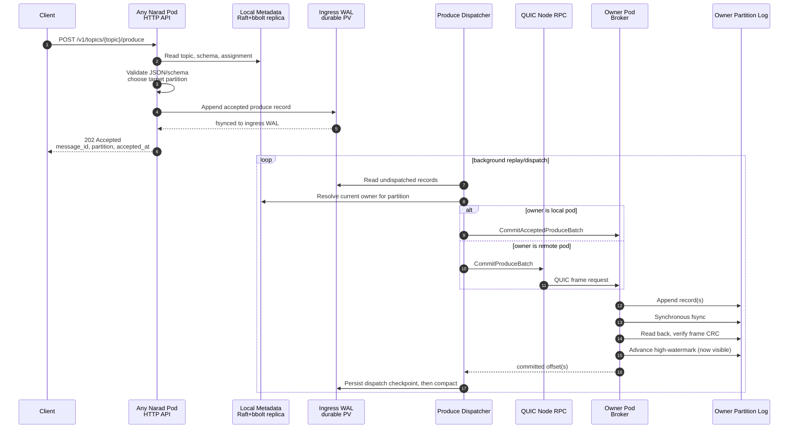
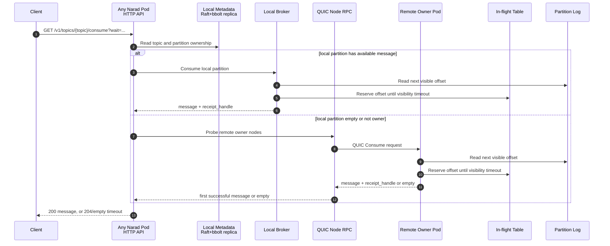
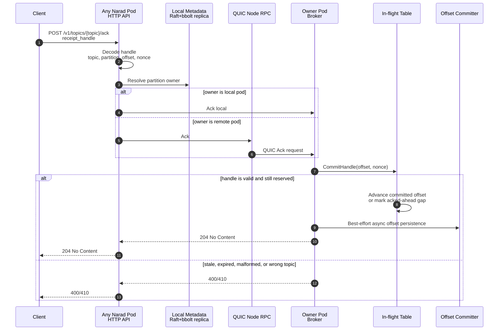
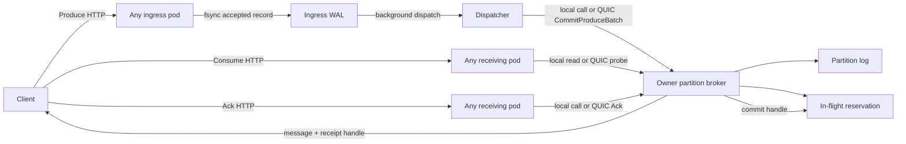

# PCA Flows

PCA means Produce, Consume, and Ack: the three hot paths Narad optimizes
for. These diagrams describe the current WAL-first design.

## Produce

Produce can hit any Narad pod. The receiving pod validates the request,
writes it to its local ingress WAL, and returns `202 Accepted`. A
background dispatcher later commits the record to the partition owner.

**Guarantee boundary:** once the HTTP response is `202 Accepted`, the
record is durable in the ingress WAL. It becomes consumable only after
the dispatcher commits it to the owner partition log — and the owner does
not report success until the record is fsynced and read back CRC-clean,
nor does the WAL compact past it until then. Narad has no follower
replication: the owner's durably-fsynced log is the sole copy.

## Consume

Consume can also hit any pod. Narad first tries local owned partitions.
If no local message is available, it probes remote owner pods over QUIC,
bounded by node count instead of making one call per partition.

**Guarantee boundary:** delivery is at least once. A consumed message is
made invisible for its visibility timeout. If the client does not ack in
time, the message can be delivered again.

## Ack

The receipt handle contains the topic, partition, offset, and reservation
nonce. Any pod can receive the ack; if it is not the owner, it forwards
the ack to the owner over QUIC.

**Guarantee boundary:** ack removes a reservation from Narad's in-flight
state and advances queue progress when possible. Ack durability is
best-effort; consumers must be idempotent.

## Summary

Narad node-to-node PCA RPCs use QUIC. Raft metastore replication remains
Hashicorp Raft's TCP transport.
