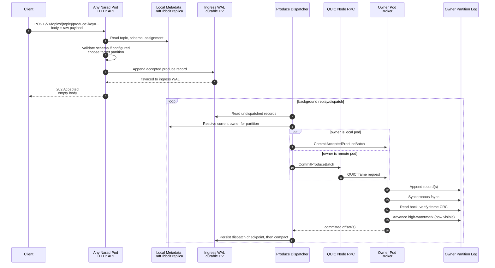
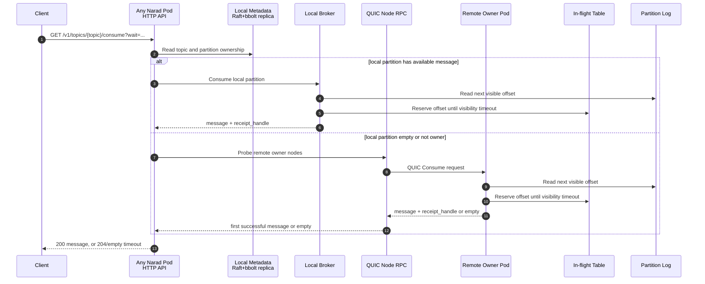
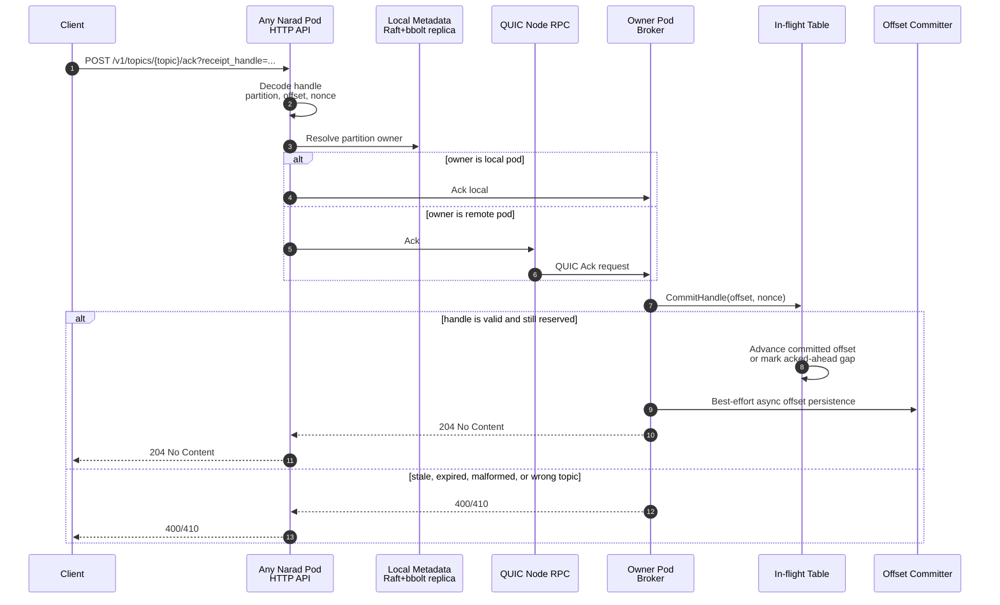
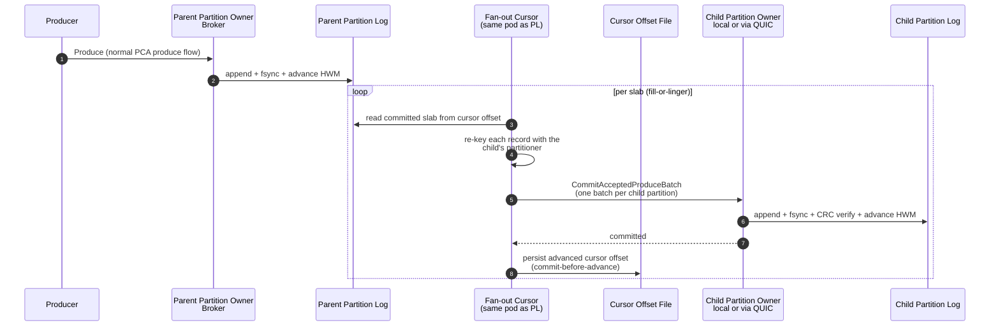
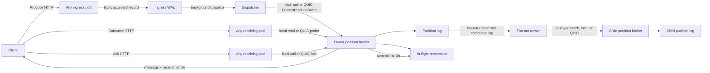

# PCA Flows

PCA means Produce, Consume, and Ack: the three hot paths Narad optimizes
for. These diagrams describe the current WAL-first design.

## Produce

Produce can hit any Narad pod. The body is the raw message payload;
optional metadata such as `key` and `partition` is sent as query params.
For topics without a schema, the receiving pod does not parse the body as
JSON. Schema-enabled topics validate the raw body before accepting it.
Accepted records are written to the local ingress WAL and the API returns
`202 Accepted`. A background dispatcher later commits the record to the
partition owner. The response intentionally does not include a message
ID, partition, or offset.

**Guarantee boundary:** once the HTTP response is `202 Accepted`, the
record is durable in the ingress WAL. It becomes consumable only after
the dispatcher commits it to the owner partition log — and the owner does
not report success until the record is fsynced and read back CRC-clean,
nor does the WAL compact past it until then. Narad has no follower
replication: the owner's durably-fsynced log is the sole copy. The WAL
record ID used during dispatch is internal bookkeeping and is not exposed
to clients.

## Consume

Consume can also hit any pod. Narad first tries local owned partitions.
If no local message is available, it probes remote owner pods over QUIC,
bounded by node count instead of making one call per partition.

**Guarantee boundary:** delivery is at least once. A consumed message is
made invisible for its visibility timeout. If the client does not ack in
time, the message can be delivered again.

## Ack

The receipt handle contains partition, offset, and reservation nonce as
`partition:offset:nonce`; the request path supplies the topic. Any pod
can receive the ack; if it is not the owner, it forwards the ack to the
owner over QUIC.

**Guarantee boundary:** ack removes a reservation from Narad's in-flight
state and advances queue progress when possible. Ack durability is
best-effort; consumers must be idempotent.

The same endpoint doubles as the lease surface: `extend=true` renews the
reservation's visibility window in place (same handle, new deadline) and
`extend=0` releases it for immediate redelivery (nack). Both validate
the handle exactly like ack — a lapsed lease returns 410 and can never
be revived.

## Fan-out (parent → child)

Fan-out sits entirely after the produce hot path: producing to a parent
is a normal produce, and a background cursor on each parent partition's
owner tails the committed log and re-commits records to the attached
children through the same commit paths the dispatcher uses. One cursor
exists per (child, parent-partition); its persisted offset advances only
after the child batch is durably committed.

For a **delay child** (attached with `delay_ms`), the cursor adds a due
gate: it delivers only records with `commitTime + delay <= now`, and —
because commit times are monotonic per partition — an undue head means
the cursor simply sleeps until it becomes due (O(1) while idle).

**Guarantee boundary:** fan-out is at-least-once within the parent's
retention window. A crash between the child commit and the cursor
persist re-delivers the last slab (duplicates, never loss). A child that
falls behind the parent's retention drops to the oldest retained record
and the loss is counted on `narad_fanout_child_dropped_messages`; the
uniform 1-hour retention floor bounds how quickly that can happen.

## Summary

Narad node-to-node PCA RPCs use QUIC. Raft metastore replication remains
Hashicorp Raft's TCP transport.
