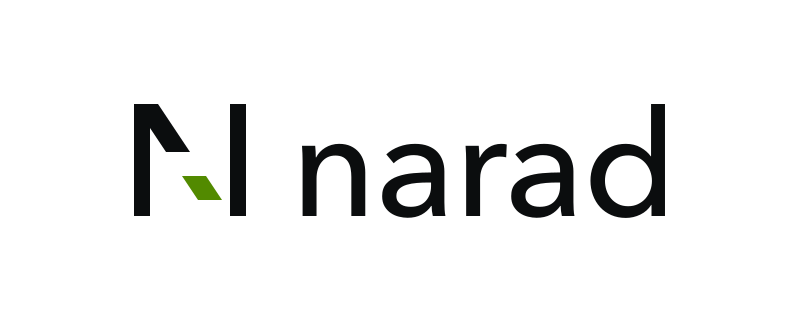

# Narad

[](https://github.com/DebanganThakuria/narad/actions/workflows/ci.yml)
[](https://github.com/DebanganThakuria/narad/releases/latest)
[](./LICENSE)
[](./go.mod)

<p align="center">
  <picture>
    <source media="(prefers-color-scheme: dark)" srcset="./assets/narad-lockup-dark.svg">
    
  </picture>
</p>

Narad is a queue-first message broker in a single Go binary: plain HTTP in, at-least-once out.
A `202` means the message is fsynced before you hear back. Consumers pull, work under a
visibility lease, and ack; anything unacked comes back. Fan-out and delayed delivery are
child topics, retained logs make replay a read, and topics can enforce a JSON Schema at the
broker. Raft keeps the metadata, Prometheus gets the metrics, and the whole thing runs on a
laptop unchanged from how it runs in Kubernetes.

[Changelog](./CHANGELOG.md) · [Releases](https://github.com/DebanganThakuria/narad/releases/latest) · [Project status](#project-status) · [Maintainers](./MAINTAINERS.md)

## Documentation

**https://debanganthakuria.github.io/narad/**

| You want | Go to |
|---|---|
| Use it: produce, consume, retries, fan-out, delay, schemas, access control | [Build](https://debanganthakuria.github.io/narad/build/connect/) |
| Run it: Helm chart, configuration, monitoring, scaling, recovery | [Operate](https://debanganthakuria.github.io/narad/operate/deploy-kubernetes/) |
| Understand it: every subsystem, with the real function names | [Understand](https://debanganthakuria.github.io/narad/understand/) |
| Decide whether it fits: an honest matrix against Kafka, NATS, RabbitMQ, SQS, Redis, Pulsar | [Compare](https://debanganthakuria.github.io/narad/get-started/compare/) |
| Write Go against it | [Go SDK](https://debanganthakuria.github.io/narad/build/go-sdk/) |

## Quickstart

```sh
brew install debanganthakuria/narad/narad

narad server start --dev          # local playground on loopback, auth off
```

To build from source instead, clone the latest release tag and run `make build`, as the
[quickstart](https://debanganthakuria.github.io/narad/get-started/quickstart/) shows. Do not use
`go install ...@latest`: it resolves to an old, unsupported v1 release, because the module path
has no `/v3` suffix.

In another terminal:

```sh
narad topic add demo
narad sub demo --peek                                   # live, read-only tail
narad pub demo '{"hello":"narad"}' --count 100 --rate 20
```

From Go, use the client rather than `curl`. It handles the visibility
lease, retries with jitter, and per-node circuit breakers, and it depends
on nothing but the standard library:

```go
import narad "github.com/debanganthakuria/narad-go"

client, _ := narad.New("narad-1:7942,narad-2:7942,narad-3:7942")
defer client.Close()

client.Consume(ctx, "orders", narad.HandlerFunc(
    func(ctx context.Context, msg *narad.Message) error {
        return process(ctx, msg)
    }))
```

It lives at [DebanganThakuria/narad-go](https://github.com/DebanganThakuria/narad-go),
with the guide in [the docs](https://debanganthakuria.github.io/narad/build/go-sdk/).

Security is on outside `--dev`: a root `admin` user is seeded at first start (set
`NARAD_ADMIN_PASSWORD`, or read the generated one from `admin-password` in the seeding node's
data directory) and every call needs HTTP Basic auth.
Terminate TLS at an ingress in front of Narad. Details in
[Connect and authenticate](https://debanganthakuria.github.io/narad/build/connect/).

## Container image

```sh
docker run --rm -p 7942:7942 -p 7943:7943 ghcr.io/debanganthakuria/narad:v3.2.2
```

Port `7942` is the API, `7943` is cluster traffic, `/var/lib/narad` is the data directory.
Images are multi-arch, non-root, and published for every tag and every commit on `master`.
For Kubernetes use the [Helm chart](https://debanganthakuria.github.io/narad/operate/deploy-kubernetes/).

Images carry a signature, an SBOM, and build provenance, all produced by the publishing
workflow with no long-lived key. Verify before you run:

```sh
cosign verify ghcr.io/debanganthakuria/narad:latest \
  --certificate-identity-regexp '^https://github\.com/DebanganThakuria/narad/\.github/workflows/container\.yml@refs/(heads/master|tags/v.*)$' \
  --certificate-oidc-issuer https://token.actions.githubusercontent.com
```

The identity is pinned to one workflow file on `master` or a release tag, not just to
the repository. Matching the repository alone would accept a signature from any workflow
on any branch, which is a weaker claim than it looks.

Signing, SBOM, and provenance start with the first image built after the `v3.0.1` release;
verifying an earlier tag fails because those images were published without them.

## Project status

Narad has been public since June 2026 and is on its third major release. The delivery
contract, the storage engine, and cluster membership are covered by unit, end-to-end, fault
injection, and chaos suites that run on every pull request. It is used in a development
cluster, not yet at scale in production by anyone the project knows of.

Three limits are structural rather than unfinished, and they are the ones to weigh:

- **No ordering guarantee.** Five documented mechanisms reorder. Carry a sequence in the payload if you need one, and make handlers idempotent, which at-least-once already requires. See [Guarantees](https://debanganthakuria.github.io/narad/understand/delivery-contract/).
- **No synchronous replication.** Partitions have a single owner. Losing a node's volume loses that node's unreplicated data, so volume snapshots and the async [replica pattern](https://debanganthakuria.github.io/narad/operate/backups/#replica-children) are the tools against disk loss. This is the top item on the roadmap.
- **Months of track record, not years.** The evidence is the project's own test suites, self-administered, and worth exactly that. Every night a three-node cluster takes load while nodes are killed and cut off from their peers, and a [linearizability checker](https://debanganthakuria.github.io/narad/understand/linearizability/) requires every anomaly to be accounted for. That is a real gate. It is not the same as years of other people's production traffic.

The full concession list, with what to pick instead when one of these is a hard requirement,
is in [Compare](https://debanganthakuria.github.io/narad/get-started/compare/). Which versions get
security fixes is in [SECURITY.md](./SECURITY.md).

## Developing

```sh
make tools-install   # gofumpt + goimports, once
make check           # fmt-check + vet + docs version check + test
make build           # bin/narad
```

The layout is under `cmd/narad` (CLI and server entry point) and `internal/` (broker, cluster,
persistence, transport). Start with
[Architecture](https://debanganthakuria.github.io/narad/understand/) before reading code.

Contributions are welcome: see [CONTRIBUTING.md](./CONTRIBUTING.md) for the workflow and
[MAINTAINERS.md](./MAINTAINERS.md) for who reviews them and how fast to expect an answer.

## License

[Apache 2.0](./LICENSE). Logo and brand assets are under [`assets/`](./assets/).
