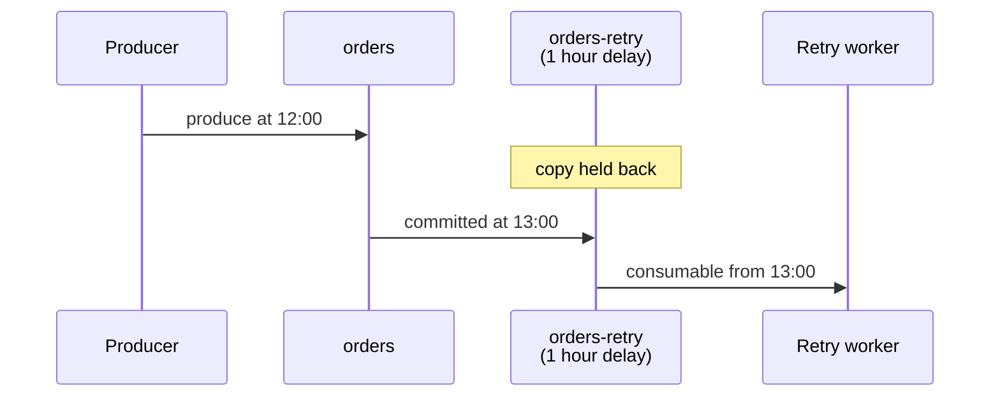

# Fan out and delay messages

Copy every message of one topic into other topics, at once or after a fixed delay, without changing your producers.

Before you start: you must own, or be an admin for, every topic you link. Creating a child in one call also needs a `create` grant that matches the child's name.

You attach [child topics](../reference/glossary.md#fan-out-child) to a parent topic. From then on, every message committed to the parent is copied to every child. Each child is an ordinary topic with its own consumers, retention and pace, so analytics, billing and a retry worker can each read the same stream on their own schedule.

<figure class="nr-dia nr-dia--doc" id="fig-fanout-children">
<div class="nr-dia__frame nr-plate nr-tint nr-tint--mint">
--8<-- "diagrams/fanout-children.html"
</div>
<figcaption>Each child stores its own copy and is read at its own pace; a delay child gets the same copy, only later. Copying starts at the attach, so messages already in <code>orders</code> are not copied.</figcaption>
</figure>

## Attach a child {#attach}

Both topics must already exist. Then attach the child to the parent:

=== "curl"

    ```sh title="Copy orders into orders-analytics"
    curl -i -u "$AUTH" -X POST "$NARAD/v1/topics/orders/children" \
      -H "Content-Type: application/json" \
      -d '{"child": "orders-analytics"}'
    ```

    ```http title="Response"
    HTTP/1.1 200 OK
    Content-Length: 282
    Content-Type: application/json
    Date: Mon, 28 Sep 2026 19:38:33 GMT

    {
      "name": "orders",
      "id": "244de9d4ac35abae",
      "partitions": 6,
      "retention_ms": 172800000,
      "visibility_timeout_ms": 30000,
      "max_in_flight_per_partition": 1024,
      "max_acked_ahead_per_partition": 1024,
      "created_at": 1790623885,
      "owner": "billing-service",
      "role": "parent",
      "children": [
        "orders-analytics"
      ]
    }
    ```

=== "CLI"

    ```sh
    narad topic attach orders orders-analytics
    ```

    The CLI prints the parent topic as JSON, with the same fields as the curl response.

`$NARAD` and `$AUTH` are the base URL and credentials from [Connect and authenticate](connect.md). The answer is the parent, now with `"role": "parent"` and the child in `children`.

- **Copying starts at the attach.** Messages already in the parent are not copied. Narad records the parent's committed position on every partition when it processes the attach (the child's `attach_offsets`), and copying starts exactly there. Partitions added to the parent later are copied from their first message.
- **Keys are kept**, so messages that share a key stay together in each child.
- **One parent per child.** A parent can have up to 108 children, and a child cannot have children of its own.
- **Schemas follow the parent.** A child takes on the parent's schema history, and an attach whose histories do not match gets [`409`](../reference/status-codes.md#status-409). [Schema validation rules](../reference/schema-rules.md#fan-out-children) has the exact conditions.
- **A failed attach links nothing.** If a node that owns one of the parent's partitions cannot be reached, the attach gets [`503`](../reference/status-codes.md#status-503); retry it.
- Detaching and attaching again starts a fresh copy from the new attach point. It never resumes or backfills.

The request is in the [HTTP API reference](../reference/http-api.md#attach-child).

## Create a child in one call {#create-child}

Pass `parent` when you create the topic, and it is created and attached in one step:

=== "curl"

    ```sh title="Create orders-billing as a child of orders"
    curl -i -u "$AUTH" -X POST "$NARAD/v1/topics" \
      -H "Content-Type: application/json" \
      -d '{"name": "orders-billing", "parent": "orders"}'
    ```

    ```http title="Response"
    HTTP/1.1 201 Created
    Content-Length: 340
    Content-Type: application/json
    Date: Mon, 28 Sep 2026 19:38:33 GMT

    {
      "name": "orders-billing",
      "id": "f26ef52b28c56169",
      "partitions": 6,
      "retention_ms": 604800000,
      "visibility_timeout_ms": 30000,
      "max_in_flight_per_partition": 1024,
      "max_acked_ahead_per_partition": 1024,
      "created_at": 1790624313,
      "owner": "billing-service",
      "role": "child",
      "parent": "orders",
      "attach_epoch": "418dffb6e352ebd0",
      "attach_offsets": [
        0,
        0,
        0,
        0,
        2,
        0
      ]
    }
    ```

=== "Go SDK"

    ```go
    child, err := client.CreateTopic(ctx, "orders-billing",
        narad.WithParent("orders"))
    ```

=== "CLI"

    ```sh
    narad topic add orders-billing --parent orders
    ```

The rules of an attach apply, plus these:

- Leave out `partitions` and the child gets the parent's partition count, as here.
- If the attach part fails, the create is undone, so no half-linked topic is left behind.
- The child's partitions are placed when it is created. With the parent's partition count, on a cluster of at least two live nodes, each child partition goes to a different node than the parent partition with the same index. That makes the child a second copy on other disks, which is the replica pattern in [Back up and replicate topics](../operate/backups.md#replica-children).
- Placement is decided at creation, not fixed forever: a later rebalance or decommission can move partitions, and it keeps a child partition off its parent's node only when that costs no balance. A child created first and attached later keeps whatever placement it was created with.

## Delay children {#delay-children}

A delay child receives each message a fixed time after the parent committed it. Give the delay when you link the child. The field has a different name in each request:

| Request | Delay field |
|---|---|
| Attach: `POST /v1/topics/{parent}/children` | `delay_ms` |
| Create with a parent: `POST /v1/topics` | `fanout_delay_ms` |

```sh title="Attach orders-retry with a one-hour delay"
curl -i -u "$AUTH" -X POST "$NARAD/v1/topics/orders/children" \
  -H "Content-Type: application/json" \
  -d '{"child": "orders-retry", "delay_ms": 3600000}'
```

```sh title="Create orders-reminders one day behind orders"
curl -i -u "$AUTH" -X POST "$NARAD/v1/topics" \
  -H "Content-Type: application/json" \
  -d '{"name": "orders-reminders", "parent": "orders",
       "fanout_delay_ms": 86400000}'
```

The attach answers `200` with the parent, and the create answers `201` with the new child, whose `fanout_delay_ms` is `86400000`. With the CLI, `--delay` takes a duration in both commands: `narad topic attach orders orders-retry --delay 1h` or `narad topic add orders-reminders --parent orders --delay 24h`.

A field sent to the wrong request is refused, not ignored:

```http title="Response to an attach sent with fanout_delay_ms"
HTTP/1.1 400 Bad Request
Content-Length: 66
Content-Type: application/json
Date: Mon, 28 Sep 2026 19:38:34 GMT

{"error":"invalid json: json: unknown field \"fanout_delay_ms\""}
```



What a delay child promises:

- **Measured on the server.** The delay counts from the parent's commit time, so the producer's clock does not matter.
- **Never early.** A message becomes consumable no earlier than the delay, usually within a second after it, and later if nodes fail. The time is read from the clock of the node that holds the parent's partition. If that partition moves to another node, messages the old node stamped are timed against the new node's clock, so keep the cluster's clocks synchronised with NTP.
- **Fixed.** The delay is at most one year and cannot be changed after the link. For a different delay, detach the child and attach a new one.
- **Fed only by the parent.** A produce straight to a delay child gets [`409`](../reference/status-codes.md#status-409): `direct produce to a delayed child topic is not allowed`.
- **Covered by the parent's retention.** The parent must keep messages for at least the delay plus one hour. Narad checks this when you link the child and when you lower the parent's retention later, and answers [`409`](../reference/status-codes.md#status-409) instead of letting a message expire before its delayed copy is made.

Delay children are also how to space out retries; [Back off with retry topics](handling-retries.md#backoff-topics) shows the pattern.

## List and detach children {#manage-children}

```sh title="List the children of orders"
curl -u "$AUTH" "$NARAD/v1/topics/orders/children"
```

```json title="Response"
{
  "parent": "orders",
  "children": [
    {
      "name": "orders-analytics",
      "delay_ms": 0,
      "lag_messages": 0,
      "lag_complete": false
    },
    {
      "name": "orders-billing",
      "delay_ms": 0,
      "lag_messages": 0,
      "lag_complete": false
    },
    {
      "name": "orders-retry",
      "delay_ms": 3600000,
      "lag_messages": 0,
      "lag_complete": false
    },
    {
      "name": "orders-reminders",
      "delay_ms": 86400000,
      "lag_messages": 0,
      "lag_complete": false
    }
  ]
}
```

- `lag_messages` counts parent messages not yet copied to that child. While `lag_complete` is `false`, some partitions have not reported, and the count is a lower bound.
- Listing needs any grant on the parent.
- `DELETE /v1/topics/orders/children/orders-analytics` detaches a child and answers `204`. The child keeps its messages and becomes an ordinary topic again. Detaching needs ownership of either topic, or admin. With the CLI: `narad topic children orders` and `narad topic detach orders orders-analytics`.

## Children on another cluster {#remote-children}

**New in v3.2.0.**

A child can also live on another Narad cluster. An admin registers that cluster once as a [remote](../reference/glossary.md#remote), then attaches a [remote child](../reference/glossary.md#remote-child):

```sh
narad topic attach orders orders-to-b --remote b --remote-topic orders
```

The owners of the parent's partitions send every record to the remote's topic through its batch produce, at least once, with the cursors, attach epochs, drop-behind and delay described here. On this cluster the child is a stub with no partitions: consume the copy on the remote. Detaching one is refused while records are unshipped, unless forced. [Replicate a topic to another cluster](remote-children.md) has the whole story.

## Fan-out cost {#cost}

Every child stores its own full copy of the parent's messages; that is what makes children independent. Ten children means ten extra copies of every message on disk and ten extra writes for each one, so budget disk and retention for every child. [Fan-out engine](../understand/fanout-engine.md) explains how the copying works and what happens when a child falls behind.

## Next steps

- [Back up and replicate topics](../operate/backups.md#replica-children): use a child as a second copy on other nodes.
- [Handle retries and dead letters](handling-retries.md#backoff-topics): build retry tiers from delay children.
- [Replicate a topic to another cluster](remote-children.md): a child whose copy lives on another Narad cluster (from v3.2.0).
- [Fan-out engine](../understand/fanout-engine.md): how copies are made, and how far behind a child can fall.
