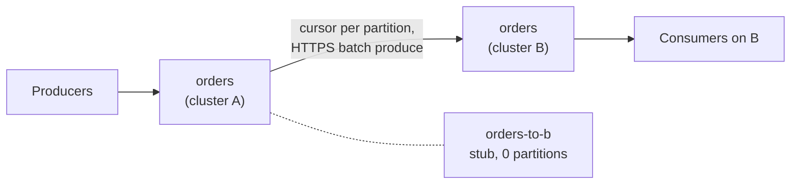

# Replicate a topic to another cluster

Copy every message of a topic to a topic on another Narad cluster, at least once, with a fan-out child whose copy lives there.

**Unreleased:** in master, not in v3.1.0.

Before you start: the `admin` grant on a cluster with security on; a [remote](../reference/glossary.md#remote) that an admin registered for the other cluster ([Manage remotes](../operate/remotes.md)); and the topic on the other cluster, created with the parent's schema if the parent has one.

A [remote child](../reference/glossary.md#remote-child) is a fan-out child whose topic lives on a remote. It works like any [fan-out child](fanout-and-delay.md): the owners of the parent's partitions run one cursor each, commit before they advance, and keep their place across restarts and partition moves. The difference is at the end of the cursor: instead of committing to child partitions on this cluster, it sends each record to the remote's [batch produce](producing.md#produce-batch) and advances only once the remote has answered `202`. On this cluster the child is a stub with no partitions; you consume the copy on the remote.



## Attach a remote child {#attach}

Name the remote in an ordinary attach. Run it with `dry_run` first: the leader runs every check from every node of this cluster against the target and resolves the start offsets, and writes nothing.

=== "curl"

    ```sh title="Check that orders can be copied to orders on remote b"
    curl -i -u "$AUTH" -X POST "$NARAD/v1/topics/orders/children" \
      -H "Content-Type: application/json" \
      -d '{"child": "orders-to-b", "remote": "b", "remote_topic": "orders",
           "from": "unconsumed", "dry_run": true}'
    ```

    ```http title="Response"
    HTTP/1.1 200 OK
    Cache-Control: no-store
    Content-Type: application/json
    X-Content-Type-Options: nosniff
    Date: Tue, 06 Oct 2026 13:06:41 GMT
    Content-Length: 435

    {
      "attach_offsets": [0, 0, 0],
      "capabilities": {"max_messages": 1000, "zstd": true},
      "checks": [
        {
          "node": "narad-0",
          "result": "pass",
          "credential_version": 1,
          "target_id": "128e63dd156ff568",
          "target_serves_ids": true,
          "rtt_ms": 0,
          "lane_capacity_per_s": 20000,
          "server_cert_not_after": "2026-11-05T13:04:25Z",
          "warnings": [],
          "posture": {
            "security_enabled": true,
            "legacy_cluster_auth": false,
            "raft_tls": true,
            "api_hop_encrypted": true
          }
        }
      ],
      "dry_run": true,
      "warnings": []
    }
    ```

    Then the same request without `dry_run`:

    ```sh title="Attach orders-to-b"
    curl -i -u "$AUTH" -X POST "$NARAD/v1/topics/orders/children" \
      -H "Content-Type: application/json" \
      -d '{"child": "orders-to-b", "remote": "b", "remote_topic": "orders",
           "from": "unconsumed"}'
    ```

    ```http title="Response"
    HTTP/1.1 201 Created
    Cache-Control: no-store
    Content-Type: application/json
    X-Content-Type-Options: nosniff
    Date: Tue, 06 Oct 2026 13:06:59 GMT
    Content-Length: 408

    {
      "name": "orders-to-b",
      "id": "d38a4383503cf4ac",
      "partitions": 0,
      "retention_ms": 0,
      "visibility_timeout_ms": 0,
      "max_in_flight_per_partition": 0,
      "max_acked_ahead_per_partition": 0,
      "created_at": 1791292019,
      "role": "child",
      "parent": "orders",
      "attach_epoch": "341e6b8a37a9688a",
      "attach_offsets": [0, 0, 0],
      "remote": {
        "name": "b",
        "topic": "orders",
        "target_id": "128e63dd156ff568",
        "from": "unconsumed",
        "lanes": 1,
        "created_by": "admin"
      }
    }
    ```

=== "CLI"

    ```sh
    narad topic attach orders orders-to-b --remote b --remote-topic orders \
      --from unconsumed --dry-run
    narad topic attach orders orders-to-b --remote b --remote-topic orders \
      --from unconsumed
    ```

    The CLI prints the same JSON as the curl responses.

These examples ran against a local pair of single-node clusters, the remote behind a TLS proxy on `localhost:8443`; `$NARAD` and `$AUTH` are this cluster's base URL and an admin's credentials ([Connect and authenticate](connect.md)). The answer is the new stub: `partitions` is `0` and `remote` says where its copies go.

| Field | Meaning |
|---|---|
| `child` | The stub's name on this cluster. It must not exist yet: the attach creates it. |
| `remote` | A remote's name. |
| `remote_topic` | The topic on the remote. Defaults to the parent's name. |
| `from` | Where the copy starts on each parent partition. `attach` (the default) at the parent's committed position, as for a local child; `unconsumed` at the parent's consumer frontier, so everything not yet acked on this cluster is sent; `earliest` at the oldest record the parent still keeps. |
| `lanes` | Ordered streams per parent partition, 1 to 8 (default 1). A key always uses one lane. More lanes help a link with a long round trip; see [throughput](#throughput). |
| `delay_ms` | As for a [delay child](fanout-and-delay.md#delay-children): each record is sent no earlier than this long after the parent committed it. |
| `dry_run` | Run the checks and resolve the start offsets; write nothing. |

What the attach checks, from every node of this cluster, before it writes anything:

- **The remote is usable here.** Every node can read the remote's credential at its current version, and every node runs this release with security on and legacy cluster authentication off. Otherwise the attach answers [`412`](../reference/status-codes.md#status-412), naming the member.
- **The target is a Narad topic you may write to.** It answers `401` without credentials, so its security is on; the topic exists; an empty batch produce is answered as a target with batch produce answers it, so the credential has `produce` there; and the credential cannot list users, so it is not an admin. There is no fallback to single produces, which would put message keys in URLs.
- **The copy cannot loop.** The target topic is not a delay child or another cluster's stub, none of its children is a remote child, and it is not the parent itself. This cluster has no other remote child sending to the same topic on the same host and port.
- **The schemas match.** When both topics have a schema, they must be the same document (formatting aside). A target with a schema and a parent without one passes with a warning: records the schema refuses will stop the link.
- **A target on v3.1.0 passes with a warning.** Its batch produce takes 100 messages and 1 MiB of body per request, while this cluster accepts a record of up to 1 MiB. A record over about 768 KiB of binary payload (sent as base64) or about 1 MiB of JSON then blocks the link as `record_too_large` until the target is upgraded or the record is [skipped](#skip), which loses it on the target. The attach warns when the target answers like v3.1.0 (unreleased).

A failed check answers with its `class` and each node's report ([check classes](../reference/remote-children.md#check-classes)). The attach also refuses a parent whose retention is below 24 hours (keep forever, `0`, passes), and warns below 72 hours: the parent's log is the only buffer while the remote is unreachable. A parent can have 16 remote children. The full request and every answer are in the [HTTP API reference](../reference/http-api.md#attach-child).

## The stub on this cluster {#stub}

The stub is a topic record with no partitions. It shows in `narad topic ls` and in the parent's children, and it refuses everything a topic with partitions does:

```http title="Response to a produce to orders-to-b"
HTTP/1.1 409 Conflict
Content-Length: 77
Content-Type: application/json
Date: Tue, 06 Oct 2026 13:07:15 GMT

{"error":"remote child \"orders-to-b\" lives on remote b; consume it there"}
```

- **Produce, consume and ack** answer [`409`](../reference/status-codes.md#status-409), as above.
- **A change to the stub** (retention, caps, partitions, schema) answers `409`. Pause and resume have their own requests, below.
- **The parent's retention** cannot be lowered below 24 hours while it has a remote child (`409`). A retention already below it can still grow.
- **Ownership.** The stub has no owner. An admin or the parent's owner may detach it; only an admin may attach, pause, resume or skip. `created_by` and `paused_by` are shown to admins only.

## Watch a remote child {#watch}

The parent's children listing shows each remote child's link:

```sh title="List the children of orders"
curl -i -u "$AUTH" "$NARAD/v1/topics/orders/children"
```

```http title="Response"
HTTP/1.1 200 OK
Content-Length: 469
Content-Type: application/json
Date: Tue, 06 Oct 2026 13:07:03 GMT

{
  "parent": "orders",
  "parent_id": "4be76b543f9c4091",
  "children": [
    {
      "name": "orders-to-b",
      "delay_ms": 0,
      "lag_messages": 0,
      "lag_complete": true,
      "remote": {
        "name": "b",
        "topic": "orders",
        "target_id": "128e63dd156ff568",
        "from": "unconsumed",
        "lanes": 1,
        "created_by": "admin"
      },
      "paused": false,
      "state": "running",
      "lag_seconds": 0,
      "retention_headroom_seconds": 259200,
      "source_drained": false,
      "blocked_at": null,
      "target_verified_at": "2026-10-06T13:07:00Z",
      "last_success_at": "2026-10-06T13:07:00Z"
    }
  ]
}
```

- **`state`** is the worst state of the link's partitions: `running`, `paused`, or the reason it is stalled, such as `auth_failed` (the remote refused the credential) or `target_missing`. Each state, what causes it and what clears it are in [Link states](../reference/remote-children.md#link-states). `unknown` means a partition's owner did not report, and then `lag_complete` is `false`.
- **`lag_messages`** counts parent records the remote has not accepted yet, and **`lag_seconds`** is the age of the oldest of them on the clock of the node that owns its partition: the link's recovery point. **`retention_headroom_seconds`** is the parent's retention minus that age, the time left before the oldest unshipped record ages out of the parent and is lost (drop-behind). A cursor that passes records lost that way counts them in `narad_fanout_child_dropped_messages` and logs `fanout: remote child lost records the remote never received` at error level, with the remote and the offset range (unreleased).
- **`source_drained`** turns `true` once the parent's consumers have acked past the link's start on every partition, which is what [moving consumers](../operate/playbooks/offload.md) waits for.
- **`blocked_at`** names the one record a cursor is stuck on, when the remote refuses it for good ([skip](#skip)).
- **`target_verified_at`** is when the cursors last checked the target. Each cursor checks it when it starts and every `check_interval_ms` of the remote (60 s by default), with records to send or not, so a quiet link still notices a deleted remote, a revoked user or a recreated topic. A running link with no successful check for 10 minutes is flagged `unverified`.
- `?partitions=true` adds one row per parent partition, with its owner, start offset, cursor, high watermark and consumer frontier.

The listing never shows the remote's URL or credential, and never text from the target: a failure is a state. With the CLI, `narad topic children orders [--partitions]`.

To wait for a link in a script, `narad topic wait` polls the listing:

```sh
narad topic wait orders orders-to-b --lag-zero --stable 5s
```

```text title="Output"
orders-to-b: reached (lag 0, state running)
```

`--lag-zero` waits until every record committed to the parent is on the remote, and `--source-drained` until the parent's consumers have passed the link's start. `--stable` makes the condition hold that long. The command exits `0` when the condition holds, `1` after `--timeout` (30 minutes by default), and `2` at once when the link is stalled in a state that needs a fix, printing the state and the stuck record.

## Pause, resume and skip {#pause-resume}

Each of these needs the `admin` grant, answers the stub, and writes an audit line.

```sh title="Pause orders-to-b"
curl -i -u "$AUTH" -X POST \
  "$NARAD/v1/topics/orders/children/orders-to-b/pause" \
  -H "Content-Type: application/json" \
  -d '{"reason": "target maintenance, CHG-4211"}'
```

The answer is the stub with `"paused": true`, the reason, who paused it and when. With the CLI: `narad topic pause orders orders-to-b --reason "..."`.

- **Pause** stops sending. The cursors keep their positions, and the parent's retention keeps running: a pause longer than the headroom loses the oldest records to drop-behind. A pause needs only that every node runs this release, read from the cluster metadata, so it works while a node is down.
- **Resume** (`POST .../resume`, `narad topic resume`) runs the attach checks from every node again, then sends from where the cursors stopped. A target topic that was deleted and created again since the attach is refused with `409` before anything goes to it, and the link holds in `target_replaced`; resume with `{"accept_target": true}` (`--accept-target`) to send to the new topic. Resume needs every node to answer.

### Skip a record the remote refuses {#skip}

A cursor that the remote answers with a refusal for one record (its schema refuses it, `rejected_record`, or it is too large for the remote, `record_too_large`) stops on that record and holds the link there. `blocked_at` in the listing names it. Fix the cause on the remote if you can; otherwise let the cursor drop that one record:

```sh title="Let orders-to-b drop the record at partition 0, offset 2"
curl -i -u "$AUTH" -X POST \
  "$NARAD/v1/topics/orders/children/orders-to-b/skip" \
  -H "Content-Type: application/json" \
  -d '{"partition": 0, "offset": 2}'
```

With the CLI: `narad topic skip orders orders-to-b --partition 0 --offset 2`. The leader asks the partition's owner first and accepts the skip only while the link's cursor is stuck on exactly that partition and offset (`blocked_at` in the listing); a skip that names any other record answers `409` with the record the cursor is stuck on, and nothing is stored. With several lanes stuck, the listing names the lowest record: skip them in order. The stub records each accepted skip under `remote.skip` (at most 16 offsets per partition, always keeping the one just skipped). Skips add up: skipping a second record of a partition keeps the first one skipped. The record stays in the parent's log for its retention, and every dropped record is counted in `narad_fanout_remote_skipped_records_total` and logged by the node that drops it (`remote child skipped a record an admin skipped`, warning). The skip request itself is audited.

## Detach a remote child {#detach}

Detaching a remote child deletes its stub. It is refused while any record of the parent is not yet on the remote:

```sh title="Detach orders-to-b while records are unshipped"
curl -i -u "$AUTH" -X DELETE \
  "$NARAD/v1/topics/orders/children/orders-to-b"
```

```http title="Response"
HTTP/1.1 409 Conflict
Cache-Control: no-store
Content-Type: application/json
X-Content-Type-Options: nosniff
Date: Tue, 06 Oct 2026 13:07:18 GMT
Content-Length: 122

{"dispatch_backlog":{},"error":"remote child \"orders-to-b\" has unshipped records","lag_complete":true,"lag_messages":4}
```

The leader counts what is unshipped before it deletes anything: the cursors' lag (`lag_messages`, and `lag_complete` `false` when an owner did not report), and every node's [ingress WAL](../reference/glossary.md#ingress-wal) records of the parent that it answered `202` for and has not committed yet (`dispatch_backlog`, by node). Any of them above zero, or a node that did not answer, refuses the detach. With the CLI the refusal says what to do:

```text title="Output of narad topic detach orders orders-to-b"
narad: remote child "orders-to-b" has unshipped records: 1 records not yet on the remote (lag complete: true).
Wait for them to ship (narad topic wait --lag-zero), or abandon them with: narad topic detach orders orders-to-b --force
```

- **Stop the producers first.** The check is a point in time: a record produced after it is not on the remote when the stub goes.
- **`force=true`** (`narad topic detach orders orders-to-b --force`) deletes anyway and abandons what is unshipped; the leader's audit line records how much. It is the only way to abandon records: `narad topic rm --force` only skips the confirmation prompt.
- **One check per parent every 10 seconds.** Another detach of the same parent within 10 s answers [`429`](../reference/status-codes.md#status-429) with `Retry-After`.
- **Deleting the parent** is refused the same way while it has remote children with unshipped records, and with `force=true` deletes their stubs in the same step.

Only an admin or the parent's owner may detach a remote child. The request and every answer are in the [HTTP API reference](../reference/http-api.md#detach-child).

## What a remote child promises {#promises}

- **At least once, never a gap.** A cursor advances only after the remote answered `202` for every record of its batch, or an admin skipped one. Nothing about a remote (a refused password, a deleted remote, a refused address, the remote down) moves a cursor; each only stalls it, with the reason in the listing.
- **Duplicates on the remote.** A request whose answer never came (a timeout, a dropped connection, a `5xx`) is sent again, so the remote can store records twice. They are counted in `narad_remote_resent_records_total`. Consumers on the remote must be idempotent, as on any Narad topic.
- **Order per key, within the guarantees Narad gives.** A key always travels on one lane, and a lane sends its records in parent order, one request at a time, so records that share a key arrive in parent order in normal operation. As on any topic, that is not a guarantee: the remote can reorder them like any produce ([Ordering](../understand/delivery-contract.md#ordering)).
- **Offsets and partitions are the remote's.** Keys travel with each record and the remote's partitioner places it, so a record's partition and offset there differ from the parent's. A payload that is one JSON value arrives byte for byte; anything else travels as base64 and is stored as the same bytes.
- **Loss only by retention.** If the remote stays unreachable for longer than the parent's retention, the oldest unshipped records age out of the parent and are counted in `narad_fanout_child_dropped_messages`, as for a local child. Watch `retention_headroom_seconds`.
- **Every node needs to reach the remote.** Cursors run where the parent's partitions are, and partitions move; the attach and resume checks run on every node. The operator sets which hosts and ports a remote may use ([Manage remotes](../operate/remotes.md)).

## Throughput {#throughput}

A lane sends one request at a time and waits for its answer, so a lane's rate is bounded by the round trip to the remote. A request carries up to 1,000 records to a remote on this release (100 to an older one) and up to 960 KiB of body, which shrinks after a timeout and grows back after 20 accepted requests. More lanes (`lanes`, up to 8) send in parallel for one parent partition; records that share a key stay on one lane. The remote's `max_in_flight` limit (16 requests per node by default) caps all the lanes of all the cursors that send to one remote from one node. With `remotes.allowed_hosts` set, [test a remote](../reference/http-api.md#test-remote) reports each node's connect time and an estimate of one lane's capacity at that round trip.

## Next steps

- [Manage remotes](../operate/remotes.md): register the other cluster, rotate its password, and the security model.
- [Playbooks](../operate/playbooks/offload.md): move a topic to another cluster, and set up disaster recovery with a remote child.
- [Remotes and remote children](../reference/remote-children.md): every link state, check class and limit.
