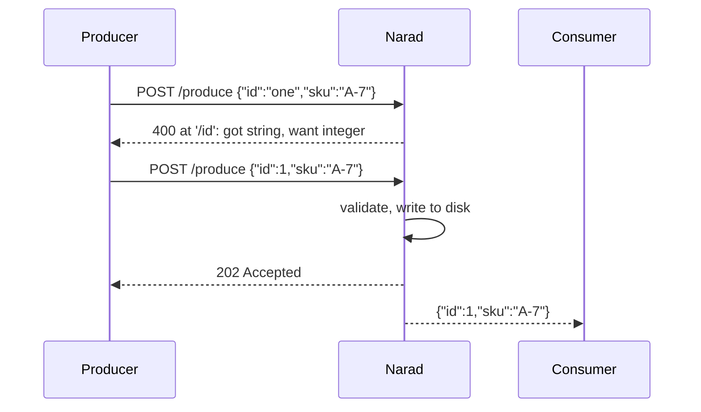

# Enforce schemas on a topic

Give a topic a JSON Schema so the broker refuses every message that does not match it, then evolve the schema without breaking consumers.

Before you start: to register or change a topic's schema you must own the topic or be an admin. Anyone with a grant on the topic can read the schema.

When a topic has a schema, Narad validates every produce against it before the message is written. A body that does not fit gets `400` with the failing field, and nothing reaches the log. The contract lives in one place and holds for every producer in every language, with no registry service to run. Versions are append-only and each change is checked for compatibility, so a consumer written against version 1 keeps working after version 2.



## Register a schema {#register}

Give the schema when you create the topic:

=== "curl"

    ```sh title="Create orders with a schema"
    curl -i -u "$AUTH" -X POST "$NARAD/v1/topics" \
      -H "Content-Type: application/json" \
      -d '{
        "name": "orders",
        "schema": {
          "type": "object",
          "properties": {
            "id":  {"type": "integer"},
            "sku": {"type": "string", "minLength": 1}
          },
          "required": ["id", "sku"],
          "additionalProperties": false
        }
      }'
    ```

    ```http title="Response"
    HTTP/1.1 201 Created
    Content-Length: 234
    Content-Type: application/json
    Date: Mon, 28 Sep 2026 19:25:35 GMT

    {
      "name": "orders",
      "id": "71f9b6869df02ef3",
      "partitions": 3,
      "retention_ms": 604800000,
      "visibility_timeout_ms": 30000,
      "max_in_flight_per_partition": 1024,
      "max_acked_ahead_per_partition": 1024,
      "created_at": 1790623535,
      "owner": "billing-service"
    }
    ```

=== "Go SDK"

    ```go
    topic, err := client.CreateTopic(ctx, "orders",
        narad.WithSchema(schema))
    ```

    `schema` is the document as a `json.RawMessage`.

=== "CLI"

    ```sh
    narad topic add orders --schema @orders-v1.json
    ```

    `--schema` takes the document inline, from a file with `@`, or from standard input with `-`.

A message that fits is accepted as usual:

```sh title="Produce a valid message"
curl -i -u "$AUTH" -X POST \
  "$NARAD/v1/topics/orders/produce?key=customer-42" \
  -H "Content-Type: application/json" \
  -d '{"id": 1, "sku": "A-7"}'
```

```http title="Response"
HTTP/1.1 202 Accepted
Date: Mon, 28 Sep 2026 19:25:35 GMT
Content-Length: 0
```

One that does not is refused, and the error names the location and the reason:

```sh title="Produce an invalid message"
curl -i -u "$AUTH" -X POST \
  "$NARAD/v1/topics/orders/produce?key=customer-42" \
  -H "Content-Type: application/json" \
  -d '{"id": "one", "sku": "A-7"}'
```

```http title="Response"
HTTP/1.1 400 Bad Request
Content-Length: 137
Content-Type: application/json
Date: Mon, 28 Sep 2026 19:25:35 GMT

{"error":"invalid argument: schema: jsonschema validation failed with 'narad://schema/orders/1#'\n- at '/id': got string, want integer"}
```

- To add a schema to a topic that has none, send it in a `PATCH`, as in the [next section](#evolve), without `schema_base_version`.
- On a topic with a schema, every produce body must be one JSON value that validates against the current version. Text that is not JSON, binary data and an empty body all get [`400`](../reference/status-codes.md#status-400).
- The schema itself must be a JSON object, or `true` to accept any JSON. `false` is refused because it would reject every message. [Schema validation rules](../reference/schema-rules.md#validation) lists the size and nesting limits, the supported drafts, and exactly how numbers, strings and formats are checked.

## Evolve a schema {#evolve}

Send the new version with `PATCH`. `schema_base_version` makes the change conditional: it applies only if version 1 is still the current one.

=== "curl"

    ```sh title="Add an optional note field"
    curl -i -u "$AUTH" -X PATCH "$NARAD/v1/topics/orders" \
      -H "Content-Type: application/json" \
      -d '{
        "schema_base_version": 1,
        "schema": {
          "type": "object",
          "properties": {
            "id":   {"type": "integer"},
            "sku":  {"type": "string", "minLength": 1},
            "note": {"type": "string"}
          },
          "required": ["id", "sku"],
          "additionalProperties": false
        }
      }'
    ```

    The answer is `200` with the topic.

=== "Go SDK"

    ```go
    topic, err := client.SetSchema(ctx, "orders",
        narad.WithSchema(schemaV2),
        narad.WithSchemaBaseVersion(1))
    ```

=== "CLI"

    ```sh
    narad topic edit orders --schema @orders-v2.json \
      --schema-base-version 1
    ```

Narad checks that every message the previous version accepted is still valid under the new one. Adding an optional property, dropping a name from `required`, adding a type or loosening a bound is accepted. Adding a required property, removing a property, or tightening a bound is refused with [`400`](../reference/status-codes.md#status-400):

```http title="Response to a new version that adds note to required"
HTTP/1.1 400 Bad Request
Content-Length: 119
Content-Type: application/json
Date: Mon, 28 Sep 2026 19:25:44 GMT

{"error":"invalid argument: schema incompatible with previous version: schema root: required property \"note\" added"}
```

The full list of allowed changes, keyword by keyword, is in [Schema validation rules](../reference/schema-rules.md#compatibility).

- **Conditional.** If another change landed first, the request gets [`409`](../reference/status-codes.md#status-409) and nothing changes. Read the current schema, merge, and send it again with the new base version. Without `schema_base_version`, the change is checked against whatever version is current when it is applied.
- **Idempotent.** Sending the current schema again registers nothing and answers `200`, so a retry after a lost response does not add a version. Formatting and key order do not matter.
- **Append-only.** A version cannot be changed or removed, and `"schema": null` gets [`400`](../reference/status-codes.md#status-400). To accept more, register a wider schema. A topic keeps at most 1000 versions.
- **When it applies.** The node that answered your `PATCH` validates with the new version from then on; other nodes switch within milliseconds. [Schema validation rules](../reference/schema-rules.md#when-a-version-takes-effect) has the exact sequence.

A version conflict looks like this:

```http title="Response"
HTTP/1.1 409 Conflict
Content-Length: 110
Content-Type: application/json
Date: Mon, 28 Sep 2026 19:25:44 GMT

{"error":"schema version conflict: schema_base_version 1 does not match the current version 2 of \"orders\""}
```

## Read the schema {#read}

`GET /v1/topics/orders` carries `schema_version` (0 when the topic has none) and the current `schema`. For every version, oldest first:

```sh title="Read the schema history"
curl -u "$AUTH" "$NARAD/v1/topics/orders/schema"
```

??? note "Full response"

    ```json
    {
      "topic": "orders",
      "version": 2,
      "versions": [
        {
          "version": 1,
          "schema": {
            "type": "object",
            "properties": {
              "id": {
                "type": "integer"
              },
              "sku": {
                "type": "string",
                "minLength": 1
              }
            },
            "required": [
              "id",
              "sku"
            ],
            "additionalProperties": false
          }
        },
        {
          "version": 2,
          "schema": {
            "type": "object",
            "properties": {
              "id": {
                "type": "integer"
              },
              "sku": {
                "type": "string",
                "minLength": 1
              },
              "note": {
                "type": "string"
              }
            },
            "required": [
              "id",
              "sku"
            ],
            "additionalProperties": false
          }
        }
      ]
    }
    ```

With the CLI, `narad topic schema orders` prints the history and `--current` prints only the current document. A `produce` grant is enough to read the schema a producer must satisfy, but not to change it.

## Schemas and children {#children}

A [fan-out child](fanout-and-delay.md) takes on its parent's whole schema history, and while attached only the parent's schema can change: a `PATCH` of the child's schema gets [`409`](../reference/status-codes.md#status-409). The conditions for attaching a child with a schema of its own are in [Schema validation rules](../reference/schema-rules.md#fan-out-children).

The Go SDK's message envelope is a different shape from your message, so producing an envelope to a topic with a schema is refused. [Go SDK](go-sdk.md#envelopes) shows how to register a schema that accepts both.

## Next steps

- [Schema validation rules](../reference/schema-rules.md): every keyword, limit and compatibility rule.
- [Produce messages](producing.md): what else a produce can be refused for.
- [Fan out and delay messages](fanout-and-delay.md): how children share a parent's schema.
