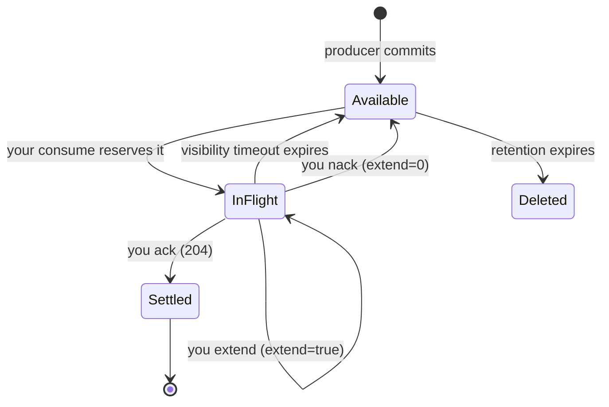

# Consuming

Narad consumers **pull**. You ask for a message, get exactly one plus a receipt handle, process it, and ack it. No partition assignment, no rebalancing, no consumer groups to configure — run as many consumer processes as you like against the same topic and Narad hands each message to exactly one of them at a time.

## The lifecycle of one message



## Consuming

```bash
curl -u $AUTH "$NARAD/v1/topics/orders/consume?wait=10s"
```

- `200` with a message, or `204` if nothing turned up within `wait`.
- `wait` long-polls (up to the server's cap, typically 10s). Loop on it — that's the intended pattern; an idle loop costs one cheap request per `wait`.
- The response's `receipt_handle` is your proof of possession. Treat it as **opaque** — echo it back on ack, never parse it.
- The message is now invisible to everyone else for `visibility_timeout_ms` (topic setting, default 30s). Your job is to finish and ack within that window.

You may also pass `partition=N` to consume from one partition only, or `offset=N&partition=N` to **replay** — read any retained message by position without affecting queue state. Replay is read-only: no reservation, no receipt handle.

## Acking

```bash
curl -u $AUTH -X POST "$NARAD/v1/topics/orders/ack?receipt_handle=$HANDLE"
```

`204`: settled forever. Acks are per-message and may arrive out of order (up to `max_acked_ahead_per_partition` outstanding).

If you're too late — the visibility window lapsed and the message was handed to someone else — you get **`410 Gone`**. That's not an error to fix; it's Narad telling you the work may run twice. Design your processing to be idempotent and move on.

## Extending your lease

Slow job? Heartbeat it instead of raising the topic-wide timeout:

```bash
curl -u $AUTH -X POST \
  "$NARAD/v1/topics/orders/ack?receipt_handle=$HANDLE&extend=true"
```

`204` restarts your visibility window from now. Call it periodically while working (e.g., every third of the timeout). A `410` means the lease already lapsed — stop working on that message; it belongs to someone else now.

## Giving a message back (nack)

Can't process it right now — dependency down, wrong worker, poison pill you want retried elsewhere?

```bash
curl -u $AUTH -X POST \
  "$NARAD/v1/topics/orders/ack?receipt_handle=$HANDLE&extend=0"
```

`204`: the message is immediately redeliverable, without waiting out the visibility timeout. Waiting consumers are woken instantly.

## Flow control you should know about

- **`max_in_flight_per_partition`**: once that many messages are out and unacked on a partition, consume returns `204` until acks arrive. Stops one stuck consumer fleet from vacuuming the queue.
- **`max_acked_ahead_per_partition`**: bound on out-of-order acks held while an earlier message is still unacked. Exceed it and acks return `503` briefly — ack the stragglers.
- **Duplicates are normal.** Crashes, timeouts, and nacks all cause redelivery. Use the message key or an ID in the payload to deduplicate in your handler.
