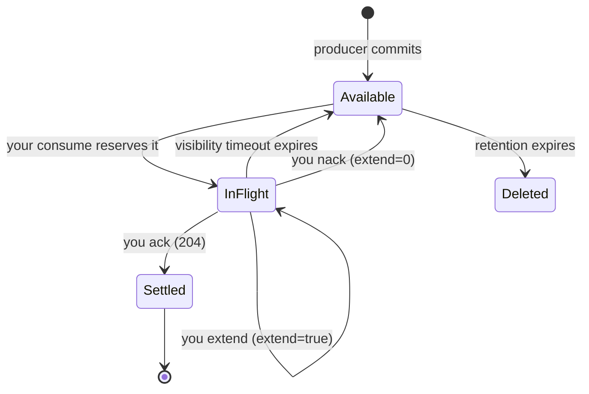

# Consuming

Narad consumers **pull**. You ask for a message, get one plus a receipt handle (or [a batch of them](#consuming-in-batches)), process it, and ack it. No partition assignment, no rebalancing, no consumer groups to configure: run as many consumer processes as you like against the same topic and Narad hands each message to exactly one of them at a time.

## The lifecycle of one message


```mermaid
stateDiagram-v2
    [*] --> Available: producer commits
    Available --> InFlight: your consume reserves it
    InFlight --> Settled: you ack (204)
    InFlight --> Available: visibility timeout expires
    InFlight --> Available: you nack (extend=0)
    InFlight --> InFlight: you extend (extend=true)
    Settled --> [*]
    Available --> Deleted: retention expires
```

## Consuming

```bash
curl -u $AUTH "$NARAD/v1/topics/orders/consume?wait=10s"
```

- `200` with a message, or `204` if nothing turned up within `wait`.
- `wait` long-polls (up to the server's cap, typically 10s). Loop on it: that's the intended pattern; an idle loop costs one cheap request per `wait`.
- Ask for longer than the cap and you get the cap, not an error. The response then carries **`X-Narad-Wait-Clamped`** with the value actually used, so a `204` that arrives sooner than you asked for is explained rather than mysterious. Worth logging the first time you see it: without it, a client that requested `wait=25s` and got answered at 10s looks like it is losing messages.
- The response's `receipt_handle` is your proof of possession. Treat it as **opaque**: echo it back on ack, never parse it.
- The message is now invisible to everyone else for `visibility_timeout_ms` (topic setting, default 30s). Your job is to finish and ack within that window.

You may also pass `partition=N` to consume from one partition only, or `offset=N&partition=N` to **replay**: read any retained message by position without affecting queue state. Replay is read-only: no reservation, no receipt handle.

## Consuming in batches

```bash
curl -u $AUTH -H 'X-Narad-Client: curl' "$NARAD/v1/topics/orders/consume?wait=10s&max=50"
```

- A batch consume must send an `X-Narad-Client` header (any value; the CLI and the Go SDK send it), else `400`. A consume reserves messages, and a page on another origin could send a `GET` with an operator's cached Basic credentials; the header forces a CORS preflight, which Narad never approves. A single consume does not need it.
- `max=N`, from 1 to 100, asks for up to N messages in one response: `200` with `{"messages":[...]}`, or `204` if nothing turned up within `wait`. Each element is exactly what a single consume returns, with its own `receipt_handle` and its own visibility window, and you ack each one on its own (or [in a batch](#acking-in-batches)). Any `max`, `max=1` included, gets the `{"messages":[...]}` shape; without `max` the body is one message, as always. An empty `max=` counts as no `max` (one message in the single-message shape, not a `400`), so a client that builds `max=` from a variable should check it is set.
- A batch is what is ready now, not N on demand. The request is never held to fill N, and it does not go round the other nodes to fill it either.
- On a node that owns some of the topic's partitions, the batch comes from one scan of those partitions. Only when that finds nothing does the request fall back on the single-message path: it asks the other owners for one message, then waits (the ordinary long-poll, other nodes' partitions included), and adds to the message the wait delivers whatever a second scan of its own partitions finds. There, other nodes' partitions contribute at most one message to a batch.
- On a node that owns none of the topic's partitions, and for a `partition=N` another node owns, the request is forwarded and asks for up to N. The owners are tried in turn, and the first that has messages answers with up to N of its own. When none has any, the request waits, and the owner whose messages end the wait answers with up to N of what it holds then.
- A batch can hold fewer than N messages when they are large. One scan stops reserving once the keys and payloads it took add up to 4 MiB, and a response carries at most 8 MiB of encoded messages; the first message always goes, whatever its size. JSON goes out as it came in and binary grows by a third, so those fit. [Text that is not JSON](#the-payload-comes-back-the-way-you-sent-it) goes out as a JSON string, where most control bytes, and each of `<`, `>` and `&`, take six bytes, so those are the messages a response leaves out. A message left out is handed back at once and goes to the next consume; it shows in the broker's metrics as a nack, and as a second consume when it is redelivered.
- `max` combines with `partition=N` but not with `offset` (a replay reads one message): that, and a `max` outside 1 to 100, is a `400`.
- Every message in a batch counts against its partition's `max_in_flight_per_partition` as a single consume would, and a batch request counts as N against your per-identity cap on concurrent consumes (`http.max_consume_in_flight_per_identity`), which answers `429` beyond it.
- Batches need a server that knows them. A node on a release before them ignores `max` and answers one message in the single-message shape, so switch a client over once every node it can reach has been upgraded. During a rolling upgrade, a batch that an upgraded node forwards to an owner still on the older release comes back with one message, in the batch shape.

## The payload comes back the way you sent it

Produce takes raw bytes, so the response's `payload` field adapts to what was produced:

| You produced | You consume |
| --- | --- |
| A JSON value (`{"a":1}`, `[1,2]`, `"hi"`, `42`) | That exact JSON, byte-for-byte verbatim |
| Plain text (`hello world`) | A JSON string: `"payload": "hello world"` |
| Raw binary (an image, protobuf, gzip…) | A base64 string, flagged: `"payload_encoding": "base64"` |

The rule for consumers: **if `payload_encoding` is `"base64"`, decode it; otherwise use the payload as-is.** JSON strings can't carry arbitrary bytes, so base64 is the one case where Narad must wrap, and it always tells you when it did. Text and JSON round-trip untouched.

The message's `key` follows the same rule. It is present only when the message was produced with one (a keyless message has no `key` field at all), and it is a plain JSON string, control characters escaped the way any JSON encoder escapes them. A key that is not valid UTF-8 (a raw hash, a packed ID) comes back as base64 with **`"key_encoding": "base64"`** beside it: decode it when that field says so, use it as-is otherwise. The partition's owner encodes the message, and a node that forwards your consume passes its encoding through, so during a rolling upgrade a message whose owner still runs an older release comes back the old way: no `key_encoding`, and a key with invalid UTF-8 or certain control bytes can make the whole response invalid JSON.

## Acking

```bash
curl -u $AUTH -X POST "$NARAD/v1/topics/orders/ack?receipt_handle=$HANDLE" \
  -H "Content-Type: application/json"
```

`204`: settled forever. Acks are per-message and may arrive out of order (up to `max_acked_ahead_per_partition` outstanding).

If you're too late (the visibility window lapsed and the message was handed to someone else), you get **`410 Gone`**. That's not an error to fix; it's Narad telling you the work may run twice. Design your processing to be idempotent and move on.

## Acking in batches

```bash
curl -u $AUTH -X POST -H "Content-Type: application/json" \
  "$NARAD/v1/topics/orders/ack" \
  -d '{"receipt_handles":["2:40:861651","0:17:220931"]}'
```

- Leave out the `receipt_handle` parameter and send a JSON body `{"receipt_handles":[...]}` with 1 to 100 handles, at most 64 KiB. `extend=true` or `extend=0` applies to every handle in the request, as it does to a single one.
- The answer is `200` with one result per handle, in request order: `{"results":[{"status":204},{"status":410,"error":"receipt handle no longer matches an active reservation"}]}`. Each `status` is exactly what a single ack of that handle would have answered (`204`, `410`, `400` for a malformed handle, `502`, `503`, ...), and `error` carries the message when it is not a success. Every handle is settled on its own: one stale or malformed handle never fails the rest, and a handle repeated in one request is answered as a second single ack would be.
- Retry the handles whose result is `502` or `503`, exactly as you would retry single acks.
- A request that is malformed as a whole (invalid JSON, an unknown field, no handles, more than 100, a bad `extend`) is `400`, and a body over 64 KiB is `413`.
- Handles for partitions other nodes own are forwarded with one request per owner, the owners in parallel, so an unreachable owner costs only its own handles.
- A node on a release before batch acks answers this request `400` (`receipt_handle required`). As with batch consume, switch a client over once every node it can reach has been upgraded.

## Extending your lease

Slow job? Heartbeat it instead of raising the topic-wide timeout:

```bash
curl -u $AUTH -X POST -H "Content-Type: application/json" \
  "$NARAD/v1/topics/orders/ack?receipt_handle=$HANDLE&extend=true"
```

`204` restarts your visibility window from now. Call it periodically while working (e.g., every third of the timeout). A `410` means the lease already lapsed: stop working on that message; it belongs to someone else now.

## Giving a message back (nack)

Can't process it right now: dependency down, wrong worker, poison pill you want retried elsewhere?

```bash
curl -u $AUTH -X POST -H "Content-Type: application/json" \
  "$NARAD/v1/topics/orders/ack?receipt_handle=$HANDLE&extend=0"
```

`204`: the message is immediately redeliverable, without waiting out the visibility timeout. Waiting consumers are woken instantly.

## Flow control you should know about

- **`max_in_flight_per_partition`**: once that many messages are out and unacked on a partition, consume returns `204` until acks arrive. Stops one stuck consumer fleet from vacuuming the queue.
- **`max_acked_ahead_per_partition`**: bound on out-of-order acks held while an earlier message is still unacked. Once it is reached, consume stops handing out fresh messages on that partition and serves only the one blocking the frontier; acks for messages you already hold are always accepted, so nothing you were given can bounce.
- **Retry `503` (and `502`) acks, batch results included. This is not optional.** A `503` on ack means the partition's owner is unreachable right now; a `502` means the node you reached got no answer from the owner in time. An ack you drop on the floor becomes a redelivery 30 seconds later, whose ack can bounce again; we watched a consumer that didn't retry generate 600,000 duplicate deliveries in one evening. Treat a failed ack like a failed write, and retry it with backoff.
- **Duplicates are normal.** Crashes, timeouts, and nacks all cause redelivery. Use the message key or an ID in the payload to deduplicate in your handler.
