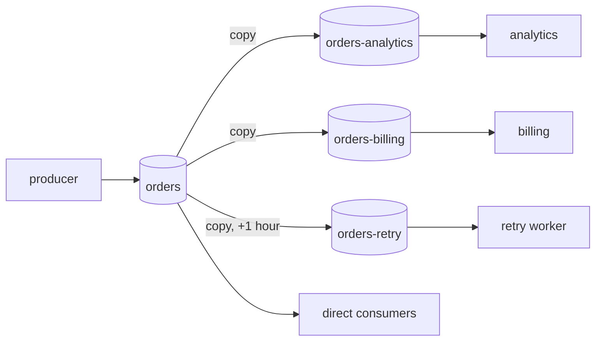
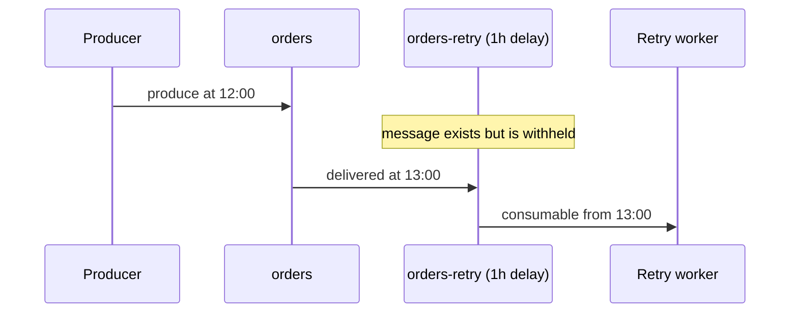

# Fan-out & Delay

Sometimes one stream of events needs to feed many independent consumers — analytics wants everything, billing wants everything, and a retry system wants everything *an hour later*. Fan-out does this without producers changing anything.

## The idea

You attach **child topics** to a **parent topic**. From that moment, every message committed to the parent is automatically copied to every child. Each child is a completely normal topic with its own consumers, retention, and pace.



## Attaching a child

Both topics must already exist. Then:

```bash
curl -u $AUTH -X POST $NARAD/v1/topics/orders/children \
  -H "Content-Type: application/json" \
  -d '{"child": "orders-analytics"}'
```

Rules to know:

- Fan-out starts **from the moment of attach**. Messages already in the parent are not backfilled.
- Copies preserve the message **key**, so per-key ordering carries into each child.
- A child belongs to one parent; a parent can have up to 108 children; chains (child of a child) are not allowed.
- If the parent enforces a schema, children must be schema-compatible — attach fails with `409` otherwise.
- Detach and re-attach = a fresh start from the parent's tail, never a resume or replay.

```bash
curl -u $AUTH $NARAD/v1/topics/orders/children              # list children + how far behind each is
curl -u $AUTH -X DELETE $NARAD/v1/topics/orders/children/orders-analytics   # detach
```

## Delay children

Add `delay_ms` and the child becomes a **delay topic**: each message appears in it exactly that long after the parent committed it.

```bash
curl -u $AUTH -X POST $NARAD/v1/topics/orders/children \
  -H "Content-Type: application/json" \
  -d '{"child": "orders-retry", "delay_ms": 3600000}'
```



The fine print:

- **Delay is measured from the parent commit time** on the server — your producer's clock doesn't matter.
- Delay is fixed per child (up to 1 year) and **immutable after attach**. Want a different delay? Detach and attach a new child.
- **You cannot produce directly to a delay child** (`409`) — its whole timeline comes from the parent, which is what makes the delay trustworthy.
- The parent's retention must be at least `delay + 1 hour`, and Narad enforces this at attach time *and* blocks retention changes that would violate it. This guarantees a message can never age out of the parent before its delayed delivery.
- Delivery is *"no earlier than"* the delay, typically within a second after. Under failures it can be later — never earlier.

## What fan-out costs you

Every child stores its **own full copy** of the data (that's what makes children independent). Ten children = ten copies of every parent message on disk. Budget retention accordingly.
