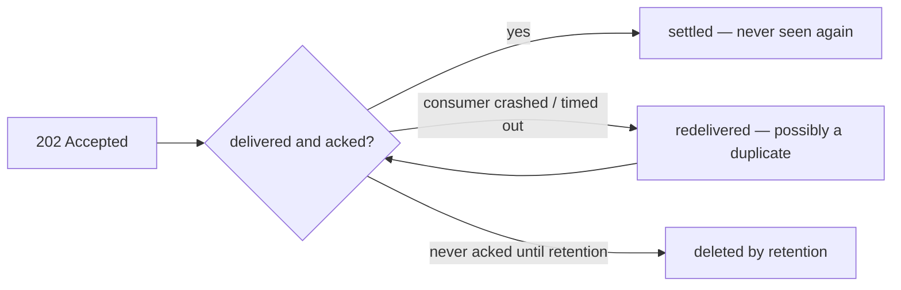
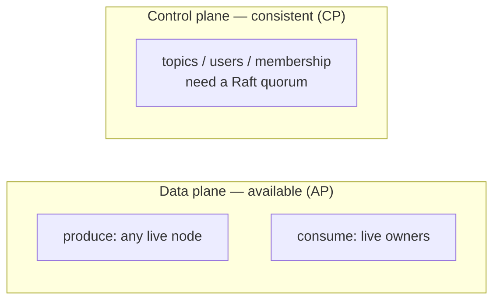

# Guarantees & Errors

This page is the contract. Everything Narad promises, the limits of those promises, and every status code you can see.

## The delivery guarantee

**At-least-once.** Every message that gets a `202` will be delivered to a consumer, and will keep being redelivered until someone acks it (or retention expires). The flip side: **duplicates happen** — after consumer crashes, visibility timeouts, nacks, ambiguous produce retries, and node failures. Your consumer must be idempotent. This is not optional advice; it's the other half of the contract.

## The durability contract — read before trusting Narad with anything important

- A `202 Accepted` means your message is **fsynced to disk** on the accepting node before the response is sent. A crash one millisecond later does not lose it.
- On its final partition, a message is **fsynced and read-back-verified** before it becomes visible to consumers or is removed from the accepting node's log.
- **Narad keeps exactly one copy of each partition** (plus the transit copy above). There is no replication subsystem. If a node's *disk* is permanently destroyed, the messages on that disk's partitions are gone. Process crashes, restarts, and node reboots lose nothing — this has been chaos-tested extensively — but disk loss is unprotected by default. Run it on storage you trust (cloud persistent volumes, RAID), and for topics that need a second copy, create a replica child: [replication, when you ask for it](fanout-and-delay.md#replication-when-you-ask-for-it) — an async full copy, deliberately placed on different nodes.
- Cluster **metadata** (topics, users, assignments) is Raft-replicated across all nodes and survives any minority of disks failing.

## Ordering: not guaranteed

Narad is explicit about this where other brokers are shy: **there is no delivery-order guarantee.** In steady state, keyed messages stick to one partition and tend to arrive in produce order — but three deliberate mechanisms reorder, and your design must assume them:

- **Redelivery**: a crashed or slow consumer's message reappears after newer ones were consumed.
- **Dead-owner skip**: while a node is marked dead, keyed produces walk forward to a live partition — the key-to-partition mapping itself moves.
- **Dispatch reroute**: accepted messages destined for an unreachable owner are committed to a live sibling partition rather than delayed indefinitely.

Need a sequence? Carry it in the payload and order on your side. Need to collapse duplicates and reorders at once? Make handlers idempotent keyed on a payload ID — which the at-least-once contract requires anyway.

## Availability: the deliberate trade

Ordering was not lost by accident — it was spent on availability. In CAP terms Narad's **data plane is AP**:

- **Produce is available while any node lives.** Any live node accepts a produce with a local fsync — no leader election, no quorum, no coordination on the hot path. Delivery is worked out afterwards and routed around dead machines.
- **Consume is available for every partition whose owner is alive** — and since new traffic reroutes to live owners, fresh messages stay consumable even mid-outage. Messages already stored on a dead node wait for it to return (their partition answers `503` meanwhile).
- **The control plane is the one consistent piece**: creating/altering topics and managing users go through Raft and need a quorum of nodes. Your *data* flows at one node; *administration* waits for a majority.

## Timing

- Produce→consumable: typically single-digit milliseconds.
- Delay children: never early; usually within ~1s after the delay elapses; can be later under failures.
- Retention: messages are deleted *at least* `retention_ms` after writing — deletion happens in coarse chunks, so data often lives somewhat longer, never shorter.

## Status codes

| Code | Where | Meaning | What you should do |
|---|---|---|---|
| `200` | consume, reads | Here's your data | Process it |
| `201` | topic/user create | Created | — |
| `202` | produce | Durably accepted — the delivery promise | Nothing. Never retry a 202 |
| `204` | ack/extend/nack, delete, empty consume | Done / nothing available | Loop or move on |
| `400` | anywhere | Malformed request, bad param, schema violation | Fix the request; don't retry as-is |
| `401` | anywhere | Missing/wrong credentials | Fix auth |
| `403` | anywhere | Authenticated but not allowed | You need a grant |
| `404` | anywhere | Topic/user doesn't exist | Check the name |
| `409` | create/attach/alter | Conflict: already exists, role conflict, retention-vs-delay violation | Read the error body |
| `410` | ack/extend | Your lease lapsed; message was handed elsewhere | Stop working on it; expect a duplicate |
| `413` | produce | Body over 1 MiB | Shrink the payload |
| `503` | produce/consume/ack | Temporarily unavailable: partition owner down, acked-ahead full, quorum lost | Back off and retry |

## Retry cheat sheet

- `202` → never retry. `4xx` → never retry unchanged. `503` and timeouts → retry with backoff.
- A **timed-out produce is ambiguous**: the message may have been accepted. Retrying may duplicate it — that's fine, because your consumer is idempotent. Right?

## API stability

The `/v1` surface is stable: routes, parameters, status codes, and JSON field names documented in this guide won't change or disappear within `/v1`. New optional fields and new endpoints may appear (your JSON parsing should ignore unknown fields — it already does, right?). Anything we ever need to break moves to a `/v2` with both versions serving during a deprecation window. The node-to-node RPC protocol is versioned by the same rule: opcodes are append-only, and unknown ops get a clean `400` — which is what makes mixed-version rolling upgrades boring.
