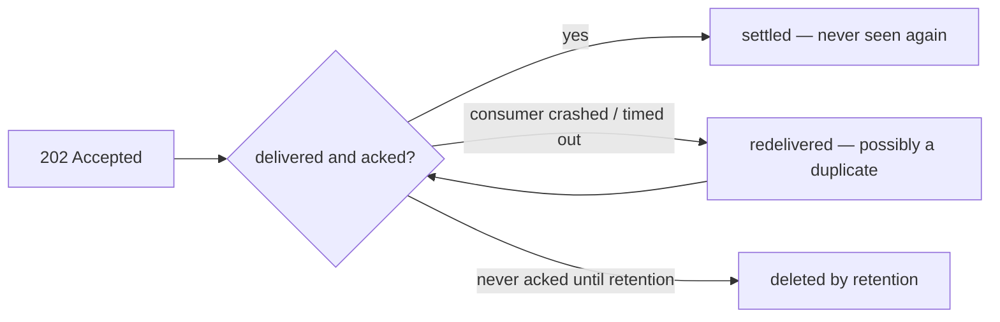

# Guarantees & Errors

This page is the contract. Everything Narad promises, the limits of those promises, and every status code you can see.

## The delivery guarantee

**At-least-once.** Every message that gets a `202` will be delivered to a consumer, and will keep being redelivered until someone acks it (or retention expires). The flip side: **duplicates happen** — after consumer crashes, visibility timeouts, nacks, ambiguous produce retries, and node failures. Your consumer must be idempotent. This is not optional advice; it's the other half of the contract.

## The durability contract — read before trusting Narad with anything important

- A `202 Accepted` means your message is **fsynced to disk** on the accepting node before the response is sent. A crash one millisecond later does not lose it.
- On its final partition, a message is **fsynced and read-back-verified** before it becomes visible to consumers or is removed from the accepting node's log.
- **Narad keeps exactly one copy of each partition** (plus the transit copy above). There is no replication. If a node's *disk* is permanently destroyed, the messages on that disk's partitions are gone. Process crashes, restarts, and node reboots lose nothing — this has been chaos-tested extensively — but disk loss is unprotected by design. Run it on storage you trust (cloud persistent volumes, RAID) and treat Narad's durability as "as durable as the volume under it."
- Cluster **metadata** (topics, users, assignments) is Raft-replicated across all nodes and survives any minority of disks failing.

## Ordering

- **Within a key, within normal operation**: delivery follows produce order.
- Redelivery breaks local order (an old message can reappear after newer ones were consumed).
- Extended node failure can reroute a key's messages to a sibling partition, breaking cross-failure ordering — availability is chosen over strict order.
- Across different keys: no ordering promise at all.

## Timing

- Produce→consumable: typically single-digit milliseconds.
- Delay children: never early; usually within ~1s after the delay elapses; can be later under failures.
- Retention: messages are deleted *at least* `retention_ms` after writing — deletion happens in coarse chunks, so data often lives somewhat longer, never shorter.

## Status codes

| Code | Where | Meaning | What you should do |
|---|---|---|---|
| `200` | consume, reads | Here's your data | Process it |
| `201` | topic/user create | Created | — |
| `202` | produce | Durably accepted — the delivery promise | Nothing. Never retry a 202 |
| `204` | ack/extend/nack, delete, empty consume | Done / nothing available | Loop or move on |
| `400` | anywhere | Malformed request, bad param, schema violation | Fix the request; don't retry as-is |
| `401` | anywhere | Missing/wrong credentials | Fix auth |
| `403` | anywhere | Authenticated but not allowed | You need a grant |
| `404` | anywhere | Topic/user doesn't exist | Check the name |
| `409` | create/attach/alter | Conflict: already exists, role conflict, retention-vs-delay violation | Read the error body |
| `410` | ack/extend | Your lease lapsed; message was handed elsewhere | Stop working on it; expect a duplicate |
| `413` | produce | Body over 1 MiB | Shrink the payload |
| `503` | produce/consume/ack | Temporarily unavailable: partition owner down, acked-ahead full, quorum lost | Back off and retry |

## Retry cheat sheet

- `202` → never retry. `4xx` → never retry unchanged. `503` and timeouts → retry with backoff.
- A **timed-out produce is ambiguous**: the message may have been accepted. Retrying may duplicate it — that's fine, because your consumer is idempotent. Right?
