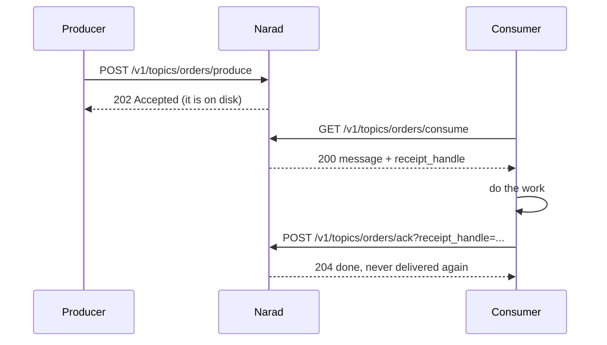

# Getting Started

This page takes you from zero to producing and consuming messages in about five minutes. All you need is `curl`.

## What Narad gives you

You create a **topic**. Producers POST messages to it; Narad writes each message safely to disk *before* acknowledging, then delivers it to consumers **at least once**. Consumers pull messages, process them, and **ack** them. If a consumer crashes mid-work, the message automatically comes back for someone else.



## Authentication

Every API call uses HTTP **Basic auth**:

```bash
export NARAD=https://your-narad-host
export AUTH="admin:your-password"
```

Your operator gives you a username and password. What you're allowed to do depends on your [grants](users-and-access.md).

## 1. Create a topic

```bash
curl -u $AUTH -X POST $NARAD/v1/topics \
  -H "Content-Type: application/json" \
  -d '{"name": "orders", "partitions": 3, "retention_ms": 86400000}'
```

`201 Created`. Messages are kept for 24 hours (`retention_ms`), spread across 3 partitions.

## 2. Produce a message

The request **body is your message** — any bytes, up to 1 MiB. The key goes in the query string:

```bash
curl -u $AUTH -X POST \
  "$NARAD/v1/topics/orders/produce?key=customer-42" \
  -d '{"order_id": "ord_123", "amount": 4999}'
```

`202 Accepted` means: *your message is durably on disk and will be delivered.* Messages with the same key always land in the same partition, so they're consumed in the order you sent them.

## 3. Consume it

```bash
curl -u $AUTH "$NARAD/v1/topics/orders/consume?wait=10s"
```

```json
{
  "topic": "orders",
  "partition": 2,
  "offset": 0,
  "key": "customer-42",
  "payload": {"order_id": "ord_123", "amount": 4999},
  "timestamp": 1783615560,
  "receipt_handle": "2:0:861651"
}
```

`wait=10s` long-polls: if nothing is available, the call waits up to 10 seconds before returning `204 No Content`. The message is now **invisible to other consumers** for the topic's visibility timeout (default 30s) — your window to process it.

## 4. Ack it

```bash
curl -u $AUTH -X POST \
  "$NARAD/v1/topics/orders/ack?receipt_handle=2:0:861651"
```

`204 No Content`. The message is settled and will never be delivered again.

**Didn't ack in time?** The message simply reappears for the next consumer. That's the at-least-once promise doing its job. Need more time? [Extend the lease](consuming.md#extending-your-lease). Want to give it back early? [Nack it](consuming.md#giving-a-message-back-nack).

## Where to next

- Tune partitions, retention, and limits → [Topics](topics.md)
- Keys, ordering, and batching advice → [Producing](producing.md)
- Visibility timeouts, extend, nack, replay → [Consuming](consuming.md)
- Copy every message to other topics, or delay them → [Fan-out & Delay](fanout-and-delay.md)
- The fine print on every promise → [Guarantees & Errors](guarantees-and-errors.md)
