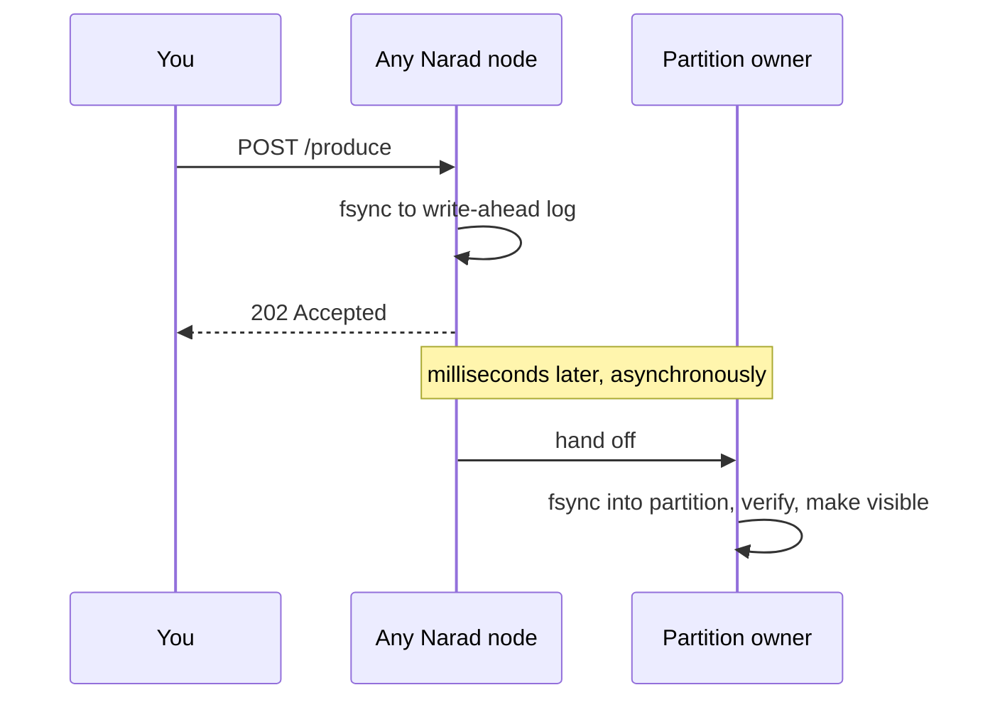

# Producing

## The request

```bash
curl -u $AUTH -X POST \
  "$NARAD/v1/topics/orders/produce?key=customer-42" \
  --data-binary @message.json
```

- The **body is the message** — raw bytes, up to **1 MiB**. JSON, protobuf, plain text: Narad doesn't care (unless the topic has a schema, in which case the body must validate against it).
- `key` (query param, optional) — messages with the same key go to the same partition and are delivered in the order they arrived.
- `partition` (query param, optional) — pin the message to an exact partition, overriding key hashing. Most apps never need this.
- No key and no partition? Narad spreads messages across partitions round-robin. Throughput is the same; you just give up per-key ordering.

## What `202 Accepted` means — read this once, carefully

When you get a `202`, your message has been **fsynced to disk** on the node that took your request. Not buffered, not "probably fine" — on disk, crash-safe, before the response was written. Delivery to its final partition happens asynchronously a few milliseconds later, and Narad retries that step through node failures until it succeeds.



Consequences worth knowing:

- **A `202` is a delivery promise**, not just a receipt. You never need to retry a `202`.
- **A timeout or 5xx is ambiguous** — the message may or may not have been accepted. If you retry (you should), you may create a duplicate. Consumers must tolerate duplicates anyway (see [Guarantees](guarantees-and-errors.md)), so retry freely.
- There's a tiny gap between `202` and the message being consumable — usually single-digit milliseconds.

## Ordering

Within one key, messages are delivered in produce order. Two caveats, both rare:

1. **Redeliveries reorder.** If message 1 times out and comes back while message 2 was already delivered, you'll see 2 before the retry of 1. At-least-once systems all share this.
2. **Node failures can reroute.** If a partition's node is down for a while, Narad prefers delivering your messages on a sibling partition over holding them hostage. Per-key order across that failover is not preserved. If a machine being dead can't break your ordering, nothing will.

## Practical tips

- Send messages concurrently — Narad handles parallel produces per connection and across connections; ordering is decided by arrival time per key.
- Keep payloads lean. The 1 MiB cap is a ceiling, not a target; big payloads slow every hop.
- If your payload is already compressed or encrypted, that's fine — Narad's on-disk compression just won't shrink it further.
