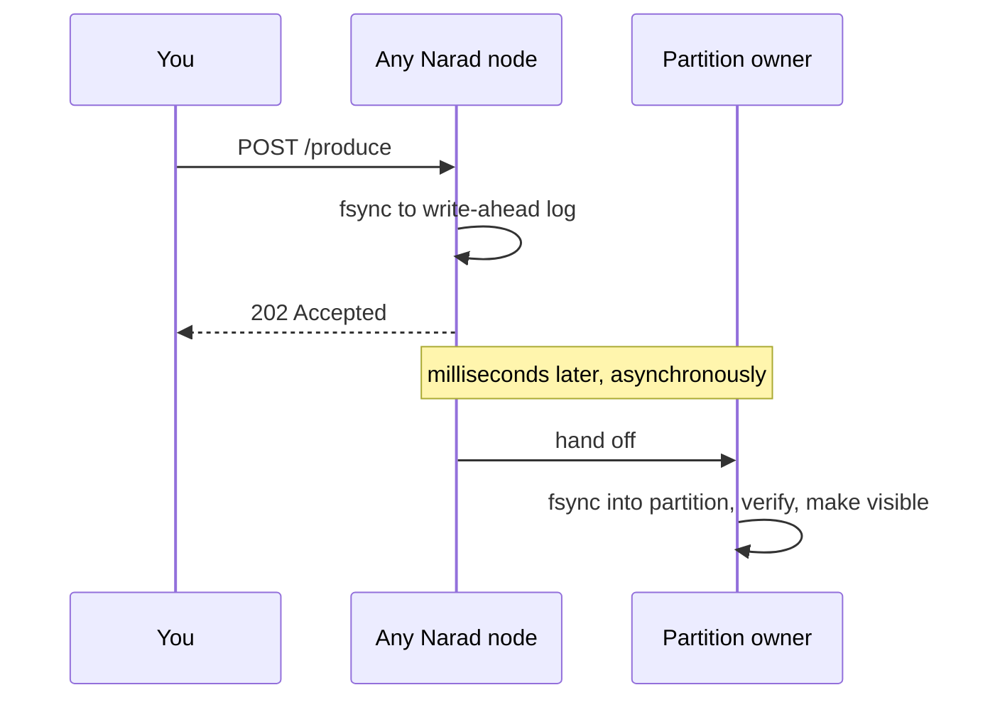

# Producing

## The request

```bash
curl -u $AUTH -X POST \
  "$NARAD/v1/topics/orders/produce?key=customer-42" \
  --data-binary @message.json
```

- The **body is the message** — raw bytes, up to **1 MiB**. JSON, protobuf, plain text, an image: Narad doesn't care (unless the topic has a schema, in which case the body must validate against it). No client-side encoding, ever — see [how each kind comes back](consuming.md#the-payload-comes-back-the-way-you-sent-it).
- `key` (query param, optional) — messages with the same key stick to the same partition in normal operation: locality for fan-out and consumers, not an ordering guarantee.
- `partition` (query param, optional) — pin the message to an exact partition, overriding key hashing. Most apps never need this.
- No key and no partition? Narad spreads messages across partitions round-robin.

## What `202 Accepted` means — read this once, carefully

When you get a `202`, your message has been **fsynced to disk** on the node that took your request. Not buffered, not "probably fine" — on disk, crash-safe, before the response was written. Delivery to its final partition happens asynchronously a few milliseconds later, and Narad retries that step through node failures until it succeeds.



Consequences worth knowing:

- **A `202` is a delivery promise**, not just a receipt. You never need to retry a `202`.
- **A timeout or 5xx is ambiguous** — the message may or may not have been accepted. If you retry (you should), you may create a duplicate. Consumers must tolerate duplicates anyway (see [Guarantees](guarantees-and-errors.md)), so retry freely.
- There's a tiny gap between `202` and the message being consumable — usually single-digit milliseconds.

## Ordering — there is no ordering guarantee

Read that heading twice, because most brokers whisper this in a footnote: **Narad does not guarantee delivery order.** Keys give steady-state partition affinity, and a single quiet partition with one consumer will usually see arrival order — but it is emergent behavior, not a contract. Three mechanisms (all deliberate) reorder:

1. **Redelivery.** A message whose consumer crashed or timed out comes back *after* newer messages were already delivered. Every at-least-once system does this.
2. **Dead-owner skip.** When a partition's node is marked dead, keyed produces walk forward to a live partition instead of blackholing that slice of the keyspace.
3. **Dispatch reroute.** Messages already accepted for a partition whose owner stops answering are committed to a live sibling partition rather than held hostage.

The last two are the availability trade: Narad would rather deliver your message on a different partition than make you wait for a dead machine. If your processing needs a sequence, put a sequence number in the payload and order on the consumer side — which you can do safely, because your consumer is already idempotent. Right?

## Practical tips

- Send messages concurrently — Narad handles parallel produces per connection and across connections.
- Keep payloads lean. The 1 MiB cap is a ceiling, not a target; big payloads slow every hop.
- If your payload is already compressed or encrypted, that's fine — Narad's on-disk compression just won't shrink it further.
