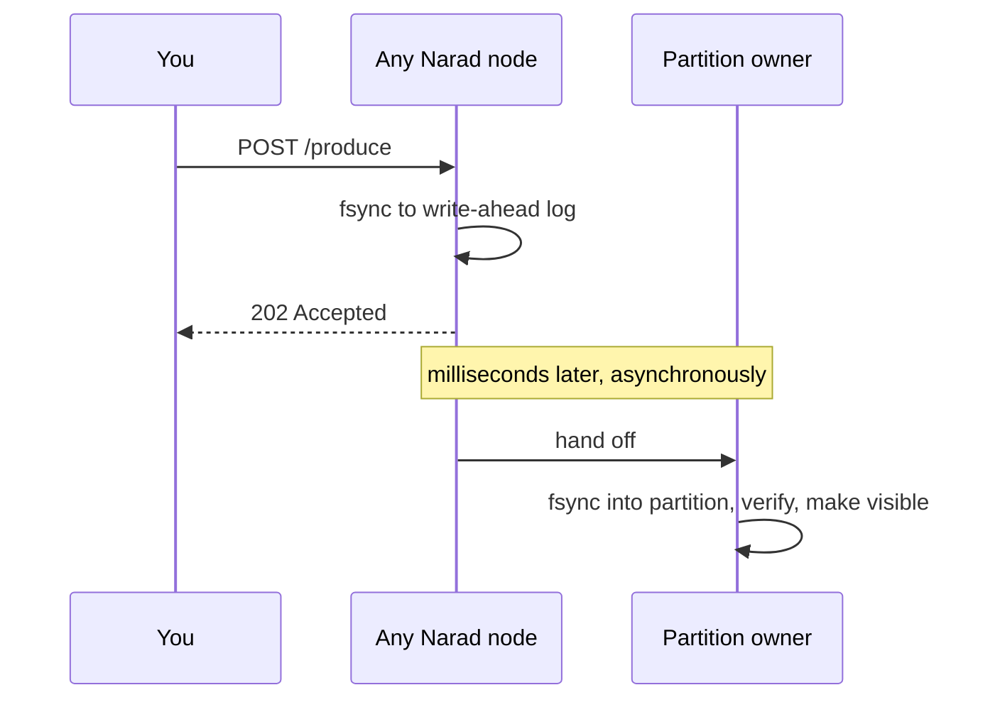

# Producing

Send a message with one `POST`. The request body is the message, and `202 Accepted`{.nr-nowrap} means Narad has fsynced it to disk and will deliver it at least once. To send many small messages at once, [send them as a batch](#producing-in-batches).

## Produce one message

```sh title="Produce a message to the orders topic"
curl -i -u "$AUTH" -X POST "$NARAD/v1/topics/orders/produce?key=customer-42" \
  -H "Content-Type: application/json" \
  -d '{"order_id": "ord_123", "amount": 4999}'
```

You get a `202` with an empty body:

```http title="Output"
HTTP/1.1 202 Accepted
Date: Mon, 28 Sep 2026 10:49:16 GMT
Content-Length: 0
```

What to put in place of each part:

- `$NARAD` is the base URL of any Narad node, or of the load balancer in front of them; every node accepts every produce. With `narad server start --dev`{.nr-nowrap} on your machine it is `http://127.0.0.1:7942`.
- `$AUTH` is `username:password` for a user with a `produce` grant on the topic (see [Users & access](users-and-access.md)). `--dev` turns auth off, so any value works there.
- `orders` is the topic. It must already exist, or you get `404`. Create it with `narad topic add orders`{.nr-nowrap} or the [topics API](topics.md).
- `customer-42` is the optional key, described below.

## Request body and parameters

- **The body is the message**: raw bytes, up to 1 MiB (1,048,576 bytes; one byte more gets `413`). JSON, protobuf, plain text and images all work. If the topic has a [schema](schemas.md), the body must be JSON that validates against it. Nothing is encoded on the client; see [how each kind comes back](consuming.md#the-payload-comes-back-the-way-you-sent-it).
- **`Content-Type`** must be `application/json`{.nr-nowrap} or `application/octet-stream`{.nr-nowrap}, or the request must carry an `X-Narad-Client`{.nr-nowrap} header. This is a cross-site guard, not a format hint: a missing header gets `415`, and so does `curl -d`{.nr-nowrap} on its own, which sends a form type. The body is stored as the same bytes either way.
- **`key`** (query, optional): messages with the same key go to the same partition in normal operation. That gives locality for fan-out and consumers, not ordering. A key does not have to be text: one that is not valid UTF-8 is stored as sent, and consumers get it base64-encoded and flagged (see [Consuming](consuming.md#the-payload-comes-back-the-way-you-sent-it)).
- **`partition`** (query, optional): pin the message to one partition, overriding the key. A partition that does not exist gets `400`. Most apps never need it.

### Messages without a key

- With no key and no partition, Narad spreads messages across partitions round-robin. Each topic has its own rotation on each node, starting at a random partition, so a producer that writes several topics in turn still spreads each of them evenly.
- The message is stored with no key, and consumers get no `key` field for it. Older releases invented a `key-<n>` key instead. Messages they stored keep that key, and during a rolling upgrade a node still on an older release keeps inventing them.
- Fan-out copies a keyless message to the child partition with the same index as its parent partition when the child has the parent's partition count. So a [replica child](fanout-and-delay.md#replication-when-you-ask-for-it) keeps its two copies of a keyless message on different nodes, as it does for a keyed one. A child with a different partition count gets keyless messages round-robin.

## 202 Accepted: what it promises

When you get a `202`, the message has been fsynced to the write-ahead log on the node that took your request. It is not buffered: it is on disk, crash-safe, before the response is written. Delivery to its final partition happens a few milliseconds later, asynchronously, and Narad retries that step through node failures until it succeeds.


```mermaid
sequenceDiagram
    accTitle: A produce, from the POST to the partition
    accDescr: You POST to any Narad node. The node fsyncs the message to its write-ahead log and answers 202 Accepted. Milliseconds later, asynchronously, it hands the message to the partition owner, which fsyncs it into the partition, verifies it and makes it visible.
    participant You
    participant Node as Any Narad node
    participant Owner as Partition owner
    You->>Node: POST /produce
    Node->>Node: fsync to write-ahead log
    Node-->>You: 202 Accepted
    Note over Node,Owner: milliseconds later, asynchronously
    Node->>Owner: hand off
    Owner->>Owner: fsync into partition, verify, make visible
```

What follows from that:

- **A `202` is a delivery promise**, not only a receipt. Never retry a `202`.
- **A timeout or a `5xx` is ambiguous**: the message may or may not have been accepted. Retry it, and expect that a retry can create a duplicate. Consumers must tolerate duplicates anyway (see [Guarantees](guarantees-and-errors.md)).
- **There is a short gap** between the `202` and the message being consumable, usually single-digit milliseconds.

!!! warning "A 202 survives a crash, not a lost disk"
    Narad keeps one copy of each partition. Process crashes, restarts and reboots lose nothing, but if a node's disk is destroyed, the messages on it are gone. Run on storage you trust, and give topics that need a second copy a [replica child](fanout-and-delay.md#replication-when-you-ask-for-it).

## Response codes

| Status | Meaning | What to do |
| --- | --- | --- |
| `202 Accepted` | On disk; will be delivered at least once | Nothing. Never retry a `202` |
| `400 Bad Request` | Empty body, a `partition` that does not exist, or a schema violation | Fix the request; do not retry it unchanged |
| `401 Unauthorized` | Missing or wrong credentials | Fix `$AUTH` |
| `403 Forbidden` | No `produce` grant on this topic | Ask for a grant |
| `404 Not Found` | The topic does not exist | Create it, or check the name |
| `409 Conflict` | The topic is a delay child, which only its parent can feed | Produce to the parent |
| `413 Request Entity Too Large` | Body over 1 MiB | Shrink the payload |
| `415 Unsupported Media Type` | No accepted `Content-Type` and no `X-Narad-Client` header | Set the header |
| `429 Too Many Requests` | Too many concurrent produces for your identity on this node (only when the operator sets `http.max_produce_in_flight_per_identity`; it is off by default) | Back off and retry, or send fewer at once |
| `503 Service Unavailable` | Temporarily unavailable, for example quorum lost | Retry with backoff; a duplicate is possible |

The full list across every endpoint is in [Guarantees & errors](guarantees-and-errors.md#status-codes).

## Producing in batches

A batch sends up to 100 messages in one request, and they share one fsync:

```sh title="Produce two messages to the orders topic in one request"
curl -i -u "$AUTH" -X POST "$NARAD/v1/topics/orders/produce/batch" \
  -H "Content-Type: application/json" \
  -d '{"messages": [
        {"key": "customer-42", "payload": {"order_id": "ord_124", "amount": 1250}},
        {"payload": "aGVsbG8=", "payload_encoding": "base64"}
      ]}'
```

The answer is `202` with `{"accepted":N}`{.nr-nowrap}, sent once every message is fsynced to the accepting node's write-ahead log. It is the same delivery promise as a single `202`, for every message in the batch.

The request:

- `POST /v1/topics/{topic}/produce/batch`{.nr-nowrap} takes a JSON body `{"messages": [...]}`{.nr-nowrap} with 1 to 100 messages. The whole body counts against the same 1 MiB cap as a single produce, and the request needs the same `produce` grant.
- Each message has:
    - **`payload`**: a JSON value, stored byte for byte as written, exactly as a single produce of that body would store it. A JSON string keeps its quotes: `"hi"` is stored as those four bytes. Anything that is not JSON (plain text, protobuf, an image) goes as a base64 string with `"payload_encoding": "base64"`{.nr-nowrap}, and is stored as the decoded bytes.
    - **`key`** (optional): a string. Absent or empty means no key, as for a single produce without `?key=`. A key that is not valid UTF-8 goes as base64 with `"key_encoding": "base64"`{.nr-nowrap}.
    - **`partition`** (optional): pins the message, as `?partition=` does.
- The `key` and `partition` query parameters get `400` on this path, because in a batch they belong to each message. An unknown field in the body gets `400` too.

What to expect:

- **All or nothing.** Every message is checked the way a single produce checks one (its key, payload and partition, the partition range, the topic's [schema](schemas.md)) before any is accepted. If one fails, the whole request gets the status a single produce of that message would get, with its index at the front of the error (`message 3: ...`), and nothing is stored.
- **Which failure you see.** The checks make two passes over the batch, each in order: first every message's format (its encodings, an empty payload, a negative partition), then each message's schema and partition range. So a bad base64 payload in message 3 is reported ahead of a schema failure in message 0.
- **A timeout or a `5xx` is ambiguous for the whole batch**: some or all of it may have been accepted, so a retry may duplicate part of it. That is the single-produce rule, applied to every message at once.
- **Batch order is kept in normal operation.** Messages go into the write-ahead log in batch order, so messages that share a key reach their partition in batch order. That is steady-state behaviour, not a contract: [ordering is not guaranteed](#ordering-is-not-guaranteed) for batches either.
- **One fsync per batch.** A batch waits for one write-ahead log fsync however many messages it carries (two when the log rolls to a new segment in the middle of it). Measured at the write-ahead log on macOS, where an fsync flushes the whole device, with one caller at a time: about 51 µs per message in batches of 100 and 0.5 ms in batches of 10, against about 4.7 ms for a single produce. For one message, use a single produce: the batch envelope costs a little more CPU and buys nothing.

Limits:

- More than 100 messages gets `400` (`too many messages: more than 100 (max 100)`{.nr-nowrap}). The server stops reading at the 101st rather than counting the rest.
- A batch counts as its message count (clamped to the cap) against your per-identity cap on concurrent produces, `http.max_produce_in_flight_per_identity`{.nr-nowrap}, which answers `429` beyond it. While its body is still being read, before that count is known, it counts as one. The cap is off by default.
- A node on a release from before batch produce answers `404`. Fall back to single produces for as long as a client can reach such a node.

## Ordering is not guaranteed

Keys give steady-state partition affinity, and a quiet partition with one consumer usually sees arrival order, but that is emergent behaviour, not a contract. Narad reorders deliberately in five cases, among them redelivery after a consumer crash and rerouting around a dead partition owner; [Guarantees](guarantees-and-errors.md#ordering-not-guaranteed) lists all five. Narad would rather deliver your message on a different partition than make you wait for a dead machine.

If your processing needs a sequence, put a sequence number in the payload and order on the consumer side. That is safe because your consumer is already idempotent.

## Throughput tips

- Send messages concurrently: Narad handles parallel produces on one connection and across connections.
- Have many small messages ready at once? [Send them as a batch](#producing-in-batches): one request and one fsync for up to 100 of them.
- Keep payloads lean. The 1 MiB cap is a ceiling, not a target; large payloads slow every hop.
- Payloads that are already compressed or encrypted are fine; Narad's on-disk compression just will not shrink them further.
