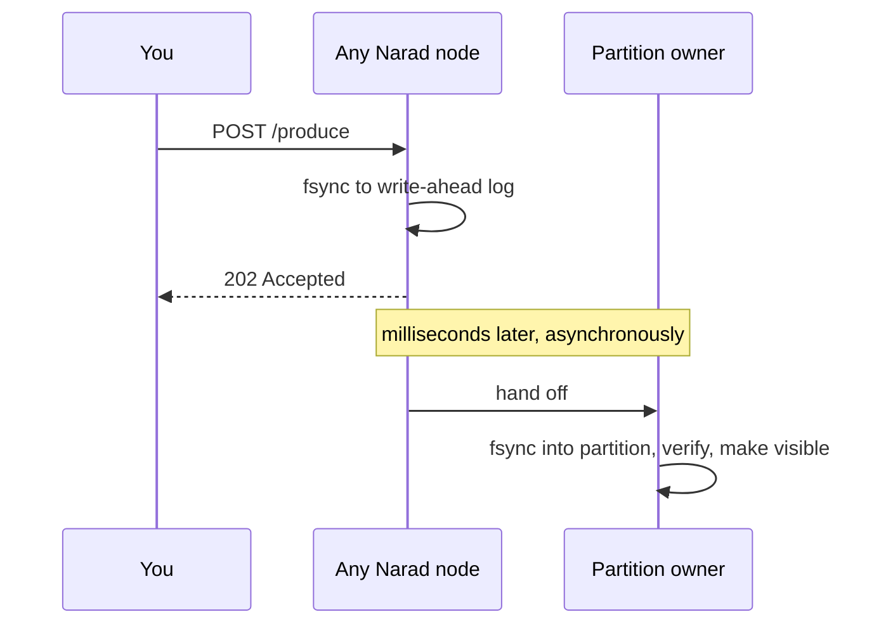

# Producing

Send a message with one `POST`. The request body is the message, and `202 Accepted` means Narad has fsynced it to disk and will deliver it at least once.

## Produce one message

```sh title="Produce a message to the orders topic"
curl -i -u "$AUTH" -X POST "$NARAD/v1/topics/orders/produce?key=customer-42" \
  -H "Content-Type: application/json" \
  -d '{"order_id": "ord_123", "amount": 4999}'
```

You get a `202` with an empty body:

```http title="Output"
HTTP/1.1 202 Accepted
Date: Mon, 28 Sep 2026 10:49:16 GMT
Content-Length: 0
```

What to put in place of each part:

- `$NARAD` is the base URL of any Narad node, or of the load balancer in front of them; every node accepts every produce. With `narad server start --dev` on your machine it is `http://127.0.0.1:7942`.
- `$AUTH` is `username:password` for a user with a `produce` grant on the topic (see [Users & access](users-and-access.md)). `--dev` turns auth off, so any value works there.
- `orders` is the topic. It must already exist, or you get `404`. Create it with `narad topic add orders` or the [topics API](topics.md).
- `customer-42` is the optional key, described below.

## Request body and parameters

- **The body is the message**: raw bytes, up to 1 MiB (1,048,576 bytes; one byte more gets `413`). JSON, protobuf, plain text and images all work. If the topic has a [schema](schemas.md), the body must be JSON that validates against it. Nothing is encoded on the client; see [how each kind comes back](consuming.md#the-payload-comes-back-the-way-you-sent-it).
- **`Content-Type`** must be `application/json` or `application/octet-stream`, or the request must carry an `X-Narad-Client` header. This is a cross-site guard, not a format hint: a missing header gets `415`, and so does `curl -d` on its own, which sends a form type. The body is stored as the same bytes either way.
- **`key`** (query, optional): messages with the same key go to the same partition in normal operation. That gives locality for fan-out and consumers, not ordering. With no key, Narad generates one per message (`key-1`, `key-2`, ...) so keyless messages spread across partitions, and the generated key comes back on consume.
- **`partition`** (query, optional): pin the message to one partition, overriding the key. A partition that does not exist gets `400`. Most apps never need it.

## 202 Accepted: what it promises

When you get a `202`, the message has been fsynced to the write-ahead log on the node that took your request. It is not buffered: it is on disk, crash-safe, before the response is written. Delivery to its final partition happens a few milliseconds later, asynchronously, and Narad retries that step through node failures until it succeeds.


```mermaid
sequenceDiagram
    participant You
    participant Node as Any Narad node
    participant Owner as Partition owner
    You->>Node: POST /produce
    Node->>Node: fsync to write-ahead log
    Node-->>You: 202 Accepted
    Note over Node,Owner: milliseconds later, asynchronously
    Node->>Owner: hand off
    Owner->>Owner: fsync into partition, verify, make visible
```

What follows from that:

- **A `202` is a delivery promise**, not only a receipt. Never retry a `202`.
- **A timeout or a `5xx` is ambiguous**: the message may or may not have been accepted. Retry it, and expect that a retry can create a duplicate. Consumers must tolerate duplicates anyway (see [Guarantees](guarantees-and-errors.md)).
- **There is a short gap** between the `202` and the message being consumable, usually single-digit milliseconds.

!!! warning "A 202 survives a crash, not a lost disk"
    Narad keeps one copy of each partition. Process crashes, restarts and reboots lose nothing, but if a node's disk is destroyed, the messages on it are gone. Run on storage you trust, and give topics that need a second copy a [replica child](fanout-and-delay.md#replication-when-you-ask-for-it).

## Response codes

| Status | Meaning | What to do |
| --- | --- | --- |
| `202 Accepted` | On disk; will be delivered at least once | Nothing. Never retry a `202` |
| `400 Bad Request` | Empty body, a `partition` that does not exist, or a schema violation | Fix the request; do not retry it unchanged |
| `401 Unauthorized` | Missing or wrong credentials | Fix `$AUTH` |
| `403 Forbidden` | No `produce` grant on this topic | Ask for a grant |
| `404 Not Found` | The topic does not exist | Create it, or check the name |
| `409 Conflict` | The topic is a delay child, which only its parent can feed | Produce to the parent |
| `413 Request Entity Too Large` | Body over 1 MiB | Shrink the payload |
| `415 Unsupported Media Type` | No accepted `Content-Type` and no `X-Narad-Client` header | Set the header |
| `503 Service Unavailable` | Temporarily unavailable, for example quorum lost | Retry with backoff; a duplicate is possible |

The full list across every endpoint is in [Guarantees & errors](guarantees-and-errors.md#status-codes).

## Ordering is not guaranteed

Keys give steady-state partition affinity, and a quiet partition with one consumer usually sees arrival order, but that is emergent behaviour, not a contract. Narad reorders deliberately in five cases, among them redelivery after a consumer crash and rerouting around a dead partition owner; [Guarantees](guarantees-and-errors.md#ordering-not-guaranteed) lists all five. Narad would rather deliver your message on a different partition than make you wait for a dead machine.

If your processing needs a sequence, put a sequence number in the payload and order on the consumer side. That is safe because your consumer is already idempotent.

## Throughput tips

- Send messages concurrently: Narad handles parallel produces on one connection and across connections.
- Keep payloads lean. The 1 MiB cap is a ceiling, not a target; large payloads slow every hop.
- Payloads that are already compressed or encrypted are fine; Narad's on-disk compression just will not shrink them further.
