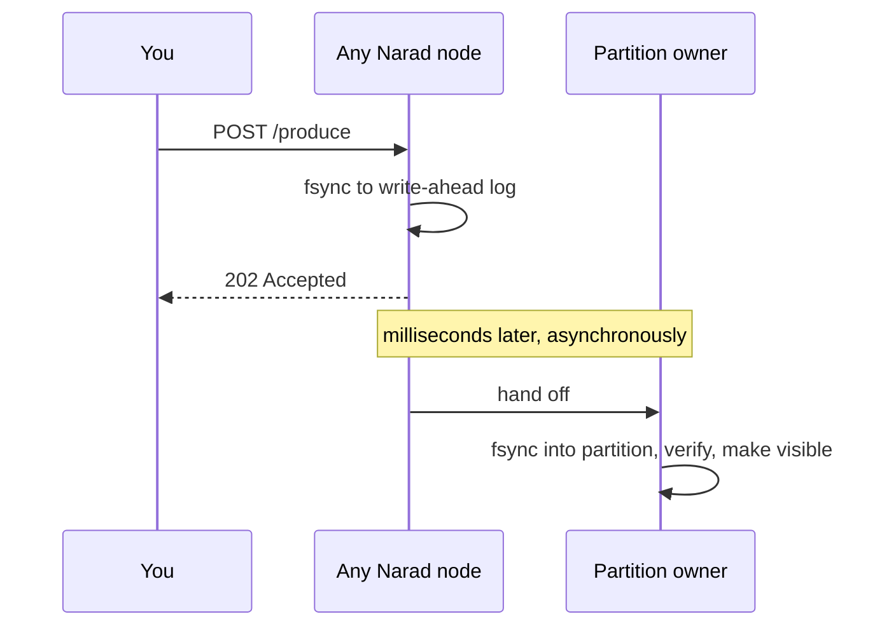

# Producing

## The request

```bash
curl -u $AUTH -X POST \
  "$NARAD/v1/topics/orders/produce?key=customer-42" \
  -H "Content-Type: application/octet-stream" \
  --data-binary @message.json
```

- The **body is the message**: raw bytes, up to **1 MiB**. JSON, protobuf, plain text, an image: Narad doesn't care (unless the topic has a [schema](schemas.md), in which case the body must be JSON that validates against it). No client-side encoding, ever; see [how each kind comes back](consuming.md#the-payload-comes-back-the-way-you-sent-it).
- `key` (query param, optional): messages with the same key stick to the same partition in normal operation: locality for fan-out and consumers, not an ordering guarantee.
- `partition` (query param, optional): pin the message to an exact partition, overriding key hashing. Most apps never need this.
- No key and no partition? Narad spreads messages across partitions round-robin. Each topic has its own rotation on each node, starting at a random partition, so a producer that writes several topics in turn still spreads every one of them evenly. Such a message is stored without a key, and consumers get no `key` field for it. (Older releases invented a `key-<n>` key for it. Messages they stored keep theirs, and during a rolling upgrade a node still on an older release keeps inventing them.) Fan-out copies a keyless message to the child partition with the same index as its parent partition when the child has the parent's partition count, so a [replica child](fanout-and-delay.md#replication-when-you-ask-for-it) keeps its two copies on different nodes as it does a keyed message's; a child with a different partition count gets keyless messages round-robin.
- A key does not have to be text: one that is not valid UTF-8 is stored as sent, and consumers get it base64-encoded and flagged (see [Consuming](consuming.md#the-payload-comes-back-the-way-you-sent-it)).

## What `202 Accepted` means: read this once, carefully

When you get a `202`, your message has been **fsynced to disk** on the node that took your request. Not buffered, not "probably fine": on disk, crash-safe, before the response was written. Delivery to its final partition happens asynchronously a few milliseconds later, and Narad retries that step through node failures until it succeeds.


```mermaid
sequenceDiagram
    participant You
    participant Node as Any Narad node
    participant Owner as Partition owner
    You->>Node: POST /produce
    Node->>Node: fsync to write-ahead log
    Node-->>You: 202 Accepted
    Note over Node,Owner: milliseconds later, asynchronously
    Node->>Owner: hand off
    Owner->>Owner: fsync into partition, verify, make visible
```

Consequences worth knowing:

- **A `202` is a delivery promise**, not just a receipt. You never need to retry a `202`.
- **A timeout or 5xx is ambiguous**: the message may or may not have been accepted. If you retry (you should), you may create a duplicate. Consumers must tolerate duplicates anyway (see [Guarantees](guarantees-and-errors.md)), so retry freely.
- There's a tiny gap between `202` and the message being consumable, usually single-digit milliseconds.

## Producing in batches

```bash
curl -u $AUTH -X POST -H "Content-Type: application/json" \
  "$NARAD/v1/topics/orders/produce/batch" \
  -d '{"messages":[{"key":"customer-42","payload":{"order":1}},{"payload":"aGVsbG8=","payload_encoding":"base64"}]}'
```

- `POST /v1/topics/{topic}/produce/batch` takes a JSON body `{"messages":[...]}` with 1 to 100 messages. The whole body counts against the same **1 MiB** cap as a single produce, and the request needs the same produce permission. Each message has:
    - `payload`: a JSON value, stored byte for byte as written, exactly as a single produce of that body would store it. A JSON string keeps its quotes: `"hi"` is stored as those four bytes. Anything that is not JSON (plain text, protobuf, an image) goes as a base64 string with **`"payload_encoding": "base64"`**, and is stored as the decoded bytes.
    - `key` (optional): a string. Absent or empty means no key, as for a single produce without `?key=`. A key that is not valid UTF-8 goes as base64 with **`"key_encoding": "base64"`**.
    - `partition` (optional): pins the message, as `?partition=` does.
- The `key` and `partition` query parameters are refused (`400`) on this path: in a batch they belong to each message. An unknown field in the body is refused too.
- The answer is **`202`** with `{"accepted":N}`, sent once every message is fsynced to the accepting node's write-ahead log. It is the same delivery promise as a single `202`, for every message in the batch.
- **All or nothing.** Every message is checked the way a single produce checks one (its key, payload and partition, the partition range, the topic's [schema](schemas.md)) before any is accepted. A message that fails answers the whole request with the status a single produce of it would get, its error prefixed with its index (`message 3: ...`), and nothing is stored. The checks run in two passes over the batch, each in order: first every message's format (its encodings, an empty payload, a negative partition), then each message's schema and partition range. So when several messages fail, the one reported is the first to fail the format pass, or, when all of them pass it, the first to fail its schema or range: a bad base64 payload in message 3 is reported ahead of a schema failure in message 0.
- **A timeout or 5xx is ambiguous for the whole batch**: some or all of it may have been accepted, so a retry may duplicate part of it. That is the single-produce rule, applied to every message at once.
- Messages go into the write-ahead log in batch order, so messages that share a key reach their partition in batch order in normal operation. That is still steady-state behaviour, not a contract: the [ordering section](#ordering-there-is-no-ordering-guarantee) applies to batches too.
- A batch waits for one write-ahead log fsync however many messages it carries (two when the log rolls to a new segment in the middle of it), so it costs far less per message than single produces. Measured at the write-ahead log on macOS, where an fsync flushes the whole device, with one caller at a time: about 51 µs per message in batches of 100 and 0.5 ms in batches of 10, against about 4.7 ms for a single produce. For one message, use a single produce: the batch envelope costs a little more CPU and buys nothing.
- A batch counts as its message count (clamped to the cap) against your per-identity cap on concurrent produces, `http.max_produce_in_flight_per_identity`, which answers `429` beyond it, and as one while its body is still being read, before that count is known. The cap is off by default.
- More than 100 messages is `400` (`too many messages: more than 100 (max 100)`): the server stops reading the batch at the 101st rather than counting the rest.
- Batches need a server that knows them. A node on a release before batch produce answers `404`, so fall back to single produces for as long as a client can reach such a node.

## Ordering: there is no ordering guarantee

Read that heading twice, because most brokers whisper this in a footnote: **Narad does not guarantee delivery order.** Keys give steady-state partition affinity, and a single quiet partition with one consumer will usually see arrival order, but it is emergent behavior, not a contract. Three mechanisms (all deliberate) reorder:

1. **Redelivery.** A message whose consumer crashed or timed out comes back *after* newer messages were already delivered. Every at-least-once system does this.
2. **Dead-owner skip.** When a partition's node is marked dead, keyed produces walk forward to a live partition instead of blackholing that slice of the keyspace.
3. **Dispatch reroute.** Messages already accepted for a partition whose owner stops answering are committed to a live sibling partition rather than held hostage.

The last two are the availability trade: Narad would rather deliver your message on a different partition than make you wait for a dead machine. If your processing needs a sequence, put a sequence number in the payload and order on the consumer side, which you can do safely, because your consumer is already idempotent. Right?

## Practical tips

- Send messages concurrently: Narad handles parallel produces per connection and across connections.
- Have many small messages ready at once? [Send them as a batch](#producing-in-batches): one request and one fsync for up to 100 of them.
- Keep payloads lean. The 1 MiB cap is a ceiling, not a target; big payloads slow every hop.
- If your payload is already compressed or encrypted, that's fine; Narad's on-disk compression just won't shrink it further.
