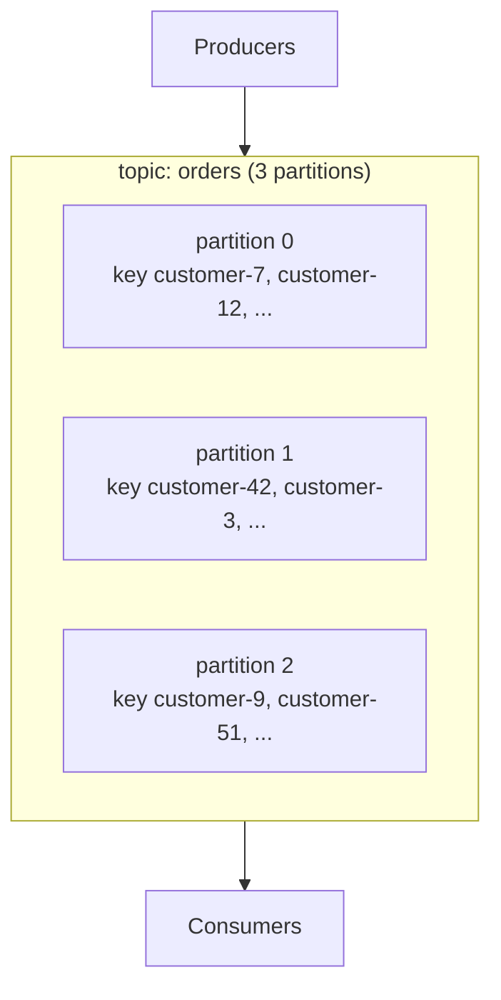

# Topics

A topic is a named stream of messages, split into **partitions**. Partitions are how Narad scales and how it keeps your messages ordered: all messages with the same key live in one partition, in the order they arrived.



## Creating a topic

```bash
curl -u $AUTH -X POST $NARAD/v1/topics \
  -H "Content-Type: application/json" \
  -d '{
    "name": "orders",
    "partitions": 6,
    "retention_ms": 86400000,
    "visibility_timeout_ms": 30000,
    "max_in_flight_per_partition": 1024,
    "max_acked_ahead_per_partition": 1024
  }'
```

| Field | Meaning | Default | Rules |
|---|---|---|---|
| `name` | Topic name | — | required, unique |
| `partitions` | Parallelism + ordering domains | 3 | at least 3, at most 108 |
| `retention_ms` | How long messages are kept on disk | operator default | 0 = keep forever; otherwise at least 1 hour |
| `visibility_timeout_ms` | How long a consumed message stays hidden before redelivery | 30000 | your processing time budget |
| `max_in_flight_per_partition` | Max unacked messages handed out per partition | 1024 | backpressure knob |
| `max_acked_ahead_per_partition` | Max out-of-order acks held per partition | 1024 | see [Consuming](consuming.md) |
| `schema` | Optional JSON Schema; payloads are validated on produce | none | rejected payloads get `400` |

**Choosing partition count.** More partitions = more parallel consumers and more spread across the cluster, but ordering only holds *within* a partition. Pick roughly the number of consumers you expect to run in parallel. Partition count is fixed after creation, so leave headroom.

**Choosing retention.** Messages are deleted `retention_ms` after they were written — *whether or not they were consumed*. Retention is a safety net for replay and slow consumers, not a substitute for acking promptly.

## Reading a topic

```bash
curl -u $AUTH $NARAD/v1/topics                # list all topics
curl -u $AUTH $NARAD/v1/topics/orders         # one topic + per-partition stats
```

The single-topic response includes `partition_stats`: per-partition oldest offset, next offset, and segment counts — handy for eyeballing backlog and growth.

## Changing a topic

```bash
curl -u $AUTH -X PATCH $NARAD/v1/topics/orders \
  -H "Content-Type: application/json" \
  -d '{"retention_ms": 172800000}'
```

Retention, visibility timeout, and the per-partition limits can be altered live. Partition count cannot. If the topic has [delay children](fanout-and-delay.md), you can't shrink retention below what the child's delay needs — Narad refuses with `409` instead of letting delayed messages age out before delivery.

## Deleting a topic

```bash
curl -u $AUTH -X DELETE $NARAD/v1/topics/orders
```

`204`. This deletes the metadata **and** the on-disk data on every node, and detaches any fan-out children. There is no undo.

## Who can do this

Creating requires a `create` grant matching the topic name; the creator becomes the topic's **owner**. Altering and deleting require ownership or an `admin` grant. Details in [Users & Access](users-and-access.md).
