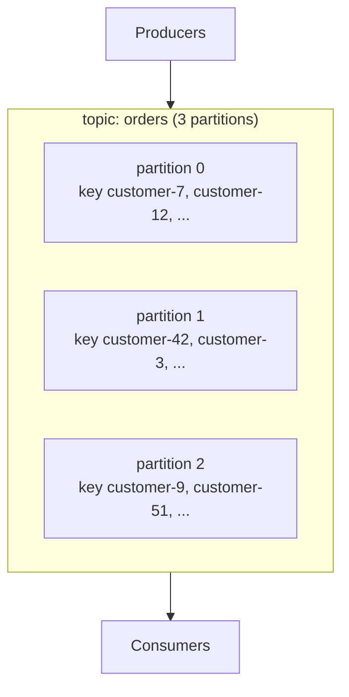

# Topics

A topic is a named stream of messages, split into **partitions**. Partitions are how Narad scales: they spread storage and consumption across the cluster, and keyed messages stick to one partition in normal operation (locality, not an ordering guarantee; see [Guarantees](guarantees-and-errors.md)).


```mermaid
flowchart TB
    subgraph orders["topic: orders (3 partitions)"]
        p0["partition 0<br/>key customer-7, customer-12, ..."]
        p1["partition 1<br/>key customer-42, customer-3, ..."]
        p2["partition 2<br/>key customer-9, customer-51, ..."]
    end
    P[Producers] --> orders
    orders --> C[Consumers]
```

## Creating a topic

```bash
curl -u $AUTH -X POST $NARAD/v1/topics \
  -H "Content-Type: application/json" \
  -d '{
    "name": "orders",
    "partitions": 6,
    "retention_ms": 86400000,
    "visibility_timeout_ms": 30000,
    "max_in_flight_per_partition": 1024,
    "max_acked_ahead_per_partition": 1024
  }'
```

| Field | Meaning | Default | Rules |
|---|---|---|---|
| `name` | Topic name | none | required, unique |
| `partitions` | Units of parallelism and placement | 3 | at least 3, at most 108 |
| `retention_ms` | How long messages are kept on disk | operator default | 0 = keep forever; otherwise at least 1 hour |
| `visibility_timeout_ms` | How long a consumed message stays hidden before redelivery | 30000 | your processing time budget |
| `max_in_flight_per_partition` | Max unacked messages handed out per partition | 1024 | backpressure knob |
| `max_acked_ahead_per_partition` | Max out-of-order acks held per partition | 1024 | see [Consuming](consuming.md) |
| `schema` | Optional JSON Schema; payloads are validated on produce | none | see [Schemas](#schemas); rejected payloads get `400` |

**Choosing partition count.** More partitions = more parallel consumers and more spread across the cluster. Pick roughly the number of consumers you expect to run in parallel. Partition count can be increased later but never decreased, so start modest.

**Choosing retention.** Messages are deleted `retention_ms` after they were written, *whether or not they were consumed*. Retention is a safety net for replay and slow consumers, not a substitute for acking promptly.

## Reading a topic

```bash
curl -u $AUTH $NARAD/v1/topics                # list all topics
curl -u $AUTH $NARAD/v1/topics/orders         # one topic + per-partition stats
```

The single-topic response includes `partition_stats` (per-partition oldest offset, next offset, and segment counts, handy for eyeballing backlog and growth) and, when the topic has a schema, `schema_version` and the current `schema` document. `GET /v1/topics/orders/schema` returns every version; see [Schemas](#schemas).

Reads are scoped to what you can touch. `GET /v1/topics/{name}` (and `/children`) answers `403` unless you hold **any** grant matching the name (`produce`, `consume`, or `create`), own the topic, or are an admin; a topic you have no grant on and that does not exist still answers `404`. `GET /v1/topics` lists only the topics you could read individually, and admins see everything. The filter runs on each page after pagination, so a page can come back shorter than `limit`, or even empty, while `next_page_token` is still set: keep paging until the token is empty.

## Changing a topic

```bash
curl -u $AUTH -X PATCH $NARAD/v1/topics/orders \
  -H "Content-Type: application/json" \
  -d '{"retention_ms": 172800000}'
```

What can change after creation, and what cannot:

| Field | Alterable | Notes |
|---|---|---|
| `retention_ms` | yes | applies to all partitions from the next retention pass |
| `max_in_flight_per_partition`, `max_acked_ahead_per_partition` | yes | send one or both; the other keeps its current value |
| `partitions` | increase only | must be greater than the current count and within the cluster maximum; omit or `0` to leave it alone |
| `schema` | yes | registers a new schema version; add `schema_base_version` to make it conditional; see [Schema evolution](#schema-evolution) below |
| `visibility_timeout_ms` | **no** | fixed at create time |

If the topic has [delay children](fanout-and-delay.md), you can't shrink retention below what the child's delay needs; Narad refuses with `409` instead of letting delayed messages age out before delivery.

A request carrying several fields applies them as separate updates in a fixed order (retention, then the per-partition limits, then partitions, then schema), with no transaction across them: the first failure stops the sequence and answers its error, and the fields before it stay applied. Send one field per request when you need all-or-nothing.

## Schemas

A topic can carry a JSON Schema. Set it at create time (`"schema": {...}`) or later with `PATCH` (below). When a topic has a schema, **every produce body must be one JSON text, in valid UTF-8, that validates against the current version**; anything else answers `400` with a message naming the failing keyword and location (`at '/qty': got string, want integer`). The message is capped at 2 KiB, so a schema with a huge `enum` cannot turn a rejected produce into a large response. A topic without a schema treats bodies as opaque bytes.

What "one JSON text" means, exactly:

- Non-JSON text, binary, an empty body, a body with trailing data after the value (`{"id":1} {"id":2}`), a UTF-8 BOM, a raw control character inside a string, and invalid UTF-8 inside a string are all `400`.
- Any JSON value is a candidate: `[1,2]` and `"text"` validate like objects do. A schema of `true` or `{}` therefore means "must be JSON" and nothing more.
- Duplicate keys in an object follow encoding/json: the last value wins and is what gets validated.
- Numbers are validated **exactly**, not as 64-bit floats: `9007199254740993` is odd under `multipleOf: 2`, `9223372036854775808` exceeds `maximum: 9223372036854775807`, and `1e400` is a valid `number`. `1.0` and `1e2` are integers; `1.5` is not.
- `maxLength`/`minLength` count Unicode characters, not bytes.
- `pattern` and `patternProperties` use Go RE2 syntax and run in linear time; a lookahead or backreference is refused at registration, and a pathological pattern cannot stall a produce.
- `format` is **asserted on every draft**, including the default 2020-12 (the library alone would only assert it for draft-07 and earlier). Known formats such as `email`, `date-time`, `uuid`, `ipv4`, `uri` reject bad values; an unknown format name is ignored.
- Payload nesting is bounded by the decoder at 10000 levels; deeper is `400`.

### Reading the schema

`GET /v1/topics/{name}` carries `schema_version` (0 when the topic has none) and `schema`, the exact document every produce is validated against on the node that answers. `GET /v1/topics/{name}/schema` returns the whole history:

```json
{"topic":"orders","version":2,"versions":[{"version":1,"schema":{...}},{"version":2,"schema":{...}}]}
```

Both follow the [topic read rule](#reading-a-topic): any grant on the topic, ownership, or admin. Changing the schema follows the manage rule (owner or admin), so a `produce` grant can read the schema it has to satisfy but never change it.

### Registering a schema

The document must be a JSON object or `true`. `false` (which would reject every message), `null`, strings, numbers and arrays are refused with `400`, as are documents over **256 KiB** or nested deeper than **64 levels** (compile time grows steeply with depth, and every node compiles the schema the first time it validates a produce after a change). A body over 1 MiB is `413` before any of this. `$ref` resolves only inside the document itself (`#/$defs/...`, `#anchor`, `$dynamicRef`); `file://`, `http(s)://` and relative references, and any `$schema` other than the built-in drafts (2020-12 default, 2019-09, 07, 06, 04), are refused at registration and the error never echoes the reference. `$id` is accepted and loads nothing.

## Schema evolution

A topic's schema history is append-only and lives in the metastore: every `PATCH` with a `schema` field is checked against the **latest persisted version** on the cluster leader and stored as the next version number. A version can never be overwritten or removed; a topic keeps at most **1000** versions (`409` beyond that).

Three rules about the request itself:

- **Idempotent.** A `schema` equal to the current version (same JSON value; formatting and key order do not matter) registers nothing and answers `200`, so a retry after a lost response does not grow the history.
- **Conditional.** Add `"schema_base_version": N` to apply the update only if the current version is exactly `N`; otherwise `409` (`schema version conflict`) and nothing changes. Two operators who both read v1 and PATCH cannot silently land as v2 and v3: read `schema_version`, send it back, and on `409` re-read the current schema before retrying. Without the field the update is unconditional and is checked against whatever version is current when the leader processes it.
- **Not removable.** `"schema": null` is `400`; a schema can only be widened. `{}` is not a widening either (it drops your properties), see the table.

The compatibility check enforces "every message the previous version accepted stays valid". It is a structural comparison that **fails closed**: a construct it cannot reason about is only allowed to stay exactly as it was (or, where removing it can only widen the schema, to disappear). Anything else answers `400` with a message naming the keyword and its location (`at /properties/qty: type "integer" no longer allowed`).

What it understands:

| Keyword | Allowed change |
|---|---|
| `type` | add types to the set; `integer` may become `number`; drop the keyword |
| `enum`, `const` | add values (`const` may become an `enum` containing it); drop |
| `minimum`, `exclusiveMinimum`, `maximum`, `exclusiveMaximum` | loosen or drop; never add |
| `multipleOf` | change to a divisor of the old value; drop |
| `minLength`, `minItems`, `minProperties` | decrease or drop; may appear only as `0` |
| `maxLength`, `maxItems`, `maxProperties` | increase or drop; never add |
| `pattern`, `format` | keep identical or drop |
| `uniqueItems` | `true` may become `false`/absent; never add |
| `required` | remove names; never add |
| `properties` | add optional properties; never remove one; each existing property is checked recursively with these same rules |
| `additionalProperties` | `false` may open up (to absent, `true`, or a schema); a schema may only widen; a closed model or a schema may not appear where there was none |
| `items` | widen recursively or drop; never add (array-form tuples are not supported) |
| `anyOf` | every old branch must be covered by some new branch |
| `allOf` | every new branch must be implied by some old branch |
| `$ref` | only `#/...` pointers into the same document, with no sibling keywords; resolved on both sides before comparing |
| `$schema` | must not change |

`oneOf`, `not`, `if`/`then`/`else`, `contains`, `propertyNames`, `dependentRequired`, `dependentSchemas` and `patternProperties` may be kept identical or removed (`patternProperties` only while `additionalProperties` stays open; `prefixItems` only when `items` goes with it). `unevaluatedProperties`, `unevaluatedItems` and `$dynamicRef` are accepted only in a subschema that is byte-for-byte unchanged. Titles, descriptions, defaults, examples and `$defs` can change freely.

Two things to know:

- **Adding an optional property under an open content model is allowed** even though, strictly, a message that already carried that key with a different type was valid before. This is the one deliberate exception; use `"additionalProperties": false` when you need exact semantics.
- The check only compares a keyword with the same keyword in the previous version. A change that is safe only because of a *different* keyword (dropping `const: 5` for `minimum: 3`, say) is rejected: make the new schema wider keyword by keyword.

### Fan-out children

A child created under or attached to a parent with a schema **adopts the parent's whole history** (same version numbers, same documents) and is parent-managed while attached: `PATCH` on the child is `409`, and every parent update propagates to the child in the same transaction. On detach the child keeps the history it has and manages it again. A child can only be attached (or re-attached) to a parent whose history is **identical** to its own, version for version; a child that has a schema cannot go under a parent that has none, and a child without one adopts on attach. To re-link a child that has drifted, bring the parent to the exact same history (or the child, while detached) first. See [Fan-out & Delay](fanout-and-delay.md).

### When does a new version take effect?

The `PATCH` answers once the new version is committed and applied on the leader. Every other node applies it within replication latency (milliseconds) and validates the next produce it receives against it; the registry on each node is keyed by the metastore's schema version, so no restart or cache expiry is involved. A produce that reaches a follower inside that window is validated against the previous version. Increasing partitions, and any other alteration, leaves the schema untouched. Deleting the topic deletes the history with it; a recreated topic of the same name starts with no schema, or at v1 with whatever it is created with.

## Deleting a topic

```bash
curl -u $AUTH -X DELETE $NARAD/v1/topics/orders
```

`204`. This deletes the metadata **and** the on-disk data on every node, and detaches any fan-out children. There is no undo.

The metadata delete is the commit point: once it stands, the topic is gone for every client and `204` is the answer even if some node could not purge its files right then (a member that is down, or a disk error). Those directories are reclaimed by that node's startup sweep; nothing about them is visible through the API. A delete that fails *before* the commit (unknown topic, control plane unavailable) still answers `404` or `503`.

## Who can do this

Creating requires a `create` grant matching the topic name; the creator becomes the topic's **owner**. Altering and deleting require ownership or an `admin` grant. Reading a topic requires any grant on it, ownership, or admin. Details in [Users & Access](users-and-access.md).
