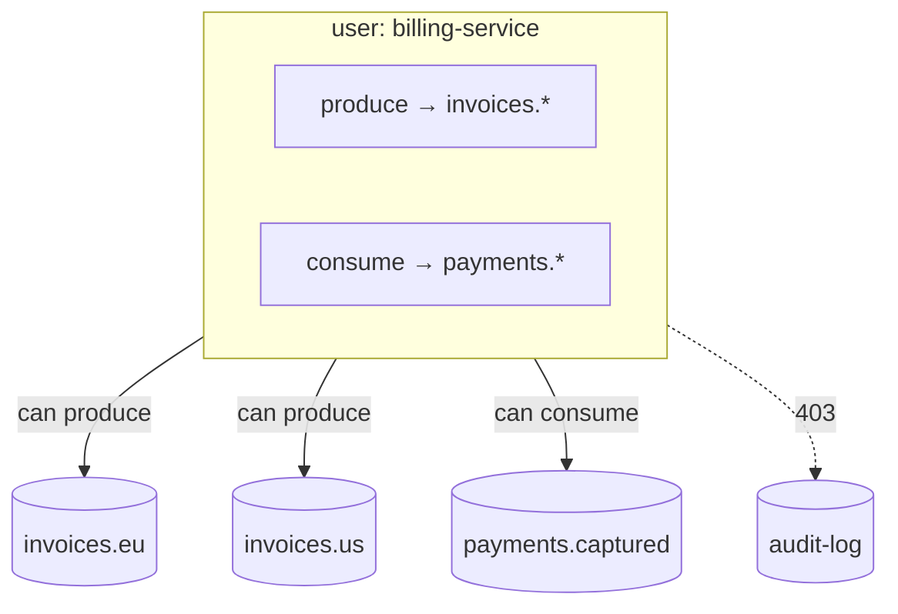

# Users & Access

When security is enabled (it is, on any real deployment), every request needs HTTP Basic auth, and what a user may do is defined by **grants**.

## The model in one picture



A **grant** is an action plus a list of topic-name patterns:

| Action | Allows |
|---|---|
| `produce` | producing to matching topics |
| `consume` | consuming from and acking matching topics |
| `create` | creating topics with matching names — the creator becomes that topic's **owner** |
| `admin` | everything, including user management |

Patterns are exact names or **prefix wildcards**: `invoices.*` matches `invoices.eu`, `invoices.us`, and so on.

**Ownership** rides on top: whoever created a topic can alter it, delete it, and manage its fan-out children — no extra grants needed. Admins can do that to any topic.

## Managing users (admin only)

```bash
# create a user
curl -u $ADMIN -X POST $NARAD/v1/users \
  -H "Content-Type: application/json" \
  -d '{
    "username": "billing-service",
    "password": "a-strong-secret",
    "grants": [
      {"action": "produce", "patterns": ["invoices.*"]},
      {"action": "consume", "patterns": ["payments.*"]}
    ]
  }'

curl -u $ADMIN $NARAD/v1/users                       # list
curl -u $ADMIN $NARAD/v1/users/billing-service        # inspect
curl -u $ADMIN -X PUT $NARAD/v1/users/billing-service/grants \
  -d '{"grants": [{"action": "produce", "patterns": ["invoices.*", "receipts.*"]}]}'
curl -u $ADMIN -X DELETE $NARAD/v1/users/billing-service
```

Two rules that keep the system honest:

- **No privilege escalation**: you can never grant another user more than you hold yourself.
- Users can change **their own password** (`PUT /v1/users/{name}/password` with `current_password`); admins can reset anyone's without it.

## Practical advice

- One user per service, scoped to exactly the topics it touches. `produce` and `consume` are separate on purpose — a producer that can't drain its own topic is a feature.
- Reserve `admin` for humans and deployment tooling.
- The root admin is seeded at cluster startup from the operator's secret; treat its credentials like any other root credential.
