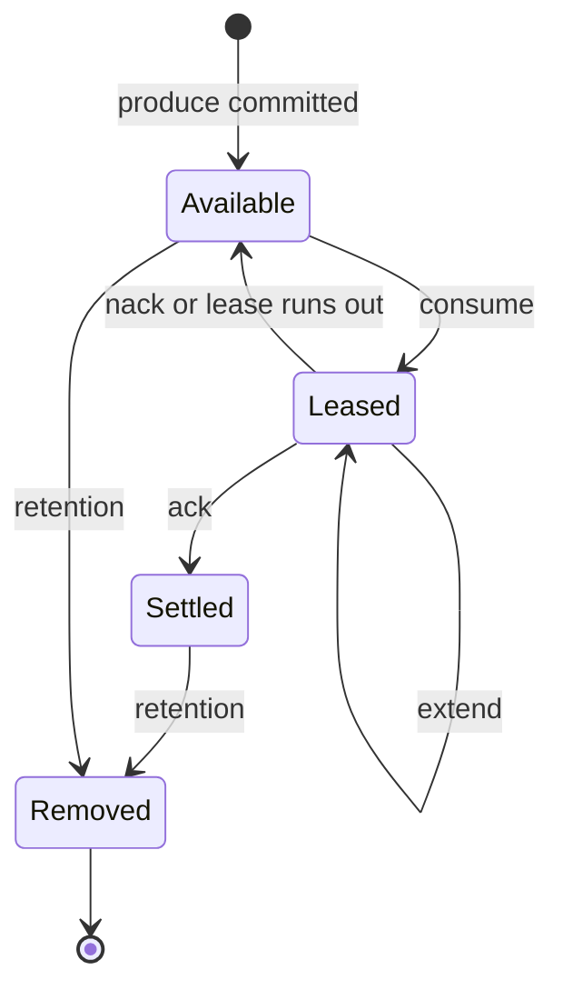

# Core concepts

Learn the handful of ideas every Narad client uses: topics, partitions, keys, leases, acks, child topics and grants.

## Topics and partitions {#topics-and-partitions}

A [topic](../reference/glossary.md#topic) is a named stream of messages: producers write to it, consumers read from it. Each topic is split into [partitions](../reference/glossary.md#partition): 3 by default, or the number you ask for when you create it. A partition is an append-only log on the disk of one node, its [owner](../reference/glossary.md#owner).

You never need to know which node owns what. Any node accepts any request, and forwards it to the owner when the work belongs elsewhere. You can add partitions to a topic later, but never remove them.

A topic keeps each message for its [retention](../reference/glossary.md#retention) period (the operator's default: 7 days for the binary, 12 hours for a cluster installed with the Helm chart), whether or not anyone acked it. Retention removes messages in whole chunks of the log, so a message can outlive its retention period but is never removed before it.

--8<-- "contract/one-copy.md"

[Manage topics](../build/topics.md) shows how to create and change topics.

## Producing messages {#producing}

A producer sends each message with one HTTP `POST` to any node. The request body is the message: any bytes up to 1 MiB, such as JSON, plain text or protobuf. There is no client library to install, although a [Go SDK](../build/go-sdk.md) exists.

A `202 Accepted` answer is a durability promise, not only a receipt: [what a 202 means](../understand/delivery-contract.md#what-202-means) spells out which failures it survives. [Produce messages](../build/producing.md) covers the request in full.

## Keys {#keys}

A produce can carry a [key](../reference/glossary.md#key), such as a customer ID. Messages with the same key go to the same partition in normal operation, which keeps related messages together for consumers and for child topics. Messages without a key are spread across the topic's partitions.

A key groups messages; it does not order them.

--8<-- "contract/no-ordering.md"

## Leases and receipt handles {#leases}

Consumers pull. A consume request reserves one message and returns it with a [receipt handle](../reference/glossary.md#receipt-handle). Until the topic's [visibility timeout](../reference/glossary.md#visibility-timeout) runs out (30 seconds by default), no other consumer gets that message. That reservation is a [lease](../reference/glossary.md#lease).

The receipt handle names one delivery of one message. You send it back to settle the message, and you treat it as an opaque string. Each delivery gets a new handle, so a handle from an earlier delivery stops working.

There are no consumer groups and no partition assignments. Run as many consumers against a topic as you need: they share its one queue, and each message goes to one of them at a time. When two services each need every message, give each its own [child topic](#children).

## Ack, extend and nack {#settling}

A consumer that holds a lease settles it through the ack endpoint, in one of three ways:

| Action | Request | What happens |
| --- | --- | --- |
| Ack | `POST /v1/topics/{topic}/ack?receipt_handle=...` | The message is settled and is not handed out again |
| [Extend](../reference/glossary.md#extend) | the same, plus `&extend=true` | The lease restarts with a full visibility timeout from now, for slow work |
| [Nack](../reference/glossary.md#nack) | the same, plus `&extend=0` | The lease ends and the message is available to the next consume at once |

Each answers `204 No Content`. Acks can arrive in any order. If the lease ran out first, the request answers `410 Gone`: the message is back in the queue, and another consumer may already be working on it.

--8<-- "contract/at-least-once.md"

[Consume and acknowledge messages](../build/consuming.md) shows each request with curl.

## Message lifecycle {#message-lifecycle}

A settled message stays in its partition's log until retention removes it. A replay can still read it by partition and offset, without taking a lease: see [Replay messages](../build/replay.md).

## Child topics {#children}

A topic can have child topics. From the moment a child is attached, Narad copies every message committed to the parent into the child, key included. Each child is an ordinary topic with its own consumers, retention and pace. Messages already in the parent are not copied.

| Kind | What it is for |
| --- | --- |
| [Fan-out child](../reference/glossary.md#fan-out-child) | A second service that needs every message, consuming at its own pace |
| [Delay child](../reference/glossary.md#delay-child) | Each copy appears a fixed delay after the parent committed it, never earlier; useful for retrying later |
| [Replica child](../reference/glossary.md#replica-child) | A second copy of a topic's messages on other nodes, created in the same request as the link to its parent |

A child has one parent, and a child cannot have children of its own. [Fan out and delay messages](../build/fanout-and-delay.md) shows how to attach each kind; replica children are covered in [Back up and replicate topics](../operate/backups.md#replica-children).

## Users and grants {#access}

On a cluster with security on, every request carries a username and password over HTTP Basic auth. A user can do what its [grants](../reference/glossary.md#grant) allow. A grant is an action on topics whose names match a pattern: an exact name such as `orders`, or a prefix wildcard such as `orders-*`.

| Action | Allows |
| --- | --- |
| `produce` | producing to matching topics |
| `consume` | consuming from, and acking on, matching topics |
| `create` | creating topics with matching names; the creator owns the new topic |
| `admin` | everything, including managing users; it takes no patterns |

A topic's owner can change and delete it without further grants. `narad server start --dev` turns security off, so a local node takes requests with no credentials. [Access model and grants](../reference/access-model.md) has the full rules, and [Connect and authenticate](../build/connect.md#credentials) shows how a client sends credentials.

## Next steps {#next-steps}

- [Delivery contract](../understand/delivery-contract.md): every promise Narad makes, and the failures that bend them.
- [Architecture overview](../understand/index.md): how nodes, partitions and Raft fit together.
- [Connect and authenticate](../build/connect.md): point a client at a real cluster.
