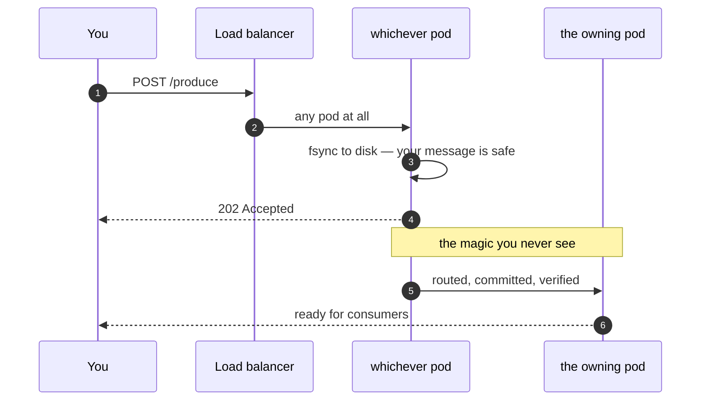
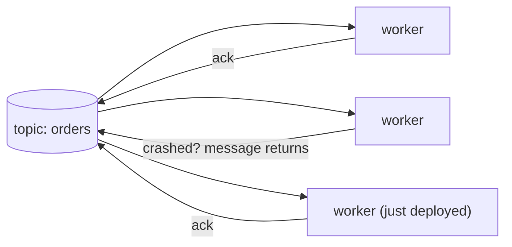
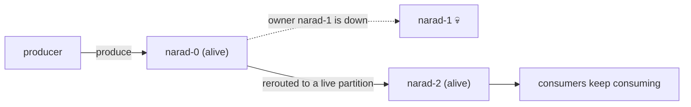
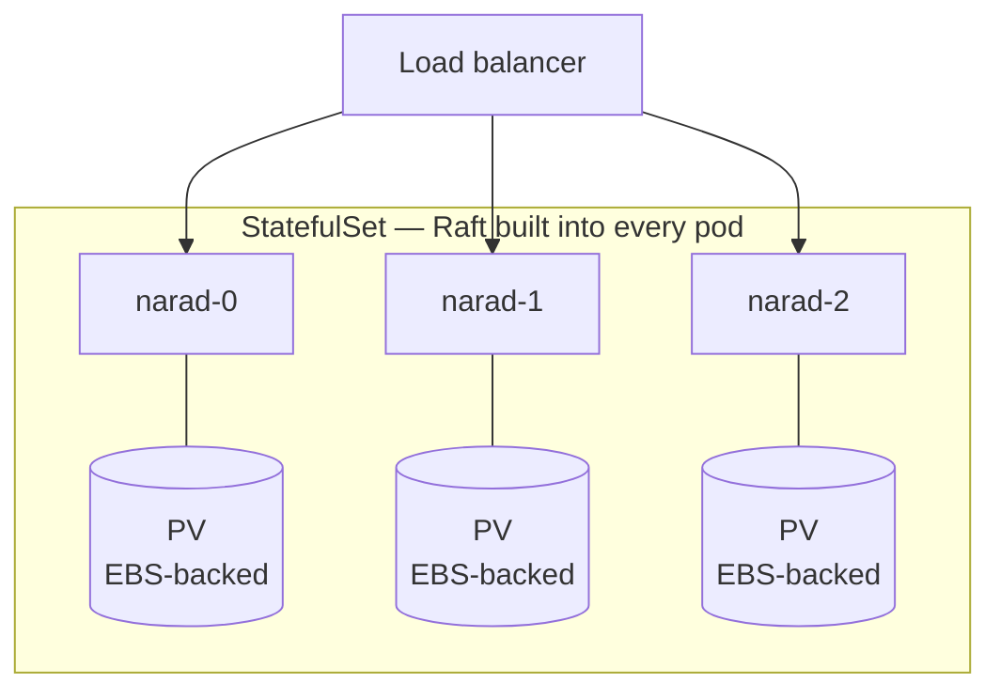

---
hide:
  - navigation
  - toc
---

<div class="narad-hero" markdown>

{ .narad-hero-logo }

<p class="narad-tagline">Durable messages. Timeless connections.</p>

<p class="narad-sub">A message broker that respects your weekend. Plain HTTP in, at-least-once out, and nothing to babysit in between.</p>

[Get started in 5 minutes](client/index.md){ .md-button .md-button--primary }
[See how it works](internals/index.md){ .md-button }

</div>

<div class="narad-section" markdown>

## Hit any pod. Narad does the rest.

Produce, consume, ack — send every request to the **load balancer** and stop thinking. There is no "find the right broker," no partition leader discovery, no client-side metadata protocol. Whatever pod your request lands on, it's the right pod.



Under the hood, the pod that catches your produce makes it **durable on disk before answering**, then finds the partition's owner, hands it over, and retries through failures until it's committed and verified. Consumes and acks route themselves the same way. You brought an HTTP client; that was your entire job.

</div>

<div class="narad-section" markdown>

## Consume without the ceremony

No consumer groups. No rebalancing storms. No partition assignment protocols, generation IDs, or "stop the world, someone joined." Run **one worker or a hundred** against the same topic — each message goes to exactly one of them, and if a worker dies mid-job, its messages quietly come back for the others.



Scale your consumers by... starting more consumers. That's the whole runbook.

</div>

<div class="narad-section" markdown>

## Built to say yes

In CAP terms, Narad's data plane picks **availability** — with durability absolute on top. As long as **one node is alive**, produces keep landing: any live node accepts your message, fsyncs it locally, and works out delivery later. A dead partition owner doesn't stop the world — new messages route around it to live nodes, automatically.



The price, stated plainly so you never discover it in production: **ordering is not guaranteed.** Failover reroutes messages across partitions, and redelivery replays older messages after newer ones. If your consumers need a sequence, carry one in the payload. What you get in exchange is a broker that keeps accepting and keeps delivering while machines burn around it.

**And when a topic needs a second copy, replication is one API call** — not a subsystem:

```bash
curl -u $AUTH -X POST $NARAD/v1/topics   -d '{"name": "orders-replica", "parent": "orders"}'
```

That creates a fan-out child that receives every message durably and whose partitions are **deliberately placed on different nodes** than the parent's — an async full copy that survives the parent's disk, with its own retention (make it longer: congratulations, you also have an archive tier). No quorums, no consistency protocol, no replication code to trust — just [a placement rule on machinery already soak-tested for days](client/fanout-and-delay.md#replication-when-you-ask-for-it). You pay double disk only on topics that opt in.

</div>

<div class="narad-section" markdown>

## Deploys like it's nothing

A load balancer, a StatefulSet, and persistent volumes. **That is the complete architecture.** No ZooKeeper. No BookKeeper. No keeper of any kind — no sidecar quorum service, no external metadata store, no six-component "getting started" diagram.



Cluster metadata lives in **Raft, inside the same binary**. Scaling out is raising `replicaCount` — new pods find the cluster, join it, and start taking work. One Helm chart, one image, one thing to understand.

```bash
helm install narad ./charts/narad --set replicaCount=3
```

</div>

<div class="narad-section" markdown>

## Simple is the feature

Here is the **entire client API**. Not highlights — the whole thing:

```text
POST   /v1/topics                       create a topic
GET    /v1/topics · /v1/topics/{t}      list · inspect
PATCH  /v1/topics/{t}                   tune retention & limits
DELETE /v1/topics/{t}                   delete

POST   /v1/topics/{t}/produce           send   (body = your message)
GET    /v1/topics/{t}/consume           receive (long-poll with ?wait=)
POST   /v1/topics/{t}/ack               settle · extend · nack

POST   /v1/topics/{p}/children          attach fan-out / delay child
GET    /v1/topics/{p}/children          list children + lag
DELETE /v1/topics/{p}/children/{c}      detach

POST/GET/DELETE /v1/users               accounts & grants
```

You just read all of it. If you know HTTP and `curl`, you already know Narad — no client library to vendor, no binary protocol to debug at 3am, no consumer-group state machine to meditate on.

**And the message body is whatever you want it to be.** JSON, plain text, protobuf, a gzip blob, an image — produce is a raw octet-stream and the broker adapts on the way out (JSON comes back verbatim, text as text, binary safely base64-flagged). Compare: SQS flat-out forbids binary bodies, and Pub/Sub's HTTP API makes *you* base64-encode every single message before sending. Narad's producers just send.

And the simplicity goes all the way down. One binary, one repo, written to be **read** — a second-year engineer can trace a produce from HTTP handler to fsync in an afternoon (the [Internals](internals/index.md) section literally walks the exact function names). You don't need a dedicated DevOps team, and you don't need the one grey-bearded engineer who "knows the broker" — if that person leaves, the next person reads the docs and carries on. Two-person startup or hundred-team org, second year or twentieth: if you can run a StatefulSet, you can run Narad.

Boring to operate. Readable to the bottom. That's not a limitation — that's the whole point.

</div>

<div class="narad-section" markdown>

## Everything you actually need from a broker

<div class="grid cards" markdown>

- :material-shield-check: **Durable before acknowledged**

    A `202` means your message is fsynced to disk — not buffered, not "probably." Crash a millisecond later; the message survives. Delivery is at-least-once — durability is never traded for anything.

- :material-call-split: **Fan-out, built in**

    Attach child topics to a parent and every message is copied to each child automatically. Analytics, billing, and audit each get their own independent stream — producers change nothing.

- :material-clock-outline: **Delayed delivery, built in**

    A child with `delay_ms` delivers each message exactly N ms after the parent committed it. Retry queues and cool-downs without cron jobs, external schedulers, or sorted-set hacks.

- :material-timer-sand: **Leases, not black holes**

    Consumed messages are invisible while you work, redelivered if you vanish, extendable if you're slow, and returnable if you give up. `410 Gone` tells you honestly when you lost the race.

- :material-lock-outline: **Access control included**

    Users, bcrypt, per-action grants with prefix wildcards, topic ownership. Give billing `produce` on `invoices.*` and nothing else. No plugin, no gateway.

- :material-magnify: **Replay on demand**

    Everything is a retained log underneath. Point a consume at any offset within retention and re-read history — without disturbing the live queue. Debugging a poison message means *reading it again*, not grepping logs.

- :material-recycle: **Retries & DLQs — your policy, our primitives**

    No baked-in retry engine to fight. Leases, delayed topics, and a `delivery_count` in your envelope compose into bounded retries, spaced backoff, and dead-letter queues — in ~10 lines of consumer code you control. [The complete menu →](client/handling-retries.md)

- :material-chart-line: **Observability out of the box**

    Every node serves Prometheus metrics on `/metrics`, zero config — queue depth, consumer lag, ack rates, and the honest delay-lag signal. A ready-to-import Grafana dashboard ships in the repo; it's the one our 47-hour soak was judged on. [Monitoring →](operate/monitoring.md)

</div>

</div>

<div class="narad-section" markdown>

## Paranoia, professionally applied

We didn't unit-test our way to confidence — we **force-killed live nodes under traffic, for days**, with a harness that catches every single lost message. Leader kills, double kills, quorum loss, kills mid-rolling-restart, kills during scale-out.

<div class="narad-stats" markdown>

<div class="narad-stat"><span class="narad-stat-num">0</span><span class="narad-stat-label">messages lost across the entire chaos matrix</span></div>
<div class="narad-stat"><span class="narad-stat-num">4</span><span class="narad-stat-label">data-loss bugs found by chaos testing — and fixed before you got here</span></div>
<div class="narad-stat"><span class="narad-stat-num">1</span><span class="narad-stat-label">rule everywhere: no node destroys data without the leader confirming it</span></div>

</div>

The full war stories — including the bug that only bit the node that *won* an election — are written up honestly in [Cluster Lifecycle](internals/cluster-lifecycle.md). We think a broker that shows you its scars is one you can trust.

</div>

<div class="narad-section narad-final" markdown>

## Convinced? Good. Here's the manual.

Not convinced yet? Fair — read [**Narad vs. Everything Else**](compare.md): one honest table against Kafka, NATS JetStream, RabbitMQ, SQS, Redis Streams, and Pulsar, including every row where they win.

<div class="grid cards" markdown>

- :material-rocket-launch: **[Client Guide](client/index.md)**

    Zero to produce–consume–ack in five minutes with `curl`, then topics, fan-out, delay, access control, and the exact fine print of every guarantee.

- :material-cog: **[Internals](internals/index.md)**

    Every subsystem with diagrams: the WAL-first produce path, the storage engine, Raft metadata, fan-out cursors, and how crash recovery really works.

</div>

</div>
