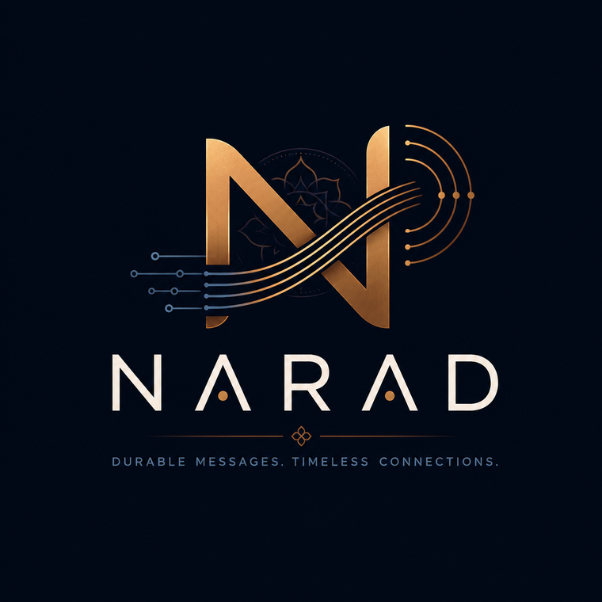

---
hide:
  - navigation
  - toc
---

{ .narad-hero-logo }

Durable messages. Timeless connections.

Narad is a small, sturdy message broker. You send it messages over plain HTTP, and it makes sure the right consumers receive them — at least once, in order per key, even when machines crash. No ZooKeeper, no Kafka, no cloud dependencies: just Go binaries, disks, and Raft.

[Get started in 5 minutes](client/index.md){ .md-button .md-button--primary }
[Read the internals](internals/index.md){ .md-button }

## Two ways to read these docs

- :material-rocket-launch: **[Client Guide](client/index.md)**

    *"I want to use Narad."* Everything you need to build on it, in plain language — topics, producing, consuming, fan-out, delay, access control, and the exact guarantees. No internals knowledge required.

- :material-cog: **[Internals](internals/index.md)**

    *"I want to understand Narad."* How every subsystem actually works, with diagrams: the WAL-first produce path, the storage engine, Raft metadata, fan-out cursors, crash recovery, and the lessons chaos testing taught us.

## Quick facts

- **API**: plain HTTP + JSON. `curl` is a first-class client.
- **Delivery**: at-least-once; per-key ordering within a partition.
- **Durability**: a message is fsynced to disk before you get your `202 Accepted`.
- **Fan-out**: attach child topics to a parent; every parent message is copied to every child.
- **Delay**: a child can deliver each message N milliseconds after the parent committed it.
- **Cluster**: Raft-backed metadata, single-owner partitions, scale-out by raising the replica count.

## Project status

Narad is in late beta (`v0.2.0-beta.x`). It is feature-complete and has survived a deliberately violent chaos-test regimen — leader kills, quorum loss, kills mid-rolling-restart — with zero message loss. See [Cluster Lifecycle](internals/cluster-lifecycle.md) for the war stories.
