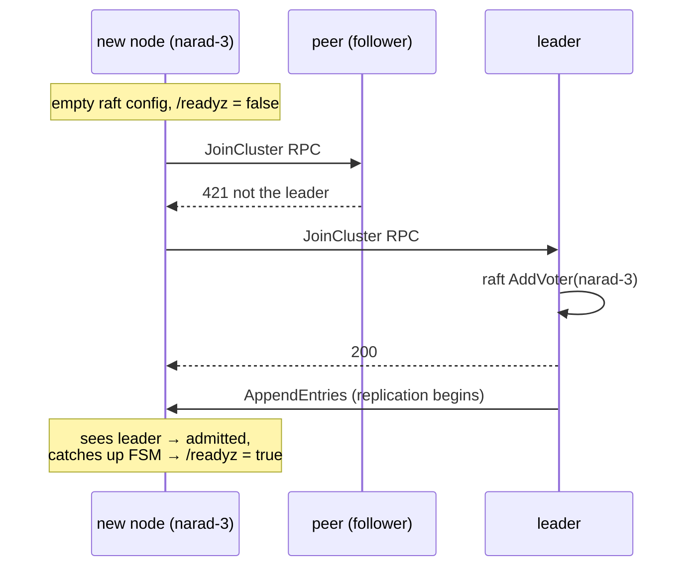
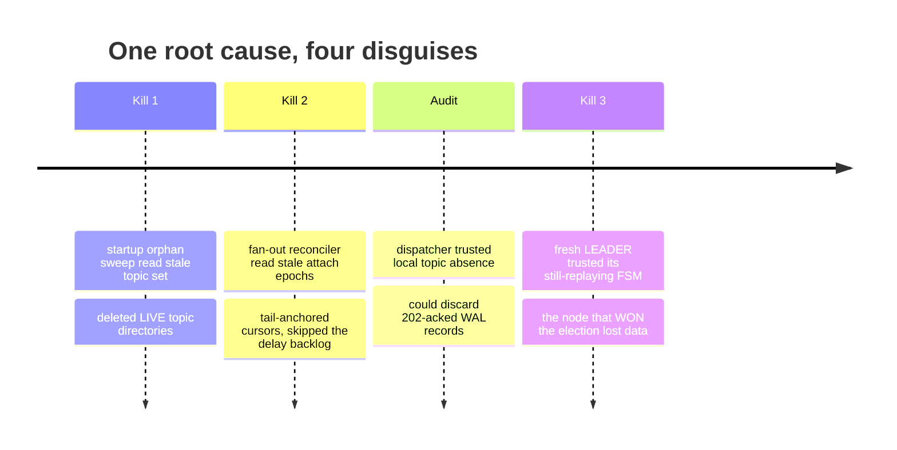

# Cluster Lifecycle

How a cluster is born, grows, and survives violence. The second half of this page is effectively a post-mortem anthology — Narad's crash-recovery design wasn't written down first and tested later; it was *forged* by killing live nodes under traffic until nothing broke anymore.

## Bootstrap

The first nodes (the `initial_members`, typically 3) each start with an empty disk and bootstrap the same Raft configuration — identical peer lists make that a legal, convergent bootstrap. One wins the first election; the controller on it seeds the root admin and starts assigning partitions.

## Scale-out: joining an existing cluster

A node *not* listed in `initial_members` must never bootstrap — it would create a phantom cluster that the real one will never contact. Instead it starts **join-only**:

The join loop walks configured peers every 2s until its own Raft sees a leader (proof of admission). Readiness is held until then, so an unadmitted node never receives traffic — the failure mode where a fresh node serves an empty metastore behind the load balancer is structurally impossible. `AddVoter` is idempotent; joiner restarts and lost replies are safe. Scaling out is literally `replicaCount: 5` in Helm.

New nodes receive partition assignments for topics created *after* they join; existing partitions never move (single-owner data). Rebalancing and scale-down/decommission are deliberately future work.

## Steady state

- Every node heartbeats its membership to the leader every 5s; 30s of silence marks it dead.
- Dead nodes' partitions are **not** reassigned (their data is on that disk); produce reroutes around them, consume returns 503 for their partitions until they return.
- Graceful shutdown transfers Raft leadership first — planned restarts fail over in ~150ms.
- Rolling restarts under full traffic are routine; the soak rig has been through dozens.

## Crash recovery: the four-bug war story

All four bugs share one root cause: **a node restored from a Raft snapshot believes it is current while being hours stale** — and each bug was a different subsystem trusting that belief with something destructive. All four were found by force-killing pods under live soak traffic with a loss-detecting harness; each fix landed with the next kill proving it.

**1. The startup orphan sweep** compared on-disk topic directories against the (stale) local topic set and reclaimed "orphans" — deleting live topics' data seconds after boot. *Fix:* deletion requires the **leader** to confirm the topic is gone; every failure mode keeps the directory.

**2. Fan-out cursors** spawned from the stale view carried dead attach epochs, mismatched the (correct) offset files, tail-anchored, and overwrote them — so the caught-up cursors re-anchored at the new tail, silently skipping the delay child's pending backlog. *Fix:* reconcilers wait for a provably-current replica; tail-anchoring requires a leader-confirmed epoch; offset files are only deleted by their own epoch's cursor.

**3. The dispatcher's discard path** dropped WAL records whose topic was locally absent — sound logic ("replicas only move forward") that snapshot restore breaks: every topic created after the snapshot reads as deleted. *Fix:* discard requires caught-up + leader-confirmed absence.

**4. The subtle one.** Fixes 1–3 had a shortcut: "if I *am* the leader, my local state is authoritative." Then a double-kill made a freshly restarted node **win the election** — legal, its *log* was complete — while its *FSM* was still replaying an old snapshot. It confirmed a dead epoch from its own stale state and tail-anchored. The follower that restarted beside it asked the real leader, was refused, and lost nothing; that asymmetry was the fingerprint. *Fix:* a self-leader must pass a **Raft barrier** (FSM fully applied) and re-read before trusting itself. Election proves the log; only the barrier proves the state.

## The chaos matrix

The regimen that found the bugs now guards against their return — all runs under 300 msg/s of soak traffic with a Redis ledger that detects any lost message:

| Scenario | Result |
|---|---|
| Force-kill a follower owning parent partitions | cursors resume from files, zero loss |
| Force-kill the Raft leader | ~1s failover, zero loss |
| Force-kill a child-partition owner | commits retry, zero loss |
| Force-kill two of three nodes (quorum loss, ×3) | reads/produce degrade gracefully, full recovery, zero loss |
| Force-kill during a rolling restart | zero loss |
| Scale 3→5, then kill leader + new node together | quorum held at 5 nodes, zero loss |

The recurring numbers: bounded duplicates (the at-least-once seams), `OVERDUE = 0` (the harness's loss detector) at the end of every scenario.
