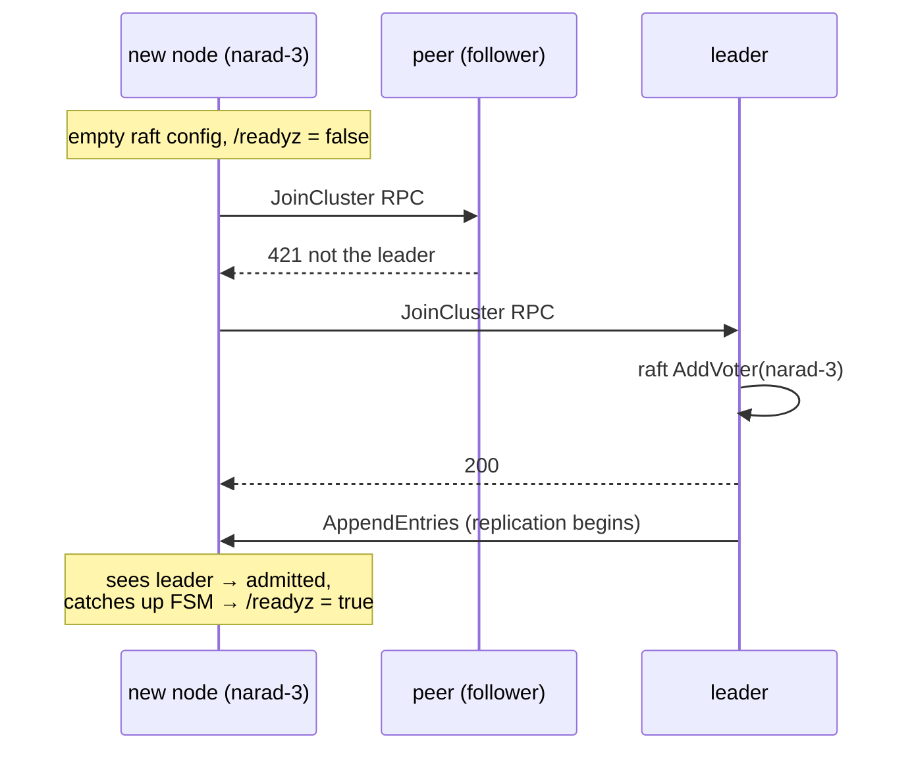
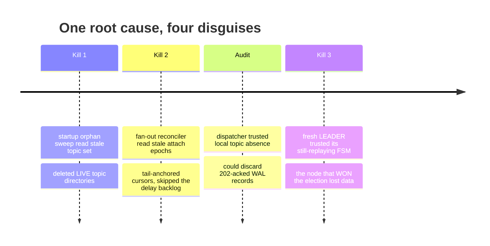

# Cluster Lifecycle

How a cluster is born, grows, and survives violence. The second half of this page is effectively a post-mortem anthology: Narad's crash-recovery design wasn't written down first and tested later; it was *forged* by killing live nodes under traffic until nothing broke anymore.

## Bootstrap

The first nodes (the `initial_members`, typically 3) each start with an empty disk and bootstrap the same Raft configuration; identical peer lists make that a legal, convergent bootstrap. One wins the first election; the controller on it seeds the root admin and starts assigning partitions.

## Scale-out: joining an existing cluster

A node *not* listed in `initial_members` must never bootstrap: it would create a phantom cluster that the real one will never contact. Instead it starts **join-only**:

```mermaid
sequenceDiagram
    participant N as new node (narad-3)
    participant P as peer (follower)
    participant L as leader
    Note over N: empty raft config, /readyz = false
    N->>P: JoinCluster RPC
    P-->>N: 421 not the leader
    N->>L: JoinCluster RPC
    L->>L: raft AddVoter(narad-3)
    L-->>N: 200
    L->>N: AppendEntries (replication begins)
    Note over N: sees leader → admitted,<br/>catches up FSM → /readyz = true
```

The join loop walks configured peers every 2s until its own Raft sees a leader (proof of admission). Readiness is held until then, so an unadmitted node never receives traffic: the failure mode where a fresh node serves an empty metastore behind the load balancer is structurally impossible. `AddVoter` is idempotent; joiner restarts and lost replies are safe. Scaling out is literally `replicaCount: 5` in Helm; the peer list the pods carry is pinned to the initial members, and each pod advertises its own address, so the existing members are not rolled by the scale.

Three answers carry meaning for a joiner. `200`: admitted. `421`: a configured node that is not the leader; try the next peer. `412`: a node with no Raft configuration at all (not bootstrapped, or itself waiting for admission); no evidence of a cluster.

"I am an initial member" is not proof of membership, so two more situations end in the same loop:

- **Any node that sees no leader for 15 s runs the join loop**, initial member or not. A node that was decommissioned and Raft-removed, then restarted with its old volume, used to sit leaderless forever (it had state, so it did not bootstrap, and it was an initial member, so it did not join). Now it asks, and the leader decides.
- **An initial member that starts with an empty volume asks its peers before bootstrapping.** If any peer answers for a configured cluster (`200`, `421`, or `409`) the node starts join-only instead of seeding a rival configuration from its peer list. On a brand-new install nobody answers yet, and bootstrap proceeds as before; if some pods have already bootstrapped, the rest join them, and Raft grants votes from a node with an empty configuration, so the first election still completes.

New nodes receive partition assignments for topics created *after* they join and the leader rebalances existing partitions onto them; see [Rebalance & Decommission](rebalance.md).

## Decommission: removal is two writes

Decommission ends with `RemoveServer`, which takes the node out of the Raft configuration. That alone leaves the member record behind: the pod keeps running until the operator scales it away, its heartbeat keeps re-registering through the leader, and it stays listed alive-and-draining forever (walked on every route-table rebuild and delete broadcast); after the pod is deleted, the record lingers as dead forever. So the controller applies a second Raft entry right after the configuration change: **remove member**, which deletes the record and leaves a tombstone for the ID. The FSM refuses to register a tombstoned ID, so no heartbeat can resurrect it, and the join handler answers `409` to the old incarnation (still running, or restarted with its old volume), which therefore cannot undo its own decommission through the join loop. A join request that declares an **empty data directory** is a deliberate re-add: the leader clears the tombstone and admits it as a new node. Operationally: to bring a pod back under a decommissioned name, delete its PVC first.

## Steady state

- Every node heartbeats its membership to the leader every 5s; 30s of silence marks it dead. A heartbeat from a removed (tombstoned) ID is refused.
- `/readyz` is live: a node answers ready only while it has a leader in view, heard from it within 5s (or is it), and its ownership view has caught up once since start. Losing the leader flips it back.
- Dead nodes' partitions are **not** reassigned (their data is on that disk); produce reroutes around them, consume returns 503 for their partitions until they return.
- Graceful shutdown transfers Raft leadership first; planned restarts fail over in ~150ms.
- Rolling restarts under full traffic are routine; the soak rig has been through dozens.

## Crash recovery: the four-bug war story

All four bugs share one root cause: **a node restored from a Raft snapshot believes it is current while being hours stale**, and each bug was a different subsystem trusting that belief with something destructive. All four were found by force-killing pods under live soak traffic with a loss-detecting harness; each fix landed with the next kill proving it.

```mermaid
timeline
    title One root cause, four disguises
    Kill 1 : startup orphan sweep read stale topic set : deleted LIVE topic directories
    Kill 2 : fan-out reconciler read stale attach epochs : tail-anchored cursors, skipped the delay backlog
    Audit : dispatcher trusted local topic absence : could discard 202-acked WAL records
    Kill 3 : fresh LEADER trusted its still-replaying FSM : the node that WON the election lost data
```

**1. The startup orphan sweep** compared on-disk topic directories against the (stale) local topic set and reclaimed "orphans", deleting live topics' data seconds after boot. *Fix:* deletion requires the **leader** to confirm the topic is gone; every failure mode keeps the directory.

**2. Fan-out cursors** spawned from the stale view carried dead attach epochs, mismatched the (correct) offset files, tail-anchored, and overwrote them, so the caught-up cursors re-anchored at the new tail, silently skipping the delay child's pending backlog. *Fix:* reconcilers wait for a provably-current replica; tail-anchoring requires a leader-confirmed epoch; offset files are only deleted by their own epoch's cursor.

**3. The dispatcher's discard path** dropped WAL records whose topic was locally absent: sound logic ("replicas only move forward") that snapshot restore breaks: every topic created after the snapshot reads as deleted. *Fix:* discard requires caught-up + leader-confirmed absence.

**4. The subtle one.** Fixes 1–3 had a shortcut: "if I *am* the leader, my local state is authoritative." Then a double-kill made a freshly restarted node **win the election** (legal, its *log* was complete) while its *FSM* was still replaying an old snapshot. It confirmed a dead epoch from its own stale state and tail-anchored. The follower that restarted beside it asked the real leader, was refused, and lost nothing; that asymmetry was the fingerprint. *Fix:* a self-leader must pass a **Raft barrier** (FSM fully applied) and re-read before trusting itself. Election proves the log; only the barrier proves the state.

## The chaos matrix

The regimen that found the bugs now guards against their return: all runs under 300 msg/s of soak traffic with a Redis ledger that detects any lost message:

| Scenario | Result |
|---|---|
| Force-kill a follower owning parent partitions | cursors resume from files, zero loss |
| Force-kill the Raft leader | ~1s failover, zero loss |
| Force-kill a child-partition owner | commits retry, zero loss |
| Force-kill two of three nodes (quorum loss, ×3) | reads/produce degrade gracefully, full recovery, zero loss |
| Force-kill during a rolling restart | zero loss |
| Scale 3→5, then kill leader + new node together | quorum held at 5 nodes, zero loss |

The recurring numbers: bounded duplicates (the at-least-once seams), `OVERDUE = 0` (the harness's loss detector) at the end of every scenario.
## Lifecycle constants, for the record

| Thing | Value |
|---|---|
| Join attempt cadence / admission proof | every 2s / "my own Raft sees a leader" |
| Graceful leadership transfer | ~150ms; crash election ~1s |
| Heartbeat / dead marking | 5s / 30s |
| Startup reconcile caught-up wait | ≤60s (sweep skipped on timeout; data outlives impatience). The timeout never marks the node ready; it keeps waiting |
| Readiness | live: leader in view, contact within 5s (or self is leader), ownership latch set |
| Leaderless join | a node with no leader for 15s runs the join loop |
| Existing-cluster probe (empty volume) | 3 rounds, 1s apart, 2s per peer, before an initial member bootstraps |
| Self-leader trust | only after a 5s-bounded Raft `Barrier` + re-read; the ownership latch on a self-leader also needs the barrier |

## Ownership after a restart

A node decides "do I own this partition" from the assignments in its local metastore replica. Right after a restart that replica lags the cluster: it has not heard from the leader yet, and it may be missing every assignment change that happened while the node was down. Acting on that view is how a node once took ownership of partitions that had been reassigned in the meantime (a topic deleted and recreated under the same name while it was down), committed dispatched records into a fresh directory at offset 0, handed them to consumers, and then lost them when the leader-confirmed stale-copy sweep reclaimed the directory.

So `ListAssignments` and `GetAssignment` refuse with `ErrUnavailable` until the replica has caught up with the leader at least once since the process started (`AppliedCaughtUp`). Every ownership decision flows through those two calls, and every caller treats the error as transient: the ingress dispatcher leaves its records in the WAL, a forwarded commit or consume is retried by its sender, the fan-out and move reconcilers skip the pass, a stats query skips the partition, and HTTP answers 503. The latch never clears once set; steady-state replica lag is coordinated through the move handoff protocol, not through this gate.

"Caught up" has to be measured against the **leader's** commit index, not the node's own. Two local numbers are not enough, and the second one is subtle:

- The freshness check (heard from the leader within 5s) is load-bearing: without it a snapshot-restored replica reads as caught up against its own pre-restart indexes.
- Raft's local `commit_index` is not the leader's. It is 0 after a restart (only `last_applied` is restored from the snapshot), heartbeats carry no commit index yet do refresh last-contact, and even a real `AppendEntries` caps it at the node's own last log index. A follower that has heard exactly one heartbeat satisfies `applied >= commit` (0 >= 0) with its FSM still at the snapshot, and the leader's replication goroutine can back off for up to ~10s after a node was down, so that window is real; a node far behind and receiving entries in batches reads `applied >= commit` after every batch.

The store therefore records the highest `LeaderCommitIndex` it has ever received on the Raft transport (a thin wrapper over the transport's consumer channel; heartbeats carry 0 and are ignored) and a follower is caught up only once `applied_index` has reached that value. A leader compares against its own `commit_index`, which is authoritative once its no-op entry for the term has committed (until then it is 0 in a fresh process), and a self-leader additionally passes a Raft barrier before the ownership latch sets: election proves the log, only the barrier proves the state.
