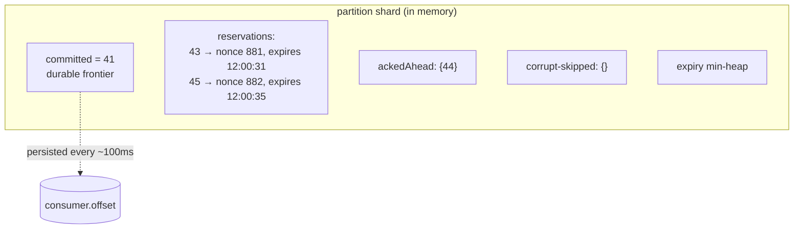
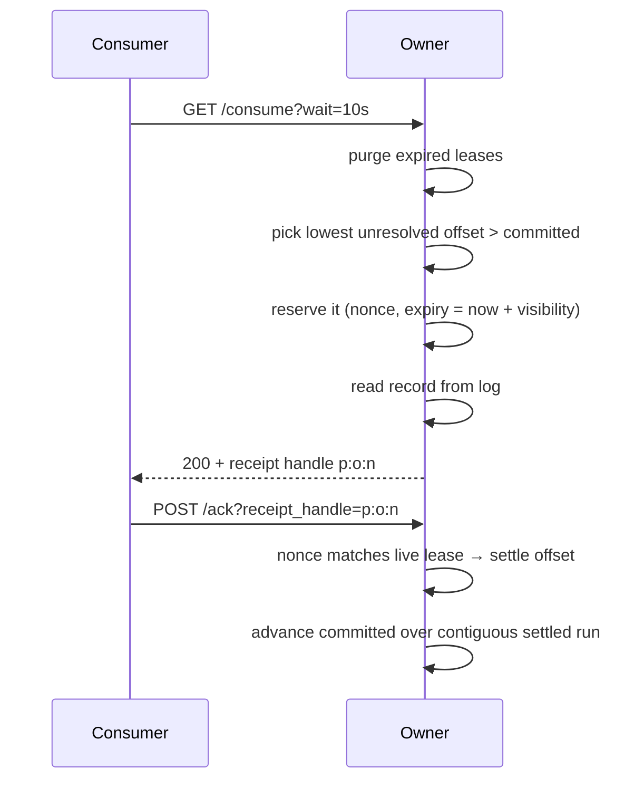
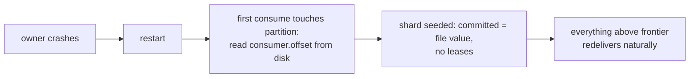

# Consume Path

Queue consumption is a leasing protocol: the owner hands each visible message to exactly one consumer at a time, remembers the lease in memory, and keeps a durable frontier of what's settled. Everything above the frontier is reconstructible; everything below it is finished forever.

## The in-flight table

Each owned partition has a shard of the **InFlight** tracker:

- **`committed`** — highest offset below which *everything* is acked. This is the only durable piece; it advances contiguously and is flushed to `consumer.offset`.
- **Reservations** — leased offsets with a **nonce** and an expiry. The receipt handle a consumer holds is `partition:offset:nonce`; the nonce is what makes a stale handle detectable.
- **`ackedAhead`** — out-of-order acks parked until the gap beneath them closes (bounded by `max_acked_ahead_per_partition`).
- The whole shard is memory-only except `committed`. A crash forgets the leases — the messages simply redeliver. That's the entire crash story for consumption.

## Reserve → deliver → settle

Details that carry the correctness:

- **Reservation before read**: an offset is claimed first, then read — two consumers can never receive the same live copy.
- **Ack validation is (offset, nonce)**: an expired-then-re-reserved offset has a new nonce, so the late original acker gets `410 Gone` instead of silently settling someone else's lease. **Extend** (heartbeat) validates the same way and re-arms the expiry; **nack** releases the lease and wakes long-pollers immediately.
- **Expiry is proactive**: a min-heap purge runs on every touch plus a background purger, so redelivery latency after a consumer death is the visibility timeout, not "whenever someone next polls."
- **Long-poll wiring**: an empty partition parks the consumer on the log's broadcast channel; new commits, lease expiries, and nacks all wake it. No polling loops server-side.
- **Corrupt records don't wedge the queue**: an offset whose frame is permanently unreadable is skipped with a counter and a loud log, recorded in the shard so the frontier can advance over it — bounded, visible loss instead of an immortal head-of-line block.

## Routing

Consume requests land on any node. Queue-style consumes prefer local partitions (cheapest), then probe remote owners over node RPC, and only then spend the client's `wait` long-polling. Replay-style consumes (`offset=` + `partition=`) route straight to that partition's owner and bypass the queue state entirely — read-only time travel within retention.

## Recovery story, end to end

The frontier file lags acks by up to ~100ms, so a crash can redeliver a few just-acked messages — duplicates, per contract. The file is read **lazily at first touch, from disk** rather than from a boot-time metastore scan: disk is ground truth for what this node settled, and it stays correct even while the node's metastore replica is still catching up.
## The numbers

| Constant | Value | Meaning |
|---|---|---|
| Offset commit cadence | 100ms | `defaultConsumerOffsetCommitInterval` — the frontier file lags acks by at most this |
| Expiry purger cadence | 1s | background sweep releasing expired leases (plus purge-on-touch) |
| Receipt handle | `partition:offset:nonce` | the nonce is a per-shard atomic counter, so handles never collide across re-reservations |
| In-flight / acked-ahead caps | per topic, default 1024 each | hit the first → consume returns 204; hit the second → ack returns 503 until the gap closes |

## Where each piece of state lives (and dies)

| State | Lives | Survives a crash? | Consequence |
|---|---|---|---|
| Reservations + nonces | shard memory | no | leases evaporate → messages redeliver. The whole crash story |
| Acked-ahead set | shard memory | no | out-of-order acks above the frontier replay as duplicates |
| Committed frontier | `consumer.offset` file (atomic temp+rename, fsynced) | yes | at most ~100ms of just-acked messages redeliver |
| Corrupt-skip set | shard memory + metrics | no* | *the skip is re-derived on re-read; the counter is the audit trail |

The asymmetry is the design: everything cheap to reconstruct is memory; the one thing that must never move backwards-then-forwards inconsistently (the frontier) is a single fsynced 8-byte file per partition.

## Ack validation, precisely

`CommitHandle` accepts an ack only if the offset has a **live reservation with the same nonce**. Expired-then-re-reserved offsets carry a new nonce → the late acker gets `410 Gone` instead of silently settling someone else's lease. Extends re-validate the same way and push a *fresh* entry into the expiry heap (the stale heap slot is skipped on pop via nonce+expiry comparison — a lease can never be evicted by its own superseded deadline).
