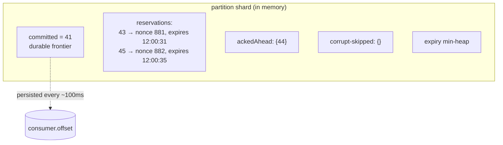
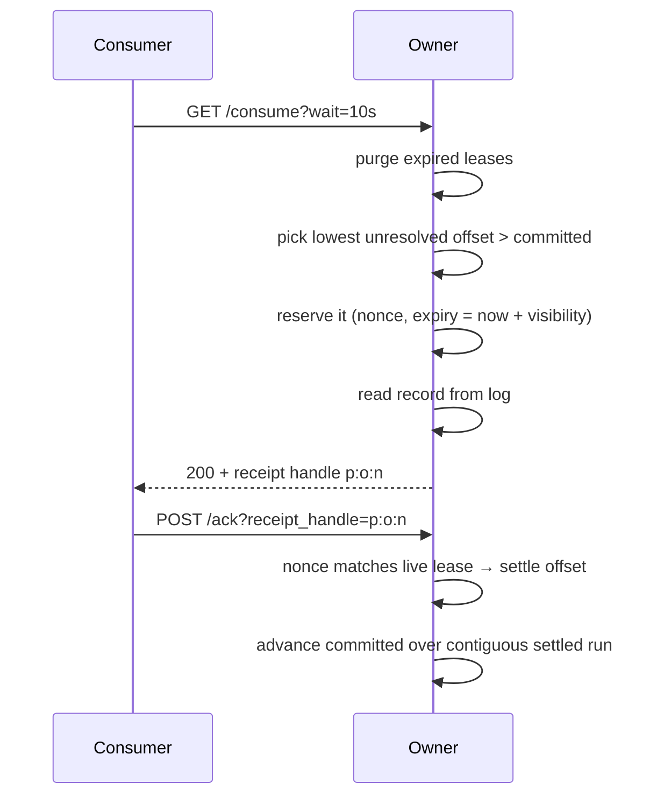
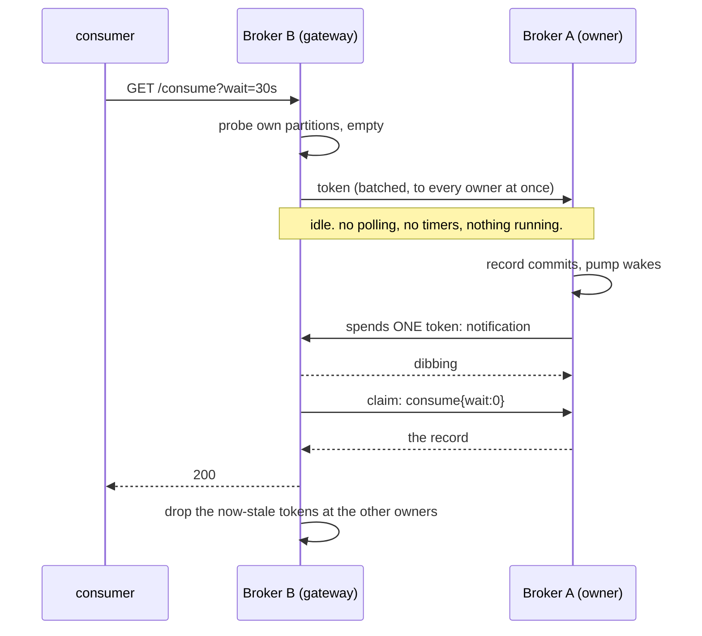
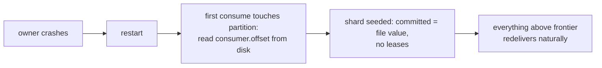

# Consume Path

Queue consumption is a leasing protocol: the owner hands each visible message to exactly one consumer at a time, remembers the lease in memory, and keeps a durable frontier of what's settled. Everything above the frontier is reconstructible; everything below it is finished forever.

## The in-flight table

Each owned partition has a shard of the **InFlight** tracker:

```mermaid
flowchart TB
    subgraph shard["partition shard (in memory)"]
        committed["committed = 41<br/>durable frontier"]
        entries["reservations:<br/>43 → nonce 881, expires 12:00:31<br/>45 → nonce 882, expires 12:00:35"]
        ahead["ackedAhead: {44}"]
        corrupt["corrupt-skipped: {}"]
        heap["expiry min-heap"]
    end
    committed -.->|"persisted every ~100ms"| file[("consumer.offset")]
```

- **`committed`**: highest offset below which *everything* is acked. This is the only durable piece; it advances contiguously and is flushed to `consumer.offset`.
- **Reservations**: leased offsets with a **nonce** and an expiry. The receipt handle a consumer holds is `partition:offset:nonce`; the nonce is what makes a stale handle detectable.
- **`ackedAhead`**: out-of-order acks parked until the gap beneath them closes (bounded by `max_acked_ahead_per_partition`).
- The whole shard is memory-only except `committed`. A crash forgets the leases; the messages simply redeliver. That's the entire crash story for consumption.

## Reserve → deliver → settle

```mermaid
sequenceDiagram
    participant C as Consumer
    participant Q as Owner
    C->>Q: GET /consume?wait=10s
    Q->>Q: purge expired leases
    Q->>Q: pick lowest unresolved offset > committed
    Q->>Q: reserve it (nonce, expiry = now + visibility)
    Q->>Q: read record from log
    Q-->>C: 200 + receipt handle p:o:n
    C->>Q: POST /ack?receipt_handle=p:o:n
    Q->>Q: nonce matches live lease → settle offset
    Q->>Q: advance committed over contiguous settled run
```

Details that carry the correctness:

- **Reservation before read**: an offset is claimed first, then read; two consumers can never receive the same live copy.
- **Ack validation is (offset, nonce)**: an expired-then-re-reserved offset has a new nonce, so the late original acker gets `410 Gone` instead of silently settling someone else's lease. **Extend** (heartbeat) validates the same way and re-arms the expiry; **nack** releases the lease and wakes long-pollers immediately.
- **Expiry is proactive**: a min-heap purge runs on every touch plus a background purger, so redelivery latency after a consumer death is the visibility timeout, not "whenever someone next polls."
- **Nobody scans and nobody races.** An empty consume does not park on a broadcast channel. It enqueues itself on the topic's waiter FIFO and blocks on one buffered channel; a single **pump** goroutine per broker does the reservation once and hands the record to exactly one waiter. The shape this replaced closed a broadcast channel on every commit, so every parked consumer woke, rebuilt a `reflect.SelectCase` slice, took the partition shard mutex and scanned, and all but one found nothing. Cost per commit now scales with *messages delivered* rather than with *consumers waiting*.
- **The pump gates on two things at once**, and is therefore woken by a change to either: a waiter arrived (enqueue kicks it), or records became available (the log's wake notifier fires on a high-watermark advance, a nack, a lease expiry, or a close). Waking on only one of them is the classic bug: a consumer that arrives *after* the data would wait for a record that has already landed.
- **Nothing is reserved speculatively.** The pump reserves only once it has taken a waiter off the queue, so there is no local give-back path at all. The single exception is explicit: a record handed over at the instant its request is cancelled has nobody to receive it, so it is released immediately rather than left invisible until its visibility timeout.
- **Idle costs nothing.** No polling, no timers; the wake notifier short-circuits on an atomic flag when a topic has no waiter, keeping the produce path allocation-free. Measured: 600 consumers parked across a four-node cluster moved idle CPU by less than the noise floor.

## Cross-node consume: the token protocol

A consumer's request lands on whichever node the load balancer picked, which usually does not own the partition its record arrives on. Narad takes partitions from Kafka and a routing-unaware client from SQS, and the cross-node gather is the interaction term of those two choices. Neither parent has it, because Kafka's client goes straight to the leader and SQS exposes no partitions at all.

The node holding the consumer leaves a **token** with every remote owner of the topic:

```mermaid
sequenceDiagram
    participant c as consumer
    participant B as Broker B (gateway)
    participant A as Broker A (owner)
    c->>B: GET /consume?wait=30s
    B->>B: probe own partitions, empty
    B->>A: token (batched, to every owner at once)
    Note over B,A: idle. no polling, no timers, nothing running.
    A->>A: record commits, pump wakes
    A->>B: spends ONE token: notification
    B-->>A: dibbing
    B->>A: claim: consume{wait:0}
    A-->>B: the record
    B-->>c: 200
    B->>B: drop the now-stale tokens at the other owners
```

The properties that make it work:

- **A token reserves nothing.** It says only "I am here, tell me if records show up". That is what removes the whole give-back problem: an owner that never hears back from a peer has stranded no record, because it never took one out of circulation. Only the *claim* reserves, and it is aimed at exactly one node.
- **One token, one record, one peer told.** Never a broadcast. An `outstanding` counter gates notifications against the available-record estimate, so the same record is never promised to two peers; a peer that declines (`pass`) retires its claim at once and the record is offered to the next holder a round trip later, rather than after a deadline.
- **Tokens are single use and connection scoped.** Firing one consumes it, so a stale token costs exactly one notification rather than one per record for its whole life. They die with the peer's connection, which is why crash recovery for this subsystem is *do nothing*: a restarting node rebuilds them by registering again.
- **Registration doubles as a read.** The first contact with an owner is the ordinary non-blocking consume probe carrying a token: give me a record if you have one, and remember me if you don't. A cold start therefore costs no extra round trip, and a broker restarting with a backlog needs no recovery scan: the next consumer to ask drains it.
- **TTLs travel as durations, never deadlines.** The sender subtracts on its own clock and the receiver adds on its own, so skew between two nodes can never expire a live consumer's token early. Same reasoning that keeps `LastHeartbeat` on the leader's clock.
- **Retirement is free.** When a consumer is served, the tokens it left with the *other* owners are stale. They are dropped in the next batched frame already going to those peers, rather than paying a cancel RPC per stale token on every delivery.

Three delivery speeds fall out of this, and which one applies depends only on whether the consumer arrived before or after the data:

| | when |
|---|---|
| **0 round trips** | the record is on a partition this node owns |
| **1 round trip** | the data was already there when the consumer asked, so the probe returns it inline |
| **2 round trips** | the consumer waited, then data arrived: notify, then claim |

Under load the first two dominate: a busy topic rarely empties, so the notification path is taken only on the empty-to-non-empty edge. Busy topics use the pump *less* than quiet ones.

- **Retention outran the consumer**: when the reserved offset is below the oldest retained offset, the frontier jumps to the oldest retained offset in one step (logged, persisted) instead of skipping one missing offset per request.
- **Receipt-handle nonces** are drawn from a per-partition random stream, not a counter, so a handle cannot be forged by a principal that did not receive the message.
- **Corrupt records don't wedge the queue**: an offset whose frame is permanently unreadable is skipped with a counter and a loud log, recorded in the shard so the frontier can advance over it: bounded, visible loss instead of an immortal head-of-line block.

## Routing

Consume requests land on any node. Queue-style consumes prefer local partitions (cheapest), then probe every remote owner once over node RPC, and only then spend the client's `wait`, parked on the local waiter queue and on tokens left with the owners rather than polling anything. Replay-style consumes (`offset=` + `partition=`) route straight to that partition's owner and bypass the queue state entirely: read-only time travel within retention.

## Recovery story, end to end

```mermaid
flowchart LR
    CRASH[owner crashes] --> BOOT[restart]
    BOOT --> LAZY["first consume touches partition:<br/>read consumer.offset from disk"]
    LAZY --> SEED["shard seeded: committed = file value,<br/>no leases"]
    SEED --> REDELIVER["everything above frontier<br/>redelivers naturally"]
```

The frontier file lags acks by up to ~100ms, so a crash can redeliver a few just-acked messages: duplicates, per contract. The file is read **lazily at first touch, from disk** rather than from a boot-time metastore scan: disk is ground truth for what this node settled, and it stays correct even while the node's metastore replica is still catching up.
## The numbers

| Constant | Value | Meaning |
|---|---|---|
| Offset commit cadence | 100ms | `defaultConsumerOffsetCommitInterval`: the frontier file lags acks by at most this |
| Expiry purger cadence | 1s | background sweep releasing expired leases (plus purge-on-touch) |
| Receipt handle | `partition:offset:nonce` | the nonce is a per-shard atomic counter, so handles never collide across re-reservations |
| In-flight / acked-ahead caps | per topic, default 1024 each | hit the first → consume returns 204; hit the second → consume hands out only the frontier hole (204 otherwise) until the gap closes. Acks for messages already handed out are always accepted, so the set is bounded by the sum of the two caps |

## Where each piece of state lives (and dies)

| State | Lives | Survives a crash? | Consequence |
|---|---|---|---|
| Reservations + nonces | shard memory | no | leases evaporate → messages redeliver. The whole crash story |
| Acked-ahead set | shard memory | no | out-of-order acks above the frontier replay as duplicates |
| Committed frontier | `consumer.offset` file (8 bytes overwritten in place, fdatasynced) | yes | at most ~100ms of just-acked messages redeliver |
| Corrupt-skip set | shard memory + metrics | no* | *the skip is re-derived on re-read; the counter is the audit trail |

The asymmetry is the design: everything cheap to reconstruct is memory; the one thing that must never move backwards-then-forwards inconsistently (the frontier) is a single fsynced 8-byte file per partition.

## Ack validation, precisely

`CommitHandle` accepts an ack only if the offset has a **live reservation with the same nonce**. Expired-then-re-reserved offsets carry a new nonce → the late acker gets `410 Gone` instead of silently settling someone else's lease. Extends re-validate the same way and push a *fresh* entry into the expiry heap (the stale heap slot is skipped on pop via nonce+expiry comparison; a lease can never be evicted by its own superseded deadline).
