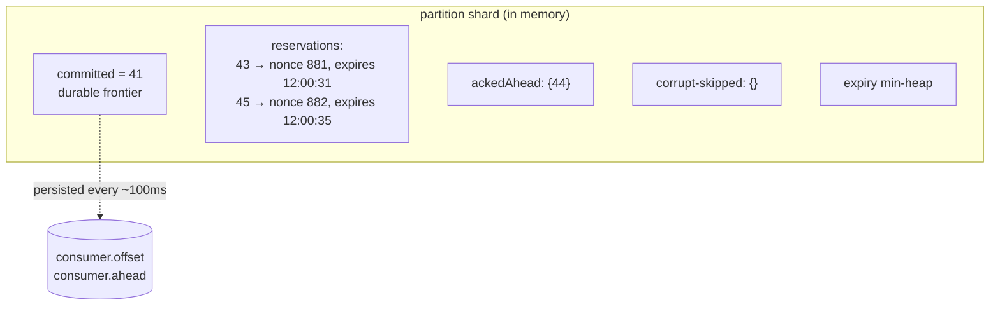
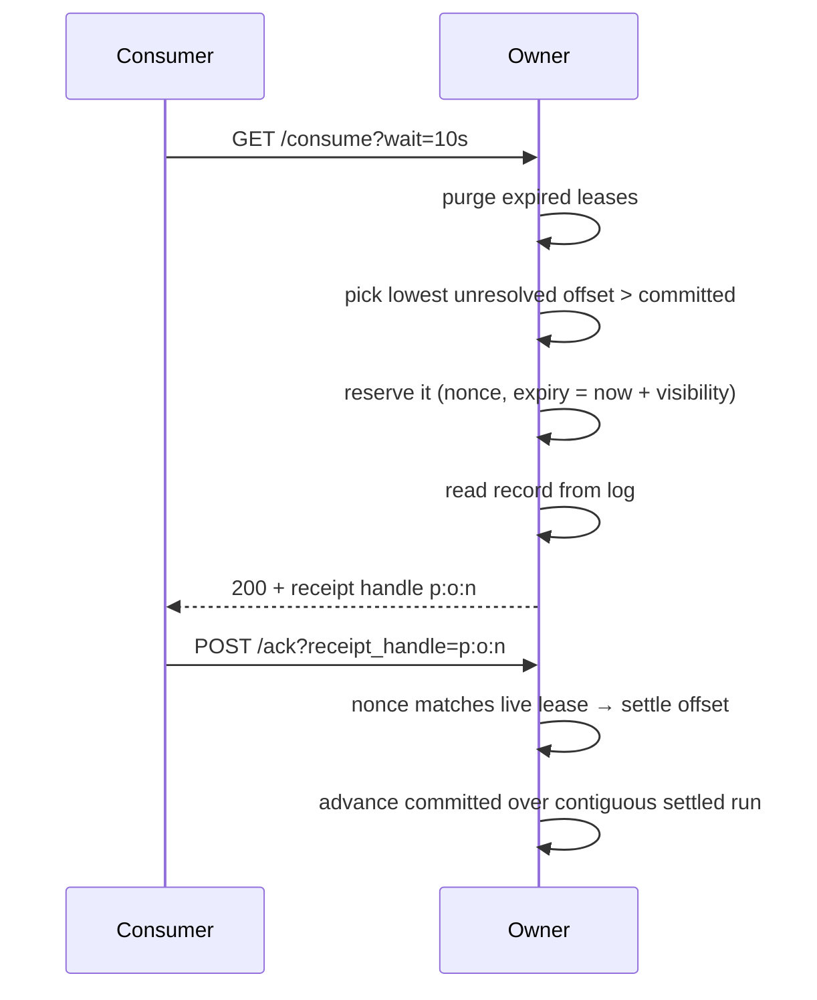
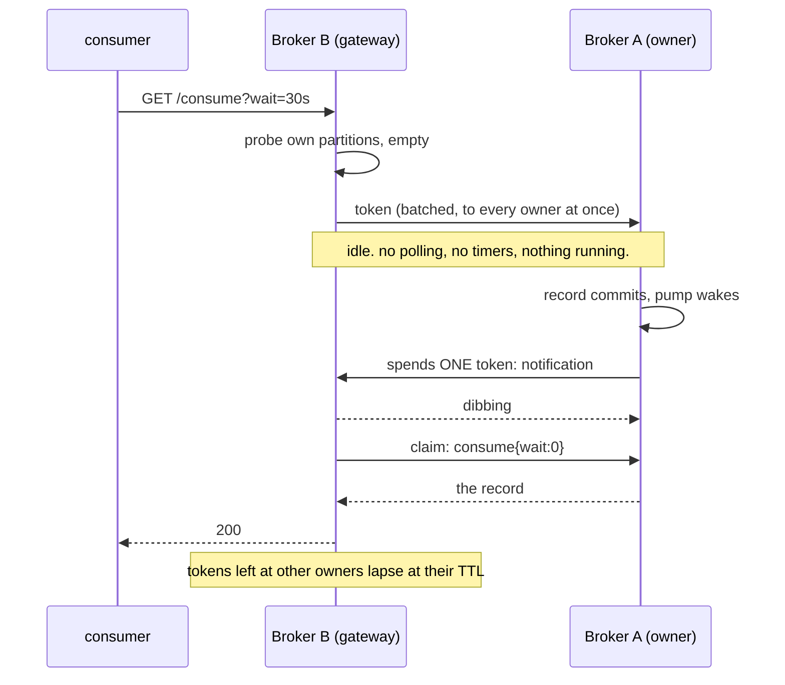
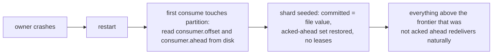

# Consume Path

Queue consumption is a leasing protocol: the owner hands each visible message to exactly one consumer at a time, remembers the lease in memory, and keeps a durable frontier of what's settled. Everything above the frontier is reconstructible; everything below it is finished forever.

## The in-flight table

Each owned partition has a shard of the **InFlight** tracker:

```mermaid
flowchart TB
    subgraph shard["partition shard (in memory)"]
        committed["committed = 41<br/>durable frontier"]
        entries["reservations:<br/>43 → nonce 881, expires 12:00:31<br/>45 → nonce 882, expires 12:00:35"]
        ahead["ackedAhead: {44}"]
        corrupt["corrupt-skipped: {}"]
        heap["expiry min-heap"]
    end
    committed -.->|"persisted every ~100ms"| file[("consumer.offset<br/>consumer.ahead")]
```

- **`committed`**: highest offset below which *everything* is acked. It advances contiguously and is made durable through `consumer.offset`, or through the frontier field of `consumer.ahead` when that file is written in the same commit; recovery takes the larger of the two.
- **Reservations**: leased offsets with a **nonce** and an expiry. The receipt handle a consumer holds is `partition:offset:nonce`; the nonce is what makes a stale handle detectable.
- **`ackedAhead`**: out-of-order acks parked until the gap beneath them closes (bounded by `max_acked_ahead_per_partition`), persisted in `consumer.ahead`.
- The whole shard is memory-only except `committed` and the acked-ahead set. A crash forgets the leases; the messages simply redeliver. That's the entire crash story for consumption.

## Reserve → deliver → settle

```mermaid
sequenceDiagram
    participant C as Consumer
    participant Q as Owner
    C->>Q: GET /consume?wait=10s
    Q->>Q: purge expired leases
    Q->>Q: pick lowest unresolved offset > committed
    Q->>Q: reserve it (nonce, expiry = now + visibility)
    Q->>Q: read record from log
    Q-->>C: 200 + receipt handle p:o:n
    C->>Q: POST /ack?receipt_handle=p:o:n
    Q->>Q: nonce matches live lease → settle offset
    Q->>Q: advance committed over contiguous settled run
```

Details that carry the correctness:

- **Reservation before read**: an offset is claimed first, then read; two consumers can never receive the same live copy.
- **Ack validation is (offset, nonce)**: an expired-then-re-reserved offset has a new nonce, so the late original acker gets `410 Gone` instead of silently settling someone else's lease. **Extend** (heartbeat) validates the same way and re-arms the expiry; **nack** releases the lease and wakes long-pollers immediately.
- **Expiry is proactive**: a min-heap purge runs on every touch plus a background purger, so redelivery latency after a consumer death is the visibility timeout, not "whenever someone next polls."
- **Nobody scans and nobody races.** An empty consume does not park on a broadcast channel. It enqueues itself on the topic's waiter FIFO and blocks on one buffered channel; a single **pump** goroutine per broker does the reservation once and hands the record to exactly one waiter. The shape this replaced closed a broadcast channel on every commit, so every parked consumer woke, rebuilt a `reflect.SelectCase` slice, took the partition shard mutex and scanned, and all but one found nothing. Cost per commit now scales with *messages delivered* rather than with *consumers waiting*.
- **The pump gates on two things at once**, and is therefore woken by a change to either: a waiter arrived (enqueue kicks it), or records became available (the log's wake notifier fires on a high-watermark advance, a nack, a lease expiry, or a close). Waking on only one of them is the classic bug: a consumer that arrives *after* the data would wait for a record that has already landed. The same holds while the pump holds a waiter it popped: the topic can then look waiter-less to the wake notifier (the flag in the last bullet below), which drops a wake that arrives meanwhile, so a pump that puts its waiter back and finds the flag cleared runs again.
- **Nothing is reserved speculatively.** The pump reserves only once it has taken a waiter off the queue, so there is no local give-back path at all. The single exception is explicit: a record handed over at the instant its request is cancelled has nobody to receive it, so it is released immediately rather than left invisible until its visibility timeout.
- **Idle costs nothing.** No polling, no timers; the wake notifier short-circuits on an atomic flag when a topic has no waiter, keeping the produce path allocation-free. Measured: 600 consumers parked across a four-node cluster moved idle CPU by less than the noise floor. A deleted topic's queue state is dropped along with its other per-topic caches, so churning through uniquely named topics leaves nothing behind.

## Cross-node consume: the token protocol

A consumer's request lands on whichever node the load balancer picked, which usually does not own the partition its record arrives on. Narad takes partitions from Kafka and a routing-unaware client from SQS, and the cross-node gather is the interaction term of those two choices. Neither parent has it, because Kafka's client goes straight to the leader and SQS exposes no partitions at all.

The node holding the consumer leaves a **token** with every remote owner of the topic:

```mermaid
sequenceDiagram
    participant c as consumer
    participant B as Broker B (gateway)
    participant A as Broker A (owner)
    c->>B: GET /consume?wait=30s
    B->>B: probe own partitions, empty
    B->>A: token (batched, to every owner at once)
    Note over B,A: idle. no polling, no timers, nothing running.
    A->>A: record commits, pump wakes
    A->>B: spends ONE token: notification
    B-->>A: dibbing
    B->>A: claim: consume{wait:0}
    A-->>B: the record
    B-->>c: 200
    Note over B: tokens left at other owners lapse at their TTL
```

The properties that make it work:

- **A token reserves nothing.** It says only "I am here, tell me if records show up". That is what removes the whole give-back problem: an owner that never hears back from a peer has stranded no record, because it never took one out of circulation. Only the *claim* reserves, and it is aimed at exactly one node.
- **One token, one record, one peer told.** Never a broadcast. An `outstanding` counter gates notifications against the available-record estimate (high-watermark minus the ack frontier, minus records in flight or acked ahead of a gap; for a partition with no queue state loaded yet, the frontier and acked-ahead set come from `consumer.offset` and `consumer.ahead`, read the way recovery reads them), so the same record is never promised to two peers; a peer that declines (`pass`) retires its claim at once and the record is offered to the next holder a round trip later, rather than after a deadline.
- **A hold lives exactly as long as the claim is in flight.** Between the notification and the claim the owner holds the record back so the pump cannot promise it to a second peer. The claim carries a `Claim` flag on the wire, and the owner retires the hold the moment a flagged claim arrives; a plain probe is never a claim, so it can never release a hold promised to someone else. A claim that never comes (the consumer left, or lost the race) falls back to a deadline. When every hold ran to that deadline, it was counted against the *next* record too, so a consumer parked on another node saw each message of a sparse stream arrive about a second late. The flag is a trailing optional field: an owner on a release before it answers `400`, the claimant retries that owner as a plain probe (which reserves the record just the same; only the hold keeps its deadline behaviour) and remembers it for two minutes, so a rolling upgrade costs one refused claim per old owner per TTL rather than one per record.
- **Tokens are single use and short-lived.** Firing one consumes it, so a stale token costs exactly one notification rather than one per record for its whole life. Each carries a TTL the requester sizes to its consumer's remaining wait (plus the 250 ms share window below), so a peer that dies leaves nothing behind for longer than one wait budget, and crash recovery for this subsystem is *do nothing*: a restarting node rebuilds them by registering again.
- **One token per (requesting node, topic), shared by every consumer parked there.** An owner replaces the token on re-registration rather than stacking them, so a node with many consumers parked on one topic gets one notification per registration. The requester therefore tracks its registration per owner. A notification spends that owner's token, so the requester forgets its registration there at once, and the keeper puts a fresh one back within 500 ms if anyone is still parked (it checks every 500 ms that each owner of a topic with parked consumers holds a live token from this node, and re-sends each registration after at most 5 s regardless). Consumers that park within 250 ms of a registration share it instead of sending their own, unless its TTL ends before their deadline; the window is short because an owner's reply only says the frame arrived, not that the token is still held. A consumer woken by a notification it cannot use (it was served locally, or its budget ran out, at that instant) passes the wake to the next consumer parked on the node, which claims the record the owner is holding for it.
- **The probe comes first, registration second.** A consumer asks every remote owner for a record with an ordinary non-blocking probe, and only registers tokens with them once those probes come back empty. Registration is a separate batched frame rather than a field on the probe, so a cold start does cost one extra round trip per owner beyond the probe. What it buys is that a broker restarting with a backlog needs no recovery scan: the next consumer to register drains it, because registering marks the topic and wakes the owner's pump.
- **TTLs travel as durations, never deadlines.** The sender subtracts on its own clock and the receiver adds on its own, so skew between two nodes can never expire a live consumer's token early. Same reasoning that keeps `LastHeartbeat` on the leader's clock.
- **Tokens lapse; nothing retires them.** When the last consumer parked on a node is served, the tokens it left with the *other* owners are stale. They are left to expire at their TTL: a stale token costs at most one notification, answered `pass`, where retiring it cost a frame to every owner each time the parked count touched zero, and the next consumer to park had to register all over again. Owners still accept the drop frames older peers send.

Three delivery speeds fall out of this, and which one applies depends only on whether the consumer arrived before or after the data:

| | when |
|---|---|
| **0 round trips** | the record is on a partition this node owns |
| **1 round trip** | the data was already there when the consumer asked, so the probe returns it inline |
| **2 round trips** | the consumer waited, then data arrived: notify, then claim |

Under load the first two dominate: a busy topic rarely empties, so the notification path is taken only on the empty-to-non-empty edge. Busy topics use the pump *less* than quiet ones.

- **Retention outran the consumer**: when the reserved offset is below the oldest retained offset, the frontier jumps to the oldest retained offset in one step (logged, persisted) instead of skipping one missing offset per request. Two consumes can reach the same gap at once; the one that loses the race finds its reservation already dropped and simply reserves again above the new frontier, where it used to answer `410` to a consumer that never held a receipt handle.
- **Receipt-handle nonces** are drawn from a per-partition random stream, not a counter, so a handle cannot be forged by a principal that did not receive the message.
- **Corrupt records don't wedge the queue**: an offset whose frame is permanently unreadable is skipped with a counter and a loud log, recorded in the shard so the frontier can advance over it: bounded, visible loss instead of an immortal head-of-line block.

## Routing

Consume requests land on any node. Queue-style consumes prefer local partitions (cheapest), then probe every remote owner once over node RPC, and only then spend the client's `wait`, parked on the local waiter queue and on tokens left with the owners rather than polling anything. A long-poll on a topic whose partitions are not assigned yet (created a moment ago, or the first seconds of a cold cluster) or whose owners are all down no longer answers `204` at once, which turned every looping consumer into a busy poll: it holds the request for its `wait`, checks the route table every 50 ms, and once owners appear probes them and parks on what is left of the budget (a partition that became local answers `204`, so the next poll takes the local path with its full wait). Such held long-polls count against `http.max_consume_in_flight_per_identity` like any other. Replay-style consumes (`offset=` + `partition=`) route straight to that partition's owner and bypass the queue state entirely: read-only time travel within retention, and not counted in `narad_messages_consumed_total`.

A partition-pinned long-poll (`partition=N&wait=...`) parks on a FIFO of its own, one per partition, rather than on the topic's shared queue. The pump stops a FIFO at the first waiter it cannot serve, which is right only when every waiter in it scans the same partitions; a pinned waiter at the head of the shared queue used to stall every unpinned waiter behind it for as long as its one partition stayed empty. Pinned FIFOs are pumped first, since a pinned consumer can only ever take from its own partition. Whatever a waiter parked with, the pump resolves the partitions to scan afresh on every attempt, so a partition this node gained after the consumer parked is served to it and one that moved away is never reopened here.

A node that owns none of the topic's partitions (a pure gateway) parks its consumers on tokens too: its only wake is an owner's notification, and as a safety net for a lost notification or a token an owner silently dropped (a restart, a lagging assignment view) it re-probes every owner once every 2 s of the wait. It falls back to re-probing the owners on a backoff (100 ms doubling to 1 s) in two cases: an owner of the topic refused a registration within the last 2 minutes (a node on an older release during a rolling upgrade, whose tokens would be discarded), or this node has no advertised address for owners to call back.

A batch consume (`max=N`, see [Consuming](../client/consuming.md#consuming-in-batches)) takes up to N records in one non-blocking scan of this node's partitions, each reserved exactly as a single consume reserves it, with its own nonce, lease and place under its partition's in-flight cap. The scan starts where a single consume's would and stays on a partition until it runs dry or reaches its in-flight cap, so a batch takes a partition's backlog in offset order rather than one record from each. Only when the scan finds nothing does the request fall back on the single-record path above (the remote owners, then the wait and the tokens) for one record, which it tops up with a second local scan. Remote owners are never asked for more than one record, so a batch through a node that owns none of the topic's partitions carries at most one.

## Recovery story, end to end

```mermaid
flowchart LR
    CRASH[owner crashes] --> BOOT[restart]
    BOOT --> LAZY["first consume touches partition:<br/>read consumer.offset and consumer.ahead from disk"]
    LAZY --> SEED["shard seeded: committed = file value,<br/>acked-ahead set restored, no leases"]
    SEED --> REDELIVER["everything above the frontier that was<br/>not acked ahead redelivers naturally"]
```

Both files lag acks by about one `storage.consumer_offset_commit_interval_ms` (100ms by default; longer when a commit takes longer than the interval, since the next one waits for it), so a crash can redeliver the messages acked in that window: duplicates, per contract. A graceful shutdown persists everything and brings `consumer.offset` level with `consumer.ahead`, so a rolling restart redelivers nothing that was acked. Recovery reads both files and takes the larger frontier, as does a partition transfer; every reader of the persisted frontier must, because while acks arrive out of order the newest frontier after a crash may be only in `consumer.ahead`. Both files are read **lazily at first touch, from disk** rather than from a boot-time metastore scan: disk is ground truth for what this node settled, and it stays correct even while the node's metastore replica is still catching up.
## After an outage: why a partition can go quiet

The frontier is one watermark per partition, so the lowest unacked
offset decides when anything above it can be reclaimed. An outage
strands leases, and a stranded lease sits exactly there: the consumer
that took it is gone, the offsets above it were acked out of order into
the acked-ahead set, and `ReserveNext` correctly reports
`all_reserved` because every offset in the window is either in flight or
resolved. The partition serves nothing until the lease lapses, then
serves the whole run at once.

The quiet window is one visibility timeout, and consumers see `204`
through it. It is arithmetic, not a stall: shrinking the visibility
timeout shrinks it one for one. `tests/cluster/crash_drain_test.go`
pins the property that matters underneath it, which is that nothing is
lost while this happens.

## The numbers

| Constant | Value | Meaning |
|---|---|---|
| Offset commit cadence | 100ms | `storage.consumer_offset_commit_interval_ms` (10 to 60000): the frontier and acked-ahead files lag acks by about this. Each partition that changed costs one data sync per commit: `consumer.ahead` when its set changed (the record carries the frontier), else `consumer.offset` |
| Expiry purger cadence | 1s | background sweep releasing expired leases (plus purge-on-touch) |
| Receipt handle | `partition:offset:nonce` | the nonce is drawn from a per-shard random stream (ChaCha8), so handles never collide across re-reservations and cannot be guessed |
| In-flight / acked-ahead caps | per topic, default 1024 each | hit the first → consume returns 204; hit the second → consume hands out only the frontier hole (204 otherwise) until the gap closes. Acks for messages already handed out are always accepted, so the set is bounded by the sum of the two caps |

## Where each piece of state lives (and dies)

| State | Lives | Survives a crash? | Consequence |
|---|---|---|---|
| Reservations + nonces | shard memory | no | leases evaporate → messages redeliver. The whole crash story |
| Acked-ahead set | shard memory + `consumer.ahead` file (two 4 KiB slots overwritten alternately in place, checksummed, fdatasynced; each record also carries the frontier) | yes | about one commit interval of out-of-order acks redeliver; a set too large for a slot keeps its lowest offsets and the tail redelivers |
| Committed frontier | `consumer.offset` file (8 bytes overwritten in place, fdatasynced), or `consumer.ahead` when that was written in the same commit | yes | about one commit interval of just-acked messages redeliver. `consumer.offset` is written only when `consumer.ahead` did not already carry the frontier, so after a crash the newest frontier may live only there; after a graceful stop `consumer.offset` alone is exact. Neither file's frontier ever moves backwards |
| Corrupt-skip set | shard memory + metrics | no* | *the skip is re-derived on re-read; the counter is the audit trail |

The asymmetry is the design: everything cheap to reconstruct is memory; the one thing that must never move backwards-then-forwards inconsistently (the frontier) is fsynced in place per partition, in the 8-byte `consumer.offset` or in the `consumer.ahead` record that carries it.

## Ack validation, precisely

`CommitHandle` accepts an ack only if the offset has a **live reservation with the same nonce**. Expired-then-re-reserved offsets carry a new nonce → the late acker gets `410 Gone` instead of silently settling someone else's lease. Extends re-validate the same way and push a *fresh* entry into the expiry heap (the stale heap slot is skipped on pop via nonce+expiry comparison; a lease can never be evicted by its own superseded deadline).

## Forwarded acks: one RPC per owner under load

An ack, extend or nack for a partition another node owns is forwarded to the owner on the ack lane with a 2 s budget. At the throughput ceiling most cluster RPCs are acks, one per consumed message, and each was a request frame, a reply frame, a server goroutine and a handler slot for a few bytes of bookkeeping. So the router coalesces them per owner, the way Nagle's algorithm does with a few packets allowed in flight:

- While fewer than 4 ack RPCs to an owner are in flight, an ack goes out at once, on its own, as the same `Ack`, `ExtendAck` or `Nack` op as ever. At low load nothing changes.
- When all 4 are busy, further acks for that owner queue, and the queue leaves as one `AckBatch` RPC the moment a slot frees: up to 64 records, a bigger pile forming several batches that leave one per freed slot, and a queue of one leaving as a plain single op. Batches therefore form exactly when acks to one owner overlap, and grow with how much they overlap.
- The 2 s budget covers the wait for a slot as well as the round trip, so a queued ack is answered no later than a single one would be, and an ack whose client gives up before its batch leaves is taken out of it.
- The owner applies an `AckBatch` under one handler slot, record by record in order, and answers each record on its own with the status and message the single op would have answered; a batch whose requester gave up while it waited for the slot is answered `503` unapplied, as a single ack is. Each HTTP ack therefore gets exactly the response its own RPC would have produced: the bare `204`, or the owner's error. Acks are idempotent by nonce, so sharing an RPC changes nothing about what they do.
- An owner on a release before `AckBatch` answers it `400` (`unsupported rpc operation`). Its queued records are then sent one at a time on what is left of their budgets, and it gets single ops only for the next 2 minutes, after which a batch is tried again.

A client's [batch ack](../client/consuming.md#acking-in-batches) uses the same op directly: its handles are grouped by owner, and each owner gets one `AckBatch` (or single ops, for a group of one or an owner on an older release), the owners in parallel, each on the 2 s budget. A handle whose owner is down is answered `503` without an RPC, and a transport failure answers `502` for that owner's handles only. Handles this node owns are applied locally.
