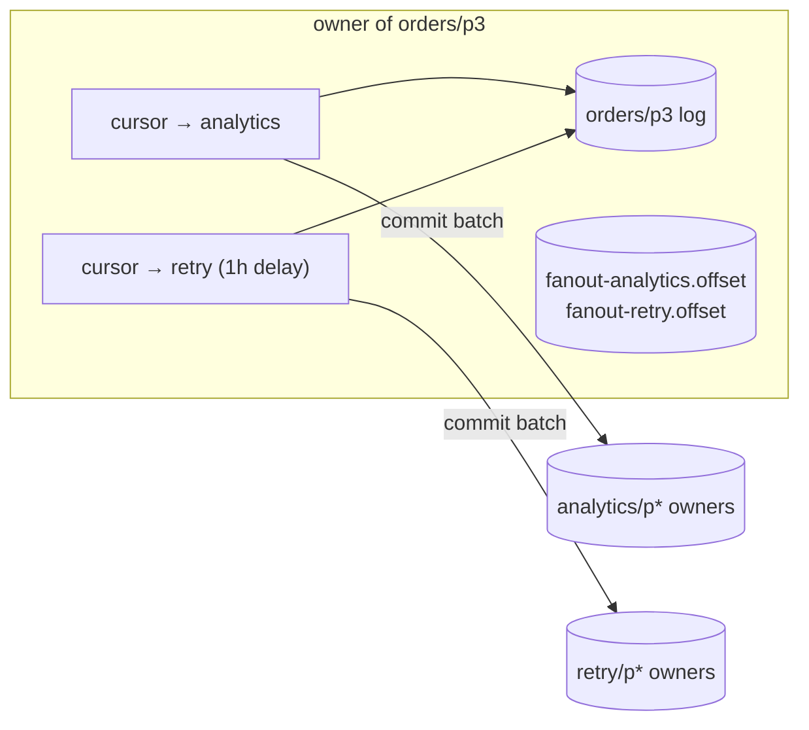
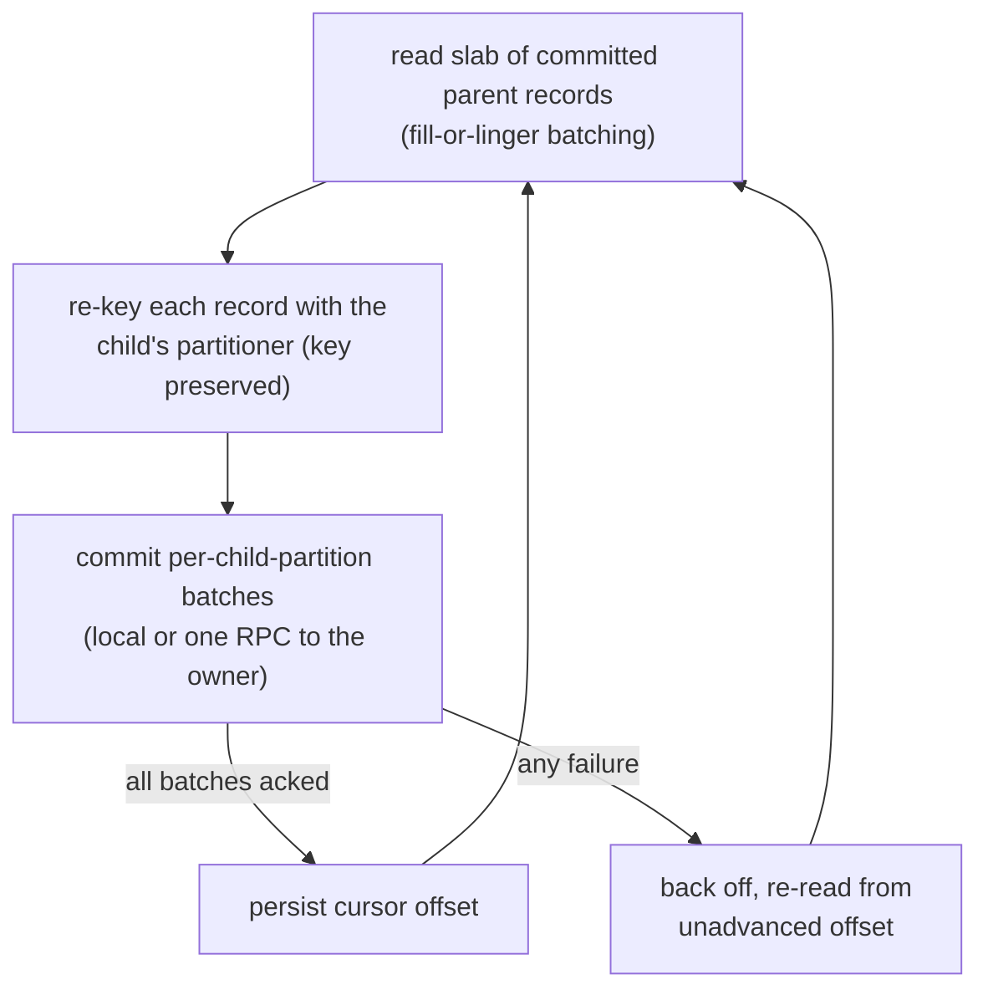
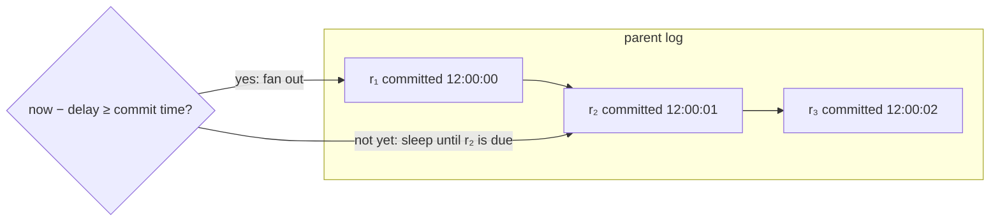

# Fan-out Engine

Fan-out looks like magic from outside — attach a child, copies appear — but it's a deliberately boring machine: **per-partition cursors tailing the parent's committed log**, with durable positions and an at-least-once commit protocol. No double-publish from producers, no broker-side subscriptions; just log readers that never lose their place.

## Where the work runs

For each (parent partition × child), one **cursor goroutine** runs on the node that *owns that parent partition* — so slab reads are always local disk, and the cursor's durable state lives in the same directory (same durability domain) as the log it tails:

A reconciler on every node diffs *desired cursors* (from the metastore: links × owned partitions) against *running cursors* once a second — cursors spawn on attach, stop on detach/delete/ownership change.

## The cursor loop: commit-before-advance

The invariant is the whole guarantee: **the cursor's durable offset only advances past records whose child commits were acknowledged** (and child commits are the same fsync-and-verify as any produce). A crash mid-flight re-commits the last slab — duplicates into the child, never a gap.

## Attach epochs: why re-attach never replays

Each attachment gets a fresh **epoch** ID, stamped into the cursor's offset file. Detach + re-attach must start from the parent's *current tail* (the client contract says "no backfill"), so a cursor that finds an offset file from a *different epoch* refuses to resume it. Epochs turn "is this my state?" from a guess into an equality check.

Tail-anchoring — the act of skipping to the tail and overwriting the offset file — is the engine's only destructive move, and chaos testing showed a stale metastore replica can fabricate exactly the epoch mismatch that triggers it. So an anchor now requires the **Raft leader to confirm the epoch** (with the barrier rule for self-leaders); anything unconfirmed defers, and the reconciler retries a second later. Cursor offset files get the same protection before deletion. The incident that forced this is told in [Cluster Lifecycle](cluster-lifecycle.md).

## The delay gate

A delay child's cursor adds one filter: **only read records whose parent commit time is ≤ now − delay.**

Because commit times are **monotonic per partition** (assigned under the partition lock — a [storage-engine](storage-engine.md) property), the first not-yet-due record proves everything behind it isn't due either. So an idle delay cursor is O(1): peek the head, sleep until its due time (capped so gauges stay fresh). No timer wheels, no scan-the-backlog polling — a million pending delayed messages cost the same as one.

Delivery is therefore *never early* (the gate is checked against the owner's clock at read time) and usually lands within a second of due (long-poll wakeups + the linger window).

## Edge behaviors

- **Drop-behind**: if a cursor falls behind the parent's *retention* (child down for days), aged-out offsets are skipped and counted on an explicit loss metric — bounded, alarmed loss instead of a wedged parent. The retention floor (`≥ delay + 1h` for delay children) makes this unreachable in sane configs.
- **Dead child-partition owner**: fan-out never reroutes to a sibling child partition (unlike produce, a cursor can afford to wait — rerouting would scatter a key's records across child partitions for no availability gain); the cursor stalls on that bucket and retries until the owner returns.
- **Lag observability**: `fanout_lag_messages` (parent HWM − cursor) is the health signal for normal children; `fanout_due_lag_seconds` (how far behind the *due frontier*) is the one for delay children — raw offset lag on a delay child is permanently ≈ rate × delay *by design*.
