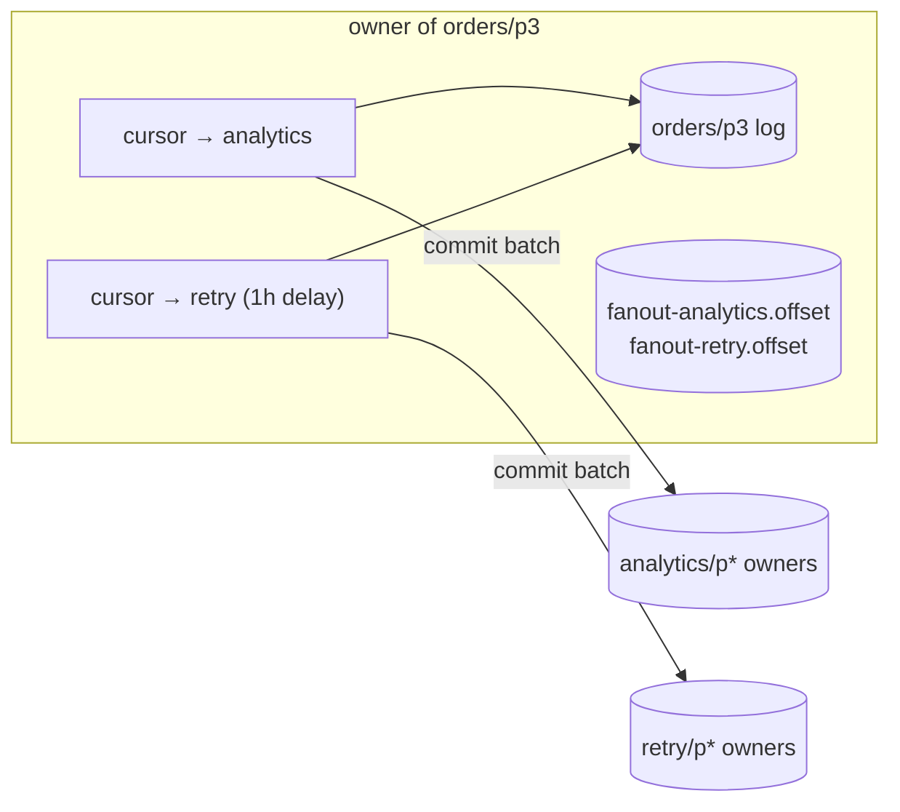
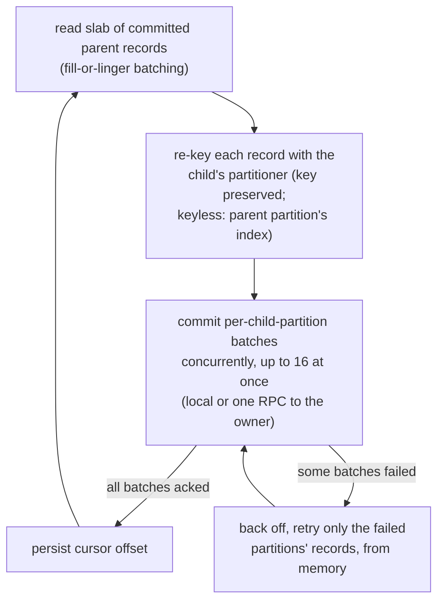
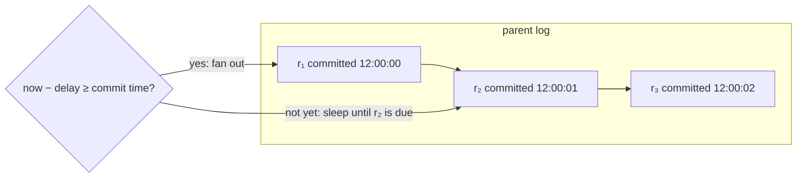

# Fan-out Engine

Fan-out looks like magic from outside (attach a child, copies appear), but it's a deliberately boring machine: **per-partition cursors tailing the parent's committed log**, with durable positions and an at-least-once commit protocol. No double-publish from producers, no broker-side subscriptions; just log readers that never lose their place.

## Where the work runs

For each (parent partition × child), one **cursor goroutine** runs on the node that *owns that parent partition*, so slab reads are always local disk, and the cursor's durable state lives in the same directory (same durability domain) as the log it tails:


```mermaid
flowchart LR
    subgraph owner["owner of orders/p3"]
        LOG[("orders/p3 log")]
        CUR1["cursor → analytics"] --> LOG
        CUR2["cursor → retry (1h delay)"] --> LOG
        OFF[("fanout-analytics.offset<br/>fanout-retry.offset")]
    end
    CUR1 -->|"commit batch"| A[("analytics/p* owners")]
    CUR2 -->|"commit batch"| R[("retry/p* owners")]
```

A reconciler on every node diffs *desired cursors* (from the metastore: links × owned partitions) against *running cursors* once a second: cursors spawn on attach, stop on detach/delete/ownership change. The diff decodes every topic record, so a tick skips it while none of the replica's topic, assignment, schema, user or routing-member versions has moved since the last full pass (`LatestDomainVersion`; member heartbeats and drain flags do not count). A full pass still runs after a pass that failed or left work behind (a cancelled cursor still draining, ownership it could not read), after any cursor exits, on the first tick after the replica caught up again, on every orphan-sweep tick, and at least every 30 s. Measured over 12-partition topics with no links or moves, one tick of this reconciler and the [move runner](rebalance.md) together takes about 91% less time than a full pass every second (at 5,000 topics, 29.5 ms to 2.8 ms, the orphan sweep's share included), and an attach or detach is still picked up on the next tick.

## The cursor loop: commit-before-advance


```mermaid
flowchart TD
    READ["read slab of committed parent records<br/>(fill-or-linger batching)"] --> REKEY["re-key each record with the<br/>child's partitioner (key preserved;<br/>keyless: parent partition's index)"]
    REKEY --> COMMIT["commit per-child-partition batches<br/>concurrently, up to 16 at once<br/>(local or one RPC to the owner)"]
    COMMIT -->|all batches acked| PERSIST["persist cursor offset"]
    PERSIST --> READ
    COMMIT -->|some batches failed| RETRY["back off, retry only the failed<br/>partitions' records, from memory"] --> COMMIT
```

The invariant is the whole guarantee: **the cursor's durable offset only advances past records whose child commits were acknowledged** (and child commits are the same fsync-and-verify as any produce). A crash mid-flight re-commits the last slab: duplicates into the child, never a gap.

The records are bucketed per child partition with a counting sort, so each bucket keeps slab order (and per-key order with it). When some buckets fail, the cursor keeps only the failed partitions' records in memory, copied off the parent log so a long outage does not pin its read buffers, and retries just those after the backoff: partitions that committed are not sent again. Each retry re-checks the link's attach epoch and re-buckets the records under the child's current partition count. It never re-reads the slab; re-reading is what used to send the whole slab again, duplicates into the healthy partitions included, on every retry. A keyless record has no key to hash. When the child has the parent's partition count it keeps its parent partition's index (`keylessKeepsIndex`): child partition p is placed away from the owner of parent partition p, so this is what keeps a keyless record's two copies on different nodes in a replica child, the way the key's hash does for a keyed record, and it keeps the parent partition's keyless records in order. The parent's partition count is read once per pass, and only for a slab that holds a keyless record. When the counts differ, the child's partitioner places keyless records round-robin (per child topic), afresh on each retry.

## Attach epochs: why re-attach never replays

Each attachment gets a fresh **epoch** ID, stamped into the cursor's offset file. Detach + re-attach must start from the new attach's *attach point* (the client contract says "no backfill"), so a cursor that finds an offset file from a *different epoch* refuses to resume it. Epochs turn "is this my state?" from a guess into an equality check.

Anchoring (the act of skipping to a starting offset and overwriting the offset file) is the engine's only destructive move, and chaos testing showed a stale metastore replica can fabricate exactly the epoch mismatch that triggers it. So an anchor requires the **Raft leader to confirm the epoch** (with the barrier rule for self-leaders); anything unconfirmed defers, and the reconciler retries a second later. Cursor offset files get the same protection before deletion. The incident that forced this is told in [Cluster Lifecycle](cluster-lifecycle.md).

## The attach point: where a fresh cursor starts

"From the attach forward" needs a definition of *the attach*, per parent partition, or the cursor invents one. The first version anchored at the parent's tail **as of the cursor's first read**, which is not the attach: the cursor spawns one reconcile interval plus a leader round trip after the attach committed, and everything committed in between was silently skipped. A partition added by a partition-count increase was worse: producers hash to it within milliseconds of assignment, its cursor spawned a second later and tail-anchored past all of it, although a brand-new partition has no pre-attach history to skip.

So the attach records its own point. While the attach is being proposed, the proposing node's fan-out runner asks every parent partition owner for its committed high watermark (a local read, or one stats RPC per remote partition, in parallel) and the answer travels inside the Raft attach command into the child's record as `attach_offsets` (index = parent partition). A cursor with no offset file for its epoch then starts:

| Record | Partition | Start |
|---|---|---|
| has `attach_offsets` | index within the slice | the recorded offset, exactly |
| has `attach_offsets` | index beyond the slice (added after the attach) | 0 |
| no `attach_offsets` (attached before this existed) | any | the live tail at first read (the older behaviour; detach and re-attach to upgrade) |

If any owner cannot be asked, the attach fails with `503` and leaves no link; a guessed offset would either skip records or backfill history, and an attach is cheap to retry. Records committed while the attach is in flight (between the tail reads and the Raft commit) sit at or past the recorded offsets and are delivered: the attach point is "the tail observed while processing the attach", never later.

The same rule decides a *lost* cursor file: with the attach point recorded, a cursor that finds no file replays from that point (duplicates, bounded by the parent's retention through drop-behind) instead of tail-anchoring past whatever it had not yet delivered. At-least-once, in the direction the contract promises.

## The delay gate

A delay child's cursor adds one filter: **only read records whose parent commit time is ≤ now − delay.**


```mermaid
flowchart LR
    subgraph parent log
        r1["r₁ committed 12:00:00"] --> r2["r₂ committed 12:00:01"] --> r3["r₃ committed 12:00:02"]
    end
    GATE{"now − delay ≥ commit time?"} -->|"yes: fan out"| r1
    GATE -->|"not yet: sleep until r₂ is due"| r2
```

Because commit times **never decrease along a partition** (stamped just before the commit takes the partition's produce lock and raised under it to the newest time the partition has committed, a [storage-engine](storage-engine.md) property), the first not-yet-due record proves everything behind it isn't due either. The floor lives in the committing process, so it starts over after a restart: a wall-clock step back across a restart can still leave a small inversion, which holds due records back by at most the size of the step. So an idle delay cursor is O(1): peek the head, sleep until its due time (capped so gauges stay fresh). No timer wheels, no scan-the-backlog polling: a million pending delayed messages cost the same as one.

Delivery is therefore *never early on the reading clock* (the gate is checked against the parent partition owner's clock at read time) and usually lands within a second of due (long-poll wakeups + the linger window).

**Two clocks after a move.** `committed_at` is stamped by whichever node committed the record (`produce_commit.go`), while the gate compares it against the clock of the node that *owns the parent partition now*. Those are the same node until the partition moves (rebalance, decommission). After a move, records the old owner stamped are gated by the new owner's clock, so their delivery is early or late by exactly the inter-node skew, in either direction. There is no cheap fix: the reader cannot know what the committing node's clock reads now, and clamping the gate to the newest commit time it has seen would only trade "late on the new owner's clock" for "early on the old owner's", not remove the skew. Under NTP the skew is milliseconds against delays measured in minutes or hours; the guarantee to quote is "never early on the clock of the node currently owning the parent partition", and the way to keep that meaningful is to keep the cluster's clocks synchronised.

## Edge behaviors

- **Drop-behind**: if a cursor falls behind the parent's *retention* (child down for days), aged-out offsets are skipped and counted on an explicit loss metric: bounded, alarmed loss instead of a wedged parent. The retention floor (`≥ delay + 1h` for delay children) makes this unreachable in sane configs.
- **Dead child-partition owner**: fan-out never reroutes to a sibling child partition (unlike produce, a cursor can afford to wait; rerouting would scatter a key's records across child partitions for no availability gain); the cursor stalls on that bucket and retries until the owner returns. A keyless record stalls the same way when it keeps its parent partition's index (the child has the parent's partition count): moving it to a sibling would put its copy wherever that sibling lives, possibly beside the parent copy. In a child with a different partition count, each retry places keyless records round-robin again, so they can land in a healthy partition. Only that partition's records are retried; the child partitions that committed are not sent the slab again on every retry cycle, as they were when a failure meant re-reading the whole slab. The held records (at most one slab, `fanout.max_batch_bytes`, 4 MiB by default, per cursor) stay in memory until the owner returns, so records that age out of the parent's retention during the outage but were already read are still delivered rather than counted as drop-behind.
- **Lag observability**: `fanout_lag_messages` (parent HWM − cursor) is the health signal for normal children; `fanout_due_lag_seconds` (how far behind the *due frontier*) is the one for delay children; raw offset lag on a delay child is permanently ≈ rate × delay *by design*.
- **Describing is free**: the children listing (`GET /v1/topics/{parent}/children`) and the topic describe (`GET /v1/topics/{topic}`) never open a partition log. An open log is read through the non-stamping `Peek`; a closed one is described from its directory (segment files plus the durable high-watermark file, exact for a cleanly closed log). Only `Get` stamps a log's last access, so a monitoring loop cannot keep idle parents warm and idle eviction still fires. Remote partitions' stats are fetched from their owners concurrently (16 in flight), not one round trip at a time.
## The numbers

| Constant | Value |
|---|---|
| Reconcile interval (desired vs running cursors) | 1s, a tick skipping its pass while metadata is unchanged; a full pass at least every 30s (`reconcileForcedPassEvery`) |
| Slab long-poll / retry backoff | 1s / 1s |
| Child-partition commits in flight per slab | 16 |
| Batch caps | 4,096 records / 4 MiB (`fanout.max_batch_records/bytes`) |
| Linger to fatten a partial batch | 25ms |
| Delay cursor max sleep (metadata freshness bound) | 30s (`defaultFanoutDueWakeCap`) |
| Orphan cursor-file sweep | every 30th caught-up reconcile tick, skipped ticks included (a sweep tick always runs a full pass) |
| Max children per parent / max delay | 108 / 1 year |
| Retention floor for a delay child's parent | delay + 1h (`topic.MinRetentionMs`) |
| Attach epoch | 8 random bytes, hex (e.g. `67953471cc57a32a`) |

## The cursor's durable state, in full

One JSON file per (parent partition, child), living next to the log it indexes:

```
topics/orders/p00003/fanout-analytics.offset
{"crc":"5e9303c4","epoch":"67953471cc57a32a","next_offset":98332}
```

That's the entire recovery story: epoch says *which attachment* this position belongs to; `next_offset` says where to resume. The record is padded with spaces and a newline to a fixed 256 bytes, and advanced in place (one write at offset 0 and one `fdatasync`) only after the batch below it is committed to the child (commit-before-advance). `crc` is a CRC-32C over everything after it, padding included: a reader that catches the writer mid-copy (a move listing the file, the cursor stats handler) or a record torn by a crash would otherwise parse a splice of two offsets as a valid cursor ahead of the true position. Readers re-read a record that fails the check a few times before calling it corrupt, which takes the existing corrupt-cursor path. The atomic temp+rename (plus a directory fsync) is kept for the first anchor, for replacing a file in the older variable-length format, and for an epoch too long to pad. Older binaries parse the new record (they ignore the `crc` field and the padding), and the new one reads and migrates the old format. The starting point of a cursor that has no file yet lives in the metastore, in the child's record (`attach_epoch` plus `attach_offsets`). Everything else (running goroutines, batches in flight, lag gauges) is disposable.

## Reading a slab: fill-or-linger

`readBatch` long-polls the parent for up to 1s (the records it returns alias the parent log's decoded frames rather than being copied, since the child commit copies them anyway), then tops up until the batch hits 4,096 records / 4 MiB or a 25ms linger expires, so a busy parent produces fat child commits (one fsync each on the child side) while a trickling parent still ships within ~25ms. For a delay child, every read carries `MaxCommittedAt = now − delay`; the reader stops at the first undue record and reports *when* it becomes due, which is what lets the cursor sleep instead of spin.
