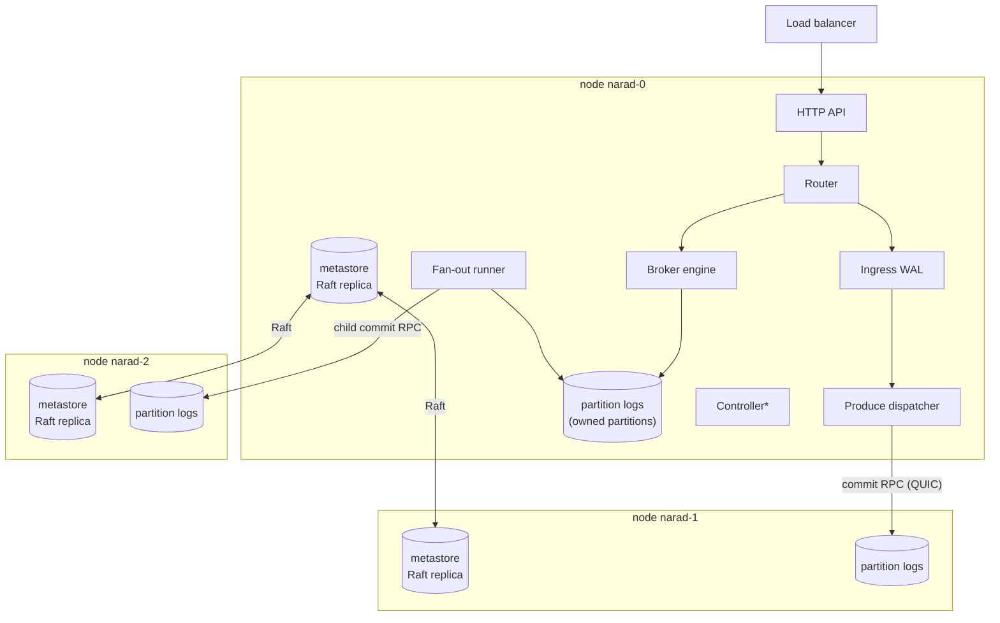
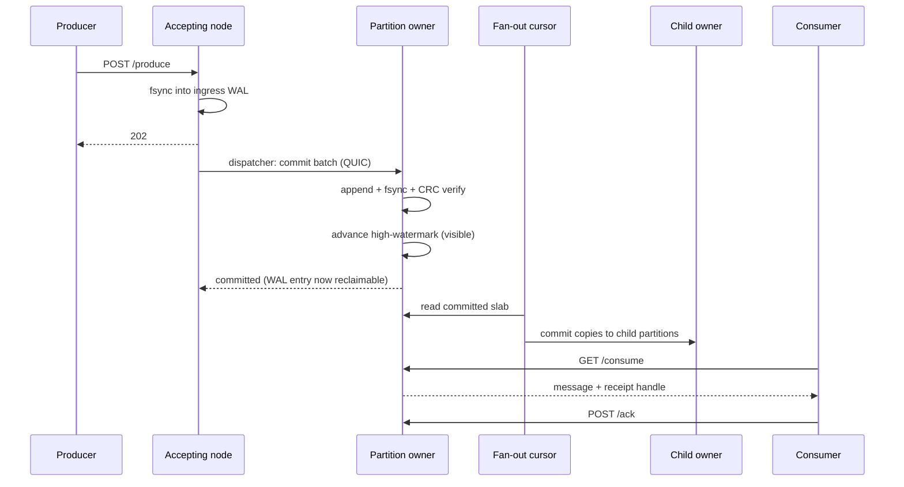

# Architecture

This section is for people who want to know how Narad actually works. Start here for the map; each subsystem then gets its own deep dive.

## The whole system on one page

Every Narad node runs the same binary with the same components. Nodes differ only in *which data they own* and *whether they currently lead Raft*.

*\*The controller runs only on the Raft leader.*

## The five big ideas

**1. Any node accepts anything; ownership decides where data lives.**
Clients talk to any node through the load balancer. Each *partition* has exactly one **owner** node whose disk holds its data. The router forwards requests it can't serve locally over QUIC node RPC. See [Networking](networking-and-security.md).

**2. Produce is WAL-first.**
A produce is fsynced into the receiving node's **ingress WAL** and acked `202` immediately. A background **dispatcher** then moves it to the partition owner and commits it durably. The client's latency is one local fsync; cross-node delivery is asynchronous and retried forever. See [Produce Path](produce-path.md).

**3. Metadata is Raft; data is single-owner.**
Topics, users, assignments, and fan-out links live in a Raft-replicated **metastore** (every node has a full replica; one leader). Message data is deliberately *not* replicated — one owner, one copy, fsync-verified. See [Metastore & Raft](metastore-and-raft.md) and the durability discussion in the [Client Guide](../client/guarantees-and-errors.md).

**4. Consume is a queue with leases.**
Consumers reserve one message at a time; a reservation is a **visibility window** tracked in the owner's memory with a durable committed frontier behind it. Acks advance the frontier; crashes just mean redelivery. See [Consume Path](consume-path.md).

**5. Fan-out is log-tailing, not double-publish.**
A child topic is fed by a **cursor** on each parent partition's owner that reads committed parent records in bulk and commits them to the child — with its own durable position, so no parent message is ever skipped or double-fanned (beyond at-least-once retries). Delay children add a due-time gate on that same cursor. See [Fan-out Engine](fanout-engine.md).

## Lifecycle of one message, end to end

## Design temperament

Two principles show up in every subsystem, learned the hard way under chaos testing:

- **Destruction requires leader confirmation.** No node ever deletes data — topic directories, cursor files, WAL records — based only on its local view, because a freshly restarted replica can be arbitrarily stale while believing it is current. Every deletion path confirms with the Raft leader first, and a node that *is* the leader must pass a Raft barrier before trusting itself.
- **Every failure mode keeps data.** When a check can't complete — no leader, peer unreachable, barrier failed — the answer is always "keep it and retry later," never "assume it's fine."

The full war stories are in [Cluster Lifecycle](cluster-lifecycle.md).
