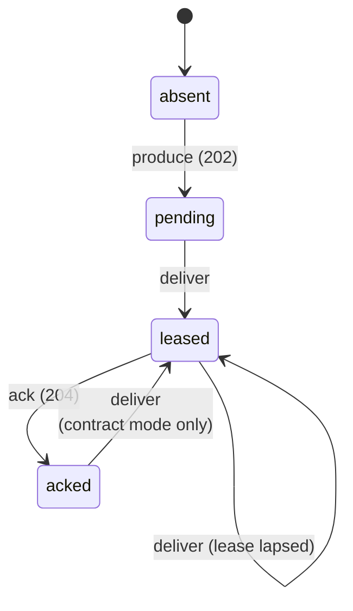

# Checking the Delivery Contract

Narad's test suites answer "did anything break". This one answers a
harder question: **is every anomaly accounted for?**

The distinction matters because Narad promises at-least-once. A message
that comes back after it was acked is *permitted*, so a counter that
reports one has not told you anything actionable. What you need to know
is whether it came back because a broker was being killed or partitioned
at that moment, or for no reason anyone has written down. The first is
the contract working. The second is a bug that has not been found yet.

A nightly job runs a three-node cluster under load, kills and partitions
nodes underneath it, records every client operation with the interval it
was in flight for, and checks the resulting history against a sequential
specification of the contract. **An unexplained anomaly fails the run.**

## Running it

```bash
./scripts/linearizability-nightly.sh --duration 180 --drain 150
```

It builds the broker, the load driver and the checker, starts three
nodes on loopback, injects faults, and prints a verdict. Useful flags:

| Flag | What it does |
|---|---|
| `--no-faults` | A clean baseline run with nothing broken |
| `--strict` | Fail on *any* post-ack redelivery, not just unexplained ones |
| `--no-partition-faults` | Kills only |
| `--out DIR` | Where to leave the history, the faults, and the verdict |
| `--grace D` | Override how long a fault's after-effects are attributed to it |
| `--min-operations N` | Report `UNKNOWN` rather than `OK` below this much evidence |

Partition faults need `iptables` and passwordless `sudo`. Without them
the script says so and injects kills only, which is the normal case on a
developer laptop and on macOS.

To check a history you already have:

```bash
go run ./tests/linearizability --history history.jsonl --faults faults.jsonl
```

## What gets recorded

The load driver writes a JSONL history when given `--history`. One line
per operation, with the interval it was in flight for:

```json
{"op":"produce","msg":"run/orders/0001","path":"orders","call":1726,"ret":1741,"status":202,"outcome":"ok"}
{"op":"deliver","msg":"run/orders/0001","path":"orders","call":1802,"ret":1809,"status":200,"outcome":"ok"}
{"op":"ack","msg":"run/orders/0001","path":"orders","call":1810,"ret":1817,"status":204,"outcome":"ok"}
```

The fault injector writes its windows to a second file, merged at check
time. Timestamps are wall-clock nanoseconds because two processes have
to interleave records on one scale.

Empty polls are not recorded. A consume that returned nothing is not an
operation on any message, and recording every one of them is what made
an earlier version of this history grow by hundreds of megabytes an
hour.

The history is the evidence, not a by-product. It is published as a CI
artifact for thirty days, which is what lets a verdict be re-derived
later under a stricter model, or disputed, without repeating the run.

## The model

The unit is a **(message, path)** pair, not a message. A message
produced to a topic with fan-out children is a separate delivery
obligation on the parent and on every child, and they succeed or fail
independently. Partitioning on that pair is also what keeps the check
cheap: each partition holds a handful of operations rather than the
whole run.

The run **declares** its topology in the history's first record: for
each topic, the paths a message produced to it is expected to arrive on.
Declaring it rather than inferring it from the deliveries that happened
is what lets a delivery on any other path be reported as the misroute it
is. Inference cannot do that, because a leaked delivery would define its
own path as legal simply by occurring, and the leak would surface as an
ordinary looking backlog on the real topic. A history with no declared
topology is still checked, with that weakening and with nothing reported
as misrouted.

Each partition is a small state machine:



Operations the client cannot interpret are **dropped before they reach
the model** rather than guessed at, and this is what keeps the checker
free of false positives:

| Situation | Treatment |
|---|---|
| Produce returned `202` | The broker holds it |
| Produce returned `429` or `503` | The broker refused it. Delivering it later is a violation |
| Produce request errored | Ambiguous. It *may* exist, so a later delivery is legal and a missing one is not counted as loss |
| Ack returned `204` | The lease was live and the message is done |
| Ack returned `410` | Excluded. A lapsed lease and an ack whose response was lost are indistinguishable |
| Ack request errored | Excluded. It may or may not have landed |

[Porcupine](https://github.com/anishathalye/porcupine) searches for a
valid ordering of each partition. That search is what makes a verdict
trustworthy under concurrency: operations that overlap in real time may
be ordered any way, so a finding only stands when *no* ordering explains
the history.

## Verdicts

| Verdict | Meaning | Exit |
|---|---|---|
| `OK` | Every partition linearized, and every post-ack redelivery sat inside a fault window | 0 |
| `OVERDUE` | No safety problem; messages were still undelivered or unacked when the run ended. Liveness, not a broken promise | 0 |
| `ANOMALY` | A message was provably redelivered after a confirmed ack with no fault to account for it | 1 |
| `VIOLATION` | A partition admits no valid ordering at all | 1 |
| `UNKNOWN` | The search did not finish in time, or too few operations were recorded for a clean result to mean anything | 1 |

A `VIOLATION` also covers a **misroute**: a message handed to a consumer
polling a topic it was never produced to. The report names the leak.

`UNKNOWN` on too little evidence matters more than it sounds. An empty
history linearizes perfectly, so without a floor a driver that died on
its first request would report "every partition linearized" and exit
zero. The nightly sets the floor from its own expected volume.

On a `VIOLATION` the checker writes Porcupine's interactive
visualization next to the history, and names the first partition that
could not linearize.

## Redelivery after an ack

This is the case the whole tool is built around, so it is worth stating
exactly when it is expected.

Acks are persisted in batches, every 100ms by default. A broker that
dies with a batch still in memory comes back having forgotten those
acks, and redelivers those messages. A partition moving to a new owner
can do the same for acks that landed during the copy. Both are
documented in [Guarantees](../client/guarantees-and-errors.md) and both
are the direct cost of not paying for a synchronous ack write per
message.

So the checker does not ask whether redelivery happened. It asks whether
each one sat inside a **fault window**: from the moment a fault began
until it ended, plus a grace period. The grace defaults to the run's
visibility timeout plus twenty seconds, because a broker that restarts
only releases the leases it was holding when they expire, up to one
visibility timeout later.

Choosing that grace is a real trade-off and worth understanding before
trusting a green run. Too short and honest redeliveries look like
anomalies. Too long and a genuine bug hides inside a fault's shadow.
Override it with `--grace` when a run's timing calls for it.

There is a sharper version of the same problem. If faults arrive closer
together than the grace period, each window's grace swallows the next
window's start, the windows merge into one unbroken interval, and
"explained by a fault" quietly degrades into "happened at all during the
fault phase". So the injector spaces faults further apart than the
grace, and **the report prints what fraction of the run sat inside a
fault window**. Read that number before trusting a green result: the
check discriminates in the time the windows do not cover.

The **steady state** leg of the nightly is the sharper claim. It injects
no faults at all and runs under `--strict`, where any post-ack
redelivery fails. That is what asserts a healthy Narad never redelivers
an acked message: not "rarely", and not "within tolerance".

## What this does not catch

A check is only worth what its limits are honest about.

- **Double leases are invisible.** The model has no clock, so "the lease expired" is not something it can observe, and a redelivery is always legal from the leased state. Two consumers holding the same message *at the same time* is a genuine fault this model accepts. The driver counts those separately as `dupBeforeAck`.
- **A redelivery overlapping its ack proves nothing.** Only a delivery that began strictly after an ack returned is counted, because anything else has an ordering where the broker handed the message out before the ack landed.
- **Ordering is not checked**, because Narad does not promise it. See [Guarantees](../client/guarantees-and-errors.md).
- **A history with no declared topology cannot report misroutes.** Everything the driver writes declares one; a hand-made history need not, and then paths are inferred and a cross-topic leak reads as a backlog rather than a violation.
- **Explained is not the same as caused.** A redelivery inside a fault window is attributed to that fault on timing alone. Nothing proves the fault caused it, only that something was broken at the time.
- **One host, one clock.** Three brokers on loopback is not three machines on a network, and wall-clock timestamps assume the clock does not step. Records that return before they were called are clamped and counted in the report.
- **A green run is evidence, not proof.** It says this workload, on this hardware, for these minutes, under these faults, produced nothing unexplained.

## Layout

| Path | What it is |
|---|---|
| `tests/linearizability/` | The checker: model, analysis, report |
| `tests/linearizability/history/` | The history format, shared with the driver |
| `tests/integration/` | The load driver that records histories |
| `scripts/linearizability-nightly.sh` | Cluster, faults, and check in one run |
| `.github/workflows/linearizability.yml` | The nightly job |
