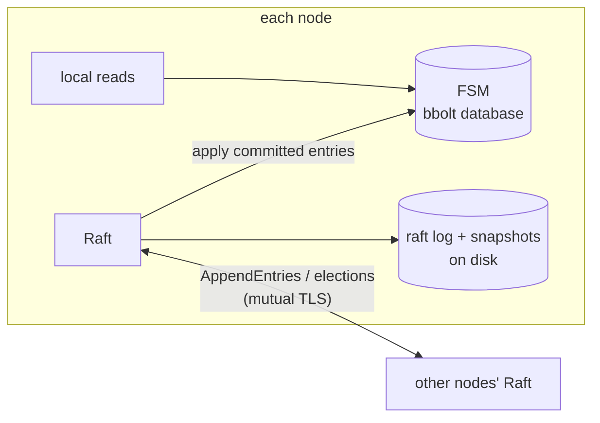
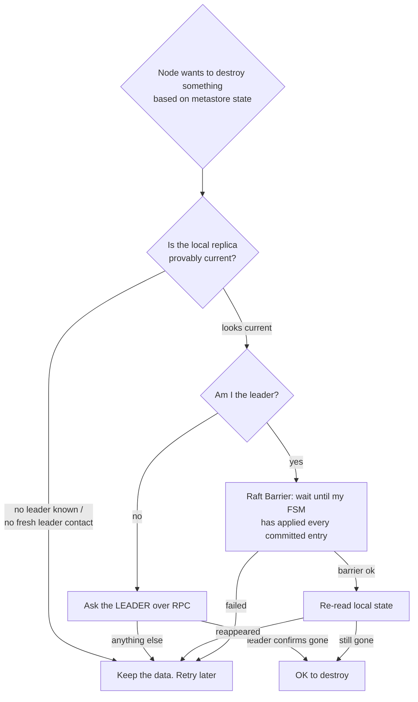

# Metastore & Raft

The metastore is Narad's brain: a Raft-replicated state machine holding everything that isn't message payloads — topics, partition assignments, cluster members, users and grants, schemas, and fan-out links.

## Shape

- **Writes** (create topic, register member, attach child…) are Raft commands: forwarded to the leader, committed by quorum, then applied to every node's FSM. Each command family bumps a per-domain **version counter**, so caches (topic lookups on the hot path) invalidate precisely.
- **Reads** are local: every node answers topic lookups from its own bbolt replica, no network hop. This is what makes request routing fast — and it's also the sharpest knife in the system (below).
- The FSM persists in **bbolt**; Raft keeps its log in boltdb and periodic **snapshots** on disk. A restarting node restores FSM state from the latest snapshot, then replays the log tail.

## What lives in it

| Domain | Contents |
|---|---|
| Topics | name, partitions, retention, visibility, caps, schema, role (parent/child), fan-out links + attach epochs + delay |
| Assignments | partition → owner node, sticky |
| Members | node ID, addresses, heartbeat, alive/dead |
| Users | usernames, bcrypt hashes, grants |
| Cluster | Raft voter configuration (managed by Raft itself) |

## The stale-replica problem — the most important idea on this page

Local reads are fast because they trust the local replica. But **a freshly restarted node's replica is restored from a snapshot that can be hours old**, and until catch-up finishes, that node sees a past world: topics that were deleted still exist; topics created since don't. The node has no local way to know it's stale — its own bookkeeping says "everything I know is applied."

Chaos testing proved this isn't theoretical: four distinct data-loss bugs came from code trusting a stale local view (details in [Cluster Lifecycle](cluster-lifecycle.md)). The defenses are now systematic:

Three primitives implement this:

- **`AppliedCaughtUp`** — "does this node have a leader, has it heard from it *recently*, and has it applied everything it knows to be committed?" The recency requirement matters: right after a snapshot restore, a node's local indexes trivially agree with each other while being hours stale. Only fresh leader contact makes the comparison meaningful.
- **Leader confirmation RPC** — before deleting a topic directory, discarding a WAL record, or resetting a fan-out cursor, the node asks the leader "does this still exist?" Only a definitive "no" authorizes destruction.
- **`Barrier`** — the subtle one. *Winning an election proves a node's Raft **log** is complete — not that its FSM has applied it.* A just-elected leader restored from an old snapshot legally serves stale reads while replay finishes. So "I am the leader, my state is authority" is only valid after `raft.Barrier()` blocks until the FSM is fully applied — and the state must be re-read *after* the barrier.

## Leadership and the controller

The Raft leader doubles as the **cluster controller**: it assigns partitions of new topics (round-robin over live members — except fan-out children, whose partition p deliberately walks past the owner of the parent's partition p via `metastore.ChildAwareOwner`, so a replica child's copy never shares a disk with the original), marks members dead when heartbeats lapse (30s), and seeds the root admin. Leadership transfer on graceful shutdown makes planned restarts nearly seamless (~150ms failover); crash failover takes an election timeout (~1s).

Assignments are **sticky**: a dead node's partitions are *not* reassigned, because the data lives only on that node's disk. The cluster waits for the node (and its volume) to come back. The produce path works around dead owners in the meantime — see [Produce Path](produce-path.md).
## The concrete bits

| Thing | Value |
|---|---|
| FSM store | bbolt, buckets: `topics`, `schemas`, `assignments`, `members`, `users` |
| Raft log store | boltdb (`raft.db`); snapshots: file store, **2 retained** |
| Heartbeat / dead marking | every 5s / after 30s silence |
| `AppliedCaughtUp` contact freshness | leader contact within 5s (followers) |
| `Barrier` timeout | 5s |
| Startup reconcile wait for caught-up | up to 60s, then the destructive sweep is skipped (never rushed) |

Every write is one `command` envelope — an op byte plus a JSON payload — applied identically on every node's FSM. Op families bump per-domain **version counters** (topics version, members version, …) that the hot paths use as cache keys: a produce checks its cached topic record against the topic version in one atomic load instead of a bbolt read per message.

## Boot order is load-bearing

`cmd/narad/serve.go` reads like a checklist because it is one: metastore first, then the broker, then the **create gate is armed** (topic creates block on every transport) *before* the QUIC listener starts — so the startup orphan sweep can never race a peer-forwarded create into deleting a directory it just missed. The gate opens when startup reconcile finishes; `/readyz` flips only after that. The comments in that file explain each ordering constraint inline, and they mean it.
