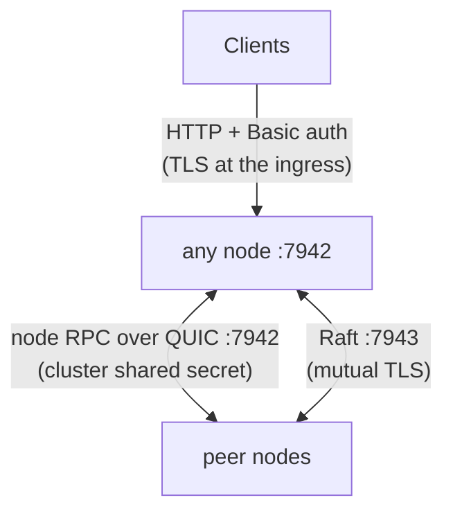
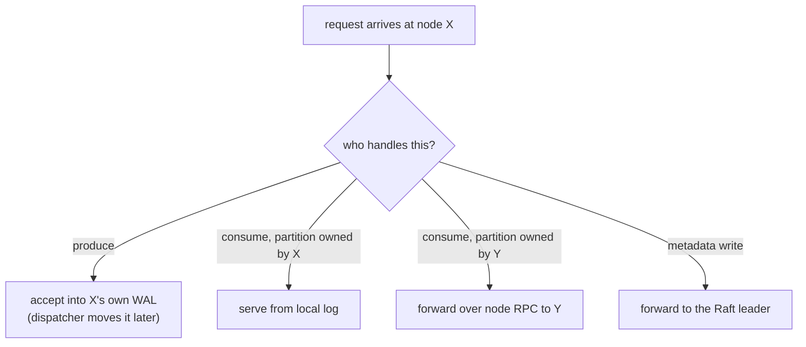

# Networking & Security

Two planes, one port each: clients speak **HTTP** to any node; nodes speak a compact **RPC protocol over QUIC** to each other. Raft has its own TCP transport with mutual TLS.

## The HTTP plane

Everything a client does is plain HTTP under `/v1` (topics CRUD, produce/consume/ack, children, users) plus unauthenticated `/healthz`, `/readyz`, and `/metrics`. `/healthz` means "process up"; `/readyz` means "safe to route traffic here" — held down until the node's metastore is caught up (and, for a joining node, until it's admitted).

## Routing: any node serves any request

Each node routes with its **local metastore replica** — no lookup service, no proxy tier:

Produce is the special case that makes the cluster feel fast: it's *always* local (WAL-first), regardless of where the partition lives. Queue consumes prefer local partitions, then probe remote owners, then long-poll.

## The node RPC plane

Node-to-node calls — commit batches from the dispatcher, fan-out child commits, forwarded consumes/acks, leader confirmations, membership, cluster join — ride one multiplexed QUIC connection per peer pair. Each request is a single-byte opcode plus a compact binary payload; responses reuse HTTP status vocabulary so errors translate 1:1 at the boundary. QUIC gives stream multiplexing without head-of-line blocking and connection migration across pod restarts.

Two transport-level guards:

- **Cluster shared secret**: every node RPC connection authenticates with a symmetric secret from the deployment's Kubernetes Secret. No secret, no cluster plane — a stray client can't speak node protocol.
- **Raft mutual TLS**: metadata replication runs over mTLS when certs are configured (and warns loudly when it's plaintext).

## AuthN and AuthZ

- **Authentication**: HTTP Basic against bcrypt-hashed users stored in the Raft metastore — credentials replicate with everything else, so any node can authenticate any request locally. TLS is expected to terminate at the ingress in front of Narad.
- **Authorization**: per-request grant check — action (`produce`/`consume`/`create`/`admin`) × topic name, with prefix wildcards, plus topic *ownership* for management rights. Enforcement lives in the HTTP handlers, ahead of any routing, so a forwarded request was authorized on the node the client actually reached. Grant semantics from the client's view are in [Users & Access](../client/users-and-access.md).
- The **root admin** is seeded once, leader-gated, from the operator's secret at first startup.

## Trust model, honestly stated

Narad assumes the *cluster network* (node RPC + Raft ports) is a private, operator-controlled network — the shared secret and mTLS are guards, not a substitute for network policy. The client plane is hardened for untrusted callers: authenticated, authorized, size-capped (1 MiB bodies), and strict about malformed input.
