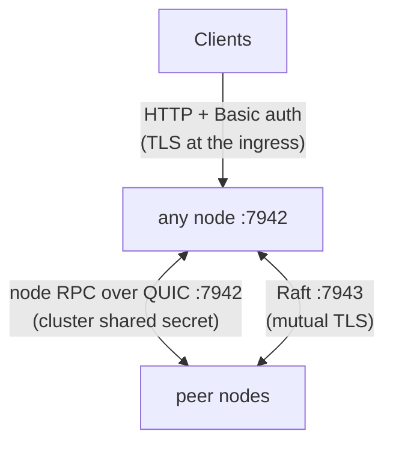
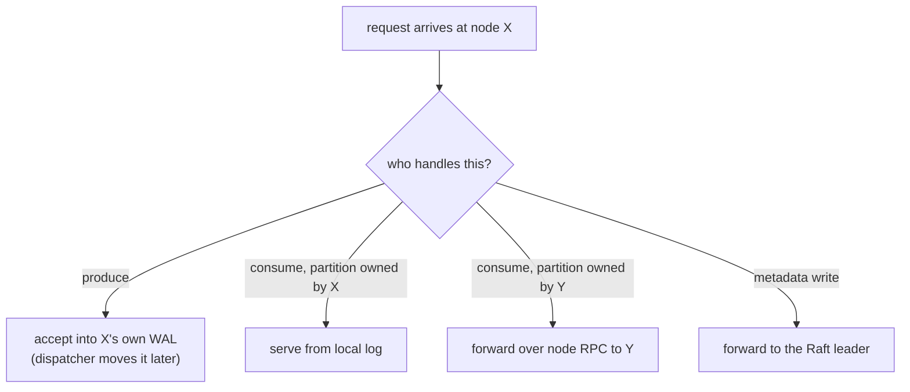

# Networking & Security

Two planes, one port each: clients speak **HTTP** to any node; nodes speak a compact **RPC protocol over QUIC** to each other. Raft has its own TCP transport with mutual TLS.

```mermaid
flowchart TB
    C[Clients] -->|"HTTP + Basic auth<br/>(TLS at the ingress)"| ANY[any node :7942]
    ANY <-->|"node RPC over QUIC :7942<br/>(cluster shared secret)"| PEERS[peer nodes]
    ANY <-->|"Raft :7943<br/>(mutual TLS)"| PEERS
```

## The HTTP plane

Everything a client does is plain HTTP under `/v1` (topics CRUD, produce/consume/ack, children, users) plus unauthenticated `/healthz` and `/readyz`. `/healthz` means "process up"; `/readyz` means "safe to route traffic here": held down until the node's metastore is caught up (and, for a joining node, until it's admitted). `/metrics` is served on its own listener when `http.metrics_addr` is set (the chart's default) and is otherwise on the API port behind the API's Basic auth: the exposition names every topic.

The listener itself is bounded: 64 KiB of headers, a 5 s header read budget, a cap on open connections (`http.max_connections`, via `netutil.LimitListener`; extra clients wait in the accept backlog rather than each getting a goroutine), and a per-identity cap on concurrent consume requests (`http.max_consume_in_flight_per_identity`, `429` beyond it), since every long-poll pins a goroutine and, on a non-owner node, a forwarded RPC stream slot for up to `max_consume_wait`.

State-changing requests (`POST`, `PUT`, `PATCH`) must carry `Content-Type: application/json` or `application/octet-stream`, or an `X-Narad-Client` header, else `415`. This is the cross-site request forgery guard for Basic-auth sessions: browsers attach cached Basic credentials to cross-origin requests, and a `POST` with `text/plain` or a form encoding needs no CORS preflight, so a hostile page could otherwise create topics, produce, ack, or decommission a member on behalf of an operator who used the API from that browser. The API content types and any custom header force a preflight, which Narad never approves. `DELETE` is preflighted by construction.

## Routing: any node serves any request

Each node routes with its **local metastore replica**, no lookup service, no proxy tier:

```mermaid
flowchart TD
    REQ[request arrives at node X] --> Q{who handles this?}
    Q -->|"produce"| WAL["accept into X's own WAL<br/>(dispatcher moves it later)"]
    Q -->|"consume, partition owned by X"| LOCAL[serve from local log]
    Q -->|"consume, partition owned by Y"| FWD[forward over node RPC to Y]
    Q -->|"metadata write"| LEADER[forward to the Raft leader]
```

Produce is the special case that makes the cluster feel fast: it's *always* local (WAL-first), regardless of where the partition lives. Queue consumes prefer local partitions, then probe remote owners, then long-poll.

## The node RPC plane

Node-to-node calls (commit batches from the dispatcher, fan-out child commits, forwarded consumes/acks, leader confirmations, membership, cluster join) ride one multiplexed QUIC connection per peer pair: a node holds a single peer client, shared by the router, dispatcher, fan-out runner, mover, and heartbeater. Each request is a single-byte opcode plus a compact binary payload; responses reuse HTTP status vocabulary so errors translate 1:1 at the boundary. QUIC gives stream multiplexing without head-of-line blocking.

Streams are pooled per **lane** so bulk traffic cannot starve control calls: produce commits (and bulk transfers such as fan-out cursors, segment chunks, and handoff freezes) ride the produce lane, consumes the consume lane, ack/extend/nack the ack lane (16 streams each), and everything else the 4-stream control lane. Requests round-robin across a lane's streams and are correlated by request ID, so many RPCs share one stream.

Peer restarts are recovered from immediately rather than at the 30s idle timeout: both ends run a QUIC transport whose stateless reset key is derived from the cluster secret (HMAC-SHA256 with a fixed context), so a restarted node answers packets for connection IDs it no longer knows with a reset the peer can verify, and the peer's pool drops the dead connection on the spot. As a backstop for resets that never arrive, a request that hits the client's fallback reply timeout pings its stream; no pong within 1s closes the connection so the next request re-dials. Dials to one address are shared by concurrent requests, and a failed dial is cached for a backoff that doubles from 250ms to 2s, during which requests to that peer fail fast.

Two transport-level guards:

- **Cluster shared secret, bound to the TLS session**: every node RPC stream starts with a mutual proof of the symmetric secret from the deployment's Kubernetes Secret. Both ends export 32 bytes of keying material from the QUIC connection's TLS 1.3 session (RFC 8446 exporter, label `narad-cluster-auth-v1`) and send `HMAC-SHA256(secret, role || ekm)`: the client's proof is the stream's first frame, the server answers with its own (server-role) proof, and the client refuses to send a single request on a stream whose server cannot prove the secret. Because the keying material is unique to that TLS session, a proof captured by a rogue endpoint (a spoofed peer address, a decommissioned pod's IP) cannot be replayed to a real node, and an impostor server cannot pass for a peer. The proof frame is read under a 64-byte cap before authentication, so an unauthenticated peer cannot make a node allocate the 16 MiB general frame buffer per stream. No secret, no cluster plane; a stray client can't speak node protocol.
- **Raft mutual TLS**: metadata replication runs over mTLS when certs are configured. With security on and peers configured, the Raft TLS files are required unless `security.allow_plaintext_raft` is set explicitly, because Raft itself has no authentication and the cluster secret does not cover it.

The QUIC layer itself is TLS 1.3 with an ephemeral ECDSA P-256 certificate per process and ALPN pinning (`narad-cluster-quic-v2`; peers do not verify the certificate, the session-bound secret proof is the authentication). Clients keep a small TLS session cache so redials resume rather than re-handshake; a resumed session still yields fresh exporter material, so proofs never repeat across connections.

Note that the QUIC listener shares the **API port number over UDP** (7942/udp by default), not the Raft port: network policies that fence the cluster plane must cover 7942/udp and 7943/tcp, not just 7943.

**Upgrading from the fixed-token protocol.** Releases before session binding proved the secret with one fixed token (`HMAC(secret, "narad-cluster-auth-v1")`, ALPN `narad-cluster-quic-v1`), sent one way. A node running the new protocol will not talk to one running the old (no shared ALPN, so the TLS handshake fails rather than mis-authenticating). For a rolling upgrade with no cross-node RPC outage, set `security.allow_legacy_cluster_auth: true` (`NARAD_SECURITY_ALLOW_LEGACY_CLUSTER_AUTH=true`, `security.allowLegacyClusterAuth` in the chart) on every node for the roll: upgraded nodes then also offer the legacy ALPN, accept the fixed token from old peers (logging each such connection), and fall back to it when dialling an old peer, while two upgraded nodes always negotiate the new protocol. Once every node runs the new release, turn the flag off and roll once more; while it is on, any peer that asks for the legacy ALPN is served with the replayable token. Without the flag, an upgrade still works, but forwarded requests between old and new nodes fail for the duration of the roll (Raft is unaffected).

On the serving side, the messaging handlers (produce commits, acks, and non-blocking consume scans) run under a concurrency bound of 4 x GOMAXPROCS; the frame read loop never blocks, and long-poll consumes and any op that calls other peers are exempt from the bound. Peer RPCs are observable as `narad_cluster_rpc_requests_total{op,outcome}` and `narad_cluster_rpc_request_seconds{op}`.

## AuthN and AuthZ

- **Authentication**: HTTP Basic against bcrypt-hashed users stored in the Raft metastore; credentials replicate with everything else, so any node can authenticate any request locally. TLS is expected to terminate at the ingress in front of Narad. Each node caches verified credentials keyed by the users domain version, throttles failed attempts per username (5 burst, one back every 12s; the bucket is per node, so N nodes behind a balancer allow 5N), rejects unknown usernames before bcrypt (a deliberate timing leak that bounds bcrypt cost to real users), and bounds bcrypt concurrency process-wide; password hashing for user create and password change runs under that same bound.
- **Cross-site guard**: see the HTTP plane above; it sits inside the auth middleware, so an anonymous request is still a `401` first.
- **Authorization**: per-request grant check, action (`produce`/`consume`/`create`/`admin`) × topic name, with prefix wildcards, plus topic *ownership* for management rights. Topic reads need any grant on the name (or ownership); attaching a child needs manage rights on both ends; cluster topology and user management are admin-only. Enforcement lives in the HTTP handlers, ahead of any routing, so a forwarded request was authorized on the node the client actually reached. Grant semantics from the client's view are in [Users & Access](../client/users-and-access.md).
- The **root admin** is seeded once, leader-gated, from the operator's secret at first startup.

## Trust model, honestly stated

Narad assumes the *cluster network* (node RPC + Raft ports) is a private, operator-controlled network; the shared secret and mTLS are guards, not a substitute for network policy. The client plane is hardened for untrusted callers: authenticated, authorized, size-capped (1 MiB bodies), and strict about malformed input.
## The node RPC wire format

Every request is a one-byte **opcode** followed by length-prefixed fields (strings/bytes get a 4-byte big-endian length; integers are big-endian). Responses carry an HTTP-vocabulary status, a content type, and a body, so errors translate 1:1 at the HTTP boundary with zero mapping tables at call sites.

The full opcode registry (`internal/protocol/node/types.go`; values are stable on the wire, appended only):

| Op | Name | Op | Name |
|---|---|---|---|
| 1 | Produce | 11 | CommitProduceBatch |
| 2 | Consume | 12 | CreateUser |
| 3 | Ack | 13 | UpdateUser |
| 4 | CreateTopic | 14 | DeleteUser |
| 5 | AlterTopic | 15 | AttachChild |
| 6 | DeleteTopic | 16 | DetachChild |
| 7 | PurgeTopic | 17 | FanoutCursors |
| 8 | TopicPartitionStats | 18 | ExtendAck |
| 9 | RegisterMember | 19 | Nack |
| 10 | CommitProduce | 20 | GetTopic · 21 JoinCluster |

An unknown opcode gets a clean 400, which is also the mixed-version story during rolling upgrades: an old node politely declines ops it hasn't heard of, and the caller retries elsewhere or later.

## Timeouts worth knowing

| Path | Timeout |
|---|---|
| Default peer RPC reply | 5s (then a 1s liveness ping decides whether the connection is dropped) |
| Produce/fan-out commit RPC | 30s (a slow fsync is not a dead node) |
| Forwarded ack / extend / nack | 2s (acks are idempotent by nonce, so a retry after a timeout cannot double-commit) |
| Non-blocking remote consume probe | 500ms per owner (a stalled owner is skipped for the round) |
| Remote consume re-probe pacing | 100ms after an empty round, doubling to 1s, within the client's wait budget |
| Forwarded long-poll consume | the client's wait (capped by `http.max_consume_wait` on the router and the RPC server alike) plus 2s grace |
| Reply write on the server | 5s plus 1s per 256 KiB of reply |
| Peer dial | 1s, then a failure backoff of 250ms doubling to 2s |
| Leader-confirmation RPCs | 5s |
| Cluster join attempt cadence | one sweep of the peer list every 2s |
| Forwarded topic create | 75s (the leader may lawfully park it behind its startup create gate) |

## Request cancellation on the cluster stream

Every request frame on a cluster stream gets its own context on the serving node. A client that stops waiting for a reply (its caller's context ended, or its reply timeout fired) sends a `StreamFrameCancel` carrying the request ID; the server cancels that request's context and, for a consume that had already reserved a message the client will never read, nacks it immediately. The record of a delivered handle lives for a 2 s grace after the reply (a client that read the reply never cancels; the record only covers a cancel that races the reply) and is expired from the front of a deadline queue, so remembering deliveries costs a map insert per forwarded consume rather than a scan. When a stream ends, every request still running on it is cancelled. Servers that predate the frame answer it with an error frame for a request nobody is waiting on, which the client ignores, so mixed-version clusters are unaffected.
