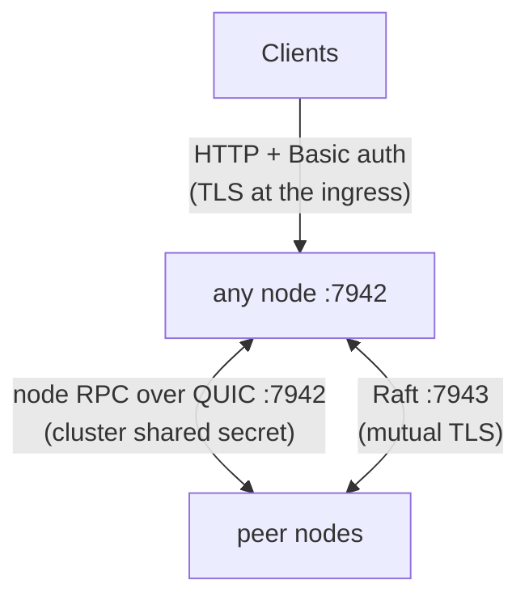
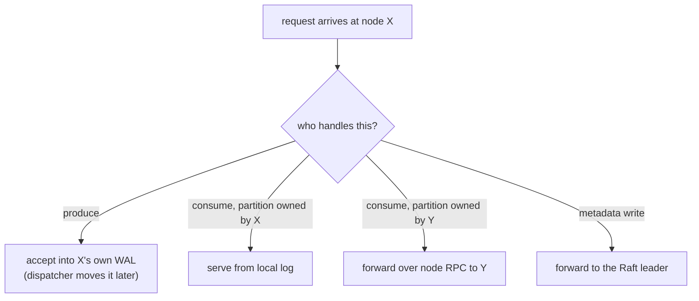

# Networking & Security

Two planes, one port each: clients speak **HTTP** to any node; nodes speak a compact **RPC protocol over QUIC** to each other. Raft has its own TCP transport with mutual TLS.

```mermaid
flowchart TB
    C[Clients] -->|"HTTP + Basic auth<br/>(TLS at the ingress)"| ANY[any node :7942]
    ANY <-->|"node RPC over QUIC :7942<br/>(cluster shared secret)"| PEERS[peer nodes]
    ANY <-->|"Raft :7943<br/>(mutual TLS)"| PEERS
```

## The HTTP plane

Everything a client does is plain HTTP under `/v1` (topics CRUD, produce/consume/ack, children, users) plus unauthenticated `/healthz`, `/readyz`, and `/metrics`. `/healthz` means "process up"; `/readyz` means "safe to route traffic here": held down until the node's metastore is caught up (and, for a joining node, until it's admitted).

## Routing: any node serves any request

Each node routes with its **local metastore replica**, no lookup service, no proxy tier:

```mermaid
flowchart TD
    REQ[request arrives at node X] --> Q{who handles this?}
    Q -->|"produce"| WAL["accept into X's own WAL<br/>(dispatcher moves it later)"]
    Q -->|"consume, partition owned by X"| LOCAL[serve from local log]
    Q -->|"consume, partition owned by Y"| FWD[forward over node RPC to Y]
    Q -->|"metadata write"| LEADER[forward to the Raft leader]
```

Produce is the special case that makes the cluster feel fast: it's *always* local (WAL-first), regardless of where the partition lives. Queue consumes prefer local partitions, then probe remote owners, then long-poll.

## The node RPC plane

Node-to-node calls (commit batches from the dispatcher, fan-out child commits, forwarded consumes/acks, leader confirmations, membership, cluster join) ride one multiplexed QUIC connection per peer pair: a node holds a single peer client, shared by the router, dispatcher, fan-out runner, mover, and heartbeater. Each request is a single-byte opcode plus a compact binary payload; responses reuse HTTP status vocabulary so errors translate 1:1 at the boundary. QUIC gives stream multiplexing without head-of-line blocking.

Streams are pooled per **lane** so bulk traffic cannot starve control calls: produce commits (and bulk transfers such as fan-out cursors, segment chunks, and handoff freezes) ride the produce lane, consumes the consume lane, ack/extend/nack the ack lane (16 streams each), and everything else the 4-stream control lane. Requests round-robin across a lane's streams and are correlated by request ID, so many RPCs share one stream.

Peer restarts are recovered from immediately rather than at the 30s idle timeout: both ends run a QUIC transport whose stateless reset key is derived from the cluster secret (HMAC-SHA256 with a fixed context), so a restarted node answers packets for connection IDs it no longer knows with a reset the peer can verify, and the peer's pool drops the dead connection on the spot. As a backstop for resets that never arrive, a request that hits the client's fallback reply timeout pings its stream; no pong within 1s closes the connection so the next request re-dials. Dials to one address are shared by concurrent requests, and a failed dial is cached for a backoff that doubles from 250ms to 2s, during which requests to that peer fail fast.

Two transport-level guards:

- **Cluster shared secret**: every node RPC stream authenticates with a symmetric secret from the deployment's Kubernetes Secret (an HMAC proof sent as the stream's first frame, verified with a constant-time compare against a token derived once per listener). No secret, no cluster plane; a stray client can't speak node protocol.
- **Raft mutual TLS**: metadata replication runs over mTLS when certs are configured (and warns loudly when it's plaintext).

The QUIC layer itself is TLS 1.3 with an ephemeral ECDSA P-256 certificate per process and ALPN pinning (peers do not verify the certificate; the shared secret is the authentication). Clients keep a small TLS session cache so redials resume rather than re-handshake.

On the serving side, the messaging handlers (produce commits, acks, and non-blocking consume scans) run under a concurrency bound of 4 x GOMAXPROCS; the frame read loop never blocks, and long-poll consumes and any op that calls other peers are exempt from the bound. Peer RPCs are observable as `narad_cluster_rpc_requests_total{op,outcome}` and `narad_cluster_rpc_request_seconds{op}`.

## AuthN and AuthZ

- **Authentication**: HTTP Basic against bcrypt-hashed users stored in the Raft metastore; credentials replicate with everything else, so any node can authenticate any request locally. TLS is expected to terminate at the ingress in front of Narad.
- **Authorization**: per-request grant check, action (`produce`/`consume`/`create`/`admin`) × topic name, with prefix wildcards, plus topic *ownership* for management rights. Enforcement lives in the HTTP handlers, ahead of any routing, so a forwarded request was authorized on the node the client actually reached. Grant semantics from the client's view are in [Users & Access](../client/users-and-access.md).
- The **root admin** is seeded once, leader-gated, from the operator's secret at first startup.

## Trust model, honestly stated

Narad assumes the *cluster network* (node RPC + Raft ports) is a private, operator-controlled network; the shared secret and mTLS are guards, not a substitute for network policy. The client plane is hardened for untrusted callers: authenticated, authorized, size-capped (1 MiB bodies), and strict about malformed input.
## The node RPC wire format

Every request is a one-byte **opcode** followed by length-prefixed fields (strings/bytes get a 4-byte big-endian length; integers are big-endian). Responses carry an HTTP-vocabulary status, a content type, and a body, so errors translate 1:1 at the HTTP boundary with zero mapping tables at call sites.

The full opcode registry (`internal/protocol/node/types.go`; values are stable on the wire, appended only):

| Op | Name | Op | Name |
|---|---|---|---|
| 1 | Produce | 11 | CommitProduceBatch |
| 2 | Consume | 12 | CreateUser |
| 3 | Ack | 13 | UpdateUser |
| 4 | CreateTopic | 14 | DeleteUser |
| 5 | AlterTopic | 15 | AttachChild |
| 6 | DeleteTopic | 16 | DetachChild |
| 7 | PurgeTopic | 17 | FanoutCursors |
| 8 | TopicPartitionStats | 18 | ExtendAck |
| 9 | RegisterMember | 19 | Nack |
| 10 | CommitProduce | 20 | GetTopic · 21 JoinCluster |

An unknown opcode gets a clean 400, which is also the mixed-version story during rolling upgrades: an old node politely declines ops it hasn't heard of, and the caller retries elsewhere or later.

## Timeouts worth knowing

| Path | Timeout |
|---|---|
| Default peer RPC reply | 5s (then a 1s liveness ping decides whether the connection is dropped) |
| Produce/fan-out commit RPC | 30s (a slow fsync is not a dead node) |
| Forwarded ack / extend / nack | 2s (acks are idempotent by nonce, so a retry after a timeout cannot double-commit) |
| Non-blocking remote consume probe | 500ms per owner (a stalled owner is skipped for the round) |
| Remote consume re-probe pacing | 100ms after an empty round, doubling to 1s, within the client's wait budget |
| Forwarded long-poll consume | the client's wait (capped by `http.max_consume_wait` on the router and the RPC server alike) plus 2s grace |
| Reply write on the server | 5s plus 1s per 256 KiB of reply |
| Peer dial | 1s, then a failure backoff of 250ms doubling to 2s |
| Leader-confirmation RPCs | 5s |
| Cluster join attempt cadence | one sweep of the peer list every 2s |
| Forwarded topic create | 75s (the leader may lawfully park it behind its startup create gate) |

## Request cancellation on the cluster stream

Every request frame on a cluster stream gets its own context on the serving node. A client that stops waiting for a reply (its caller's context ended, or its reply timeout fired) sends a `StreamFrameCancel` carrying the request ID; the server cancels that request's context and, for a consume that had already reserved a message the client will never read, nacks it immediately. The record of a delivered handle lives for a 2 s grace after the reply (a client that read the reply never cancels; the record only covers a cancel that races the reply) and is expired from the front of a deadline queue, so remembering deliveries costs a map insert per forwarded consume rather than a scan. When a stream ends, every request still running on it is cancelled. Servers that predate the frame answer it with an error frame for a request nobody is waiting on, which the client ignores, so mixed-version clusters are unaffected.
