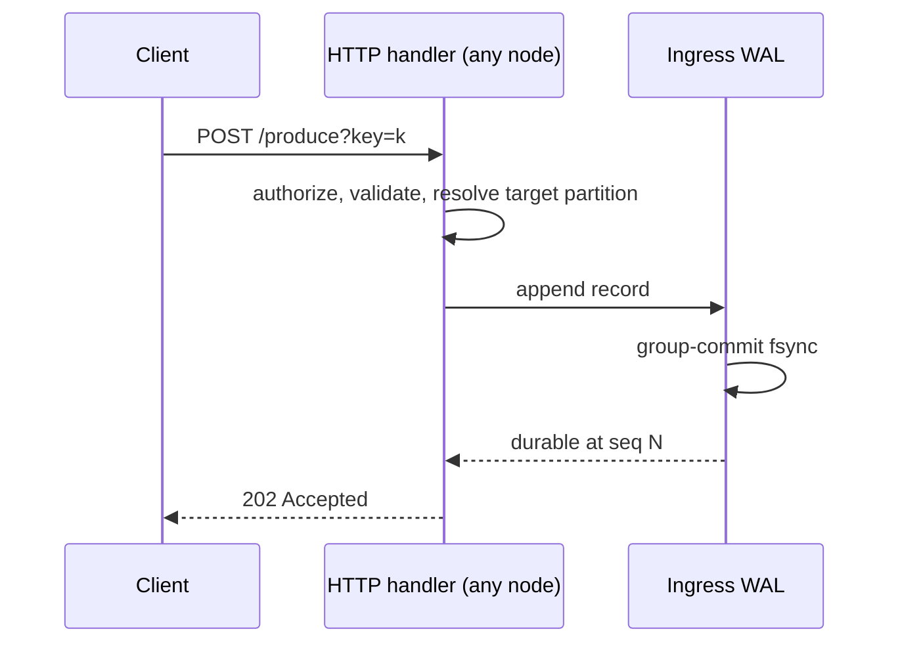
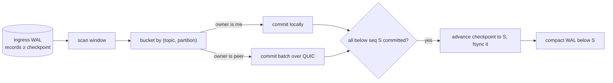

# Produce Path

The produce path answers one question with two different clocks: *how fast can we make the client safe* (one local fsync), and *how reliably can we finish the job* (asynchronously, retried forever).

## Stage 1 — accept: WAL-first

Every node has one **ingress WAL** — a segmented append-only log with group commit: concurrent produces are staged into a shared buffer and fsynced together, so under load the per-message fsync cost amortizes toward zero. The record stores topic, key, target partition, payload, and timestamp. Once the fsync returns, the client gets its `202`: the message now survives any crash of this node.

The target partition is resolved *at accept time* from the local metastore replica: keyed messages hash; unkeyed rotate; explicit `?partition=` pins.

## Stage 2 — dispatch: the background mover

A per-node **dispatcher** continuously drains the WAL from a durable checkpoint and commits records to their partition owners:

The interesting engineering is in the failure handling:

- **Adaptive windows.** The drain window sizes itself so each partition's commit batch stays fat (target ~64 records/partition) — commit batches are one fsync each on the owner, so batch size is the throughput lever.
- **Skip-set, not head-of-line blocking.** If partition 7's owner is down, records for it stay uncommitted, but everything else in the window commits and is remembered in a `committedAhead` set. The checkpoint only advances past the stuck record, bounded by a lookahead horizon; nothing is recommitted meanwhile.
- **Reroute after persistent failure.** If a destination keeps failing (3 passes) and membership agrees the owner is dead, its records are **rerouted to a live sibling partition** of the same topic. This deliberately trades per-key ordering across the failure for availability — messages flow while a node is dead, at the cost of arriving on a different partition.
- **At-least-once seams.** The skip-set is memory-only (a crash re-commits the window: duplicates), and a commit RPC that succeeds after its client timed out also duplicates. Both are within the delivery contract.

## Stage 3 — commit: the durability boundary

On the owner, a commit batch goes through `commitDurable` — the only place in Narad where a message becomes *real*:

1. Append all records (wrapped in the keyed envelope) to the partition log's buffer.
2. **Fsync.**
3. **Read back and CRC-verify** every frame just written — a torn or corrupt write is caught *now*, not at consume time.
4. Advance the **high-watermark** (records become visible to consumers and fan-out).

Only after the ack flows back does the dispatcher's checkpoint move — so the WAL copy lives until the partition copy is proven durable and uncorrupted. There is never a moment when a `202`-acked message exists in zero verified places.

## Discarding — the one way a WAL record dies unfinished

If a record's topic was **deleted** while it sat undispatched, committing is impossible forever, and it must be discarded or it would block its partition's lookahead. Discarding a `202`-acked record is destruction, so it takes the full [stale-replica defense](metastore-and-raft.md): the topic must be locally absent **and** the replica caught up **and** the *leader* must confirm the topic is gone (a self-leader must barrier and re-read). Anything less keeps the record for the next pass.

## WAL hygiene

The checkpoint compacts fully-dispatched segments; a fully-dispatched *active* segment past 1 MiB is rotated so it can be reclaimed too. Steady-state WAL disk on an idle-ish node is under a megabyte, self-maintained.
