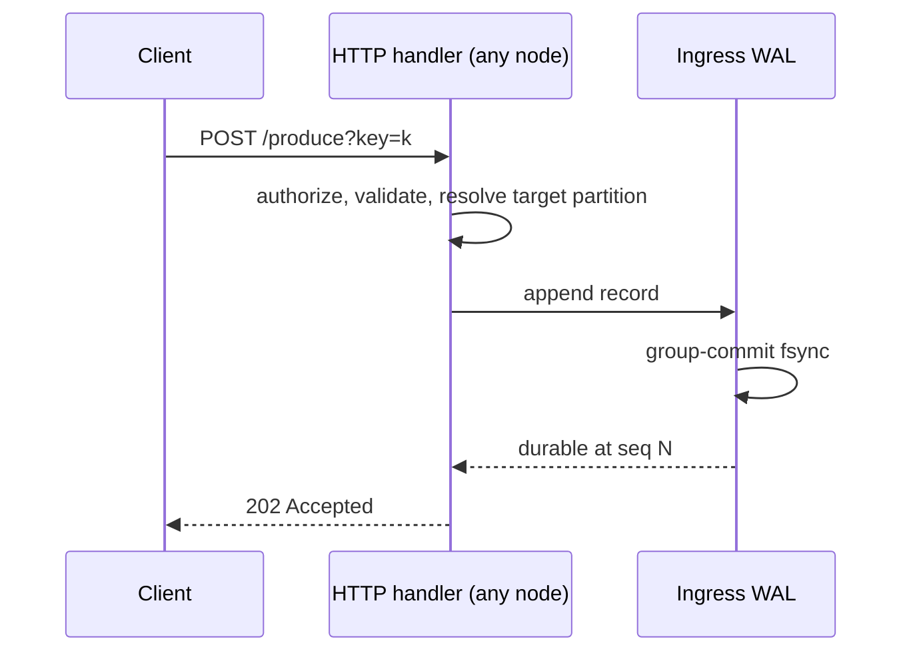
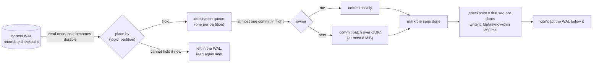

# Produce Path

The produce path answers one question with two different clocks: *how fast can we make the client safe* (one local fsync), and *how reliably can we finish the job* (asynchronously, retried forever).

## Stage 1 (accept): WAL-first

```mermaid
sequenceDiagram
    participant C as Client
    participant H as HTTP handler (any node)
    participant W as Ingress WAL
    C->>H: POST /produce?key=k
    H->>H: authorize, validate, resolve target partition
    H->>W: append record
    W->>W: group-commit fsync
    W-->>H: durable at seq N
    H-->>C: 202 Accepted
```

Every node has one **ingress WAL**, a segmented append-only log with group commit: concurrent produces are staged into a shared buffer and fsynced together, so under load the per-message fsync cost amortizes toward zero. The record stores the topic and its incarnation id (the `id` of the topic record the payload was validated against, when the record has one), the key (none for a keyless produce), the target partition, the payload, and a timestamp. Once the fsync returns, the client gets its `202`: the message now survives any crash of this node.

The target partition is resolved *at accept time* from the local metastore replica: keyed messages hash; unkeyed ones rotate round-robin and are stored with no key at all; explicit `?partition=` pins.

## Stage 2 (dispatch): the background mover

A per-node **dispatcher** drains the WAL from a durable checkpoint and commits records to their partition owners:

```mermaid
flowchart LR
    WAL[("ingress WAL<br/>records ≥ checkpoint")] -->|"read once, as it becomes durable"| PLACE{"place by<br/>(topic, partition)"}
    PLACE -->|hold| Q["destination queue<br/>(one per partition)"]
    PLACE -->|"cannot hold it now"| SKIP["left in the WAL,<br/>read again later"]
    Q -->|"at most one commit in flight"| OWNER{owner}
    OWNER -->|me| LOCAL[commit locally]
    OWNER -->|peer| RPC["commit batch over QUIC<br/>(at most 8 MiB)"]
    LOCAL & RPC --> DONE[mark the seqs done]
    DONE --> CKPT["checkpoint = first seq not done;<br/>write it, fdatasync within 250 ms"]
    CKPT --> COMPACT[compact the WAL below it]
```

The reader reads each record once, as soon as it is durable, and puts it on the queue of its destination partition. Each destination has **at most one commit in flight**: when it lands, whatever queued meanwhile goes out as the next batch. Different destinations commit independently, up to 16 commits at once, so a slow or unreachable owner holds up its own partitions and nothing else. Every seq between the checkpoint and the read frontier is marked done (committed, or discarded as described [below](#discarding-the-one-way-a-wal-record-dies-unfinished)), held (queued or in flight) or skipped (left in the WAL), and the checkpoint is the first seq that is not done, so it never passes a record that is not committed.

- **Batching comes from queueing.** The longer a commit takes, the more records the next one carries, so a busy owner gets fewer, fatter commits, one fsync each. A destination's queue holds up to a quarter of the window, or 4,096 records if that is more; the reader stops once the records held (queued or in flight) reach the window, but at least four destinations' worth, so a hot or slow partition never takes more than half of it and the others keep being read while its commit runs. The window sizes itself to the fan-out it sees (64 records per destination partition, between 4,096 and 65,536), and the reader never reads more than 16 windows past the checkpoint.
- **Linger below the batch floor.** A record becoming durable wakes the dispatcher at once, and each WAL group commit makes a few records durable, so on its own every group commit would go out as a handful of records per partition, one partition fsync each, on the disk the next group commit waits for. So while other commits are in flight, a destination holding fewer than 64 records waits for more, until twice its owner's recent commit latency has passed since its oldest queued record, at most 50 ms. The latency is a moving average per owner, so a slow remote owner does not lengthen the wait of this node's own partitions. An idle dispatcher, an owner with no commit measured yet, and a failing destination commit at once.
- **A byte budget for remote commits.** A commit to another node carries at most 8 MiB of encoded records (half the cluster stream's 16 MiB frame limit: the transport refuses a larger frame before sending it, so an oversized batch would fail the same way on every retry), and always at least one record; the rest stays queued, in order, for the next commit. A local commit has no such bound: the partition log splits a large batch into frames itself.
- **A hung commit stops counting.** A commit in flight for more than 1 s no longer takes one of the 16 slots, returns whatever queued behind it to the WAL, and its destination takes no new records until it lands, so an owner that stops answering holds nothing of anyone else's while its commit waits out its 30 s budget.
- **A failing destination waits alone.** After a failed commit, the destination keeps one record as a **probe**, returns the rest to the WAL, and retries with that single record, on a 5 s budget, once a second. Nothing else waits for it: the dispatcher as a whole backs off only when it cannot read the WAL or store its checkpoint. A destination whose owner does not resolve at all (a new topic not assigned yet) is looked up again every 10 ms.
- **Reroute after persistent failure.** A destination whose commits keep failing for 3 s, counted from the start of the first failed attempt, has its records **rerouted to a live sibling partition** of the same topic (the next partition, counting up and wrapping around, whose owner membership reports alive and whose own commits are neither failing nor hung), while its probe keeps trying the original once a second, so it gets its records back the moment it recovers. A destination whose owner membership already reports dead is rerouted at once, with the same authority as the accept-time dead-owner skip. The grace is measured in time, not passes, so a partition handoff freeze or an owner restart does not scatter records across partitions. This is the availability trade made explicit: messages flow while a node is dead, at the cost of arriving on a different partition. (It is one of the reasons Narad [does not promise ordering](../client/guarantees-and-errors.md); the client contract is honest about it.) Records of a commit in flight are never re-sent or rerouted.
- **Records left in the WAL come back in order.** A record is skipped rather than held when holding it would cost memory for nothing or break partition order: its destination is failing and already holds its probe, is hung, or has a full queue; an earlier record of the same partition is still skipped; or a delete or incarnation change is not confirmed yet. Skipped records are read again, in WAL order, when their destination recovers or drains, and at least once a second; the WAL read passes over the records that need no work before decoding them.
- **The checkpoint is stored lazily.** Each time the checkpoint moves, its 8 bytes are overwritten in place at once (a process crash keeps the value), and a background flush makes the value durable within 250 ms, one `fdatasync` for however many stores landed meanwhile, and on shutdown. The WAL compacts behind the stored value. The gauge `narad_ingress_dispatch_backlog_records` is the durable next seq minus that stored value: the records a restart would replay (see [Monitoring](../operate/monitoring.md)).
- **At-least-once seams.** Which records above the checkpoint already committed lives only in memory, so a crash re-commits them: duplicates. An OS crash or power loss can also bring back a checkpoint up to 250 ms old, with the same result: more duplicates, never loss. And a commit RPC carries no idempotency token, so one that succeeds after its client gave up is retried (and, past the reroute grace, rerouted), duplicating the batch; the 30 s budget makes that rare, and a probe's 5 s budget risks a single record. All of these are within the delivery contract.

## Stage 3 (commit): the durability boundary

On the owner, a commit batch goes through `commitDurable`, the only place in Narad where a message becomes *real*:

1. Append all records (wrapped in the keyed envelope) to the partition log's buffer.
2. **Fsync.**
3. **Read back and CRC-verify** every frame just written: a torn or corrupt write is caught *now*, not at consume time.
4. Advance the **high-watermark** in memory (records become visible to consumers and fan-out).

Steps 2 to 4 run as one pass on the partition's flusher goroutine (`storage.CommitDurable`), and a commit costs one fsync: the new boundary is not written to disk, because a restart recovers it from the CRC-verified record tail, which the fsync in step 2 already covers (the details, and the one-time emptying of the `hwm` file this relies on, are in [Storage Engine](storage-engine.md#the-high-watermark-and-the-hidden-tail)). Only after the ack flows back does the dispatcher's checkpoint move, so the WAL copy lives until the partition copy is proven durable, uncorrupted, and *visible after a restart*. There is never a moment when a `202`-acked message exists in zero verified places.

### Batches that arrive together share one commit

The partition's produce lock spans the append and the durable commit: a failed commit discards everything above the high-watermark, another caller's records included, so the two can never be split. Commit batches for one partition often arrive together (each node's dispatcher sends its own, and fan-out cursors add theirs), and each used to pay its own write, fsync and read-back back to back behind that lock.

Now a batch queues on the partition's combiner. With no cycle running, its caller becomes the leader: it takes the produce lock, drains every batch queued by then, appends them as one run and commits them with one `CommitDurable`, never releasing the lock in between. Everyone in the cycle shares the outcome: contiguous offsets on success, or the same error on failure, which the ingress dispatcher and the fan-out runner already handle by appending again. Batches that arrive during a cycle wait for the next one, which the leader hands to the oldest of them on its way out.

Under the lock, before anything is appended, the cycle checks again what the caller checked on its way in:

- **Ownership and the handoff freeze.** A commit that passed the check before a [rebalance handoff](rebalance.md) armed its freeze, but reached the lock after the handoff read the final high-watermark, is refused with nothing appended and retries at the new owner.
- **The caller is still waiting.** A batch whose caller gave up (its commit RPC timed out) is left out: it will be retried anyway, and appending it would only commit a duplicate.
- **The topic incarnation.** A batch whose records carry an incarnation id other than the live topic's (the topic was deleted and recreated while they waited in the WAL, or this node's metadata lags) is refused with a retriable `ErrTopicIncarnationMismatch`, and nothing is appended. Records without an id commit by name, as before. The id travels with the records on the commit RPC to another owner too (see [Discarding](#discarding-the-one-way-a-wal-record-dies-unfinished)), so the check covers every commit, local or remote; only an owner on a release from before the field gets the records without it, and commits them by name.

The cycle also keeps commit times from going backwards along the partition, which the fan-out [delay gate](fanout-engine.md#the-delay-gate) relies on (see [Storage Engine](storage-engine.md)).

## Discarding: the one way a WAL record dies unfinished

If a record's topic was **deleted** while it sat undispatched, committing is impossible forever, and it must be discarded or it would pin the checkpoint. Discarding a `202`-acked record is destruction, so it takes the full [stale-replica defense](metastore-and-raft.md): the topic must be locally absent **and** the replica caught up **and** the *leader* must confirm the topic is gone (a self-leader must barrier and re-read). Anything less keeps the record for a later attempt. The confirmation is asked once per topic per read, not once per record, and an unconfirmed answer is remembered for a second, so deleting a topic with a backlog behind it costs one leader round trip rather than one per record, and a leader that cannot be reached is asked about once a second.

A topic that was deleted and **recreated under the same name** is the harder case: the name resolves, so nothing would stop the old records from committing into the new topic, past its schema and ownership. Every record of a topic that has an incarnation id carries the id it was accepted under (format 2, below), and the dispatcher checks it against the local replica before anything resolves or reroutes the record by name. When the replica shows another incarnation under the name, the record stays in the WAL until the leader confirms the old incarnation is gone (the name is absent, or belongs to another id), and is then discarded; the confirmed id is remembered, so its other records go without asking again. The same checks run just before a batch leaves (records whose incarnation was replaced meanwhile go back to the WAL) and after a failed commit, on that commit's own goroutine, so a slow leader holds up only that destination.

The owner checks the id too, under the partition's produce lock (see Stage 3), which is why the commit RPC carries it. `CommitProduceBatch` has an optional trailing section for it, written only when some record has an id: a count of runs, then per run a record count and the id the run shares, so a batch for one partition costs a few bytes, and a batch without ids is byte for byte the frame older releases send and accept. An owner on an older release refuses a batch with the section as trailing data (`400`); the dispatcher then resends it without the ids, on what is left of the same budget, and keeps sending that owner's batches without ids for 2 minutes before trying again, so a rolling upgrade costs one refused batch per old owner per 2 minutes.

## WAL hygiene

The checkpoint compacts fully-dispatched segments; a fully-dispatched *active* segment past 1 MiB is rotated so it can be reclaimed too. Steady-state WAL disk on an idle-ish node is under a megabyte, self-maintained.

### Record formats

A WAL record starts with a format byte. Format 1 holds topic, key, partition, timestamp and payload; format 2, which every accept for a topic with an incarnation id now writes, adds that id after the topic name (a topic created before v2.2.0 has no id, and its records stay format 1). The decoder reads both, so a WAL written by an older binary replays unchanged. The reverse is not true: a binary from before format 2 (v3.0.1 and earlier) cannot decode a format-2 record, and its dispatcher stops at the first one, with everything the node accepts after it waiting behind it. Nothing is lost, and delivery resumes once a newer binary is back. Downgrading a node therefore needs its ingress WAL drained first (every accepted record dispatched, which `narad_ingress_dispatch_backlog_records` reading 0 shows); see [Rolling back to an earlier release](../operate/helm-chart.md#rolling-back-to-an-earlier-release).

### Segment preparation (opt-in)

With `storage.ingress_wal_prealloc: true` (off by default, see [Configuration](../operate/configuration.md)), the WAL prepares each next segment off the append path: once the active segment is half full, a background goroutine creates `next-segment.prep`, zero-fills it to the full segment size (64 MiB) and ends it with a 16-byte trailer (`NWPREP01` plus the write limit below); the roll renames it into place. Appends then overwrite blocks that are already allocated, so a group commit's `fdatasync` no longer changes the file's size and, on journaling file systems (ext4, XFS), no longer commits the inode through the journal on the path every produce waits on. A roll that finds no spare ready (preparation failed, the disk is full) creates an empty segment as before, and the roll that seals a prepared segment trims it to its data, so sealed segments look exactly as they always did.

Overwriting in place changes what a power loss can leave. An appended write that tears loses its end; an overwrite can leave a hole of zeros in front of valid frames of the same write. So writes into a prepared segment are bounded: a group commit larger than 16 MiB is written and synced in runs of whole frames of at most 16 MiB, and recovery accepts "a bad frame followed by valid frames" as a torn tail only in the last segment, only when it ends in the trailer, and only within 16 MiB of the bad frame. It then truncates at the bad frame; anything else is still a loud corruption failure at open. The cost of the rule: inside that window, damage to frames that were already synced cannot be told apart from a tear and is truncated too, as damage to the last frame of any active segment always was.

Preparation costs up to two segments of extra disk (the active prepared segment and a ready spare) and one extra segment of background zero-filling per segment. Its latency win was measured on ext4 only; APFS showed no difference. A binary from before preparation opens a cleanly stopped prepared WAL without losing records, but can refuse to start (a `corrupt frame` error) on a WAL where a crash tore a write inside a prepared segment and left valid frames behind a hole: start the new binary once to recover it before rolling back.

## The numbers (compiled-in, grep-able)

| Constant | Value | Where |
|---|---|---|
| Ingress WAL sync backstop | 10ms (`ingress_wal_sync_interval_ms`) | group commit fires on every append; this bounds a missed wakeup |
| Dispatcher idle backstop | 10ms | `defaultProduceDispatchInterval`: a record becoming durable wakes the dispatcher at once (`DurableProduceAdvanced`), so this only bounds a missed wakeup; it is also how often an owner that does not resolve is looked up again |
| Window base / hard cap | 4,096 / 65,536 records | `produceDispatchBaseWindow`, `defaultProduceDispatchBatchSize`: records held in memory at once (queued or in flight, hung commits aside) |
| Per-partition batch target | 64 records | `produceDispatchTargetPerPartition`: the window aims for this per destination, and a smaller batch lingers while other commits run |
| Linger cap | 50ms | `produceDispatchMaxLinger`: a small batch waits up to twice its owner's recent commit latency, never longer than this |
| Per-destination queue cap | a quarter of the window, at least 4,096 | `perDestCap`: one destination holds at most a batch in flight and a full queue |
| Remote commit byte budget | 8 MiB | `produceRemoteBatchBytes`: half the 16 MiB stream frame limit; at least one record per commit |
| Lookahead past a stuck record | 16 windows | `produceDispatchLookaheadWindows`: bounds the per-seq marks and the work of a rescan |
| Commit fan-out | 16 commits in flight | `defaultProduceDispatchCommitFanout`: hung commits (past 1s) do not count |
| Hung-commit threshold | 1s | `produceDispatchSlowAfter` |
| Commit budget / probe budget / failure backoff | 30s / 5s / 1s | `produceCommitRPCTimeout`, `produceProbeRPCTimeout`, `defaultProduceDispatchFailureBackoff`: generous on purpose, a commit that succeeds after the client gave up duplicates; the backoff is per destination |
| Reroute after | 3s of failed commits | `produceDispatchRerouteGrace` (at once if membership already says the owner is dead) |
| Rescan backstop | 1s | `produceDispatchRescanInterval`: records left in the WAL are read again at least this often |
| Legacy-owner memory | 2 minutes | `produceLegacyOwnerTTL`: how long commits to an owner that refused topic ids go without them |
| Checkpoint flush delay | 250ms | `checkpointSyncDelay`: how long a stored checkpoint may sit written but not yet fdatasynced |

## Group commit, precisely

`wal.Log.Append` doesn't fsync per message: it stages the record into a shared buffer, wakes the sync loop, and **blocks on the batch's completion channel**. Every producer that arrived in the same instant shares one write+fsync (`syncBatch`); under load the amortized fsync cost per message approaches zero, while each caller still only returns after *its* bytes are durable. One subtlety worth knowing: once a record is staged, `Append` ignores context cancellation and waits for the true sync outcome; reporting failure for a record that actually became durable would make a well-behaved retrying client produce duplicates for no reason. The sync loop alternates between two staging buffers (each kept up to 4 MiB), so a busy WAL does not allocate a fresh buffer per batch.

### When the WAL's disk fails

A write or fsync failure on the ingress WAL (`ENOSPC`, `EIO`) fails the whole batch that was in flight: every producer in it gets a `500`, logged as `http server error` and counted in `errors_total{component="http",kind="5xx"}`, and nothing in that batch was acked. The failure is then **latched**: the WAL refuses every later append with the same error, because a second write on top of a region of unknown content could be acked and then lost. The latch clears only when the node restarts, which rescans the WAL and truncates its torn tail; so a node that ran out of disk keeps answering `500` to produce after space is freed until it is restarted, while everything it acked before the failure is replayed and committed after the restart. Records written before the failing point of a failed batch survive the rescan too, so a produce that got a `500` may still be delivered: the at-least-once contract, exactly as for a commit RPC that succeeds after its client timed out. The latch is exported as the gauge `narad_ingress_wal_failed` (1 once latched); consume and `/readyz` are unaffected by it, so alert on the gauge rather than waiting for readiness to notice (see [Monitoring](../operate/monitoring.md)).

## Two produce paths, one honest difference

There are two partition-pickers in `broker/messaging`, and the difference is deliberate:

- **`resolveAcceptedProducePartition`** (the WAL-first accept you use): pure hash, no liveness check; the accept must stay O(local fsync), and the *dispatcher* deals with dead owners later.
- **`pickProducePartition`** (`routing.go`, the synchronous internal path): walks forward past partitions whose owner is dead per membership, "so a dead node doesn't blackhole its share of the keyspace"; that's a direct quote from the source, and it's one of the documented reasons [ordering is not a contract](../client/guarantees-and-errors.md).
