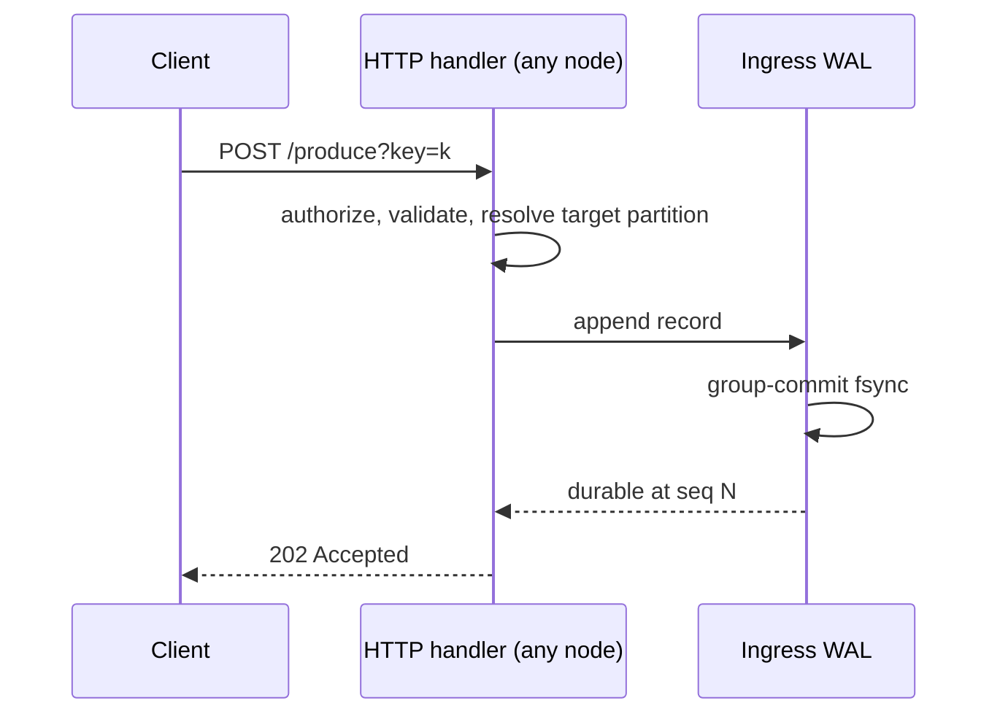
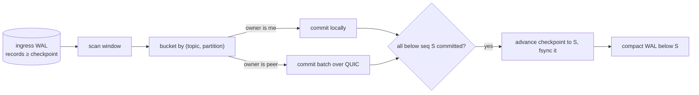

# Produce Path

The produce path answers one question with two different clocks: *how fast can we make the client safe* (one local fsync), and *how reliably can we finish the job* (asynchronously, retried forever).

## Stage 1 (accept): WAL-first

```mermaid
sequenceDiagram
    participant C as Client
    participant H as HTTP handler (any node)
    participant W as Ingress WAL
    C->>H: POST /produce?key=k
    H->>H: authorize, validate, resolve target partition
    H->>W: append record
    W->>W: group-commit fsync
    W-->>H: durable at seq N
    H-->>C: 202 Accepted
```

Every node has one **ingress WAL**, a segmented append-only log with group commit: concurrent produces are staged into a shared buffer and fsynced together, so under load the per-message fsync cost amortizes toward zero. The record stores the topic and its incarnation id (the `id` of the topic record the payload was validated against, when the record has one), the key (none for a keyless produce), the target partition, the payload, and a timestamp. Once the fsync returns, the client gets its `202`: the message now survives any crash of this node.

The target partition is resolved *at accept time* from the local metastore replica: keyed messages hash; unkeyed ones rotate round-robin and are stored with no key at all; explicit `?partition=` pins.

## Stage 2 (dispatch): the background mover

A per-node **dispatcher** continuously drains the WAL from a durable checkpoint and commits records to their partition owners:

```mermaid
flowchart LR
    WAL[("ingress WAL<br/>records ≥ checkpoint")] --> SCAN[scan window]
    SCAN --> BUCKET["bucket by (topic, partition)"]
    BUCKET -->|owner is me| LOCAL[commit locally]
    BUCKET -->|owner is peer| RPC[commit batch over QUIC]
    LOCAL & RPC --> DONE{all below seq S committed?}
    DONE -->|yes| CKPT[advance checkpoint to S, fsync it]
    CKPT --> COMPACT[compact WAL below S]
```

The interesting engineering is in the failure handling:

- **Adaptive windows.** The drain window sizes itself so each partition's commit batch stays fat (target ~64 records/partition); commit batches are one fsync each on the owner, so batch size is the throughput lever.
- **Skip-set, not head-of-line blocking.** If partition 7's owner is down, records for it stay uncommitted, but everything else in the window commits and is remembered in a `committedAhead` set. The checkpoint only advances past the stuck record, bounded by a lookahead horizon; nothing is recommitted meanwhile.
- **Reroute after persistent failure.** If a destination keeps failing (3 passes) and membership agrees the owner is dead, its records are **rerouted to a live sibling partition** of the same topic. This is the availability trade made explicit: messages flow while a node is dead, at the cost of arriving on a different partition. (It is one of the reasons Narad [does not promise ordering](../client/guarantees-and-errors.md); the client contract is honest about it.)
- **At-least-once seams.** The skip-set is memory-only (a crash re-commits the window: duplicates), and a commit RPC that succeeds after its client timed out also duplicates. Both are within the delivery contract.

## Stage 3 (commit): the durability boundary

On the owner, a commit batch goes through `commitDurable`, the only place in Narad where a message becomes *real*:

1. Append all records (wrapped in the keyed envelope) to the partition log's buffer.
2. **Fsync.**
3. **Read back and CRC-verify** every frame just written: a torn or corrupt write is caught *now*, not at consume time.
4. Advance the **high-watermark** in memory (records become visible to consumers and fan-out).

Steps 2 to 4 run as one pass on the partition's flusher goroutine (`storage.CommitDurable`), and a commit costs one fsync: the new boundary is not written to disk, because a restart recovers it from the CRC-verified record tail, which the fsync in step 2 already covers (the details, and the one-time emptying of the `hwm` file this relies on, are in [Storage Engine](storage-engine.md#the-high-watermark-and-the-hidden-tail)). Only after the ack flows back does the dispatcher's checkpoint move, so the WAL copy lives until the partition copy is proven durable, uncorrupted, and *visible after a restart*. There is never a moment when a `202`-acked message exists in zero verified places.

### Batches that arrive together share one commit

The partition's produce lock spans the append and the durable commit: a failed commit discards everything above the high-watermark, another caller's records included, so the two can never be split. Commit batches for one partition often arrive together (each node's dispatcher sends its own, and fan-out cursors add theirs), and each used to pay its own write, fsync and read-back back to back behind that lock.

Now a batch queues on the partition's combiner. With no cycle running, its caller becomes the leader: it takes the produce lock, drains every batch queued by then, appends them as one run and commits them with one `CommitDurable`, never releasing the lock in between. Everyone in the cycle shares the outcome: contiguous offsets on success, or the same error on failure, which the ingress dispatcher and the fan-out runner already handle by appending again. Batches that arrive during a cycle wait for the next one, which the leader hands to the oldest of them on its way out.

Under the lock, before anything is appended, the cycle checks again what the caller checked on its way in:

- **Ownership and the handoff freeze.** A commit that passed the check before a [rebalance handoff](rebalance.md) armed its freeze, but reached the lock after the handoff read the final high-watermark, is refused with nothing appended and retries at the new owner.
- **The caller is still waiting.** A batch whose caller gave up (its commit RPC timed out) is left out: it will be retried anyway, and appending it would only commit a duplicate.
- **The topic incarnation.** A batch whose records carry an incarnation id other than the live topic's (the topic was deleted and recreated while they waited in the WAL, or this node's metadata lags) is refused with a retriable `ErrTopicIncarnationMismatch`, and nothing is appended. Records without an id commit by name, as before. Today only a commit on the node that accepted the records sees the id: the commit RPC to another owner carries records without it.

The cycle also keeps commit times from going backwards along the partition, which the fan-out [delay gate](fanout-engine.md#the-delay-gate) relies on (see [Storage Engine](storage-engine.md)).

## Discarding: the one way a WAL record dies unfinished

If a record's topic was **deleted** while it sat undispatched, committing is impossible forever, and it must be discarded or it would block its partition's lookahead. Discarding a `202`-acked record is destruction, so it takes the full [stale-replica defense](metastore-and-raft.md): the topic must be locally absent **and** the replica caught up **and** the *leader* must confirm the topic is gone (a self-leader must barrier and re-read). Anything less keeps the record for the next pass.

## WAL hygiene

The checkpoint compacts fully-dispatched segments; a fully-dispatched *active* segment past 1 MiB is rotated so it can be reclaimed too. Steady-state WAL disk on an idle-ish node is under a megabyte, self-maintained.

### Record formats

A WAL record starts with a format byte. Format 1 holds topic, key, partition, timestamp and payload; format 2, which every accept for a topic with an incarnation id now writes, adds that id after the topic name (a topic created before v2.2.0 has no id, and its records stay format 1). The decoder reads both, so a WAL written by an older binary replays unchanged. The reverse is not true: a binary from before format 2 (v3.0.1 and earlier) cannot decode a format-2 record, and its dispatcher stops at the first one, with everything the node accepts after it waiting behind it. Nothing is lost, and delivery resumes once a newer binary is back. Downgrading a node therefore needs its ingress WAL drained first (every accepted record dispatched); see [Rolling back to an earlier release](../operate/helm-chart.md#rolling-back-to-an-earlier-release).

### Segment preparation (opt-in)

With `storage.ingress_wal_prealloc: true` (off by default, see [Configuration](../operate/configuration.md)), the WAL prepares each next segment off the append path: once the active segment is half full, a background goroutine creates `next-segment.prep`, zero-fills it to the full segment size (64 MiB) and ends it with a 16-byte trailer (`NWPREP01` plus the write limit below); the roll renames it into place. Appends then overwrite blocks that are already allocated, so a group commit's `fdatasync` no longer changes the file's size and, on journaling file systems (ext4, XFS), no longer commits the inode through the journal on the path every produce waits on. A roll that finds no spare ready (preparation failed, the disk is full) creates an empty segment as before, and the roll that seals a prepared segment trims it to its data, so sealed segments look exactly as they always did.

Overwriting in place changes what a power loss can leave. An appended write that tears loses its end; an overwrite can leave a hole of zeros in front of valid frames of the same write. So writes into a prepared segment are bounded: a group commit larger than 16 MiB is written and synced in runs of whole frames of at most 16 MiB, and recovery accepts "a bad frame followed by valid frames" as a torn tail only in the last segment, only when it ends in the trailer, and only within 16 MiB of the bad frame. It then truncates at the bad frame; anything else is still a loud corruption failure at open. The cost of the rule: inside that window, damage to frames that were already synced cannot be told apart from a tear and is truncated too, as damage to the last frame of any active segment always was.

Preparation costs up to two segments of extra disk (the active prepared segment and a ready spare) and one extra segment of background zero-filling per segment. Its latency win was measured on ext4 only; APFS showed no difference. A binary from before preparation opens a cleanly stopped prepared WAL without losing records, but can refuse to start (a `corrupt frame` error) on a WAL where a crash tore a write inside a prepared segment and left valid frames behind a hole: start the new binary once to recover it before rolling back.

## The numbers (compiled-in, grep-able)

| Constant | Value | Where |
|---|---|---|
| Ingress WAL sync backstop | 10ms (`ingress_wal_sync_interval_ms`) | group commit fires on every append; this bounds a missed wakeup |
| Dispatcher poll when idle | 10ms | `defaultProduceDispatchInterval` |
| Drain window base / hard cap | 4,096 / 65,536 records | `produceDispatchBaseWindow`, `defaultProduceDispatchBatchSize` |
| Per-partition batch target | 64 records | `produceDispatchTargetPerPartition`: one fsync per batch, so this is the throughput lever |
| Lookahead past a stuck record | 16 windows | `produceDispatchLookaheadWindows`: bounds skip-set memory too |
| Reroute after | 3 consecutive failed passes | `produceDispatchRerouteAfterPasses` (immediately if membership already says the owner is dead) |
| Commit RPC timeout / failure backoff | 30s / 1s | generous on purpose: a commit that succeeds after the client gave up = duplicates |
| Commit fan-out concurrency | 16 buckets in parallel | `defaultProduceDispatchCommitFanout` |

## Group commit, precisely

`wal.Log.Append` doesn't fsync per message: it stages the record into a shared buffer, wakes the sync loop, and **blocks on the batch's completion channel**. Every producer that arrived in the same instant shares one write+fsync (`syncBatch`); under load the amortized fsync cost per message approaches zero, while each caller still only returns after *its* bytes are durable. One subtlety worth knowing: once a record is staged, `Append` ignores context cancellation and waits for the true sync outcome; reporting failure for a record that actually became durable would make a well-behaved retrying client produce duplicates for no reason. The sync loop alternates between two staging buffers (each kept up to 4 MiB), so a busy WAL does not allocate a fresh buffer per batch.

### When the WAL's disk fails

A write or fsync failure on the ingress WAL (`ENOSPC`, `EIO`) fails the whole batch that was in flight: every producer in it gets a `500`, logged as `http server error` and counted in `errors_total{component="http",kind="5xx"}`, and nothing in that batch was acked. The failure is then **latched**: the WAL refuses every later append with the same error, because a second write on top of a region of unknown content could be acked and then lost. The latch clears only when the node restarts, which rescans the WAL and truncates its torn tail; so a node that ran out of disk keeps answering `500` to produce after space is freed until it is restarted, while everything it acked before the failure is replayed and committed after the restart. Records written before the failing point of a failed batch survive the rescan too, so a produce that got a `500` may still be delivered: the at-least-once contract, exactly as for a commit RPC that succeeds after its client timed out. The latch is exported as the gauge `narad_ingress_wal_failed` (1 once latched); consume and `/readyz` are unaffected by it, so alert on the gauge rather than waiting for readiness to notice (see [Monitoring](../operate/monitoring.md)).

## Two produce paths, one honest difference

There are two partition-pickers in `broker/messaging`, and the difference is deliberate:

- **`resolveAcceptedProducePartition`** (the WAL-first accept you use): pure hash, no liveness check; the accept must stay O(local fsync), and the *dispatcher* deals with dead owners later.
- **`pickProducePartition`** (`routing.go`, the synchronous internal path): walks forward past partitions whose owner is dead per membership, "so a dead node doesn't blackhole its share of the keyspace"; that's a direct quote from the source, and it's one of the documented reasons [ordering is not a contract](../client/guarantees-and-errors.md).
