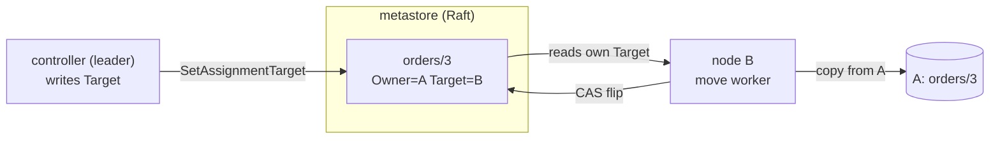
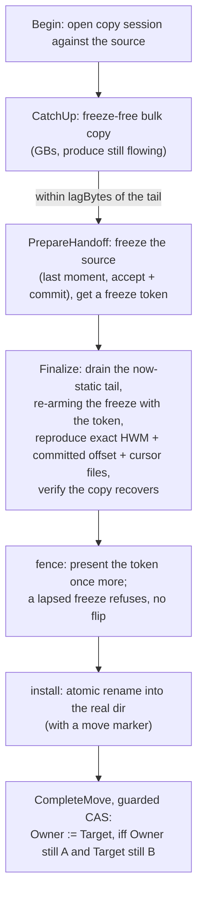

# Rebalance & Decommission

Narad has no follower replication: a partition's data lives only on its owner's disk. So moving a partition means *physically copying it* to another node and cutting over without losing a record. Rebalance (spread load onto a new node) and decommission (drain a node off) are the same machine: **relocate a partition, verbatim, from one owner to another.**

The design principle is the same one that runs fan-out and assignment: **nodes worry about themselves.** The controller (Raft leader) writes *desired* ownership into Raft; each node runs a local reconcile loop that converges its own partitions toward it. Nobody choreographs anybody.

## Desired state: Owner + Target

Every partition assignment carries two fields:

- **Owner**: who serves it *now* (produce and consume land here).
- **Target**: where it *should* end up (empty when stable).

The controller's only job is policy: set `Target` to balance partition count across the live nodes. The nodes do the work. The ownership flip is a Raft compare-and-swap: atomic, single entry, no split-brain.


```mermaid
flowchart LR
    subgraph raft["metastore (Raft)"]
        A["orders/3<br/>Owner=A Target=B"]
    end
    CTRL["controller (leader)<br/>writes Target"] -->|SetAssignmentTarget| A
    A -->|reads own Target| B["node B<br/>move worker"]
    B -->|copy from A| A2[("A: orders/3")]
    B -->|CAS flip| A
```

## The move: catch up, then freeze at the last moment

A partition can be gigabytes. Freezing produce for the whole copy would be an outage, so the copy is **two phases** and the freeze covers only the tiny tail:


```mermaid
flowchart TD
    BEGIN["Begin: open copy session against the source"] --> CATCHUP
    CATCHUP["CatchUp: freeze-free bulk copy<br/>(GBs, produce still flowing)"] -->|within lagBytes of the tail| FREEZE
    FREEZE["PrepareHandoff: freeze the source<br/>(last moment, accept + commit), get a freeze token"] --> FINAL
    FINAL["Finalize: drain the now-static tail,<br/>re-arming the freeze with the token,<br/>reproduce exact HWM + committed offset + cursor files,<br/>verify the copy recovers"] --> FENCE
    FENCE["fence: present the token once more;<br/>a lapsed freeze refuses, no flip"] --> INSTALL
    INSTALL["install: atomic rename into the real dir<br/>(with a move marker)"] --> FLIP
    FLIP["CompleteMove, guarded CAS:<br/>Owner := Target, iff Owner still A and Target still B"]
```

**CatchUp** streams the source's segments (sealed files plus the growing active tail) while produce keeps flowing, iterating to shrink the un-copied tail. Once it is within `lagBytes` of the live tail it stops and **PrepareHandoff** freezes the source; the freeze lasts milliseconds, because Finalize has only the last few MiB to drain.

### What if the partition is written faster than it copies?

CatchUp is a **pre-copy / stop-and-copy** cutover, the same shape as live VM migration. Let `W` = the partition's write rate and `B` = the copy bandwidth. Each pass copies the delta since the last one, and consecutive deltas scale by `W/B`:

- **`W < B`** (the normal case: a single partition's writes are far below network/disk copy speed): deltas shrink geometrically, CatchUp converges, the freeze is tiny.
- **`W ≥ B`** (a very hot partition, or a slow copy link): deltas stay flat or grow, so the tail would never shrink below `lagBytes`.

CatchUp is therefore **bounded**: after a capped number of passes (or once the tail stops shrinking), it stops pre-copying and freezes anyway. The freeze then does a **stop-and-copy** of whatever tail remains. This is always safe and always terminates, because the freeze *stops the writes*: `Finalize` drains a now-fixed tail at full bandwidth with nothing competing. The move never hangs; a partition the copy can't keep up with just gets a **longer freeze** (bounded by the remaining tail ÷ bandwidth), logged as a non-converged cutover. And because the tail only grows while you keep trying to catch a moving target, stopping sooner is what makes that freeze *smallest*.

The freeze stops *both* produce-accept and commit on the source:

- Frozen **produce reroutes** to the new owner (Narad is AP; produce never blocks).
- Frozen **commits are rejected**, so the ingress dispatcher retries them at the new owner.

That is the no-loss guarantee: once the destination captures the final tail, no record can land behind it on the source. Anything in flight redelivers at the new owner (at-least-once absorbs the small duplicate burst). If the destination dies mid-handoff, the freeze **auto-resumes on a TTL**; no coordinator needed to clean up.

### The freeze is fenced, and it is re-armed while the drain runs

The TTL that makes a dead destination harmless would also make a *slow* destination dangerous: the freeze is 30 s, and a non-converged stop-and-copy can drain for longer. If the freeze silently lapsed mid-drain, the source would resume accepting commits, `Finalize` would still stop on a quiet pass, and everything committed on the source between that pass and the CAS flip would be stranded on a copy the sweep later deletes. Two things close that hole:

- **Re-arm.** `PrepareHandoff` returns a **freeze token**. While `Finalize` drains, the destination presents the token every `FreezeTTL/4` (on its own timer, so a single long pass cannot outlive the TTL either). Presenting a token *extends* the freeze that token names; it never arms a new one.
- **Fence.** Right before the install and the CAS, the destination presents the token once more. The source refuses (409) if that freeze is no longer active, which is exactly the case where commits may have landed behind the copy. The refused destination does not flip: it re-freezes under a fresh token, drains again, and only then proposes the flip. The fence also checks that the HWM the source reports now equals the one the copy reproduced, and renews the TTL so the install and the Raft round trip run under a fresh freeze.

A source running an older release returns no token; the destination then behaves as before (re-arms unfenced, warns) so a rolling upgrade never stalls a move.

Two details make the reported HWM *final* rather than merely current. `PrepareHandoff` reads the transfer info while holding the partition's **produce lock**, so a commit that passed the freeze gate a moment earlier and is mid-fsync finishes first and is included. And `Finalize` only stops after **two consecutive passes that copy nothing and report the same HWM**: a single quiet pass could observe the segment before an append and the HWM after it.

The copy reproduces the source's *exact* high-watermark, which may lag the physical record count (a hidden tail): a reopened copy must never expose records the source hadn't made visible. The verify step reopens the staged copy and confirms it recovers into a log reaching that HWM before the flip.

### What clients see during a move

**Nothing blocks for anyone, at any point.** The "freeze" is internal to one partition; from the outside:

- **Produce keeps succeeding.** A produce that would have routed to the moving partition lands on another partition of the topic instead (the same AP reroute Narad uses around a dead owner). No request fails or waits, even during the freeze. The trade is per-key partition affinity for those few milliseconds: a record whose key normally hashes to the moving partition is placed elsewhere, so strict per-key ordering has a seam across the cutover, exactly as it does across an owner failure.
- **Consume is never frozen at all.** Reads can't violate the no-loss invariant (only writes to the log can), so the source keeps serving consumers through the entire freeze, and after the flip consume simply routes to the new owner.
- **Consumer position moves with the partition.** The committed consumer offset is copied along with the data, so the new owner resumes where the old one left off. In-flight reservations are *not* transferred: anything unacked at the flip (plus an ack that lands on the source in the milliseconds after the final capture) is **redelivered** by the new owner. Duplicates, never gaps: the standard at-least-once contract.
- **Fan-out cursors move with the partition.** A parent partition's `fanout-<child>.offset` files travel as **sidecars** of the transfer info and are installed into the copy last, after the final segment pass (the source's cursors keep advancing until the flip, since fan-out only reads). The new owner's cursor resumes from the copied position; whatever the source fanned out between the copy and the flip is fanned out again. Without this, the new owner tail-anchored and silently skipped the child's backlog, which for a delay child is its entire pending window.

Should a cursor file still be missing after a move for a link that already existed when the partition was installed (a source on an older release that did not ship sidecars, or a lost file), the new owner refuses to tail-anchor over data. Every installed copy carries a `move.marker` naming the child links that existed at install time (with their attach epochs); a cursor for such a link that finds no file resumes from the partition's **oldest retained offset** instead of the tail. A link attached after the install is a fresh attach and keeps the no-backfill contract.

In short: the freeze protects **durability** (no write may land behind the final copy), and **redelivery** protects consume correctness. Availability is never the price of a move.

## The flip is a compare-and-swap

`CompleteMove` sets `Owner := Target` **only if** the owner is still the source and the target is still this node. A re-plan that retargeted the move, or a competing worker, makes the CAS fail, and a failed flip rolls the install back but keeps the target, so the source stays authoritative and a retry is legitimate. This single guarded entry is what makes the whole scheme split-brain free.

## What if the source dies mid-move?

The destination worker holds one copy session and **retries**; it doesn't give up when a copy attempt fails. If the source is briefly unreachable (a pod restart), the next attempt resumes the copy and the move completes normally once the source is back. Because Narad has no replication, waiting for the source is the data-safe default: the source's disk holds the authoritative partition.

But if the source stays dead past `ForcePromoteAfter` (default 2 min, long enough to rule out a transient restart), the destination **force-promotes** the copy it already holds: it skips the freeze (a dead source isn't writing) and flips ownership to itself. Force-promote is strictly gated so it can never expose a truncated partition:

- the session must have reached the source at least once (otherwise it has no idea what the source exposed, so it refuses);
- the staged copy must recover to an offset **≥ the source's last-known high-watermark**, i.e. the destination copied everything the source had made *visible*. If the source died before the copy caught up, promoting would drop visible records, so it refuses and keeps waiting.

Records the source committed in the window between the destination's last successful read and the source's death live only on the source's disk. If the source really crashed they are lost regardless; force-promote recovers the maximum that is recoverable, turning a stalled move into a completed one.

But "dead" is a heartbeat verdict, not a post-mortem: a source cut off by a long network partition keeps serving local consumers and whatever dispatchers can still reach it, and its copy ends up **ahead** of the position the destination promoted at. When that source returns, its stale-copy sweep must not delete the only copy of those records. So the install writes a **move marker** (`move.marker`) into the partition directory recording the promoted HWM (and whether it was a force-promote), the owner reports it in its transfer info, and the old owner's sweep asks the new owner for it before reclaiming. A local copy whose recovered next offset is **ahead** of the promoted HWM is **quarantined** (renamed to `<partition>.quarantine`) and logged at error level for an operator to reconcile; a copy at or behind it is reclaimed as before. An owner that cannot be asked defers the sweep; an owner that reports no marker (older release) reclaims unguarded.

## What if the target dies mid-move?

Only the destination aborts a move, and a dead destination cannot. Left alone, moves aimed at a node that died would sit in flight forever, pinning the `MaxInFlightMoves` budget and stopping every later rebalance and decommission (`narad cluster moves` would list them indefinitely). The controller's rebalance pass therefore clears the target of any in-flight move whose target member is gone from the membership, has been dead longer than `DeadTargetAbortAfter` (default 2 min, so a restarting pod still finishes its copy), or is out of the Raft voter set while dead or draining. The partition never left its owner, so clearing the target is safe at any point; a destination that comes back finds its guarded CAS refused and discards its staged copy. The freed budget is used in the same pass.

## The planner: minimal movement, level-triggered

On each tick the leader computes the fewest moves that balance owned partition count. With T movable partitions over R receivers, balance gives each receiver `floor(T/R)` or `ceil(T/R)`; the plan moves exactly the surplus above capacity, and the nodes already holding the most keep the `ceil` slots, so a partition on a node within its share is never touched.

Two properties make it safe to recompute every tick:

- **Idempotent under in-flight moves.** A partition mid-move is counted at its *destination* and excluded from the movable pool, so a plan computed while moves run already accounts for them and reaches a fixpoint. Recompute, converge, never oscillate.
- **Bounded concurrency.** The plan tops the in-flight move count up to `MaxInFlightMoves` (default 8) each tick, so a large rebalance drains gradually instead of copying every partition at once.

Planning runs under a **mutex** and after a **Raft barrier**: a membership change landing mid-computation can't race two passes, and a freshly elected leader never plans against a stale applied FSM. Dead-owner partitions are left put: their data lives only on the dead node's disk, so they wait for it to return. Anti-affinity is honored as a *preference*: a fan-out child is steered off its parent's node when a balanced alternative exists, but balance always wins.

## Decommission is rebalance with a zero-capacity node

Marking a node **draining** (`POST /v1/cluster/members/{id}/decommission`) removes it from the planner's *receiver* set while it stays a live owner. The same minimal-movement algorithm then sheds every partition it owns onto the others. The drain flag survives a re-registration, so a node that restarts mid-decommission stays draining.

Once a draining node owns nothing, the controller removes it from the Raft voter set, behind two guards:

- **MinVoters** (default 3): never remove a node if doing so would drop the cluster below a quorum-safe size.
- **Leader-off-departing**: a node can't be cleanly removed from its own Raft config while it leads, so if the drained node is the current leader the controller transfers leadership away and the new leader finishes the removal.

## Operating it

Rebalance is **automatic**: the controller triggers it when a node joins. Decommission and observation are operator-driven:

```
narad cluster members                 # status, drain flag, owned + outbound counts
narad cluster moves                   # partitions currently mid-move
narad cluster decommission narad-4    # drain a node off and remove it
narad cluster decommission narad-4 --cancel
```

See [Cluster Lifecycle](cluster-lifecycle.md) for how nodes join and how leadership and membership are managed.

### What the handoff freezes on the source

`PrepareHandoff` freezes produce (new records reroute, commits retry to the new owner) and consume: the source hands out no new reservations for the partition, waits up to 500 ms for the leases already out to be acked or released, and only then reports the transfer info, read under the partition's produce lock so an in-flight commit is either fully in it or rejected. The committed offset it reports is the in-memory frontier, which leads the flushed `consumer.offset` file by up to one flush. Before this, the copied frontier was the file's value and the acks that landed in the last flush interval, or during the copy, were redelivered by the new owner: every co-location move of a freshly created child topic produced a handful of post-ack redeliveries. A lease still out when the drain bound is reached is redelivered by the new owner, as before (at-least-once). The freeze it arms is fenced by the token it returns (see above); presenting the token again (`PrepareHandoff` with a token on the wire) extends that freeze or fails with 409 if it lapsed.
