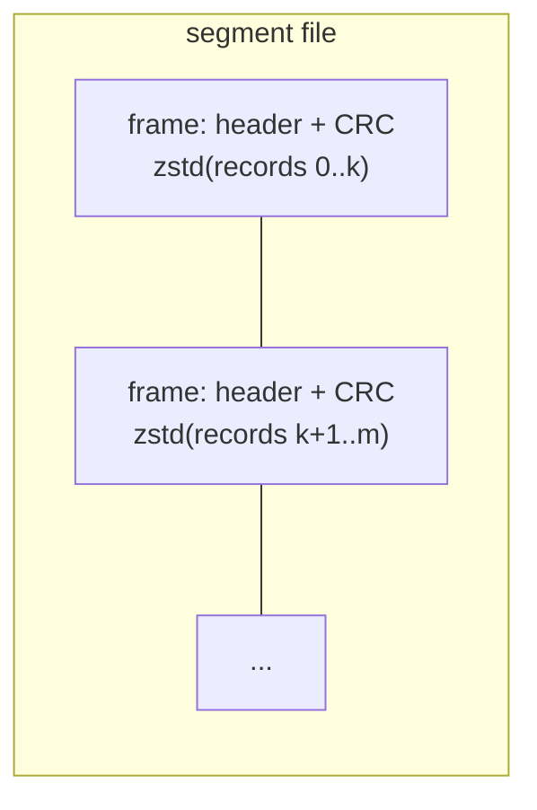
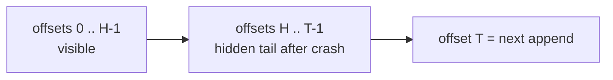
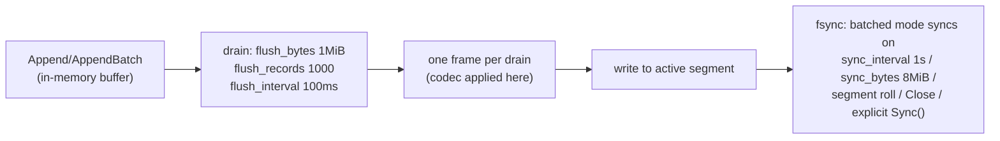

# Storage Engine

Every partition is a directory owned by exactly one node. The engine underneath is a compressed, CRC-checked, segmented log with a visibility watermark and a retention reaper.

## On disk

```
topics/orders/p00003/
├── 00000000000000000000.log     ← sealed segment (starts at offset 0)
├── 00000000000000450832.log     ← active segment (starts at offset 450832)
├── hwm                          ← 8-byte high-watermark
└── consumer.offset              ← 8-byte committed consumer frontier
```



- **Segments** are capped at 64 MiB; an append that would overflow seals the segment and rolls a new one named by its first offset. Sealed segments are immutable — the unit of retention deletion.
- **Frames** are the write unit: all records drained in one flush become one frame — length-prefixed records, compressed together (zstd by default), CRC over the stored bytes. Frame size therefore tracks batch size: trickle traffic gives per-record frames (~40% compression on JSON-ish payloads); busy traffic gives multi-hundred-record frames (~95%+, since similar records compress against each other).
- **Records** carry the keyed envelope: `[version][key][commit-time][payload]`. Commit time is assigned under the partition lock, so it is monotonic per partition — the property the [delay gate](fanout-engine.md) relies on.

## Write path: buffer → flush → sync

Appends go into an in-memory buffer; a flusher goroutine drains it into frames and writes them out; fsync policy is configurable (per-write or batched). The **commit path bypasses the leniency**: `Log.Sync()` forces drain + fsync synchronously, then re-reads and CRC-verifies the new frames, and only then advances the high-watermark. Buffered data lost in a crash was, by construction, never acked to anyone.

## The high-watermark and the hidden tail

The **HWM** is the exclusive bound of what consumers may see. It advances in memory at commit and is persisted (single-sector atomic write + fsync) at a bounded interval. Recovery trusts the persisted file, clamped to the recovered tail — which creates a deliberate artifact:



Records above the persisted HWM after a crash — fsynced but never re-exposed — stay hidden on purpose: for produce-path records, the ingress WAL **re-commits them at fresh offsets** (its checkpoint never passed them), so exposing the hidden copy would double-deliver. New commits append past the hidden tail and advance the HWM over it, at which point the duplicates become visible — duplicates, never loss, and only around crashes.

## Recovery

Opening a log scans segments for the valid frame extent:

- A **torn tail** in the active segment (crash mid-write) is truncated — those bytes were never acked.
- **Mid-file corruption** under valid later frames is *not* truncated (that would destroy acked data and regress offsets); it fails loudly at open, and unreadable single records are skipped at consume time with an explicit counter — recorded loss, never silent.

## Retention

A per-partition reaper sweeps every minute and deletes **sealed segments whose last write is older than the topic's `retention_ms`**. Granularity is the segment: data lives until its whole 64 MiB segment ages out, so real retention oscillates between `retention` and `retention + one segment's fill time`. Deletions export bytes/messages counters (`reason="age"`).

The consumer frontier (`consumer.offset`, atomic temp-file rename, ~100ms cadence) is recovered lazily when a partition's queue state is first touched — from the file on disk, deliberately *not* from a boot-time metastore scan, so a stale replica at startup can't misplace consumption progress.
## The frame format, byte by byte

From `storage/format.go`, and yes, the magic is `0xCAFE`:

```
offset 0   magic         2B   0xCA 0xFE
offset 2   flags         1B   bits 0-2: codec (0=none, 1=zstd)
offset 3   recordCount   4B   big-endian int32
offset 7   baseOffset    8B   big-endian int64 — first record's offset
offset 15  uncompressed  4B   payload size before codec
offset 19  compressed    4B   payload size on disk
offset 23  crc32c        4B   Castagnoli over header[2:23] + payload
offset 27  payload            [len:4BE][record bytes] × recordCount, codec-encoded
```

The CRC deliberately excludes the magic so the recovery scanner can hunt for `0xCAFE` cheaply when resynchronizing past a torn region. A 256 MiB `maxFrameBytes` bound is enforced on both write and read, so a corrupt header can never talk recovery into allocating the moon.

Inside each record sits the **keyed envelope** (`storage/keyed_record.go`):

```
[version:1B = 0x02][keyLen:uvarint][key][committedAtUnixMs:8B BE][payload]
```

The commit timestamp is assigned under the partition produce lock — that's the per-partition monotonicity the delay gate stands on.

## The flusher pipeline, with its actual knobs



Two things make this safe rather than sloppy:

- **The commit path doesn't negotiate.** `Log.Sync()` (called by `commitDurable` on every produce commit) synchronously drains, writes, and fsyncs — the lazy timers above only govern data nobody has been promised yet.
- **Reads are self-verifying.** Every frame decode re-checks the CRC; `VerifyDurable` re-reads the just-written frames *before* the high-watermark moves. Decoded frames and frame positions are cached (`frameCache`, `navCache`), both invalidated under the write lock when retention deletes a segment.

## Long-poll wiring, since everyone asks

An idle consumer isn't polling: it parks on the partition log's broadcast channel (`Log.NotifyC`). The channel is *closed* to broadcast — commit, lease expiry, and nack all `notifyAll()`, every parked waiter wakes, re-checks, and either grabs a message or parks on the fresh channel. Zero timers, zero missed wakeups (a waiter that raced the close sees the already-closed channel immediately).
