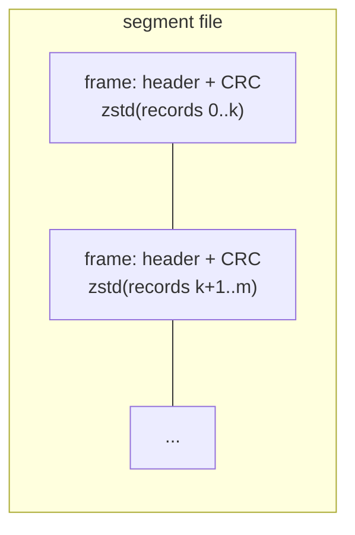
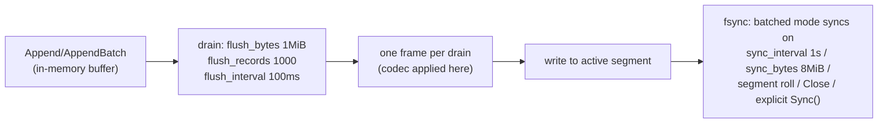

# Storage Engine

Every partition is a directory owned by exactly one node. The engine underneath is a compressed, CRC-checked, segmented log with a visibility watermark and a retention reaper.

## On disk

```
topics/orders/
├── incarnation                  ← the topic incarnation this directory belongs to
└── p00003/
    ├── 00000000000000000000.log     ← sealed segment (starts at offset 0)
    ├── 00000000000000450832.log     ← active segment (starts at offset 450832)
    ├── hwm                          ← 8-byte high-watermark
    └── consumer.offset              ← 8-byte committed consumer frontier
topics/orders.stale-3f9a1c0e7b2d4a61/   ← quarantined: a deleted incarnation's leftover
```

Everything under the data directory that the engine creates is private to the broker's user: directories `0700`, files `0600` (segments, `hwm`, `consumer.offset`, fan-out cursors, the incarnation marker, transferred segments, and the ingress WAL's directory and segments). Segments carry every message payload, so they get the same protection `fsm.db` (password hashes) already had. Modes are applied at creation only; a file or directory created by an older binary keeps the mode it was created with, so tighten those by hand if the host is shared.

### The incarnation marker

Topic directories are keyed by name, and a name outlives the topic: delete `orders`, recreate `orders`, and the new topic's partition logs open exactly where the old one's segments, high-watermark and consumer offset sit on any node that missed the purge (it was down, or the purge lost the race with the recreate). Served as-is, the recreated topic would hand consumers the deleted topic's messages and append new produce after them.

So every topic record carries an **incarnation id** (`id`, 16 hex characters, minted by the proposer at create time and preserved by every update), and every topic directory a marker file, `topics/<name>/incarnation`, holding the id of the incarnation it belongs to. The marker is stamped the first time a node opens a partition log for the topic, or installs a moved partition, and every open compares it with the metastore record before serving the directory:

- **match**: served;
- **no marker**: the directory predates markers and is adopted (stamped with the current id), the one-time upgrade path; a record without an id keeps name-based bookkeeping and stamps nothing;
- **different marker**: the directory is a deleted incarnation's leftover. Any open logs under the name are closed, the whole directory is renamed to `topics/<name>.stale-<oldid>` (quarantined, never served), an error is logged with both ids, and a fresh directory is opened for the current id.

An already-open log is re-checked whenever the topic's metadata version moves, so a delete plus recreate applied while the log was open retires it rather than serving the old data. The transfer listing a move source serves reads the directory without opening a log, so it performs the same comparison itself and refuses a stale directory.

A quarantined directory is reclaimed only after the **leader** confirms that incarnation is gone (the record is absent, or carries a different id): by the purge for that incarnation if it still arrives, by the startup orphan sweep, or by the periodic sweep the move runner performs. Older binaries never read the marker and ignore the file.


```mermaid
flowchart LR
    subgraph segment file
        F1["frame: header + CRC<br/>zstd(records 0..k)"]
        F2["frame: header + CRC<br/>zstd(records k+1..m)"]
        F3[...]
    end
    F1 --- F2 --- F3
```

- **Segments** are capped at 64 MiB. A frame that pushes the active segment past the cap marks it full and fsyncs it; the roll itself (a new segment named by its first offset) happens at the end of the commit that filled it, at Close, or right before the next frame write, whichever comes first, and a segment also rolls before the first write that finds its oldest record older than the retention roll age (see Retention). Sealed segments are immutable: the unit of retention deletion.
- **Frames** are the write unit: all records drained in one flush become one frame: length-prefixed records, compressed together (zstd by default), CRC over the stored bytes. Frame size therefore tracks batch size: trickle traffic gives per-record frames (~40% compression on JSON-ish payloads); busy traffic gives multi-hundred-record frames (~95%+, since similar records compress against each other).
- **Records** carry the keyed envelope: `[version][key][commit-time][payload]`. Commit time is assigned under the partition lock, so it is monotonic per partition, the property the [delay gate](fanout-engine.md) relies on.

## Write path: buffer → flush → sync

Appends go into an in-memory buffer; a flusher goroutine drains it into frames and writes them out; fsync policy is configurable (per-write or batched). The **commit path bypasses the leniency**: `Log.CommitDurable` forces drain + fsync synchronously on the flusher goroutine, re-reads and CRC-verifies the new frames, persists the new high-watermark, and only then advances it in memory. Buffered data lost in a crash was, by construction, never acked to anyone.

Records drained out of the buffer sit in a **flushing snapshot** until an fsync proves their frame durable; a failed segment write is retried from the unwritten suffix on the next drain, and the in-memory copy is released only after the sync. On the commit path the sync is part of the same drain, so the snapshot never outlives a commit.

### When a commit fails

A commit can fail at the write (`ENOSPC`, `EIO`), the fsync, the CRC read-back, the segment roll, or the high-watermark persist. The records are acked to the producer only by the ingress WAL, which re-commits any batch whose `CommitDurable` did not return success by appending the same records again. So a failed commit must leave **nothing** of the batch behind: if the first copy stayed in the log (in the snapshot, or already written and fsynced), the retry would append a second copy at fresh offsets and its commit would advance the high-watermark past both, delivering every record of the batch twice, permanently, without any crash.

Before the error reaches the caller, the flusher discards the uncommitted tail: everything above the high-watermark is dropped from the buffer and the snapshot, the active segment is truncated back to the first frame at or above the high-watermark (and the truncate fsynced), the sparse index and the caches forget the cut frames, and the next append is assigned the offset the failed batch had. The retry lands exactly one copy at the same offsets. The lazy roll above is what makes this always possible: a commit's frames are never sealed into an immutable segment before the commit has returned.

### When fsync fails

An fsync failure is final for the log. After a failed `fdatasync` the kernel may already have dropped the dirty pages (Linux marks them clean and reports the error once), so a second fsync that "succeeds" proves nothing about the bytes that failed, and the tail of the segment past the last good sync is of unknown content. This is the PostgreSQL fsyncgate lesson: the only sound recovery is the one a crash would get. Narad does not crash the node (other partitions on it are fine), but it treats the log as crashed: the error is **latched** (`storage.ErrLogPoisoned`, wrapping the original error), every later append and commit on that log fails with it, the failure is logged at error level and counted (`errors_total{component="storage",kind="fsync_poisoned"}`), and the state clears only when the log is reopened and its files rescanned. Reads of committed records keep working. Nothing acked is lost: records above the last durable tail are still in the ingress WAL, which reroutes them to a sibling partition after a few failed passes and re-commits them here after the reopen.

## The high-watermark and the hidden tail

The **HWM** is the exclusive bound of what consumers may see. A commit persists it (single-sector atomic write + fdatasync, through a descriptor kept open for the life of the log) *before* advancing it in memory, so a committed record is never visible with an unpersisted boundary; a bounded interval covers any other advance. Recovery trusts the persisted file, clamped to the recovered tail, which creates a deliberate artifact:


```mermaid
flowchart LR
    A["offsets 0 .. H-1<br/>visible"] --> B["offsets H .. T-1<br/>hidden tail after crash"]
    B --> C["offset T = next append"]
```

Records above the persisted HWM after a crash (fsynced but never exposed: the commit failed or the crash landed between the fsync and the HWM persist) stay hidden on purpose: for produce-path records, the ingress WAL **re-commits them at fresh offsets** (its checkpoint never passes a batch whose commit did not return, and a commit only returns once the HWM is persisted), so exposing the hidden copy would double-deliver. New commits append past the hidden tail and advance the HWM over it, at which point the duplicates become visible: duplicates, never loss, and only around crashes.

## Recovery

Opening a log scans segments for the valid frame extent:

- A **torn tail** in the active segment (crash mid-write, including a crash in the middle of a commit's frame write) is truncated and the truncate fsynced; those bytes were never acked by this log, and the ingress WAL re-commits the batch at the offset it had. A last frame whose bytes are all present but do not check out (a zero-filled or scrambled final sector: the file size reached the disk, the data did not) is a torn tail too, as long as no valid frame follows it; left in place, its intact-looking header would shadow the frames the next commits write at the same offsets.
- **Mid-file corruption** under valid later frames is *not* truncated (that would destroy acked data and regress offsets); it fails loudly at open, and unreadable single records are skipped at consume time with an explicit counter: recorded loss, never silent.

### What a lying fsync costs

Every durability decision above assumes `fdatasync` tells the truth. A drive (or a virtualised disk) that acknowledges a flush it never performed can lose, at a power cut, any record whose commit was acked on the strength of the lie: the frames are gone (the segment sync lied), or the high-watermark that exposed them regressed (the `hwm` sync lied) and they sit in the hidden tail until the ingress WAL re-commits them at fresh offsets. That is the hardware's loss, not the engine's, and it is bounded to exactly those records. What must never happen, and what the disk-fault tests in `storage` and `wal` pin under a lying-fsync simulation (`fault_test.go`, driven by the `syncfile` fault seam that fails or skips a chosen syscall for tests only): a torn or fabricated record served, a crash loop at open, a sparse index that disagrees with the file, a record from a fully honest commit missing, or a high-watermark that grew past what the crash left.

## Retention

One process-wide reaper loop (a single goroutine, not one per partition) sweeps every open partition log with an age bound about once a minute and deletes **sealed segments whose last write is older than the topic's `retention_ms`**. Granularity is the segment, and two rules keep a segment from outliving retention on a partition that never fills one:

- **Time-based roll.** The flusher rolls the active segment before the first write that finds the segment's oldest record older than the roll age (`RetentionConfig.MaxSegmentAge`, which defaults to `MaxAge`). A partition writing 1 MiB a day with a 7-day retention used to keep its oldest records for months (until the 64 MiB segment filled, then one more retention period); now the segment is sealed after at most one retention period of writes.
- **Rotation of an idle active segment.** A partition that stops writing never triggers the roll, so the reaper asks the flusher to seal an active segment whose last write is older than `MaxAge` (every record in it has expired) and deletes it in the same sweep. Only a fully committed segment is rotated; one that still holds records above the high-watermark waits for the ingress WAL to re-commit them first, so the failed-commit discard above always finds them in the active segment.

Together these bound a record's lifetime by `MaxSegmentAge + MaxAge + CheckInterval`, so with the defaults a record is gone within about twice the retention age of its write. For a segment recovered from disk the roll age counts from the file's mtime (its last write), the only write time the inode keeps, so such a segment can live up to one write-span longer.

The reaper's bookkeeping is cheap: every segment caches its first and last write time (the reaper never stats a file per sweep), a sweep detaches expired segments under the write lock but unlinks the files after releasing it (a restart with a backlog of expired segments no longer stalls the partition's readers and flusher for the whole batch of unlinks), and a failed unlink is logged and counted (`errors_total{component="storage",kind="retention_unlink"}`) rather than silently dropped while the file keeps consuming disk. Sealed segments do not pin a file descriptor: recovery releases a sealed segment's handle after scanning it, the first read reopens it lazily, and the handle goes away with the segment's sparse index when it leaves the two-segment hot set, so a partition with days of history holds a handful of descriptors, not one per segment. Deletions export bytes/messages counters (`reason="age"`).

Two things keep retention running when the happy path does not. The shared loop is supervised: a sweep that panics is logged and skipped for that partition rather than taking retention down for every partition on the node, and a loop that stops ticking for a minute is replaced (`narad_reaper_restarts` counts the replacements; past a cap the log line is the alarm). And the loop only sees *open* logs, so a partition closed by idle eviction, or never reopened since a restart, would keep its expired segments until something touched it. The cold-retention walk (`storage.cold_retention_walk_ms`, see [Configuration](../operate/configuration.md)) lists the partition directories on disk every few minutes, stats the closed ones without opening them, and for one holding an expired segment opens the log, runs a single sweep through the same roll, detach and unlink path, and closes it again (`narad_cold_retention_swept_total`).

The consumer frontier (`consumer.offset`, 8 bytes overwritten in place as a single-sector atomic write + fdatasync, ~100ms cadence; an empty file left by a crash between create and first write reads as "no offset") is recovered lazily when a partition's queue state is first touched, from the file on disk, deliberately *not* from a boot-time metastore scan, so a stale replica at startup can't misplace consumption progress.
## The frame format, byte by byte

From `storage/format.go`, and yes, the magic is `0xCAFE`:

```
offset 0   magic         2B   0xCA 0xFE
offset 2   flags         1B   bits 0-2: codec (0=none, 1=zstd)
offset 3   recordCount   4B   big-endian int32
offset 7   baseOffset    8B   big-endian int64, first record's offset
offset 15  uncompressed  4B   payload size before codec
offset 19  compressed    4B   payload size on disk
offset 23  crc32c        4B   Castagnoli over header[2:23] + payload
offset 27  payload            [len:4BE][record bytes] × recordCount, codec-encoded
```

The CRC deliberately excludes the magic so the recovery scanner can hunt for `0xCAFE` cheaply when resynchronizing past a torn region. A 256 MiB `maxFrameBytes` bound is enforced on both write and read, so a corrupt header can never talk recovery into allocating the moon.

Inside each record sits the **keyed envelope** (`storage/keyed_record.go`):

```
[version:1B = 0x02][keyLen:uvarint][key][committedAtUnixMs:8B BE][payload]
```

The commit timestamp is assigned under the partition produce lock; that's the per-partition monotonicity the delay gate stands on.

## The flusher pipeline, with its actual knobs


```mermaid
flowchart LR
    A["Append/AppendBatch<br/>(in-memory buffer)"] --> D["drain: flush_bytes 1MiB<br/>flush_records 1000<br/>flush_interval 100ms"]
    D --> F["one frame per drain<br/>(codec applied here)"]
    F --> W[write to active segment]
    W --> S["fsync: batched mode syncs on<br/>sync_interval 1s / sync_bytes 8MiB /<br/>segment roll / Close / explicit Sync()"]
```

Three things make this safe rather than sloppy:

- **The commit path doesn't negotiate.** `Log.CommitDurable` (called by `commitDurable` on every produce commit) synchronously drains, writes, fsyncs, verifies, and persists the high-watermark; the lazy timers above only govern data nobody has been promised yet.
- **`flush_interval` is not a heartbeat.** The flusher holds a timer only while a pass is actually owed: records sitting in the buffer, bytes written but not yet fsynced, a failed write waiting to retry, or a high-watermark ahead of the persisted one. An idle partition holds no timer and burns no CPU; an append into an empty buffer or a high-watermark advance re-arms it. That matters at scale, because the cost is per open partition: measured on 500 idle logs, an always-armed 100ms timer cost 2.7% of a core doing nothing, and the runtime's timer heap was most of it. It also means any new "do it later, the timer will pick it up" path needs a matching condition in `flusher.needsTimer`, or it is silently never scheduled once the partition goes quiet.
- **Reads are self-verifying.** Every frame decode re-checks the CRC; the commit path re-reads the just-written frames (streamed through a reused buffer, no per-frame allocation) *before* the high-watermark moves. Decoded frames and frame positions are cached (`frameCache`, `navCache`), both invalidated under the write lock when retention deletes a segment.

## Long-poll wiring, since everyone asks

An idle consumer isn't polling: it parks on the partition log's broadcast channel (`Log.NotifyC`). The channel is *closed* to broadcast: a commit's high-watermark advance, a lease expiry, a nack, and an ack that frees a cap slot or ends an ahead-full stall all `notifyAll()`; every parked waiter wakes, re-checks, and either grabs a message or parks on the fresh channel. Buffering or flushing a record does not broadcast (waiters gate on the high-watermark), and an ack that relieves nothing wakes nobody. Zero timers, zero missed wakeups (a waiter that raced the close sees the already-closed channel immediately).
