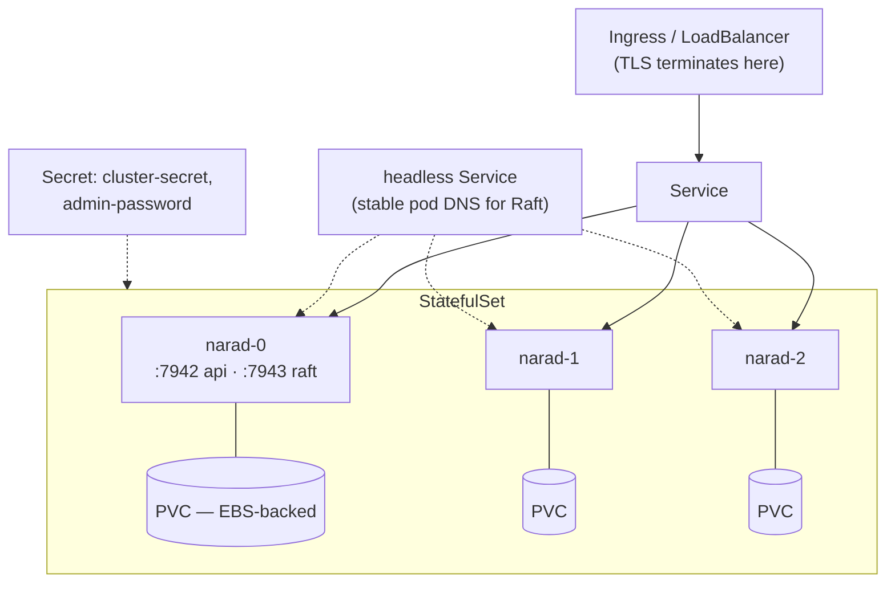

# Deployment

Everything on this page is how we actually run Narad — the same chart, the same knobs, verified against a live cluster that gets force-killed for sport. No aspirational YAML.

## The shape of a deployment



Four Kubernetes objects do all the work:

| Object | Job |
|---|---|
| **StatefulSet** | Stable identities (`narad-0…N`) — the pod name *is* the node ID |
| **Headless Service** | Stable DNS per pod, which is what the Raft peer list is made of |
| **Client Service / Ingress** | Round-robins client HTTP to any pod (any pod is the right pod) |
| **Secret** | `cluster-secret` (node-to-node auth) and optionally `admin-password` |

## Install, step by step

**1. Create the security secret** (the chart expects `<release>-security`):

```bash
kubectl create secret generic narad-security -n narad \
  --from-literal=cluster-secret="$(openssl rand -base64 32)" \
  --from-literal=admin-password="$(openssl rand -base64 24)"
```

`admin-password` is optional — omit it and the seeding node generates one and logs it exactly once at first startup. (Then you get to practice your log-searching skills. Setting it is easier.)

**2. Install:**

```bash
helm install narad ./charts/narad -n narad --create-namespace \
  --set replicaCount=3 \
  --set persistence.size=50Gi
```

**3. Watch it come up:**

```bash
kubectl get pods -n narad -w
# all pods Ready = Raft has a leader, replicas caught up, root admin seeded
```

That's the install. Really. (Every knob: [Helm Chart Reference](helm-chart.md).)

## Ports and probes

| Port | Protocol | What |
|---|---|---|
| `7942` | HTTP + QUIC | Client API, `/healthz` `/readyz` `/metrics`, and node RPC (QUIC) |
| `7943` | TCP (mTLS-capable) | Raft replication |
| `6060` | HTTP | pprof, only if enabled |

Probes matter and the chart wires them the only correct way:

- **`/healthz`** → startup + liveness. "The process is up." Answers immediately at boot, *before* the node is caught up — so a node recovering from a long outage is never murdered by its own liveness probe mid-recovery.
- **`/readyz`** → readiness. "Safe to route traffic here." Held false until the metastore replica is caught up (and, for a freshly scaled-out pod, until the leader admits it). A pod that isn't ready receives nothing — including a brand-new node that hasn't joined yet.

## Values that matter (grounded in our live cluster)

```yaml
replicaCount: 3
initialClusterSize: 3        # set once at first install, never change

image:
  repository: ghcr.io/debanganthakuria/narad
  tag: v0.2.0-beta.3         # pin releases, not master

persistence:
  size: 50Gi                 # see the disk-sizing math in Scaling & Recovery

narad:
  defaultRetentionAgeMs: 43200000   # topic default; topics can override
  maxConsumeWait: 10s               # long-poll ceiling
  config:                           # engine config → JSON file → --config
    storage:
      codec: zstd                   # compression is OFF by default; we turn it on
      compression_level: fastest

extraEnv:                    # Go runtime tuning we actually run with
  GOMAXPROCS: "5"
  GOMEMLIMIT: 1GiB
  GOGC: "400"

metrics:
  enabled: true              # ServiceMonitor for Prometheus operators
```

Two of those deserve a second look:

- **`initialClusterSize`** is the set of pods allowed to *bootstrap* a brand-new Raft cluster (`narad-0/1/2` at 3). Every pod beyond it joins the existing cluster instead. It is consulted only on an empty disk — set it once and forget it exists. Changing it later does nothing good and possibly something educational.
- **`narad.config.storage.codec: zstd`** — on-disk compression is **off by default**. We run zstd/fastest: ~40% smaller at low rate, up to ~95% smaller under real load for JSON-ish payloads, for near-zero CPU. Turn it on unless your payloads are already compressed.

## TLS story

Client TLS terminates at your ingress — Narad serves plain HTTP behind it. Node-to-node QUIC is authenticated by the cluster secret; Raft can additionally run mutual TLS (`NARAD_CLUSTER_TLS_{CERT,KEY,CA}_FILE`). Without certs, Raft is plaintext and the node says so loudly in its logs — restrict port 7943 with a NetworkPolicy either way.

## Single-node / laptop mode

No Kubernetes required for a test drive:

```bash
docker run -p 7942:7942 -v narad-data:/var/lib/narad \
  -e NARAD_SECURITY_ENABLED=false \
  ghcr.io/debanganthakuria/narad:v0.2.0-beta.3
curl -X POST "localhost:7942/v1/topics" -d '{"name":"hello","partitions":3}' -H "Content-Type: application/json"
```

A single node bootstraps itself as a one-member Raft cluster and behaves exactly like production, minus the surviving-node-failure part.
