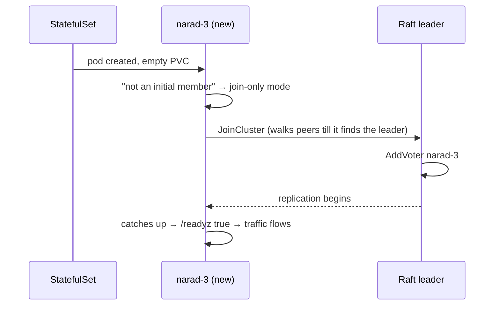

# Scaling & Recovery

The operations you'll actually perform, and what the cluster does when the universe performs operations on *you*.

## Scaling out

```bash
helm upgrade narad ./charts/narad -n narad --reuse-values --set replicaCount=5
```

What happens, in order (all automatic):



Admission typically lands in single-digit seconds. When a node joins, the leader **auto-rebalances**: it computes the minimal set of partition moves that re-balances owned-partition count across the live nodes and relocates them — copying each partition verbatim to its new owner and cutting over with a millisecond freeze at the very end. Moves drain gradually (bounded by an in-flight cap) and never lose a record. Watch it with `narad cluster moves` and `narad cluster members`. See [Rebalance & Decommission](../internals/rebalance.md) for the mechanics.

Real-world footnote from our own cluster: if you ever scaled with `kubectl scale` or patched replicas by hand, Helm's server-side apply may refuse with a field-manager conflict on `.spec.replicas`. Fix: drop the stale manager entry —

```bash
kubectl get statefulset narad -n narad --show-managed-fields -o json | # find the kubectl-* entry index
kubectl patch statefulset narad -n narad --type=json \
  -p '[{"op":"remove","path":"/metadata/managedFields/<idx>"}]'
```

## Scaling in

**Decommission a node before you remove its pod** — that drains its partitions off first, so nothing strands:

```bash
narad cluster decommission narad-4     # drain narad-4's partitions onto the others
narad cluster members                  # watch owned_partitions on narad-4 fall to 0
# once drained, the controller removes it from the Raft voter set; then:
helm upgrade narad ./charts/narad -n narad --reuse-values --set replicaCount=4
```

Draining marks the node so the rebalance planner stops sending it partitions and sheds everything it owns onto the others — the same verbatim-copy machine as scale-out, run in reverse. `narad cluster decommission narad-4 --cancel` aborts a drain in progress.

Two safety rails hold: the controller **never removes a node if it would drop the cluster below three Raft voters** (a quorum-safe floor), and it transfers leadership away first if the departing node is the leader. So `initialClusterSize` down to 3 is safe; below 3 the Raft removal is refused by design.

## What failure actually does

| Event | Cluster behavior | Your job |
|---|---|---|
| **One pod dies** | Leader failover ≤ ~1s if it led Raft. Its partitions 503 for consume; **produce reroutes to live partitions automatically**. Everything drains on return | Nothing. Maybe watch |
| **Pod dies and comes back** | Replica catches up; readiness gates traffic; cursors resume from durable positions; leases redeliver | Nothing |
| **Quorum lost** (2 of 3 down) | Data plane: produce **still accepted** on live nodes, new traffic flows. Control plane: topic/user changes wait for quorum | Bring pods back; don't panic-restart the survivor |
| **PV destroyed** | That node's partition data is gone — single copy by design | Restore from your volume snapshots. This is the one you plan for |
| **Rolling restart** | Leadership hands off gracefully (~150ms); we've force-killed pods *mid-rollout* under load with zero loss | Ship at will |

The one rule under the hood that makes recovery boring: **no node ever destroys data based on its own possibly-stale view** — every cleanup confirms with the Raft leader first, and every failure to confirm keeps the data. The [war stories](../internals/cluster-lifecycle.md) explain why we're this paranoid.

## Measured capacity

From a bench run against a 3-node cluster: **50,000 msg/s sustained through the full produce → consume → ack flow**.

The run ended because the load generator saturated, not the broker — treat 50k msg/s as a **floor**, not a ceiling.

## Disk sizing

Per node, roughly:

```
bytes ≈ (cluster msg/s ÷ nodes) × avg_stored_record × retention_seconds × 1.3
```

- `avg_stored_record` ≈ payload + ~20B envelope, then × your compression ratio (zstd: measure; we see 0.05–0.6 depending on batch fatness — compression improves under load because frames get fatter).
- `× 1.3` covers the retention sawtooth: deletion is per 64 MiB segment, so a partition holds up to `retention + one segment's fill time` of data.
- Fan-out children each store their **own full copy** — count them as separate topics in the math.
- Add the metastore (~tens of MB) and ingress WAL (self-reclaiming, sub-MB steady state) as rounding errors.

Worked example from our soak: 100 msg/s × ~250B JSON × 12h retention × 3 topic copies ≈ 1.4GB cluster-wide with zstd. Disk is cheap; run the math anyway.

## Backups

Narad's data plane is single-copy, and you have two tools against disk loss. **Replica children** are the online one: create a fan-out child with `parent` set and it becomes an asynchronous full copy of the topic, deliberately placed on different nodes than the parent's partitions (see [the replica pattern](../client/fanout-and-delay.md#replication-when-you-ask-for-it)) — RPO ≈ fan-out lag, and consumers can switch to it if the parent's node is lost for good. **Volume snapshots** are the offline one: EBS snapshots of the PVs on a schedule give you a consistent-enough restore point (segments are append-only; a mid-write snapshot loses at most an unacked tail, which was never promised to anyone). Metastore state snapshots along with everything else in the same data dir. Restore = new PV from snapshot, same pod identity, start the pod.
