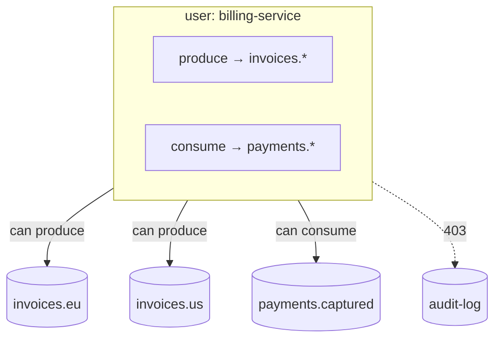

# Access model and grants

Look up which grant, ownership rule or admin right each Narad request needs.

```sh title="Request"
curl -i -u "$AUTH" "$NARAD/v1/users/billing-service"
```

```http title="Response"
HTTP/1.1 200 OK
Content-Length: 196
Content-Type: application/json
Date: Mon, 28 Sep 2026 19:31:44 GMT

{
  "username": "billing-service",
  "grants": [
    {"action": "produce", "patterns": ["invoices.*"]},
    {"action": "consume", "patterns": ["payments.*"]}
  ],
  "created_at_ms": 1790623904012,
  "updated_at_ms": 1790623904012
}
```

- `$NARAD` is the base URL of any node or of the load balancer, for example `http://127.0.0.1:7942`.
- `$AUTH` is `username:password` of a user with the `admin` grant.

With security on (the default), every `/v1` request carries HTTP Basic credentials, and three things decide what the user may do: its [grants](glossary.md#grant), whether it [owns](glossary.md#owner) the topic, and the `admin` grant. With security off (`narad server start --dev`), there is no user and every check passes. Getting credentials to a client is in [Connect and authenticate](../build/connect.md#credentials); creating users is in [Manage users and grants](../operate/users.md).



## Actions {#actions}

A grant is one action plus a list of topic-name patterns.

| Action | Allows |
|---|---|
| `produce` | Produce and batch produce to matching topics. |
| `consume` | Consume from matching topics, and ack, extend and nack what was consumed. |
| `create` | Create topics whose names match. The creator becomes the topic's owner. |
| `admin` | Everything: every topic, user management and the cluster routes. It takes no patterns. |

`produce` and `consume` are separate on purpose, so a producer cannot drain its own topic and a consumer cannot write to it. Any grant on a topic also lets the user read that topic's details ([Reads](#reads)).

## Patterns {#patterns}

A pattern is a topic name, or a prefix followed by one `*` at the end.

| Pattern | Matches | Does not match |
|---|---|---|
| `orders` | `orders` | `orders-eu` |
| `orders-*` | `orders-eu`, `orders-us`, `orders-` | `orders` |
| `*` | every topic | |

- A pattern uses the characters of a topic name (`A-Z a-z 0-9 . _ -`), up to 255 of them, and may end in `*`. A `*` anywhere else is refused with `400`.
- `produce`, `consume` and `create` need at least one pattern. `admin` must have none.

## Ownership {#ownership}

The user that creates a topic becomes its owner; the topic's `owner` field names it. Any `owner` sent in the create request is ignored. The owner, or any user with `admin`, may:

- change the topic (retention, caps, partitions, schema);
- delete it;
- read its details, schema history and children;
- attach it as a child, or attach a child to it. An attach needs this right on both topics; a detach needs it on either.

Ownership is stored as a username, and it never moves. A topic created while security was off has no owner, so once security is on only an admin can change or delete it. If a user is deleted and a new one is created under the same username, the new user owns the old user's topics.

## Reads {#reads}

- **Get a topic, its schema history, or a parent's children:** any grant whose pattern matches the topic name, whatever its action, or ownership, or `admin`. Anything else gets `403` (`no grant on this topic`). A topic that does not exist gets `404` either way.
- **List topics:** any user. The list holds only the topics the user could read one by one. The filter runs after a page is cut, so a page can be short, or empty, while `next_page_token` is still set: keep paging until the token is empty.

## Admin only {#admin-only}

These routes need the `admin` grant, reads included:

- every `/v1/users` route, except a user changing their own password;
- every `/v1/cluster` route: members and moves (they show node addresses and topic names) and decommission.

## No escalation {#no-escalation}

The user routes enforce these rules, so an admin cannot hand out more power than the model allows:

- Only a user with `admin` creates users or changes grants.
- Only the root admin can give the `admin` grant.
- No one can change their own grants.
- The root admin's grants cannot change, the root admin cannot be deleted, and only the root admin can change its password.
- No one can delete their own account.
- A user without `admin` can change only their own password, and must send `current_password` to do it.

A request that breaks one of these gets `403`. Grant and password updates change only their own field, so two admins editing different fields of one user at the same time cannot undo each other. The root admin is created the first time a secured cluster starts; see [Manage users and grants](../operate/users.md#root-admin).

## Permissions by route {#by-route}

| Route | Needs |
|---|---|
| `POST /v1/topics` | `create` on the name; with `parent`, also ownership of the parent |
| `GET /v1/topics` | any user; the list is filtered |
| `GET /v1/topics/{topic}`, `GET /v1/topics/{topic}/schema` | any grant on the topic, or ownership |
| `PATCH /v1/topics/{topic}`, `DELETE /v1/topics/{topic}` | ownership |
| `POST /v1/topics/{parent}/children` | ownership of the parent and the child |
| `GET /v1/topics/{parent}/children` | any grant on the parent, or ownership |
| `DELETE /v1/topics/{parent}/children/{child}` | ownership of the parent or the child |
| `POST /v1/topics/{topic}/produce`, `.../produce/batch` | `produce` on the topic |
| `GET /v1/topics/{topic}/consume`, `POST /v1/topics/{topic}/ack` | `consume` on the topic |
| `PUT /v1/users/{username}/password` | the user themself, with `current_password` |
| every other `/v1/users` route, every `/v1/cluster` route | `admin` |
| `GET /metrics` on the API port | any valid credentials, or none with `http.metrics_unauthenticated` |
| `GET /healthz`, `GET /readyz` | nothing |

`admin` passes every check in the table. Each route's full entry is in the [HTTP API reference](http-api.md).
