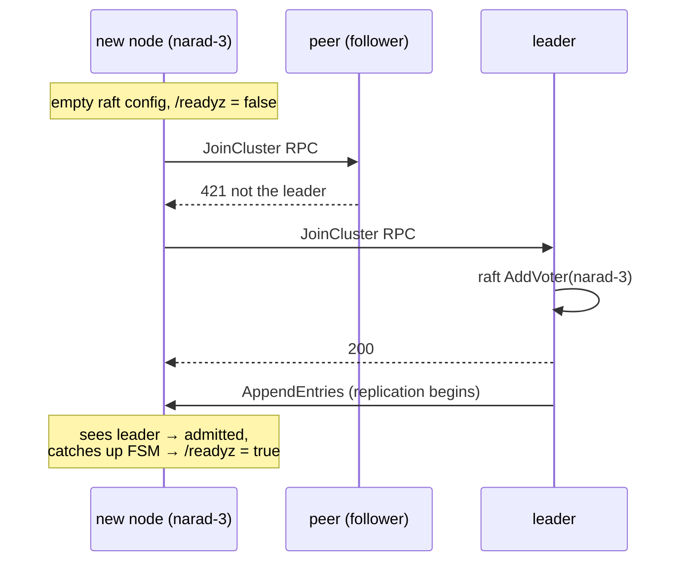

# Cluster lifecycle

Learn how a Narad cluster forms, grows, recovers from crashes, and handles a topic that is deleted and recreated under the same name.

!!! abstract "In short"
    - The initial members bootstrap one Raft configuration together. Every other node starts join-only and is admitted by the leader.
    - A node reports ready only while it has a leader in view and has caught up at least once, so a load balancer never sends traffic to an empty or stale replica.
    - Decommission removes a node from Raft and leaves a tombstone, so the old node cannot rejoin under its ID with its old data.
    - Four crash-recovery bugs shared one cause: a node restored from a snapshot trusted its stale view with something destructive. Every destructive step now needs the leader's confirmation.
    - Every topic carries an incarnation id, so a topic deleted and recreated under the same name never serves the old topic's data.

A cluster's crash-recovery design was not written down first and tested later. It came from killing live nodes under traffic until nothing broke any more, and the second half of this page records what those tests found.

## Cluster bootstrap {#bootstrap}

The first nodes (the `initial_members`, typically 3) each start with an empty disk and bootstrap the same Raft configuration; identical peer lists make that a legal bootstrap that converges. One wins the first election, and the controller on it seeds the root admin and starts assigning partitions.

## Scale-out: joining a cluster {#join}

A node *not* listed in `initial_members` must never bootstrap: it would create a phantom cluster that the real one never contacts. Instead it starts **join-only**:

The join loop walks the configured peers every 2 s until its own Raft sees a leader, which proves admission. Readiness is held until then, so an unadmitted node never receives traffic: a fresh node cannot serve an empty metastore behind the load balancer. `AddVoter` is idempotent, so joiner restarts and lost replies are safe. Scaling out is `replicaCount: 5` in Helm. The peer list the pods carry is pinned to the initial members, and each pod advertises its own address, so the existing members are not rolled by the scale.

Three answers mean something to a joiner:

- `200`: admitted.
- `421`: a configured node that is not the leader; try the next peer.
- `412`: a node with no Raft configuration at all (not bootstrapped, or itself waiting for admission); no evidence of a cluster.

"I am an initial member" does not prove membership, so two more situations end in the same loop:

- **Any node that sees no leader for 15 s runs the join loop**, initial member or not. A node that was decommissioned and removed from Raft, then restarted with its old volume, used to sit leaderless forever: it had state, so it did not bootstrap, and it was an initial member, so it did not join. Now it asks, and the leader decides.
- **An initial member that starts with an empty volume asks its peers before bootstrapping.** If any peer answers for a configured cluster (`200`, `421` or `409`), the node starts join-only instead of seeding a rival configuration from its peer list. On a brand-new install nobody answers yet, and bootstrap proceeds as before. If some pods have already bootstrapped, the rest join them; Raft grants votes to a node with an empty configuration, so the first election still completes.

New nodes receive partition assignments for topics created *after* they join, and the leader rebalances existing partitions onto them (see [Rebalance and decommission](rebalance.md)).

## Decommission removal {#decommission-removal}

A [decommission](../reference/glossary.md#decommission) ends with `RemoveServer`, which takes the node out of the Raft configuration. That alone leaves the member record behind. The pod keeps running until the operator scales it away, its heartbeat keeps registering it again through the leader, and it stays listed as alive and draining forever, walked on every route-table rebuild and delete broadcast. After the pod is deleted, the record would linger as dead forever.

So the controller applies a second Raft entry right after the configuration change: **remove member**, which deletes the record and leaves a tombstone for the ID. The state machine refuses to register a tombstoned ID, so no heartbeat can bring it back. The join handler answers `409` to the old incarnation of the node (still running, or restarted with its old volume), which therefore cannot undo its own decommission through the join loop.

A join request that declares an **empty data directory** is a deliberate re-add: the leader clears the tombstone and admits it as a new node. So to bring a pod back under a decommissioned name, delete its PVC first. The steps are in [Scale out and in](../operate/scaling.md#scale-in).

## Steady-state behaviour {#steady-state}

- Every node heartbeats its membership to the leader every 5 s; 30 s of silence marks it dead. A heartbeat from a removed (tombstoned) ID is refused.
- `/readyz` is live: a node answers ready only while it has a leader in view, has heard from it within 5 s (or is the leader), and its ownership view has caught up once since start. Losing the leader turns it not ready again.
- A dead node's partitions are **not** reassigned, because their data is on that node's disk. Produce reroutes around them, and a consume pinned to one of them fails until the node returns.
- Graceful shutdown transfers Raft leadership first, so planned restarts fail over in about 150 ms.
- Rolling restarts under full traffic were run dozens of times against the soak workload before it was removed in September 2026 (PR #211). The nightly [linearizability check](linearizability.md) now kills and partitions nodes under load every night.

## Crash recovery bugs {#crash-recovery-bugs}

All four bugs had one root cause: **a node restored from a Raft snapshot believes it is current while being hours stale**. Each bug was a different subsystem trusting that belief with something destructive. All four were found by force-killing pods under live soak traffic, with a harness that detected any lost message, and each fix was proven by the next kill.

| Found by | Subsystem and stale view | Effect |
|---|---|---|
| Kill 1 | The startup orphan sweep read a stale topic set | Deleted live topic directories |
| Kill 2 | The fan-out reconciler read stale attach epochs | Cursors anchored at the tail, skipping a delay child's backlog |
| Audit | The dispatcher trusted a topic's local absence | Could discard WAL records that had a `202` |
| Kill 3 | A fresh leader trusted its state machine while it was still replaying | The node that won the election lost data |

**1. The startup orphan sweep** compared the topic directories on disk with the (stale) local topic set and reclaimed "orphans", deleting live topics' data seconds after boot. *Fix:* deletion requires the **leader** to confirm the topic is gone, and every failure keeps the directory.

**2. Fan-out cursors** started from the stale view carried dead attach epochs. They did not match the (correct) offset files, so the cursors anchored at the tail and overwrote the files: cursors that had caught up re-anchored at the new tail and skipped the delay child's pending backlog without a trace. *Fix:* reconcilers wait for a provably current replica, anchoring at the tail requires an epoch the leader confirmed, and offset files are deleted only by their own epoch's cursor.

**3. The dispatcher's discard path** dropped WAL records whose topic was absent locally. The logic was sound ("replicas only move forward") until a snapshot restore broke it: every topic created after the snapshot reads as deleted. *Fix:* a discard requires a caught-up replica and the leader's confirmation that the topic is absent.

**4. The subtle one.** Fixes 1 to 3 had a shortcut: "if I *am* the leader, my local state is authoritative." Then a double kill made a freshly restarted node **win the election** (legal, since its *log* was complete) while its *state machine* was still replaying an old snapshot.

It confirmed a dead epoch from its own stale state and anchored at the tail. The follower that restarted beside it asked the real leader, was refused, and lost nothing; that difference between the two was the clue. *Fix:* a node that is the leader must pass a **Raft barrier** (state machine fully applied) and read its state again before trusting itself. An election proves the log; only the barrier proves the state.

The rules these fixes add up to are in [Stale replicas](metastore-and-raft.md#stale-replicas).

## Chaos test results {#chaos-results}

These scenarios ran under 300 messages per second of soak traffic, with a Redis ledger that detected any lost message. The soak harness was removed in September 2026; the nightly [linearizability check](linearizability.md) now kills and partitions nodes under load instead.

| Scenario | Result |
|---|---|
| Force-kill a follower owning parent partitions | cursors resumed from their files, zero loss |
| Force-kill the Raft leader | about 1 s failover, zero loss |
| Force-kill a child-partition owner | commits retried, zero loss |
| Force-kill two of three nodes (quorum loss, three times) | reads and produce degraded, full recovery, zero loss |
| Force-kill during a rolling restart | zero loss |
| Scale 3 to 5, then kill the leader and the new node together | quorum held at 5 nodes, zero loss |

Every scenario ended with bounded duplicates (the at-least-once seams) and `OVERDUE = 0`, the harness's loss detector.

## Lifecycle constants {#constants}

| Thing | Value |
|---|---|
| Join attempt cadence / proof of admission | every 2s / "my own Raft sees a leader" |
| Graceful leadership transfer | about 150ms; election after a crash about 1s |
| Heartbeat / dead marking | 5s / 30s |
| Startup reconcile wait for caught-up | up to 60s (the sweep is skipped on timeout, so data is never deleted in a hurry). The timeout never marks the node ready; it keeps waiting |
| Readiness | live: leader in view, contact within 5s (or the node is the leader), ownership latch set |
| Leaderless join | a node with no leader for 15s runs the join loop |
| Existing-cluster probe (empty volume) | 3 rounds, 1s apart, 2s per peer, before an initial member bootstraps |
| Trust in itself as leader | only after a Raft `Barrier` bounded at 5s and a new read; the ownership latch on a node that is the leader also needs the barrier |

## Topic incarnations {#incarnations}

A topic delete is two things: the Raft-committed removal of the record, and a best-effort purge of every member's directory on disk. The Raft commit is the commit point: from there the topic is gone for every client. The purge is broadcast to the live members after the commit, and purges are missed: a member can be down, unreachable, or slower to apply the delete than the leader is to broadcast.

Historically the two backstops were the startup orphan sweep (remove directories whose topic the leader confirms absent) and the purge handler's rule "wait until the local replica no longer shows the topic, else skip". Both keyed on the **name**, and a name is reused. Recreate `orders` quickly enough and the purge handler saw the name present again and skipped for good; a member that was down through the delete and the recreate kept the old directory because the name existed. Either way the recreated topic reopened the deleted one's segments, high watermark and consumer offset, and its consumers received the deleted topic's messages (observed in an audit, and reproduced in `TestRecreatedTopicDoesNotResurrectOldData`).

So every topic record now carries an [incarnation](../reference/glossary.md#incarnation) id (since v2.2.0), created by the proposer at create time and carried inside the Raft entry, so all replicas store the same value; the state machine derives nothing random itself. Every topic directory carries the marker of the incarnation it belongs to (see [Storage engine](storage-engine.md#incarnation-marker)). The delete path is keyed on it end to end:

- **The purge names the incarnation.** The delete handler reads the record's id before the delete removes it, and hands it to the purge broadcast. The receiver waits until its local record is gone *or belongs to a different incarnation*, then removes only the directory whose marker carries the purged id (and any quarantine of it). A directory the recreated topic already owns is left alone. A member running an older binary rejects the trailing id field with `400`; the sender then repeats the purge by name, which is the purge that member has always performed.
- **The purge and a concurrent open cannot interleave.** The purge holds the topic's open guard from closing the logs through unlinking the directory, so a lazy open of the same name either finishes before it (and is closed by it) or waits, then sees the directory gone. Before, `RemoveAll` ran outside the log map lock, and an open could land a log in a directory that was being unlinked. The purge also renames the directory to a quarantine name (`topics/<name>.stale-<id>`) before it removes it there, and drops the name's in-memory consumer state after the rename as well as after the removal (unreleased). The offset committer writes consumer files by path, so with a removal in place, an ack racing the unlinks could have the committer create files in the directory being removed. Its `rmdir` then failed with `directory not empty`, and a same-named topic created later adopted the unmarked leftover, with the deleted topic's frontier, and skipped its own first records.
- **Opens quarantine a stale directory and never serve it.** A node that missed the purge finds a marker for another incarnation on its next open. It sets the directory aside as `topics/<name>.stale-<oldid>` and opens a fresh, empty directory for the live incarnation. In-memory consumer state for the name is dropped right after the rename, before the fresh directory exists, so a committed frontier cannot carry over either. A drop waits for a rebuild of a consumer's queue state that already read the old files, and drops what it stores; a consume still holding the old incarnation's log reads `ErrLogClosed` from it, never a gap to skip.
- **Sweeps compare ids, not names.** The startup orphan sweep removes a directory whose marker is not the live topic's id, whether or not the name exists, and reclaims quarantined directories. Every removal still requires the leader to confirm (the record is absent, or carries a different id), and a node that is the leader must first pass a Raft barrier. The move runner's periodic sweep sets aside a directory of a deleted incarnation that no open would ever visit (this node owns none of the new incarnation's partitions) and reclaims quarantines, both confirmed by the leader. The stale-copy sweep never mistakes a deleted incarnation's partitions for stale copies of the live topic.
- **Moves carry the incarnation.** A source's transfer listing reports its copy's incarnation and refuses to list a directory whose marker is stale. The destination compares the reported incarnation with its own record before installing, and stamps the topic directory it installs into. The install's swap, the rollback after a rejected flip, and the source's reclaim of a moved-away copy act on the partition's path only under the topic's open guard, and only while the topic directory's marker names the incarnation they read, or, for the reclaim, is absent (unreleased). So a delete and recreate landing in the middle of a move never has them remove the successor's partition directory.
- **Accepted records carry the incarnation** (unreleased). A produce is written to the ingress WAL with the id of the topic record its payload was validated against, and the owner's commit, checked again under the partition's produce lock, refuses a batch stamped with any other id (`ErrTopicIncarnationMismatch`, retriable, nothing appended). Records without an id (written by an older binary, or for a topic created before v2.2.0, which has none) commit by name. The id travels on the commit RPC to other owners too, so the check covers every commit, local or remote; only an owner on a release from before the field gets the records without it and commits them by name. Before committing anything, the accepting node's dispatcher also holds back a record whose incarnation its replica shows was replaced, and discards it once the leader confirms (see [Discarding records of deleted topics](produce-path.md#discarding)).
- **Nodes forget the name.** The purge also drops the name's in-memory state on each node it reaches, including nodes that hold none of its files: the cached topic record, assignments and schema, consume cursors and queue state, and the partition commit combiners. The metastore retires the name's per-key version cells instead of keeping one per name ever created.

On upgrade, records without an id and directories without a marker keep the old name-based behaviour. The first open under a new binary adopts an unmarked directory by stamping it with the current id. Nothing is quarantined unless both sides carry an id and they differ.

## Ownership after a restart {#ownership-after-restart}

A node decides "do I own this partition" from the assignments in its local metastore replica. Right after a restart that replica lags the cluster: it has not heard from the leader yet, and it may be missing every assignment change made while the node was down. Acting on that view is how a node once took ownership of partitions that had been reassigned in the meantime (a topic deleted and recreated under the same name while it was down). It committed dispatched records into a fresh directory at offset 0, handed them to consumers, and then lost them when the stale-copy sweep, confirmed by the leader, reclaimed the directory.

So `ListAssignments` and `GetAssignment` refuse with `ErrUnavailable` until the replica has caught up with the leader at least once since the process started (`AppliedCaughtUp`). Every ownership decision goes through those two calls, and every caller treats the error as transient: the ingress dispatcher leaves its records in the WAL, a forwarded commit or consume is retried by its sender, the fan-out and move reconcilers skip the pass, a stats query skips the partition, and HTTP answers `503`. The latch never clears once set; replica lag in steady state is coordinated through the move handoff protocol, not through this gate.

"Caught up" has to be measured against the **leader's** commit index, not the node's own. Two local numbers are not enough, and the second one is subtle:

- The freshness check (heard from the leader within 5 s) carries weight: without it a replica restored from a snapshot reads as caught up against its own indexes from before the restart.
- Raft's local `commit_index` is not the leader's. It is 0 after a restart (only `last_applied` is restored from the snapshot), heartbeats carry no commit index yet do refresh last-contact, and even a real `AppendEntries` caps it at the node's own last log index. A follower that has heard exactly one heartbeat satisfies `applied >= commit` (0 >= 0) with its state machine still at the snapshot. The leader's replication goroutine can back off for up to about 10 s after a node was down, so that window is real, and a node far behind that receives entries in batches reads `applied >= commit` after every batch.

The store therefore records the highest `LeaderCommitIndex` it has ever received on the Raft transport (a thin wrapper over the transport's consumer channel; heartbeats carry 0 and are ignored), and a follower is caught up only once `applied_index` has reached that value. A leader compares against its own `commit_index`, which is authoritative once its no-op entry for the term has committed (until then it is 0 in a fresh process). A node that is the leader also passes a Raft barrier before the ownership latch sets: an election proves the log, only the barrier proves the state.

One more number matters, and it is not Raft's. Raft advances `applied_index` when it has *queued* a batch of entries for the state machine goroutine, and its `fsm_pending` counts the batches still queued, not the one being applied. A node restarting without a recent snapshot replays its whole log from index 1 into the state machine in batches of 64. On those two numbers it read as caught up while the state machine was still applying the last batch, the one holding the newest entries. The latch then set on a view from before a partition changed owner, the node treated a partition it had just handed off as its own, committed replayed produce records into its stale copy, and the reclaim sweep later quarantined them (found by the rolling-restart scenarios in `tests/cluster`).

So the state machine keeps its own durable applied index (set after each entry's bbolt transaction commits), and `AppliedCaughtUp` also requires that no `LogCommand` sits between that index and Raft's `applied_index`. The gap is read from the log store, and it is a couple of entries when caught up (a fresh leader's no-op, a configuration change: entries the state machine never sees).

## Next steps

- [Rebalance and decommission](rebalance.md): how partitions move between nodes without losing a record.
- [Scale out and in](../operate/scaling.md): the operator steps for adding and removing nodes.
