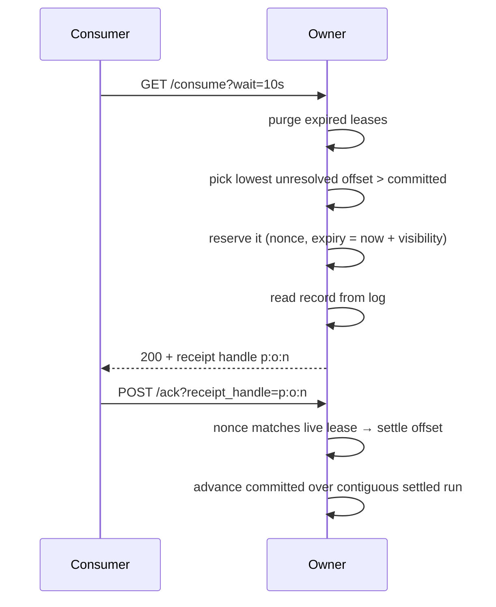
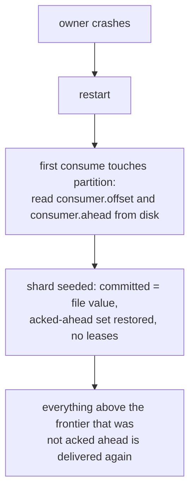

# Consume path

Learn how Narad hands each message to one consumer at a time: in-memory leases, a durable frontier of settled messages, and consumes across nodes.

!!! abstract "In short"
    - The owner of a partition leases each visible message to one consumer at a time, and remembers the lease only in memory. A crash forgets leases, and the messages are delivered again.
    - What is settled is a durable frontier per partition, plus the offsets acked out of order above it. Acks reach the page cache within about 100 ms and the disk within about the durability interval (1 s by default) (unreleased; v3.0.1 syncs every changed partition every 100 ms).
    - A consumer that finds nothing waits in a queue. One pump per node hands each new record to exactly one waiter, so cost scales with messages delivered, not with consumers waiting.
    - A node that holds a consumer but not the data leaves a delivery token with each remote owner, and claims the record when an owner tells it one arrived.
    - After an outage, a lease stranded at the bottom of a partition can hold that partition quiet for up to one visibility timeout.

Queue consumption is a leasing protocol. The [owner](../reference/glossary.md#owner) of a partition hands each visible message to exactly one consumer at a time, remembers the [lease](../reference/glossary.md#lease) in memory, and keeps a durable frontier of what is settled. Everything above the frontier can be rebuilt; everything below it is finished for good.

## In-flight table {#in-flight-table}

Each owned partition has a shard of the **InFlight** tracker:

<figure class="nr-dia nr-dia--doc" id="fig-consume-offset-strip">

--8<-- "diagrams/consume-offset-strip.html"

<figcaption>The committed frontier is the last offset up to which everything is acked; leases and the acked-ahead set sit above it. Only the frontier and the acked-ahead set reach the disk, in <code>consumer.ahead</code> and <code>consumer.offset</code>.</figcaption>
</figure>

- **`committed`** is the [committed frontier](../reference/glossary.md#committed-frontier): the last offset up to which *everything* is acked. It advances contiguously. It is persisted in the frontier field of every `consumer.ahead` record, and in `consumer.offset`, which is brought level with it at most every 30 s and at a graceful stop (see [Ack persistence](#how-acks-reach-the-disk)). Recovery takes the larger of the two.
- **Reservations** are leased offsets, each with a **nonce** and an expiry. The [receipt handle](../reference/glossary.md#receipt-handle) a consumer holds is `partition:offset:nonce`; the nonce is what makes a stale handle detectable.
- **`ackedAhead`** is the [acked-ahead set](../reference/glossary.md#acked-ahead-set): acks that arrived out of order, parked until the gap beneath them closes. It is bounded by `max_acked_ahead_per_partition` and persisted in `consumer.ahead`.
- The whole shard is memory-only except `committed` and the acked-ahead set. A crash forgets the leases, and the messages are simply delivered again. That is the entire crash story for consumption.

## Reserve, deliver, settle {#reserve-deliver-settle}

The details that carry the correctness:

- **Reservation comes before the read.** An offset is claimed first, then read, so two consumers can never receive the same live copy.
- **An ack is checked by (offset, nonce).** An offset that expired and was reserved again has a new nonce, so the late original acker gets `410 Gone` instead of settling someone else's lease. An [extend](../reference/glossary.md#extend) is checked the same way and re-arms the expiry; a [nack](../reference/glossary.md#nack) releases the lease and wakes waiting consumers at once.
- **Expiry is proactive.** A min-heap purge runs on every touch of the partition, plus a background purger every second, so redelivery after a consumer dies takes the [visibility timeout](../reference/glossary.md#visibility-timeout), not "whenever someone next polls".
- **Nobody scans and nobody races.** A consume that finds nothing does not park on a broadcast channel. It joins the topic's waiter FIFO and blocks on one buffered channel, and a single **pump** goroutine per broker does the reservation once and hands the record to exactly one waiter. The design this replaced closed a broadcast channel on every commit: every parked consumer woke, rebuilt a `reflect.SelectCase` slice, took the partition shard mutex and scanned, and all but one found nothing. The cost per commit now scales with *messages delivered* rather than with *consumers waiting*.
- **The pump waits on two things at once**, and wakes on a change to either: a waiter arrived (joining the queue kicks the pump), or records became available (the log's wake notifier fires on a high-watermark advance, a nack, a lease expiry or a close; see [Wake-ups](storage-engine.md#wakeups)). Waking on only one of them is a well-known bug: a consumer that arrives *after* the data would wait for a record that has already landed. The same holds while the pump holds a waiter it popped. The topic can then look waiter-less to the wake notifier (the flag in the last item below), which drops a wake that arrives meanwhile, so a pump that puts its waiter back and finds the flag cleared runs again.
- **Nothing is reserved speculatively.** The pump reserves only once it has taken a waiter off the queue, so there is no local give-back path at all. The one exception is explicit: a record handed over at the instant its request is cancelled has nobody to receive it, so it is released at once rather than left invisible until its visibility timeout.
- **An idle topic costs nothing.** There is no polling and no timer. The wake notifier returns at once on an atomic flag when a topic has no waiter, keeping the produce path allocation-free. Measured: 600 consumers parked across a four-node cluster moved idle CPU by less than the noise floor. A deleted topic's queue state is dropped along with its other per-topic caches, so churning through uniquely named topics leaves nothing behind.

<figure class="nr-dia nr-dia--doc" id="fig-consume-pump">

--8<-- "diagrams/consume-pump.html"

<figcaption>Each record is reserved once, for the waiter at the head of the queue; the others keep waiting, and nobody scans.</figcaption>
</figure>

## Cross-node consume: delivery tokens {#delivery-tokens}

A consumer's request lands on whichever node the load balancer picked, which usually does not own the partition its record arrives on. Narad takes partitions from Kafka and a client that knows nothing about routing from SQS, and gathering records across nodes is the result of combining those two choices. Neither parent has it: Kafka's client goes straight to the partition leader, and SQS exposes no partitions at all.

The node holding the consumer leaves a [delivery token](../reference/glossary.md#delivery-token) with every remote owner of the topic:

<figure class="nr-dia nr-dia--doc" id="fig-consume-delivery-tokens">

--8<-- "diagrams/consume-delivery-tokens.html"

<figcaption>A token reserves nothing; the owner where a record commits spends one, and only the claim takes the record. The token left on <code>narad-2</code> lapses at its time to live.</figcaption>
</figure>

The properties that make it work:

- **A token reserves nothing.** It says only "I am here, tell me if records show up". That removes the whole give-back problem: an owner that never hears back from a peer has stranded no record, because it never took one out of circulation. Only the *claim* reserves, and it is aimed at exactly one node.
- **One token, one record, one peer told.** Never a broadcast. An `outstanding` counter gates notifications against the estimate of available records: the high watermark minus the ack frontier, minus records in flight or acked ahead of a gap. For a partition with no queue state loaded yet, the frontier and acked-ahead set come from `consumer.offset` and `consumer.ahead`, read the way recovery reads them. So the same record is never promised to two peers. A peer that declines (`pass`) retires its claim at once, and the record is offered to the next holder a round trip later, rather than after a deadline.
- **A hold lives exactly as long as the claim is in flight.** Between the notification and the claim, the owner holds the record back so the pump cannot promise it to a second peer. The claim carries a `Claim` flag on the wire, and the owner retires the hold the moment a flagged claim arrives; a plain probe is never a claim, so it can never release a hold promised to someone else. A claim that never comes (the consumer left, or lost the race) falls back to a deadline. When every hold ran to that deadline, it was counted against the *next* record too, so a consumer parked on another node saw each message of a sparse stream arrive about a second late. The flag is a trailing optional field. An owner on a release before it answers `400`; the claimant then retries that owner as a plain probe (which reserves the record just the same; only the hold keeps its deadline behaviour) and remembers it for two minutes. So a rolling upgrade costs one refused claim per old owner per TTL rather than one per record.
- **Tokens are single use and short-lived.** Firing one consumes it, so a stale token costs exactly one notification rather than one per record for its whole life. Each carries a TTL the requester sizes to its consumer's remaining wait (plus the 250 ms share window below), so a peer that dies leaves nothing behind for longer than one wait. Crash recovery for this subsystem is *do nothing*: a restarting node rebuilds its tokens by registering again.
- **One token per (requesting node, topic), shared by every consumer parked there.** An owner replaces the token on re-registration rather than stacking tokens, so a node with many consumers parked on one topic gets one notification per registration. The requester therefore tracks its registration per owner. A notification spends that owner's token, so the requester forgets its registration there at once, and the keeper puts a fresh one back within 500 ms if anyone is still parked. The keeper checks every 500 ms that each owner of a topic with parked consumers holds a live token from this node, and sends each registration again after at most 5 s regardless.
- **Consumers share a recent registration** (unreleased). Consumers that park within 250 ms of a registration share it instead of sending their own, unless its TTL ends before their deadline. The window is short because an owner's reply only says the frame arrived, not that the token is still held. A consumer woken by a notification it cannot use (it was served locally, or its budget ran out, at that instant) passes the wake to the next consumer parked on the node, which claims the record the owner is holding for it. Replacing a token costs O(1), amortized, under the topic's lock, as does a consumer on the owner giving up its place in the queue: the old entry is marked where it stands and skipped, not searched for, and marked entries are swept out once they outnumber the live ones. Both used to scan and copy the topic's waiter FIFO, so a re-registration cost grew with the queue (measured with 1,000 entries queued: about 550 ns before, 100 ns now).
- **The probe comes first, registration second.** A consumer asks every remote owner for a record with an ordinary non-blocking probe, and registers tokens with them only once those probes come back empty. Registration is a separate batched frame rather than a field on the probe, so a cold start costs one extra round trip per owner beyond the probe. What it buys is that a broker restarting with a backlog needs no recovery scan: the next consumer to register drains it, because registering marks the topic and wakes the owner's pump.
- **TTLs travel as durations, never deadlines.** The sender subtracts on its own clock and the receiver adds on its own, so clock skew between two nodes can never expire a live consumer's token early. The same reasoning keeps `LastHeartbeat` on the leader's clock.
- **Tokens lapse; nothing retires them** (unreleased). When the last consumer parked on a node is served, the tokens it left with the *other* owners are stale. They are left to expire at their TTL: a stale token costs at most one notification, answered `pass`. Retiring them cost a frame to every owner each time the parked count touched zero, and the next consumer to park had to register all over again. Owners still accept the drop frames older peers send.

Three delivery speeds follow from this, and which one applies depends only on whether the consumer arrived before or after the data:

| Speed | When |
|---|---|
| **0 round trips** | the record is on a partition this node owns |
| **1 round trip** | the data was already there when the consumer asked, so the probe returns it inline |
| **2 round trips** | the consumer waited, then data arrived: notify, then claim |

Under load the first two dominate: a busy topic rarely empties, so the notification path is taken only when a partition goes from empty to non-empty. Busy topics use the pump *less* than quiet ones.

## Queue edge cases {#edge-cases}

- **Retention outran the consumer.** When the reserved offset is below the oldest retained offset, the frontier jumps to the oldest retained offset in one step (logged and persisted) instead of skipping one missing offset per request. Two consumes can reach the same gap at once; the one that loses the race finds its reservation already dropped and simply reserves again above the new frontier, where it used to answer `410` to a consumer that never held a receipt handle.
- **Receipt-handle nonces are random.** They are drawn from a per-partition random stream, not a counter, so a principal that did not receive a message cannot forge its handle.
- **Corrupt records do not block the queue.** An offset whose frame is permanently unreadable is skipped with a counter and a loud log line, and recorded in the shard so the frontier can advance over it: bounded, visible loss instead of a permanent block at the head of the queue.
- **A closed log is not a gap.** Shards are keyed by topic name, so a consume that resolved a partition's log just before it closed (a delete and recreate retiring the old incarnation, a purge, a move installing a copy) can reserve an offset on the shard the name has by then, the successor's, and read it from the old log. A closed log answers every read with `ErrLogClosed` and nothing else, which the scan treats as transient: it gives the reservation back and the consume fails that attempt. Read as "not found" below the old log's retention floor, it would have made the scan jump the successor's frontier to that floor, past records it never delivered. The fan-out slab read gets the same protection for its record reads: a read from a closed parent log is an error, never counted as drop-behind or a corrupt skip. The drop-behind a slab computes before it reads anything is not covered: it comes from the log's oldest offset and high watermark, which a closed log still answers.

## Consume routing {#routing}

Consume requests land on any node. Queue-style consumes prefer local partitions (cheapest), then probe every remote owner once over node RPC, and only then spend the client's `wait`, parked on the local waiter queue and on tokens left with the owners rather than polling anything.

A long-poll on a topic whose partitions are not assigned yet (created a moment ago, or the first seconds of a cold cluster), or whose owners are all down, does not answer `204` at once (unreleased). That turned every looping consumer into a busy poll. Instead it holds the request for its `wait`, checks the route table every 50 ms, and once owners appear probes them and parks on what is left of the budget. A partition that became local answers `204`, so the next poll takes the local path with its full wait. Such held long-polls count against `http.max_consume_in_flight_per_identity` like any other.

Replay-style consumes (`offset=` and `partition=`) go straight to that partition's owner and bypass the queue state entirely: read-only access to history within retention, not counted in `narad_messages_consumed_total`. The client side is in [Replay messages](../build/replay.md).

A partition-pinned long-poll (`partition=N&wait=...`) parks on a FIFO of its own, one per partition, rather than on the topic's shared queue. The pump stops a FIFO at the first waiter it cannot serve, which is right only when every waiter in it scans the same partitions. A pinned waiter at the head of the shared queue used to stall every unpinned waiter behind it for as long as its one partition stayed empty. Pinned FIFOs are pumped first, since a pinned consumer can only ever take from its own partition. Whatever a waiter parked with, the pump works out the partitions to scan afresh on every attempt, so a partition this node gained after the consumer parked is served to it, and one that moved away is never reopened here.

A scan resolves the log of its first partition on its own, so a consume that finds a record there opens and stamps nothing else. Only when that partition has nothing are the rest of the topic's local partitions resolved, in one `Logs.GetMany` (one read lock, one topic-version read and one clock read for all of them, where a lookup each paid for those per partition). An empty consume over 8 local partitions got 18% cheaper and over 12, 22%; one that hits the first partition costs what it did. More than 16 local partitions, or a lookup that fails, fall back to resolving each log as the scan reaches it, so a partition that cannot be opened fails the scan only when the scan gets to it, and never hides a record on a partition before it.

A node that owns none of the topic's partitions, a [gateway node](../reference/glossary.md#gateway-node), parks its consumers on tokens too (unreleased). Its only wake is an owner's notification. As a safety net for a lost notification, or a token an owner silently dropped (a restart, a lagging assignment view), it probes every owner again once every 2 s of the wait. It falls back to probing the owners on a backoff (100 ms doubling to 1 s) in two cases: an owner of the topic refused a registration within the last 2 minutes (a node on an older release during a rolling upgrade, whose tokens would be discarded), or this node has no advertised address for owners to call back.

### Batch consume {#batch-consume}

**Unreleased:** in master, not in v3.0.1.

A [batch consume](../build/consuming.md#consume-batch) (`max=N`) takes up to N records in one non-blocking scan of this node's partitions. Each is reserved exactly as a single consume reserves it, with its own nonce, lease, and place under its partition's in-flight cap. The scan starts where a single consume's would and stays on a partition until it runs dry or reaches its in-flight cap, so a batch takes a partition's backlog in offset order rather than one record from each.

The scan also stops once the records it took carry 4 MiB of keys and payloads (the first record is always taken). The response carries the records in the order taken until the next one would take the body past 8 MiB of encoded records. JSON and binary records of a full 4 MiB reserve fit in that; only text whose escaping inflates it (most control bytes, and each of `<`, `>` and `&`, become six bytes) is cut. The records left out are nacked before the response is written, so the next consume takes them at once. On a node that owns some of the topic's partitions, the request goes to the other owners only when the scan finds nothing, along the single-record path above (the remote owners, then the wait and the tokens), but asking for up to N in the opening probe of each remote owner and in the claim after a notification alike. An owner's batch is passed through unchanged; an owner on a release before `Max` answers one record, which goes out alone. A record this node's own partitions deliver during the wait is topped up with a second local scan.

On a node that owns none of the topic's partitions, or for a pinned partition another node owns, every request the forward makes asks the owner for up to N. That covers the opening probe of each remote owner in turn (the first that has records answers), and in the wait phase the claim after a notification, the 2 s probe and the polling fallback. The owner answers with one scan of its own partitions (only the pinned one, when there is one), capped at 100 records and stopping once the records taken carry 4 MiB of keys and payloads (the record that crosses the bound is kept). With a wait (a pinned long-poll) it parks and tops up the record the wait delivers.

Its reply is `{"messages":[...]}`, bounded at 8 MiB of encoded records, half the 16 MiB cluster frame: a reply over the frame could not be written, the stream would abort, and every record in it would stay reserved until its lease lapsed. The records past the bound are nacked at once. The requesting node passes the owner's body through unchanged. The request never fills up from several owners, so a gateway parked on tokens takes its batch from the owner that notified it.

The count travels as `Max`, a second optional trailing field of the node `Consume` op: an `i32` after the `Claim` byte, written only when it is above 1. So a single consume's request is byte for byte what it was, with the `Claim` byte written first whenever `Max` follows it. An owner on a release before it refuses the request with `400` (trailing data). A probe or pinned forward is then sent again for one record on what is left of its budget; a claim drops the newest field first, `Max` and then `Claim`, which leaves the plain probe every release understands, all within the one 500 ms claim budget. Each refusal is remembered for that owner for 2 minutes, so a rolling upgrade costs one refused request per old owner every 2 minutes, and a batch through an old owner carries one record.

The owner remembers the receipt handle of every record a forwarded batch reply carries, as it does the one record of a single reply, for 2 s: a cancel that races the reply (`HandleStreamCancel`) nacks them all, not only the first. That bookkeeping costs O(1) per forwarded delivery. The expiry queue's head moves forward over spent entries, and the live ones move to the front only once the spent ones fill half of it, where every expiry used to shift the whole queue (in a benchmark at 50,000 deliveries a second, about 60 µs per delivery before and 141 ns now).

## Ack persistence {#how-acks-reach-the-disk}

**Unreleased:** in master, not in v3.0.1. v3.0.1 makes every changed partition durable on every 100 ms tick.

An ack settles in the shard's memory at once and marks its partition for the node's **offset committer** (`runtime.ConsumerOffsetCommitter`, one goroutine). The committer runs at two cadences:

- **Every tick** (T: 100 ms, or `storage.consumer_offset_commit_interval_ms` when that is shorter), each partition whose acked state changed gets a fresh `consumer.ahead` record, the frontier plus the offsets acked above it, written through a descriptor the committer keeps open. Nothing is synced: the record is in the page cache, which a crash of the broker process does not lose.
- **Every durability interval** (D: `storage.consumer_offset_commit_interval_ms`, 1 s by default), each partition written since is written out once. On Linux that is `fdatasync`. On macOS it is a plain `fsync(2)`, which gets the data to the drive but not past its cache, and then one `F_FULLFSYNC` per device for all of that tick's partitions instead of one per partition. The writeouts are spread over the ticks of an interval by a hash of the partition, so they do not reach the disk as one burst, and a partition whose writes have waited a whole interval is written out on the next tick whatever its turn.

<figure class="nr-dia nr-dia--doc" id="fig-consume-ack-cadences">

--8<-- "diagrams/consume-ack-cadences.html"

<figcaption>Each tick rewrites the window slot in the page cache, and one writeout per interval makes it the anchor. Follow the lime record: after the tick at 0.3 s a process crash keeps it, and after the writeout at 0.7 s a power loss does too.</figcaption>
</figure>

`consumer.ahead` has two 4 KiB slots, and the committer gives them roles. The **anchor** holds the newest record known to be durable and is never written while it is the anchor; ticks write the other slot, the **window**. A writeout that succeeds (with its device flush, on macOS) flips the two. One that fails leaves the anchor alone, and the next tick rewrites the window in full, since after a failed sync the page cache is not to be trusted.

A window torn by a power loss fails its checksum and recovery falls back to the anchor. Every record holds only acked values, so no crash of the process or of the machine recovers a frontier past an ack.

A partition's first touch after a start, or after the committer dropped its state, **primes** it. The committer extends a `consumer.ahead` shorter than both slots to 8 KiB (a missing file, or a move's copy, which carries slot 0 only), reads both slots, anchors on the newest valid one, and writes the file out (with its directory entry, when it created the file) before that tick writes any window. The newest slot may exist only in the page cache of a process that crashed before its writeout, and the first window write overwrites the other slot, which may hold the only durable record. So every partition acked since the upgrade has a `consumer.ahead`, in-order acks included. The first tick after an upgrade creates one for every partition acked in order and primes them all at once, with one device flush for all of them: 0.55 s at 256 partitions on macOS.

`consumer.offset`, the 8-byte frontier file that older releases and operators read, is brought level with `consumer.ahead`'s frontier when a partition is written out, or on a quiet partition's turn, at most every 30 s, and `Close` levels every one: after a graceful stop both files are exact and durable. While the broker runs, `consumer.offset` can trail `consumer.ahead` by about 30 s plus the interval, which is why every reader of a persisted frontier takes the larger of the two.

The committer holds up to min(4096, a quarter of the soft open-file limit) `consumer.ahead` descriptors. Past that it closes the one of the partition written longest ago among those whose window is durable, and when none is, it writes through a descriptor opened for that write alone.

A partition directory can be replaced under the committer (a move installs a copy, a reclaim quarantines one, a delete and recreate sets the old topic directory aside), and a stale shard's acks must not land in the new one. Four rules keep them out:

- **A commit whose shard is gone writes nothing.** An ack reports its commit to the committer after releasing the shard's lock, so a drop can land in between. A tick takes the state of each partition acked since the last one from the live shard, and skips a partition that has none.
- **Every drop forgets.** Dropping a shard (a move's reset before and after its install, a reclaim, a retired incarnation) tells the committer to forget the partition: its descriptor and state go, and once the call returns no snapshot taken before it is written.
- **Nothing is written by path into a directory the committer did not prime.** A prime, and a write that brings `consumer.offset` level, pin the partition directory (`os.OpenRoot`) before they open a state file, and keep the file only if the path still names the pinned directory after the open; a missing file is created only inside the pinned directory. A reopen of an evicted `consumer.ahead` descriptor goes by path, never creates, and is refused unless it names the file and the directory the prime opened. A missing directory is never recreated. A partition whose directory was removed or replaced under the state the committer held is **stranded**: nothing is written for it until its next forget, which the move, reclaim or retire that replaced the directory brings. The committer logs `consumer offsets: partition directory removed or replaced under its persisted state; its acks are not persisted until the partition is dropped` (with `topic` and `partition`). Only a path that is gone or names another file strands a partition. A stat that fails for any other reason (`EIO`, `ESTALE`, `EACCES`) is an ordinary error: the tick reports it and tries the partition again, checking the directory and file identity again before it writes.
- **A drop waits for a shard create that is already reading.** A create reads the partition's files by path before it stores the shard, so the drop takes the write side of a create fence around its deletes. A create that read a replaced directory's files stores its shard before the drop and is dropped with it, and a create that starts after the drop reads the path as it is now.

Two warnings, each logged at most once a minute, say when a node falls behind:

- `consumer offset commits cannot keep to their interval: persisted offsets lag acks by about the flush time` (with `partitions`, `flush_took`, and `interval`, which is the tick) when a tick took longer than T; a tick that primed partitions does not count. The next tick then starts at once, and the page cache trails acks by about a tick's duration.
- `consumer offsets wait longer than their durability interval for a device flush: a power loss would redeliver more acks than it promises` (with `partitions`, `oldest` and `durability_interval`) when a partition's writes have waited more than twice the interval for their writeout.

This replaced a committer that made every changed partition durable on every 100 ms tick, each with its own device flush. On macOS, where that flush is an `F_FULLFSYNC` of the whole drive cache, it took 67 ms at 12 changed partitions, 366 ms at 64 and 1.5 s at 256. So persisted offsets lagged acks by the flush time rather than the interval, and an owner's produce commits beside it ran at about half their rate. On the same machine, an owner beside 64 dirty partitions now commits 168.4 times a second where it managed 82.9, and a tick that writes out every partition, as `Close` does, takes 5.8 ms, 9.3 ms and 21 ms at 12, 64 and 256 partitions.

## Crash recovery {#crash-recovery}

What the files hold trails the acks (see [Ack persistence](#how-acks-reach-the-disk)): by about one tick (100 ms) after a crash of the broker process, and by up to about the durability interval plus a tick and the sync time (about 1.1 s by default) after a power loss, a kernel crash or the loss of the machine. A restart delivers the messages acked in that window again: duplicates, within the [delivery contract](delivery-contract.md#at-least-once). A graceful shutdown persists everything and brings `consumer.offset` level with `consumer.ahead`, so a rolling restart delivers no acked message again.

Recovery reads both files and takes the larger frontier, as does a partition transfer. Every reader of the persisted frontier must, because while the broker runs the newest frontier is in `consumer.ahead`, and `consumer.offset` can trail it by about 30 s plus the interval. Both files are read **lazily at first touch, from disk**, rather than from a metastore scan at boot: disk is the ground truth for what this node settled, and it stays correct even while the node's metastore replica is still catching up.

## Quiet partitions after an outage {#after-an-outage}

The frontier is one watermark per partition, so the lowest unacked offset decides when anything above it can be reclaimed. An outage strands leases, and a stranded lease can sit exactly there. The consumer that took it is gone, and the offsets above it were acked out of order into the acked-ahead set. `ReserveNext` then correctly reports `all_reserved`, because every offset in the window is either in flight or resolved. The partition serves nothing until the lease lapses, then serves the whole run at once.

<figure class="nr-dia nr-dia--doc" id="fig-consume-after-outage">

--8<-- "diagrams/consume-after-outage.html"

<figcaption>One lease stranded at the frontier holds back a whole acked run: consumers get <code>204</code> until it lapses one visibility timeout later, and then the run clears at once.</figcaption>
</figure>

The quiet window is one visibility timeout, and consumers see `204` through it. It is arithmetic, not a stall: shrinking the visibility timeout shrinks it one for one. `tests/cluster/crash_drain_test.go` pins the property that matters underneath it, which is that nothing is lost while this happens.

The symptom, how to confirm it and what to do are in [Troubleshooting](../operate/troubleshooting.md#quiet-after-outage).

## Consume constants {#constants}

| Constant | Value | Meaning |
|---|---|---|
| Offset write tick (T) | 100ms | or the interval below, when that is shorter: each partition acked since the last tick gets its `consumer.ahead` window written into the page cache, no sync. A crash of the broker process delivers about this much of acks again |
| Offset durability interval (D) (unreleased) | 1s | `storage.consumer_offset_commit_interval_ms` (10 to 60000): each partition written since is written out once per interval, spread over its ticks by a hash of the partition (`fdatasync` on Linux; `fsync(2)`, then one `F_FULLFSYNC` per device per tick, on macOS). A power loss or kernel crash delivers up to about D + T + the writeout time of acks again; 100 restores the window of releases before the two cadences. A tick writes its partitions out one at a time: overlapping 8 of those syncs made a flush 2.4 to 3.7 times shorter, but on macOS it held back the produce syncs sharing the disk (an owner's produce commit p99 went from 10ms to 22ms beside 12 changed partitions) |
| `consumer.offset` level | at most every 30s | brought level with the frontier at a partition's writeout, or on a quiet partition's turn, and at `Close` |
| Held `consumer.ahead` descriptors | min(4096, RLIMIT_NOFILE soft limit / 4) | only partitions whose window is durable are evicted, least recently written first |
| Expiry purger cadence | 1s | background sweep releasing expired leases (plus purge on every touch) |
| Receipt handle | `partition:offset:nonce` | the nonce is drawn from a per-shard random stream (ChaCha8), so handles never collide across reservations and cannot be guessed |
| In-flight / acked-ahead caps | per topic, default 1024 each | hit the first and consume returns 204; hit the second and consume hands out only the frontier hole (204 otherwise) until the gap closes. Acks for messages already handed out are always accepted, so the set is bounded by the sum of the two caps |

## Consumer state: memory and disk {#state}

| State | Lives | Survives a crash? | Consequence |
|---|---|---|---|
| Reservations and nonces | shard memory | no | leases disappear and the messages are delivered again. The whole crash story |
| Acked-ahead set | shard memory and the `consumer.ahead` file (two checksummed 4 KiB slots overwritten in place: a durable anchor and a window each tick writes; each record also carries the frontier) | yes | about a tick of out-of-order acks are delivered again after a process crash, up to about the durability interval plus a tick after a power loss; a set too large for a slot keeps its lowest offsets and the rest are delivered again |
| Committed frontier | `consumer.ahead` records, and `consumer.offset` (8 bytes overwritten in place), levelled with them at most every 30s and at `Close` | yes | as for the acked-ahead set. While the broker runs the newest frontier lives in `consumer.ahead`; after a graceful stop both files are exact |
| Corrupt-skip set | shard memory and metrics | no* | *the skip is worked out again on the next read; the counter is the audit trail |

The asymmetry is the design. Everything cheap to rebuild lives in memory. The one thing that must never move backwards and then forwards inconsistently, the frontier, is written in place per partition, in the `consumer.ahead` record that carries it, and synced once per durability interval, with the last durable record kept in an anchor slot that is never written while it is the anchor.

## Ack validation {#ack-validation}

`CommitHandle` accepts an ack only if the offset has a **live reservation with the same nonce**. An offset that expired and was reserved again carries a new nonce, so the late acker gets `410 Gone` instead of settling someone else's lease. Extends are checked the same way and push a *fresh* entry into the expiry heap. The stale heap entry is skipped when popped, by comparing its nonce and expiry, so a lease can never be evicted by its own superseded deadline.

## Forwarded acks {#forwarded-acks}

**Unreleased:** in master, not in v3.0.1.

An ack, extend or nack for a partition another node owns is forwarded to the owner on the ack lane with a 2 s budget. At the throughput ceiling most cluster RPCs are acks, one per consumed message, and each was a request frame, a reply frame, a server goroutine and a handler slot for a few bytes of bookkeeping. So the router coalesces them per owner, the way Nagle's algorithm does with a wide window:

- While fewer than max(128, 8 x GOMAXPROCS) ack RPCs to an owner are in flight, an ack goes out at once, on its own, as the same `Ack`, `ExtendAck` or `Nack` op as ever. That is twice the owner's messaging-handler bound, because an ack holds an owner's handler slot only while it runs there, not while it crosses the network. Below that bound nothing changes.
- When all of them are busy, further acks for that owner queue, and the queue leaves as one `AckBatch` RPC the moment a slot frees: up to 64 records, a bigger pile forming several batches that leave one per freed slot, and a queue of one leaving as a plain single op. Batches therefore form only when more acks to one owner overlap than the window holds, and grow with how much more.
- The 2 s budget covers the wait for a slot as well as the round trip, so a queued ack gives up no later than a single one would, and an ack whose client gives up before its batch leaves is taken out of it.
- The window is wide because a queued ack waits for some other ack's round trip to end. With a window of 4 and a 1 ms round trip, forwarded acks at 5 to 64 in flight were 38% to 93% slower than one RPC each. At the current width, measured with 1 to 512 acks in flight to one owner and round trips of 0, 200 µs and 1 ms, no point was slower than one RPC per ack, and from 256 in flight a half to a quarter as many RPCs go out.
- The owner applies an `AckBatch` under one handler slot, record by record in order, and answers each record on its own with the status and message the single op would have answered. A batch whose requester gave up while it waited for the slot is answered `503` unapplied, as a single ack is. Each HTTP ack therefore gets exactly the response its own RPC would have produced: the bare `204`, or the owner's error. Acks are idempotent by nonce, so sharing an RPC changes nothing about what they do.
- An owner on a release before `AckBatch` answers it `400` (`unsupported rpc operation`). Its queued records are then sent one at a time on what is left of their budgets, and it gets single ops only for the next 2 minutes, after which a batch is tried again.

A client's [batch ack](../build/consuming.md#ack-batch) uses the same op directly. Its handles are grouped by owner, and each owner gets one `AckBatch` (or single ops, for a group of one or an owner on an older release), the owners in parallel, each on the 2 s budget. A handle whose owner is down is answered `503` without an RPC, and a transport failure answers `502` for that owner's handles only. Handles this node owns are applied locally.

## Next steps

- [Fan-out engine](fanout-engine.md): how the records a partition holds are copied to child topics.
- [Consume and acknowledge](../build/consuming.md): the client side of leases, acks, extends and nacks.
- [Troubleshooting](../operate/troubleshooting.md#quiet-after-outage): what to do when a partition goes quiet after an outage.
