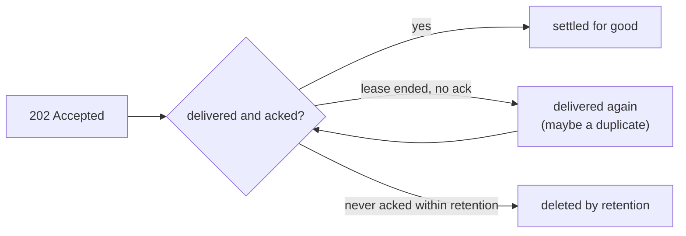

# Delivery contract

Learn what Narad promises about delivery, durability, ordering and availability, and what each kind of failure does to your messages.

!!! abstract "In short"
    - Delivery is at least once. A message is delivered until a consumer acks it, sometimes more than once, so every handler must be idempotent.
    - A `202` means the node that answered fsynced the message. It survives any crash, restart or power loss from then on.
    - Narad stores each partition once. Losing a node's volume loses the partitions on it, unless you keep a replica child or volume snapshots.
    - There is no ordering guarantee. Carry a sequence in the payload if you need one.
    - Produce and consume keep working while nodes fail. Topic and user changes need a Raft quorum.

## At least once {#at-least-once}

--8<-- "contract/body/at-least-once.md"

A consumer takes a [lease](../reference/glossary.md#lease) on each message it receives. The lease lasts the topic's [visibility timeout](../reference/glossary.md#visibility-timeout) (`visibility_timeout_ms`, 30 seconds by default), and the response carries a [receipt handle](../reference/glossary.md#receipt-handle) that names the lease. An ack with that handle settles the message for good. Anything that ends a lease without an ack puts the message back in the queue.

These events deliver a message again:

- **The lease lapses.** The consumer crashed, hung or worked past the visibility timeout. The message goes to the next consumer, and the late ack is answered [`410`](../reference/status-codes.md#status-410).
- **A consumer nacks it.** A [nack](../reference/glossary.md#nack) ends the lease at once.
- **The broker process crashes.** Leases live only in the memory of the partition's [owner](../reference/glossary.md#owner). When the node comes back, every message that was leased on its partitions is delivered again straight away, even if the first consumer is still working on it. Acks reach the disk in batches, so the messages acked in about the last 100 ms come back too.
- **A node loses power**, its kernel crashes, or its machine is lost with the volume intact. As for a crash, but acks of about the last 1.1 s come back by default: the durability interval `storage.consumer_offset_commit_interval_ms` (1 s, unreleased), plus about 100 ms and the time a sync takes. v3.0.1 brings back about 0.1 s plus its sync time.
- **A produce is retried after a timeout.** The first attempt may have been accepted, so the retry can store a second copy.
- **A node commits accepted messages again after a crash.** Its dispatcher keeps in memory which messages above its checkpoint are already committed, so a crash commits those again at new offsets. After a power loss the checkpoint can also be up to 250 ms old (unreleased; v3.0.1 syncs it on every store).
- **A partition moves.** Leases still out when a [rebalance or decommission](rebalance.md) hands the partition to a new owner are delivered again by that owner.

A graceful stop writes every ack to disk first, so a rolling restart delivers no acked message again. It does forget the leases of the stopping node, as a crash does.

None of these loses a message. The one way an unacked message leaves without being delivered is [retention](#retention). The patterns for idempotent handlers are in [Handle retries and dead letters](../build/handling-retries.md).

## What a 202 means {#what-202-means}

--8<-- "contract/body/produce-202.md"

A produce is written to the [ingress WAL](../reference/glossary.md#ingress-wal) of the node that received it, and the `202` goes out once the group-commit fsync that covers it returns. That node's dispatcher then commits the message to the owner of its partition. The owner fsyncs it and reads it back with its checksum verified, and only then moves the [high watermark](../reference/glossary.md#high-watermark) over it so consumers can see it. The ingress WAL keeps its copy until the owner confirms that commit, so a message that got a `202` is always in at least one verified place.

A produce that gets no answer is ambiguous, and so is one answered `500`. When the ingress WAL's disk fails in the middle of a write, the records written before the failure survive the restart and are delivered ([when the WAL's disk fails](produce-path.md#wal-disk-failure)). A [batch produce](../reference/http-api.md#produce-batch) (unreleased) gets one `202` for all of its messages, and a batch that fails or times out may have been accepted in part.

The whole path, stage by stage, is in [Produce path](produce-path.md).

## One copy per partition {#one-copy}

--8<-- "contract/body/one-copy.md"

Narad has no replication subsystem for message data. Each [partition](../reference/glossary.md#partition) is a directory on its owner's volume, and every commit is fsynced and verified there before it becomes visible. So process crashes, restarts and power loss lose nothing that got a `202`. A destroyed volume loses the messages, consumer positions and fan-out cursors stored on it.

Cluster metadata is different. Topics, users, grants, schemas and partition assignments live in the Raft-replicated [metastore](../reference/glossary.md#metastore), which every node holds in full. It survives the loss of any minority of volumes.

Two tools protect message data against a lost volume, and [Back up and replicate topics](../operate/backups.md) covers both:

- A [replica child](../reference/glossary.md#replica-child) is an asynchronous full copy of a topic, placed on nodes other than the parent's partitions when it is created. It trails the parent by the fan-out lag.
- Volume snapshots give each node a restore point.

Run Narad on storage you trust, such as cloud persistent volumes or RAID.

## Ordering {#ordering}

--8<-- "contract/body/no-ordering.md"

Messages with the same [key](../reference/glossary.md#key) go to one partition by the hash of the key, and in steady state they tend to arrive in the order they were produced. Five mechanisms reorder them on purpose, and a design must assume all five:

1. **Redelivery.** A message whose lease lapsed, or that was nacked, comes back after newer messages were consumed.
2. **A stranded lease holds its partition.** A message leased by a consumer that never comes back is delivered again only when its visibility timeout ends. Until then its partition may have nothing else to serve, because everything above it is already acked. So after an outage a partition can go quiet for up to one visibility timeout and then deliver the rest ([the mechanism](consume-path.md#after-an-outage)).
3. **A broker restart.** Acks reach the disk in batches, so after a crash the messages acked in the last moments are delivered again, after newer ones.
4. **Each node dispatches on its own.** A message is committed to its partition by the dispatcher of the node that accepted it. Two messages with the same key that reach two different nodes can land on their partition in either order.
5. **Reroute around an unavailable owner.** When a partition's owner is marked dead, or its commits keep failing for 3 seconds, the accepting node commits those messages to a live sibling partition instead ([the reroute](produce-path.md#dispatch)). The key-to-partition mapping moves for them.

<figure class="nr-dia nr-dia--doc" id="fig-delivery-ordering">

--8<-- "diagrams/delivery-ordering.html"

<figcaption>Two nodes, two dispatchers, two clocks: <code>m1</code> was sent first and lands second, at offset 8.</figcaption>
</figure>

If you need a sequence, carry one in the payload and order on your side. Handlers that are idempotent on an ID in the payload absorb duplicates and reordering together.

## Availability {#availability}

Ordering was traded for availability. In CAP terms, Narad's data plane is AP and its control plane is CP.

- **Produce works while any node lives.** Any live node accepts a produce with a local fsync: no leader election, no quorum, no coordination on the request path. Delivery to the owner happens afterwards and routes around dead nodes. When a majority of nodes is down, a survivor still accepts a produce sent to it directly. It reports not ready while it has no Raft leader, though, so a load balancer stops sending it traffic until quorum returns. Losing a minority of nodes never stops produces through the load balancer.
- **Consume works for every partition whose owner is alive.** New messages reroute to live owners, so fresh messages stay consumable during an outage. Messages already stored on a dead node wait for it to return. Meanwhile a consume pinned to one of its partitions is answered [`503`](../reference/status-codes.md#status-503), or [`502`](../reference/status-codes.md#status-502) until the node is marked dead.
- **Topic, user and grant changes go through Raft** and need a quorum of nodes. Without one they are answered `503`. Data flows through one node; administration waits for a majority.

<figure class="nr-dia nr-dia--doc" id="fig-delivery-availability">

--8<-- "diagrams/delivery-availability.html"

<figcaption>Losing a minority stops nothing that goes through the load balancer. Losing a majority stops the control plane and the load balancer, but a produce sent straight to a survivor still gets <code>202</code>.</figcaption>
</figure>

## Retention {#retention}

Retention is the one way an unacked message leaves without being delivered. A topic's `retention_ms` (at least 1 hour, or `0` to keep messages forever; when unset, the operator's default: 7 days for the binary, 12 hours for a cluster installed with the Helm chart) is a floor: a message lives at least that long after it was written. It usually lives somewhat longer, because deletion works on whole segments of up to 64 MiB, and it is gone within about twice the retention age of its write.

When a consumer falls so far behind that its next message has been deleted, the partition's [committed frontier](../reference/glossary.md#committed-frontier) jumps to the oldest message still retained, and the owner logs `consumer frontier fell behind retention; skipped to oldest retained offset`. A [fan-out child](../reference/glossary.md#fan-out-child) that falls behind its parent's retention skips the lost records too, and counts them in `narad_fanout_child_dropped_messages`. The parent of a [delay child](../reference/glossary.md#delay-child) must keep messages for at least the delay plus one hour, which keeps a healthy delay child clear of this.

How segments age out is in [Storage engine](storage-engine.md#retention).

## Timing {#timing}

- **Produce to consumable:** typically single-digit milliseconds. Under load, tens of milliseconds while the dispatcher gathers messages into larger commits.
- **Redelivery after a lapsed lease:** one visibility timeout after the lease was taken or last extended. A sweep releases expired leases every second, and every consume of the partition releases them too.
- **Delay children:** never early on the clock of the node that owns the parent partition, and usually within a second after the delay has passed. Failures can make them later.
- **Ack persistence:** about 100 ms to the operating system and about 1 s to disk by default, as listed under [At least once](#at-least-once).

## Failure matrix {#failure-matrix}

Each row is one event: what clients see while it lasts, what it can lose, and where the procedure is.

| Event | Producers see | Consumers see | What can be lost | What to do |
|---|---|---|---|---|
| A consumer crashes holding a lease | Nothing | The message again after its visibility timeout | Nothing | Make handlers [idempotent](../build/handling-retries.md) |
| A handler outlives the visibility timeout | Nothing | Another consumer gets the message; the late ack gets `410` | Nothing, but the work may run twice | [Extend the lease](../build/consuming.md#extend) while working |
| An ack is lost, or answered `502` or `503` | Nothing | Unknown whether it landed; a retry of one that landed gets `410` | Nothing | [Retry the ack](../build/handling-retries.md#retry-acks) with backoff |
| A produce times out | Unknown whether it was accepted | A retried produce may arrive twice | Nothing, once retried | Retry, per the [retry rules](../reference/status-codes.md#retry-rules) |
| The broker process crashes | Requests in flight to that node fail; other nodes accept | Its partitions wait. On its return, its leased messages and about 100 ms of acks come back at once | Nothing that got a `202` | Nothing, with [idempotent handlers](../build/handling-retries.md) |
| A node loses power, volume intact | As for a crash | As for a crash, plus about 1.1 s of acks, and about 250 ms of dispatched messages twice | Nothing that got a `202` | To shorten the ack window, lower [the durability interval](../reference/configuration.md#storage) |
| A node is down | `202` as usual; its partitions' messages go to other partitions after about 3 s | Its stored messages wait; pinned consumes fail with `502` or `503`. After it returns, a partition can stay quiet for one visibility timeout | Nothing | Bring it back, then see [quiet after an outage](../operate/troubleshooting.md#quiet-after-outage) |
| A node's volume is destroyed | The node rejoins empty; produce continues | Its messages never arrive | Every message, consumer position and fan-out cursor on it | [Restore a snapshot](../operate/backups.md#restore), or move consumers to a replica child |
| The ingress WAL's disk fails | `500` from that node until it restarts, even after space is freed | No change | Nothing that got a `202`; a produce answered `500` may still arrive | Alert on `narad_ingress_wal_failed` (unreleased), then [fix and restart](../operate/troubleshooting.md#produce-500) |
| Raft quorum is lost | Survivors report not ready, so the load balancer stops routing to them; topic and user changes get `503` | The load balancer stops routing to the survivors | Nothing | Bring nodes back; [do not restart the survivor](../operate/troubleshooting.md#not-ready-all-pods) |
| A partition moves (rebalance or decommission) | `202` as usual; commits to it pause for the freeze, usually milliseconds | No new messages from it during the freeze; leases unacked at the handover come back from the new owner | Nothing | Nothing; follow it with [`narad cluster moves`](../operate/scaling.md) |
| A move's source dies mid-move | As for a node that is down | After 2 minutes the copy is promoted; messages acked in the source's last moments may come back | What the source committed after the destination's last read, if it never returns. On v3.0.1, records committed after the promote could also stay undelivered (unreleased fix) | Keep any copy the returning source quarantines; see [Scale out and in](../operate/scaling.md) |
| A rolling restart | Requests move to the other pods; Raft leadership moves in about 150 ms | Messages leased on the restarting node come back; acked ones do not | Nothing | [Roll one pod at a time](../operate/upgrade.md#upgrade) |
| An unacked message outlives retention | Nothing | It is never delivered; the frontier skips it, and the owner logs it | That message, by policy | [Alert on lag](../operate/monitoring.md#alerts), and keep retention above your longest consumer outage |

Every status code, and whether to retry it, is in [Status codes and errors](../reference/status-codes.md).

## How we check the contract {#how-we-check}

A nightly job runs a three-node cluster under load, kills nodes and cuts them off from their peers, and records every client operation with the interval it was in flight for. It then checks that history against a model of this contract. A message delivered again after a confirmed ack must fall inside a fault window, or the run fails. A second run injects no faults and fails on any redelivery after an ack at all.

The method, the verdicts and what the check cannot catch are in [Linearizability check](linearizability.md).

## Next steps

- [Status codes and errors](../reference/status-codes.md): which codes to retry, and how.
- [Handle retries and dead letters](../build/handling-retries.md): idempotent handlers, ack retries and backoff topics.
- [Troubleshooting](../operate/troubleshooting.md): symptoms and fixes for the failures above.
