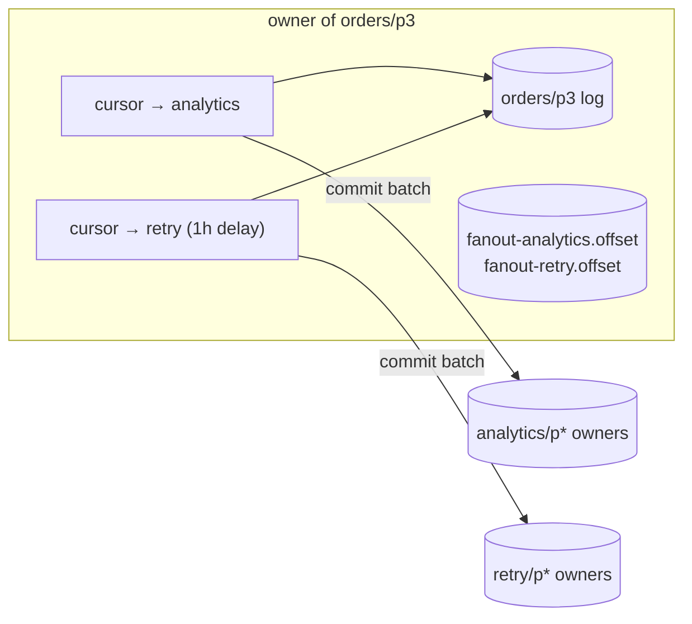
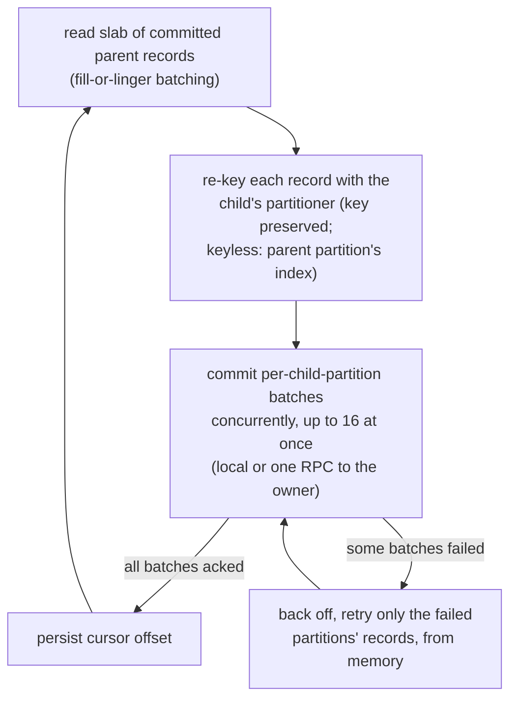
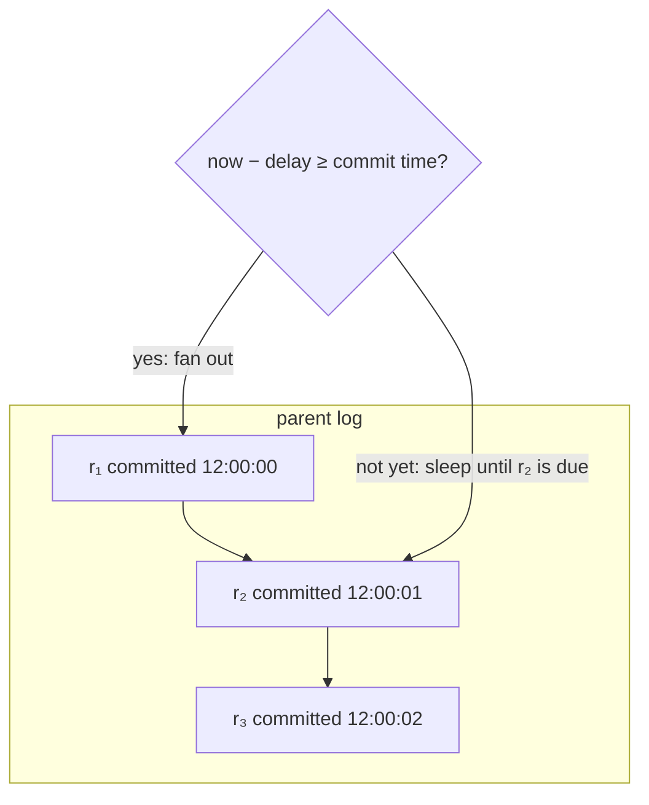

# Fan-out engine

Learn how Narad copies a parent topic's messages to its children: cursors that tail the parent's committed log and never skip a record.

!!! abstract "In short"
    - For each parent partition and each child, one cursor runs on the node that owns the parent partition, so it always reads local disk.
    - A cursor commits a batch to the child before it moves its own durable position past it. A crash repeats the last batch into the child; it never leaves a gap.
    - Each attach gets a fresh epoch, and records the parent's tail at the moment of the attach, so a new cursor starts exactly there.
    - A delay child's cursor reads only records whose commit time is at least the delay in the past. Commit times never decrease along a partition, so an idle delay cursor sleeps until the next record is due.
    - A child that falls behind the parent's retention skips the aged-out records and counts them as lost.

A [fan-out child](../reference/glossary.md#fan-out-child) gets its copies from **per-partition cursors that tail the parent's committed log**, with durable positions and an at-least-once commit protocol. Producers never publish twice, and the broker keeps no subscriptions: there are only log readers that keep their place.

## Cursor placement {#where-the-work-runs}

For each (parent partition, child) pair, one **cursor goroutine** runs on the node that *owns that parent partition*. So slab reads always hit local disk, and the cursor's durable state lives in the same directory, with the same durability, as the log it tails:



A reconciler on every node compares the *desired cursors* (from the metastore: links times owned partitions) with the *running cursors* once a second. Cursors start on attach and stop on detach, delete or a change of ownership.

The comparison decodes every topic record, so a tick skips it while none of the replica's topic, assignment, schema, user or routing-member versions has moved since the last full pass (`LatestDomainVersion`; member heartbeats and drain flags do not count). This skip is unreleased. A full pass still runs after a pass that failed or left work behind (a cancelled cursor still draining, ownership it could not read), after any cursor exits, on the first tick after the replica caught up again, on every orphan-sweep tick, and at least every 30 s. Measured over 12-partition topics with no links or moves, one tick of this reconciler and the [move runner](rebalance.md) together takes about 91% less time than a full pass every second (at 5,000 topics, 29.5 ms to 2.8 ms, the orphan sweep's share included), and an attach or detach is still picked up on the next tick.

## Cursor loop: commit before advance {#cursor-loop}



The invariant is the whole guarantee: **the cursor's durable offset only moves past records whose child commits were acknowledged**, and a child commit is the same fsync and verify as any produce. A crash in the middle commits the last slab again: duplicates in the child, never a gap.

The records are bucketed per child partition with a counting sort, so each bucket keeps slab order, and per-key order with it. When some buckets fail, the cursor keeps only the failed partitions' records in memory, copied off the parent log so a long outage does not pin its read buffers, and retries just those after the backoff. Partitions that committed are not sent again (unreleased; before, a failure meant reading the whole slab again, which sent duplicates into the healthy partitions on every retry). Each retry checks the link's attach epoch again and re-buckets the records under the child's current partition count.

A keyless record has no key to hash (unreleased; v3.0.1 gives it an invented key). When the child has the parent's partition count, it keeps its parent partition's index (`keylessKeepsIndex`). Child partition p is placed away from the owner of parent partition p, so this keeps a keyless record's two copies on different nodes in a [replica child](../reference/glossary.md#replica-child), the way the key's hash does for a keyed record, and keeps the parent partition's keyless records in order. The parent's partition count is read once per pass, and only for a slab that holds a keyless record. When the counts differ, the child's partitioner places keyless records round-robin (per child topic), afresh on each retry.

## Attach epochs {#attach-epochs}

Each attachment gets a fresh [attach epoch](../reference/glossary.md#attach-epoch) ID, stamped into the cursor's offset file. A detach followed by a re-attach must start from the new attach's *attach point*, because the client contract says there is no backfill. So a cursor that finds an offset file from a *different epoch* refuses to resume it. Epochs turn "is this my state?" from a guess into an equality check.

Anchoring (skipping to a starting offset and overwriting the offset file) is the engine's only destructive move, and chaos testing showed that a stale metastore replica can fabricate exactly the epoch mismatch that triggers it. So an anchor requires the **Raft leader to confirm the epoch** (with the barrier rule for a node that is itself the leader). Anything unconfirmed is deferred, and the reconciler tries again a second later. Cursor offset files get the same protection before deletion. The incident that forced this is in [Cluster lifecycle](cluster-lifecycle.md#crash-recovery-bugs).

## Attach point {#attach-point}

"From the attach forward" needs a definition of *the attach*, per parent partition, or the cursor invents one. The first version anchored at the parent's tail **as of the cursor's first read**, which is not the attach. The cursor starts one reconcile interval plus a leader round trip after the attach committed, and everything committed in between was skipped without a trace. A partition added by a partition-count increase was worse: producers hash to it within milliseconds of assignment, its cursor started a second later and anchored at the tail past all of it, although a brand-new partition has no history from before the attach to skip.

So the attach records its own [attach point](../reference/glossary.md#attach-point). While the attach is being proposed, the proposing node's fan-out runner asks every parent partition's owner for its committed high watermark (a local read, or one stats RPC per remote partition, in parallel). The answer travels inside the Raft attach command into the child's record as `attach_offsets` (index = parent partition). A cursor with no offset file for its epoch then starts here:

| Record | Partition | Start |
|---|---|---|
| has `attach_offsets` | index within the slice | the recorded offset, exactly |
| has `attach_offsets` | index beyond the slice (added after the attach) | 0 |
| no `attach_offsets` (attached before this existed) | any | the live tail at first read (the older behaviour; detach and re-attach to upgrade) |

If any owner cannot be asked, the attach fails with `503` and leaves no link: a guessed offset would either skip records or backfill history, and an attach is cheap to retry. Records committed while the attach is in flight (between the tail reads and the Raft commit) sit at or past the recorded offsets and are delivered: the attach point is "the tail observed while processing the attach", never later.

The same rule decides a *lost* cursor file. With the attach point recorded, a cursor that finds no file replays from that point (duplicates, bounded by the parent's retention through drop-behind) instead of anchoring at the tail past whatever it had not yet delivered. That is at-least-once, in the direction the contract promises.

## Delay gate {#the-delay-gate}

A [delay child](../reference/glossary.md#delay-child)'s cursor adds one filter: **it reads only records whose parent commit time is at or before now minus the delay.**



Commit times **never decrease along a partition**: they are stamped just before the commit takes the partition's produce lock, and raised under it to the newest time the partition has committed (see [Storage engine](storage-engine.md#segments-frames-records)). So the first record that is not due yet proves that everything behind it is not due either. The floor lives in the committing process, so it starts over after a restart: a wall-clock step back across a restart can still leave a small inversion, which holds due records back by at most the size of the step.

An idle delay cursor therefore costs O(1): it peeks at the head and sleeps until its due time (capped, so gauges stay fresh). There is no timer wheel and no polling of the backlog, so a million pending delayed messages cost the same as one.

Delivery is therefore *never early on the reading clock* (the gate is checked against the clock of the parent partition's owner at read time), and usually lands within a second of the due time (long-poll wake-ups plus the linger window).

**Two clocks after a move.** `committed_at` is stamped by whichever node committed the record (`produce_commit.go`), while the gate compares it with the clock of the node that *owns the parent partition now*. Those are the same node until the partition moves (rebalance, decommission). After a move, records the old owner stamped are gated by the new owner's clock, so their delivery is early or late by exactly the clock skew between the two nodes, in either direction.

There is no cheap fix: the reader cannot know what the committing node's clock reads now, and clamping the gate to the newest commit time it has seen would only trade "late on the new owner's clock" for "early on the old owner's", not remove the skew. Under NTP the skew is milliseconds against delays of minutes or hours. The guarantee to quote is "never early on the clock of the node currently owning the parent partition", and the way to keep it meaningful is to keep the cluster's clocks synchronised.

## Edge cases {#edge-cases}

- **Drop-behind.** If a cursor falls behind the parent's *retention* (a child down for days), aged-out offsets are skipped and counted on an explicit loss metric, `narad_fanout_child_dropped_messages`: bounded loss that raises an alarm, instead of a parent that cannot move. The retention floor for a delay child's parent (at least the delay plus 1 hour) keeps a healthy delay child clear of this.
- **A child partition's owner is dead.** Fan-out never reroutes to a sibling child partition. Unlike produce, a cursor can afford to wait, and rerouting would scatter a key's records across child partitions for no availability gain. So the cursor stalls on that bucket and retries until the owner returns. A keyless record stalls the same way when it keeps its parent partition's index (the child has the parent's partition count): moving it to a sibling would put its copy wherever that sibling lives, possibly beside the parent copy. In a child with a different partition count, each retry places keyless records round-robin again, so they can land in a healthy partition. Only that partition's records are retried. The held records (at most one slab, `fanout.max_batch_bytes`, 4 MiB by default, per cursor) stay in memory until the owner returns, so records that age out of the parent's retention during the outage, but were already read, are still delivered rather than counted as drop-behind.
- **Lag signals.** `narad_fanout_lag_messages` (the parent's high watermark minus the cursor) is the health signal for normal children. `narad_fanout_due_lag_seconds` (how far behind the *due frontier* the cursor runs) is the one for delay children: raw offset lag on a delay child is always about the produce rate times the delay, by design. Both are described in [Metrics reference](../reference/metrics.md#fan-out).
- **Describing costs nothing.** The children listing (`GET /v1/topics/{parent}/children`) and the topic describe (`GET /v1/topics/{topic}`) never open a partition log. An open log is read through the non-stamping `Peek`; a closed one is described from its directory (segment files plus the durable high-watermark file, exact for a cleanly closed log). Only `Get` stamps a log's last access, so a monitoring loop cannot keep idle parents warm, and idle eviction still fires. Remote partitions' stats are fetched from their owners concurrently (16 in flight), not one round trip at a time.

## Fan-out constants {#constants}

| Constant | Value |
|---|---|
| Reconcile interval (desired against running cursors) | 1s, a tick skipping its pass while metadata is unchanged; a full pass at least every 30s (`reconcileForcedPassEvery`) |
| Slab long-poll / retry backoff | 1s / 1s |
| Child-partition commits in flight per slab (unreleased) | 16 |
| Batch caps | 4,096 records / 4 MiB (`fanout.max_batch_records/bytes`) |
| Linger to fill a partial batch | 25ms |
| Delay cursor maximum sleep (bound on metadata freshness) | 30s (`defaultFanoutDueWakeCap`) |
| Orphan cursor-file sweep | every 30th caught-up reconcile tick, skipped ticks included (a sweep tick always runs a full pass) |
| Maximum children per parent / maximum delay | 108 / 1 year |
| Retention floor for a delay child's parent | delay + 1h (`topic.MinRetentionMs`) |
| Attach epoch | 8 random bytes, hex (for example `67953471cc57a32a`) |

## Cursor file {#cursor-file}

One file per (parent partition, child), next to the log it indexes:

```
topics/orders/p00003/fanout-analytics.offset
{"crc":"5e9303c4","epoch":"67953471cc57a32a","next_offset":98332}
```

That is the entire recovery story: the epoch says *which attachment* this position belongs to, and `next_offset` says where to resume. The starting point of a cursor that has no file yet lives in the metastore, in the child's record (`attach_epoch` plus `attach_offsets`). Everything else (running goroutines, batches in flight, lag gauges) can be thrown away.

The fixed-size format below is unreleased. The record is padded with spaces and a newline to a fixed 256 bytes, and advanced in place (one write at offset 0 and one `fdatasync`) only after the batch below it is committed to the child. `crc` is a CRC-32C over everything after it, padding included. Without it, a reader that catches the writer in the middle of a write (a move listing the file, the cursor stats handler), or a record torn by a crash, could parse a mix of two offsets as a valid cursor ahead of the true position. Readers read a record that fails the check again a few times before calling it corrupt, which then takes the existing corrupt-cursor path.

The atomic write to a temp file and rename (plus a directory fsync) is kept for the first anchor, for replacing a file in the older variable-length format, and for an epoch too long to pad. Older binaries parse the new record (they ignore the `crc` field and the padding), and the new one reads and migrates the old format.

## Slab reads: fill or linger {#slab-reads}

`readBatch` long-polls the parent for up to 1 s. The records it returns point into the parent log's decoded frames rather than being copied, since the child commit copies them anyway. It then tops up until the batch reaches 4,096 records or 4 MiB, or a 25 ms linger expires. So a busy parent produces large child commits (one fsync each on the child side), while a trickling parent still ships within about 25 ms.

For a delay child, every read carries `MaxCommittedAt = now − delay`. The reader stops at the first record that is not due and reports *when* it becomes due, which is what lets the cursor sleep instead of spinning.

## Next steps

- [Metastore and Raft](metastore-and-raft.md): where links, epochs and attach points are stored.
- [Fan out and delay messages](../build/fanout-and-delay.md): attach children and create delay children from a client.
- [Metrics reference](../reference/metrics.md#fan-out): the fan-out lag and loss metrics.
