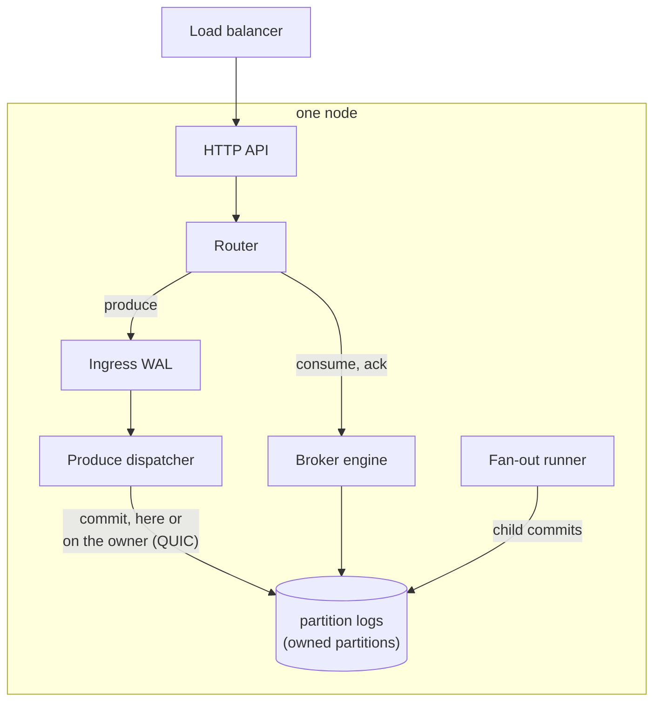
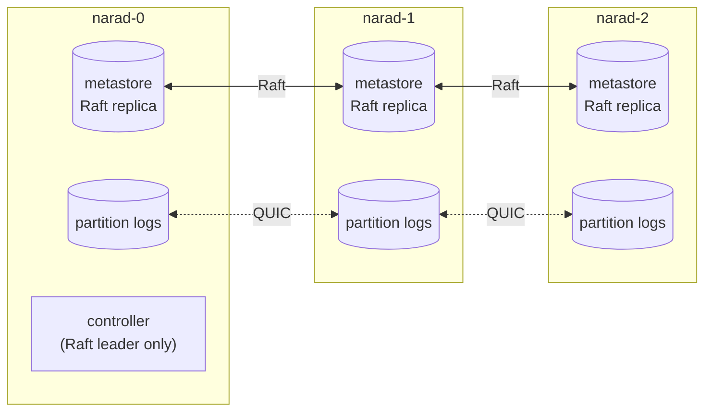
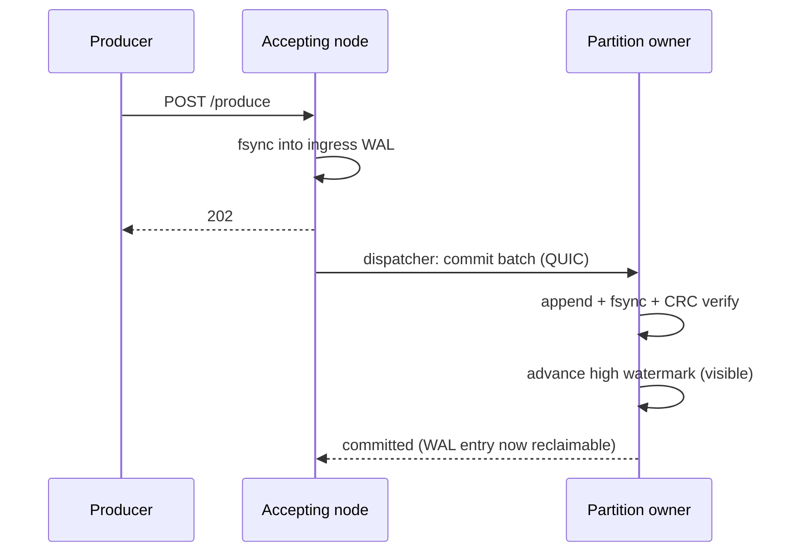
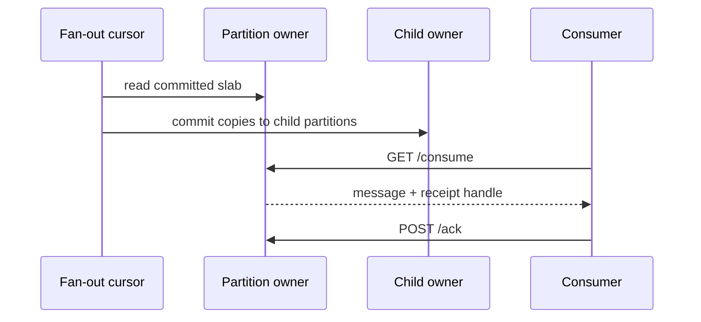

# Architecture overview

Learn how Narad is put together: what every node runs, where data lives, and how one message travels from producer to consumer.

The Understand pages describe the code on `master`. Where v3.0.1 behaves differently, the text says so; see [which release these docs describe](../reference/api-stability.md#docs-version).

## The whole system {#whole-system}

Every Narad node runs the same binary with the same components. Nodes differ only in which data they own and whether they currently lead Raft.

Inside one node, a request takes this path:



Across the cluster, every node holds a full copy of the metadata and the partitions it owns:



## Five design ideas {#design-ideas}

**1. Any node accepts any request; ownership decides where data lives.**
Clients talk to any node through the load balancer. Each [partition](../reference/glossary.md#partition) has exactly one [owner](../reference/glossary.md#owner), the node whose disk holds its data. A node forwards what it cannot serve locally to the owner over QUIC. See [Networking and security](networking-and-security.md).

**2. Produce writes a local log first.**
A produce is fsynced into the receiving node's [ingress WAL](../reference/glossary.md#ingress-wal) and answered `202` at once. A background dispatcher then moves it to the partition's owner, which commits it durably. The client waits for one local fsync; delivery to the owner is asynchronous and retried until it succeeds. See [Produce path](produce-path.md).

**3. Metadata is replicated by Raft; message data has one owner.**
Topics, users, assignments and fan-out links live in the Raft-replicated [metastore](../reference/glossary.md#metastore): every node holds a full replica, and one node leads. Message data is not replicated: one owner, one copy, fsynced and verified. See [Metastore and Raft](metastore-and-raft.md) and [One copy per partition](delivery-contract.md#one-copy).

**4. Consume is a queue with leases.**
Each message is reserved on its own, even in a batch consume (unreleased), which takes up to 100 in one request. A reservation is a [lease](../reference/glossary.md#lease) that lasts the [visibility timeout](../reference/glossary.md#visibility-timeout), held in the owner's memory, with a durable [committed frontier](../reference/glossary.md#committed-frontier) behind it. Acks move the frontier forward, and a background committer [writes it to disk](consume-path.md#how-acks-reach-the-disk); a crash only means redelivery. See [Consume path](consume-path.md).

**5. Fan-out tails the parent's log.**
A child topic is fed by a cursor on the owner of each parent partition. The cursor reads committed parent records in bulk, commits them to the child, and keeps its own durable position, so no parent message is skipped and none is copied twice except by at-least-once retries. A delay child adds a due-time gate to the same cursor. See [Fan-out engine](fanout-engine.md).

## One message, end to end {#message-end-to-end}

A produce is accepted by any node and committed on the partition's owner:



Once it is visible, a fan-out cursor copies it to child topics and a consumer takes it from the owner:



## Design principles {#design-principles}

Two rules appear in every subsystem. Both came out of chaos testing, where each was learned from a bug that lost data.

- **Destroying data needs the Raft leader's confirmation.** No node deletes data (topic directories, cursor files, WAL records) on its local view alone, because a freshly restarted replica can be far behind while believing it is current. Every deletion asks the leader first, and a node that is the leader must pass a Raft barrier before it trusts its own state.
- **Every failure keeps the data.** When a check cannot complete (no leader, a peer unreachable, a barrier failed), the answer is always to keep the data and try again later.

The bugs that taught these rules are in [Cluster lifecycle](cluster-lifecycle.md#crash-recovery-bugs).

## Reading order {#reading-order}

The pages in this section follow the path of a message, then the cluster around it:

1. [Delivery contract](delivery-contract.md): what Narad promises, and what each failure does to your messages.
2. [Linearizability check](linearizability.md): how a nightly run checks that contract.
3. [Produce path](produce-path.md): from a produce request to a durable, visible record.
4. [Storage engine](storage-engine.md): segments, frames, the high watermark and retention.
5. [Consume path](consume-path.md): leases, acks and how they reach the disk, and consumes that cross nodes.
6. [Fan-out engine](fanout-engine.md): cursors that copy a parent's log to its children.
7. [Metastore and Raft](metastore-and-raft.md): the replicated metadata, and the stale-replica problem.
8. [Networking and security](networking-and-security.md): the HTTP and QUIC planes, authentication and authorization.
9. [Cluster lifecycle](cluster-lifecycle.md): bootstrap, joins, crash recovery and topic incarnations.
10. [Rebalance and decommission](rebalance.md): moving a partition between nodes without losing a record.

## Codebase map {#codebase-map}

If you are about to read the source, start from this map:

| Package | What lives there |
|---|---|
| `cmd/narad` | Wiring: config, boot order, the join loop, startup reconcile. `serve.go` is the table of contents for the whole process |
| `internal/transport/httpserver` | HTTP routes, auth middleware, handlers. Thin on purpose |
| `internal/cluster` | Everything node-to-node: router, produce dispatcher, fan-out runner, QUIC RPC client and server, leader confirmation |
| `internal/broker/ingress` | The produce WAL: accept, replay, checkpoint, compaction |
| `internal/broker/messaging` | The engine: produce commit, consume, ack, fan-out slab reads |
| `internal/broker/runtime` | Partition-log registry, offset committer, orphan sweeps, lifecycle |
| `internal/consumer` | The in-flight lease table: reservations, nonces, acked-ahead sets |
| `internal/persistence/storage` | Partition log engine: segments, frames, flusher, retention, high watermark |
| `internal/persistence/wal` | The generic segmented WAL under ingress |
| `internal/persistence/metastore` | Raft and the bbolt state machine: topics, members, users, assignments |
| `internal/domain/*` | Pure types: topic, user, records |
| `internal/platform/*` | Config, metrics, partitioner, network utilities |

## One produce, by function name {#produce-by-function}

The same journey as the diagram above, with function names you can search for, from the handler to the disk:

```
POST /v1/topics/orders/produce?key=k
 └─ messaging.Produce (transport/httpserver/handlers/messaging/produce.go)
     └─ Engine.AcceptProduce (broker/messaging/produce_accept.go)
         ├─ resolveAcceptedProducePartition: hash the key, no liveness
         │   check
         └─ ingress.Manager.AcceptProduceWithTopicID
             (broker/ingress/produce.go)
             └─ wal.Log.AppendWith: staged into the group-commit
                buffer, blocks until the shared fsync lands
                                                  <- the 202 line
... in the background, woken as soon as the record is durable ...
 └─ ProduceDispatcher.run (cluster/produce_dispatcher.go)
     ├─ read, then place (cluster/produce_dispatch.go): read the newly
     │   durable records, queue each on its (topic, partition),
     │   reroute dead owners
     ├─ launch, startCommit, runJob (cluster/produce_commit.go): at
     │   most one commit in flight per partition, local or to the
     │   owner over QUIC
     │   └─ Engine.CommitAcceptedProduceBatch
     │       (broker/messaging/produce_commit.go)
     │       ├─ storage.Log.AppendBatchOwned: keyed-envelope records
     │       └─ commitDurable, then storage.Log.CommitDurable:
     │          fsync, CRC read-back, advance the high watermark
     │                                   <- consumers can see it
     └─ advanceCheckpoint: first seq not yet committed, stored; the
        WAL compacts behind it
```

Each deep dive follows the same pattern: the concept first, then the constants and function names behind it.

## Next steps

- [Delivery contract](delivery-contract.md): the promises these components add up to.
- [Produce path](produce-path.md): the first stop on a message's journey, in detail.
